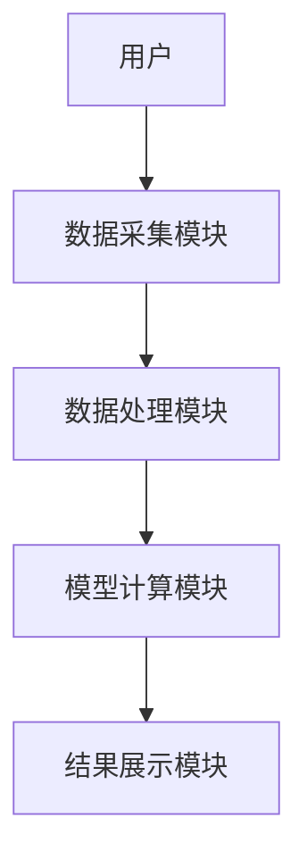

                 


# 目录大纲：《约翰·伯格的长期投资回报预期设定》

---

## 第一部分：长期投资回报预期设定的背景与重要性

### 第1章：长期投资回报预期的定义与背景

#### 1.1 投资回报预期的核心概念
- 1.1.1 投资回报的定义与分类
- 1.1.2 长期投资回报的特殊性
- 1.1.3 投资回报预期的重要性

#### 1.2 长期投资回报预期的背景
- 1.2.1 约翰·伯格的背景与投资理念
- 1.2.2 长期投资在现代金融中的地位
- 1.2.3 当前市场环境下的挑战

---

## 第二部分：长期投资回报预期的设定方法

### 第2章：长期投资回报预期的基本原理

#### 2.1 投资回报的驱动因素
- 2.1.1 资产类别与回报来源
- 2.1.2 市场周期的影响
- 2.1.3 风险与收益的平衡

#### 2.2 投资回报预期的设定方法
- 2.2.1 理论基础：现代投资组合理论
- 2.2.2 历史数据分析法
- 2.2.3 情景分析法

---

## 第三部分：长期投资回报预期的数学模型与算法

### 第3章：投资回报预期的数学模型

#### 3.1 投资回报的期望值计算
- 3.1.1 期望值公式：$$E(r) = \sum p_i r_i$$
- 3.1.2 投资组合的期望回报计算

#### 3.2 风险调整后的回报模型
- 3.2.1 风险溢价的计算
- 3.2.2 CAPM模型在长期投资中的应用

#### 3.3 时间价值与复利计算
- 3.3.1 复利公式：$$A = P(1 + r/n)^{nt}$$
- 3.3.2 时间价值对长期回报的影响

---

## 第四部分：长期投资回报预期的系统架构与实现

### 第4章：投资回报预期系统的架构设计

#### 4.1 系统功能模块
- 4.1.1 数据采集模块
- 4.1.2 模型计算模块
- 4.1.3 结果展示模块

#### 4.2 系统架构图


---

## 第五部分：项目实战与案例分析

### 第5章：项目实战

#### 5.1 环境安装与数据准备
- 5.1.1 安装必要的Python库（如NumPy、Pandas、Matplotlib）
- 5.1.2 数据来源与数据清洗

#### 5.2 核心代码实现
- 5.2.1 数据分析与可视化代码示例：
  ```python
  import pandas as pd
  import matplotlib.pyplot as plt

  # 读取数据
  data = pd.read_csv('investment_returns.csv')
  # 绘制折线图
  data['cumulative_return'].plot.line()
  plt.title('累积回报率')
  plt.xlabel('时间')
  plt.ylabel('回报率')
  plt.show()
  ```

#### 5.3 案例分析与结果解读
- 5.3.1 使用约翰·伯格的方法进行回报预期设定
- 5.3.2 案例结果分析与优化建议

---

## 第六部分：最佳实践与总结

### 第6章：总结与最佳实践

#### 6.1 小结
- 6.1.1 长期投资回报预期设定的核心要点
- 6.1.2 约翰·伯格方法的优势与局限性

#### 6.2 最佳实践
- 6.2.1 数据选择与模型优化建议
- 6.2.2 风险管理策略
- 6.2.3 定期复盘与调整建议

#### 6.3 注意事项
- 6.3.1 避免过度依赖单一模型
- 6.3.2 注意市场环境的变化
- 6.3.3 确保数据的准确性和完整性

#### 6.4 拓展阅读
- 6.4.1 推荐书籍与文献
- 6.4.2 相关领域的最新研究

---

## 第七部分：附录

### 附录A：常用公式汇总
- 期望回报公式：$$E(r) = \sum p_i r_i$$
- 复利计算公式：$$A = P(1 + r/n)^{nt}$$
- CAPM模型：$$r_i = r_f + \beta_i (r_m - r_f)$$

### 附录B：Python代码示例
- 数据分析与可视化完整代码
- 模型实现步骤详细代码

### 附录C：参考文献
- 约翰·伯格的经典著作
- 相关学术论文

---

## 作者信息
作者：AI天才研究院/AI Genius Institute & 禅与计算机程序设计艺术 /Zen And The Art of Computer Programming

---

### 关键词
- 长期投资回报预期
- 投资策略
- 风险管理
- 投资组合优化
- 约翰·伯格

### 摘要
本文系统地探讨了约翰·伯格的长期投资回报预期设定方法，从理论基础到实际应用，结合数学模型与算法，详细分析了投资回报预期的设定过程。通过案例分析与项目实战，提供了可操作的指导建议，帮助投资者更好地理解和应用长期投资策略。

