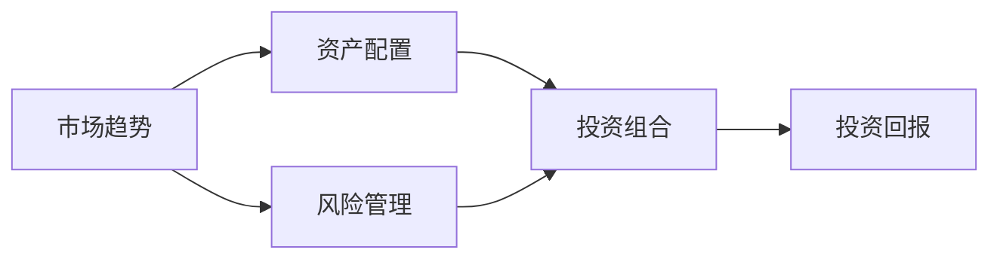

                 

# 约翰·伯格的长期投资回报预测模型

> 关键词：约翰·伯格、投资回报预测、长期投资、资产配置、风险管理、价值投资

> 摘要：本文详细介绍了约翰·伯格的长期投资回报预测模型，探讨其背后的数学原理、算法实现、系统架构设计以及实际应用案例。通过分析模型的核心概念、算法流程和系统实现，本文为投资者提供了科学的投资决策方法。结合实际案例，本文还展示了如何将模型应用于实际投资中，帮助投资者优化资产配置，降低投资风险。

---

# 第一部分: 长期投资回报预测模型的背景与核心概念

## 第1章: 长期投资回报预测模型概述

### 1.1 投资回报预测的背景与意义

#### 1.1.1 投资回报预测的背景
在金融市场中，投资回报预测是一个复杂的系统工程，涉及多个因素的综合分析。随着金融市场的日益复杂化，投资者需要更加精确的工具来预测投资回报，以便做出更明智的投资决策。

#### 1.1.2 长期投资回报预测的重要性
长期投资回报预测对于投资者来说具有重要意义。通过长期预测，投资者可以更好地规划投资策略，优化资产配置，降低投资风险，并实现财富的长期增长。

#### 1.1.3 约翰·伯格投资理念的核心思想
约翰·伯格是投资界的重要人物，他提出了长期投资回报预测模型。他的核心思想是，长期投资回报可以通过对市场趋势、资产配置和风险管理的综合分析来预测。他强调了价值投资的重要性，并认为长期持有优质资产是实现投资回报的关键。

### 1.2 长期投资回报预测模型的定义与特点

#### 1.2.1 模型的定义
约翰·伯格的长期投资回报预测模型是一种基于市场分析、资产配置和风险管理的投资预测模型。它通过分析历史数据和市场趋势，预测未来一段时间内的投资回报。

#### 1.2.2 模型的核心特点
- **长期性**：模型关注的是长期投资回报，而非短期波动。
- **资产配置**：模型强调资产的多样化配置，以降低风险并提高回报。
- **风险管理**：模型通过分析风险因素，帮助投资者制定风险管理策略。

#### 1.2.3 模型的边界与外延
模型适用于长期投资策略，但不适用于短期交易。其外延包括市场趋势分析、宏观经济因素和公司基本面分析。

### 1.3 模型的核心要素与概念结构

#### 1.3.1 核心要素组成
- **市场趋势**：包括股市、债市等主要市场的走势。
- **资产配置**：不同资产类别在投资组合中的比例。
- **风险管理**：通过分散投资和止损策略来降低风险。
- **经济指标**：如GDP增长率、利率变动等宏观经济指标。

#### 1.3.2 概念结构与关系图
以下是一个简化的概念结构图：

---

## 第2章: 长期投资回报预测模型的核心原理

### 2.1 投资回报预测的核心原理

#### 2.1.1 投资回报的驱动因素
投资回报主要由以下几个因素驱动：
1. **市场整体表现**：股市、债市等主要市场的走势。
2. **资产配置**：不同资产类别在投资组合中的比例。
3. **风险因素**：包括市场风险、流动性风险等。

#### 2.1.2 股票估值的核心方法
股票估值是投资回报预测的重要部分。常用的股票估值方法包括市盈率（P/E）、市净率（P/B）和股息率等。

#### 2.1.3 长期投资回报的计算公式
长期投资回报的计算公式如下：

$$
\text{长期投资回报} = \left( \frac{\text{最终价值}}{\text{初始价值}} \right)^{1/\text{投资期限}} - 1
$$

### 2.2 模型的数学基础

#### 2.2.1 投资回报的数学模型
投资回报的数学模型可以表示为：

$$
R = r_f + \beta (R_m - r_f)
$$

其中：
- \( R \) 是投资回报率
- \( r_f \) 是无风险利率
- \( \beta \) 是股票的贝塔系数
- \( R_m \) 是市场平均回报率

#### 2.2.2 风险调整后的回报计算
风险调整后的回报可以通过夏普比率来衡量：

$$
\text{夏普比率} = \frac{R_p - R_f}{\sigma_p}
$$

其中：
- \( R_p \) 是投资组合的回报率
- \( R_f \) 是无风险利率
- \( \sigma_p \) 是投资组合的波动率

#### 2.2.3 时间价值与复利计算公式
时间价值与复利的计算公式为：

$$
A = P \left(1 + \frac{r}{n}\right)^{nt}
$$

其中：
- \( A \) 是未来价值
- \( P \) 是本金
- \( r \) 是年利率
- \( n \) 是每年的计息次数
- \( t \) 是投资时间（年）

---

## 第3章: 系统分析与架构设计

### 3.1 系统功能模块划分

#### 3.1.1 数据输入模块
数据输入模块负责接收和处理输入数据，包括历史价格数据、经济指标等。

#### 3.1.2 模型计算模块
模型计算模块基于输入数据进行投资回报预测，包括资产配置、风险评估等。

#### 3.1.3 结果展示模块
结果展示模块将预测结果以可视化形式呈现，方便用户理解和分析。

### 3.2 系统架构设计

#### 3.2.1 系统架构的分层设计
系统架构分为数据层、计算层和展示层。

#### 3.2.2 模块间的接口设计
模块间的接口设计需要考虑数据格式和交互方式。

#### 3.2.3 系统交互的流程设计
系统交互流程包括数据输入、模型计算和结果展示三个主要步骤。

---

## 第4章: 系统实现与测试

### 4.1 系统实现的环境配置

#### 4.1.1 开发环境的搭建
开发环境需要安装Python、Jupyter Notebook等工具。

#### 4.1.2 数据库的配置
数据库用于存储历史价格数据和预测结果。

#### 4.1.3 依赖库的安装
安装必要的依赖库，如Pandas、NumPy等。

### 4.2 系统核心代码实现

#### 4.2.1 数据处理代码
数据处理代码用于清洗和预处理数据。

#### 4.2.2 模型训练代码
模型训练代码基于历史数据进行参数优化。

#### 4.2.3 结果展示代码
结果展示代码将预测结果以图表形式展示。

### 4.3 系统测试与优化

#### 4.3.1 测试用例的设计
设计合理的测试用例，验证模型的准确性和稳定性。

#### 4.3.2 系统性能优化
通过优化算法和减少计算复杂度来提高系统性能。

#### 4.3.3 测试结果分析
分析测试结果，找出系统的瓶颈并进行改进。

---

## 第5章: 项目实战与案例分析

### 5.1 案例背景介绍

#### 5.1.1 案例选择的依据
选择具有代表性的投资组合进行分析。

#### 5.1.2 案例的行业背景
分析所选行业的市场趋势和经济环境。

#### 5.1.3 案例的目标与意义
明确案例的目标和预期成果。

### 5.2 投资组合分析

#### 5.2.1 投资组合的构成
分析投资组合中各资产的比例和权重。

#### 5.2.2 市场趋势分析
基于历史数据和市场预测，分析未来市场走势。

#### 5.2.3 风险评估与优化
评估投资组合的风险，并提出优化建议。

### 5.3 实际案例分析

#### 5.3.1 案例的具体实施
详细描述案例的实施过程。

#### 5.3.2 模型预测结果
展示模型的预测结果，并进行详细解读。

#### 5.3.3 案例的总结与启示
总结案例的成果，并提出对未来投资的启示。

---

## 第6章: 总结、注意事项与扩展阅读

### 6.1 总结
总结本文的主要内容和研究成果。

### 6.2 注意事项
提醒读者在实际应用中需要注意的问题。

### 6.3 扩展阅读
推荐相关书籍和资源，供读者深入学习。

---

作者：AI天才研究院/AI Genius Institute & 禅与计算机程序设计艺术 /Zen And The Art of Computer Programming

---

以上是《约翰·伯格的长期投资回报预测模型》的完整目录大纲和部分章节内容。后续章节将按照上述结构继续完成。

