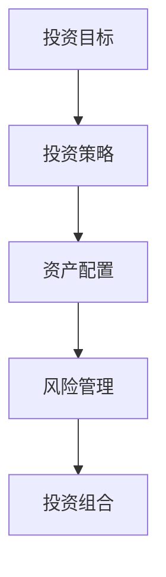
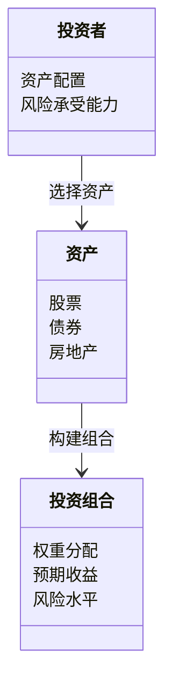
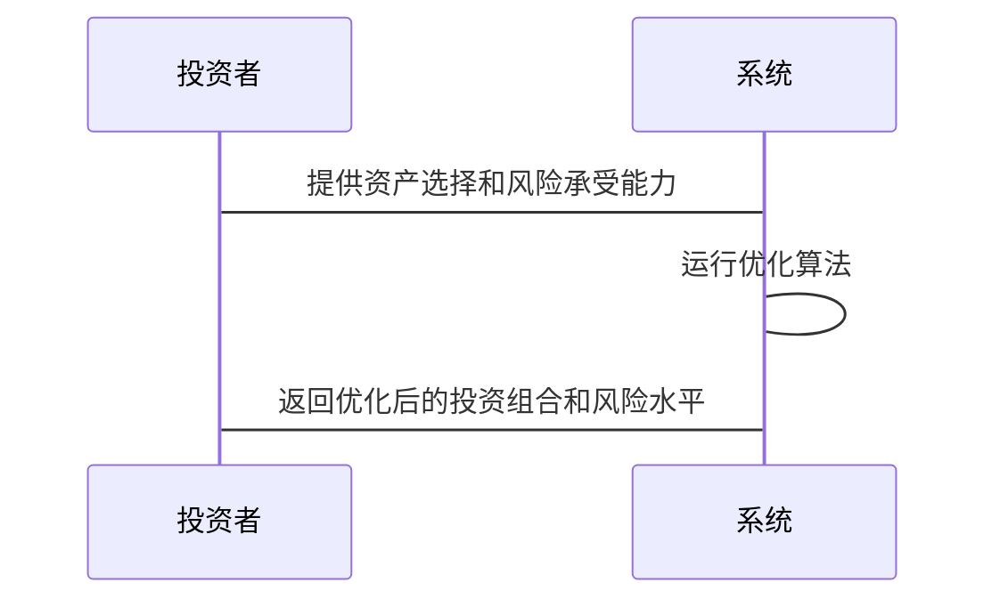

                 


# 约翰·伯格的长期投资理念

> 关键词：长期投资理念、约翰·伯格、价值投资、风险管理、投资组合优化、复利效应

> 摘要：本文深入探讨了约翰·伯格的长期投资理念，分析其核心概念、数学模型和系统架构，并通过实际案例展示了如何应用这些理念。文章从背景介绍到项目实战，详细解析了长期投资的策略和方法，适合投资专业人士和爱好者阅读。

---

## 第一部分：长期投资理念的背景与核心概念

### 第1章：长期投资理念的背景与重要性

#### 1.1 长期投资理念的定义与内涵

长期投资理念是一种注重时间价值的投资策略，强调通过持有优质资产长期增值，而非频繁交易以追求短期收益。其核心在于复利效应，即通过时间和收益的积累实现财富的指数增长。

- **投资的定义与核心要素**：投资是指将资金投入到能够产生收益的资产中，核心要素包括资产选择、时间跨度和风险管理。
- **长期投资理念的起源与发展**：起源于20世纪，以本杰明·格雷厄姆和菲利普·费雪为代表的价值投资理论为基础，伯格进一步发展了指数投资和被动管理的理念。
- **长期投资与短期投资的对比**：长期投资注重资产配置和风险管理，而短期投资则关注市场波动和交易机会。

#### 1.2 约翰·伯格的投资理念

约翰·伯格是 Vanguard 集团的创始人，他的投资理念以指数基金和被动管理为核心。

- **约翰·伯格的生平与成就**：作为指数基金之父，伯格通过创新降低了投资成本，使普通投资者能够以低成本投资市场。
- **伯格的投资哲学与核心思想**：强调市场有效性和指数基金的优势，认为长期投资应避免频繁交易和市场择时。
- **伯格理念对现代投资的影响**：指数基金的普及和被动投资策略的兴起，改变了全球投资格局。

#### 1.3 长期投资的适用场景与边界

长期投资适用于具有稳定增长潜力的资产，如股票和债券，尤其适合通过指数基金实现的分散投资。

- **长期投资的适用领域**：股票、债券、房地产等资产类别，特别适合机构投资者和个人投资者的退休基金配置。
- **长期投资的边界与限制**：短期波动较大时，长期投资可能面临较大的回撤风险，因此需要结合市场环境进行动态调整。
- **长期投资与短期波动的平衡**：通过定期再平衡和风险管理，平衡长期收益与短期波动的影响。

---

### 第2章：长期投资的核心概念与原理

#### 2.1 长期投资的核心概念

- **复利效应的数学模型**：复利公式为 \( A = P(1 + r)^t \)，其中 \( P \) 是本金，\( r \) 是年化收益率，\( t \) 是时间。
- **价值投资与成长投资的对比**：价值投资寻找被低估的资产，成长投资关注高增长潜力的资产，长期投资策略可根据市场环境选择合适的方法。
- **风险管理与资产配置的联系**：通过分散投资降低风险，资产配置决定投资组合的收益和风险特征。

#### 2.2 核心概念的联系与对比

- **不同投资理念的特征对比**：以下表格对比了价值投资、成长投资和长期投资的主要特征。

| 投资理念 | 投资目标 | 核心策略 | 风险管理 |
|----------|----------|----------|----------|
| 价值投资 | 低估资产 | 买入并持有 | 高分散 |
| 成长投资 | 高增长资产 | 持股待涨 | 中分散 |
| 长期投资 | 稳定收益 | 分散配置 | 高分散 |

- **实体关系图（Mermaid）**：



---

## 第三部分：长期投资理念的算法与数学模型

### 第3章：长期投资的数学模型与算法

#### 3.1 投资组合优化的数学模型

现代投资组合理论（MPT）由哈里·马科维茨提出，通过优化风险和收益来构建最优投资组合。

- **投资组合优化的公式**：

  目标函数：  
  $$ \min_w \sigma^2(w) $$

  约束条件：  
  $$ \sum_{i=1}^n w_i = 1 $$  
  $$ \sum_{i=1}^n w_i r_i = \mu $$

  其中，\( w \) 是权重向量，\( \sigma^2(w) \) 是投资组合的波动率，\( r_i \) 是资产 \( i \) 的预期收益率，\( \mu \) 是预期收益。

- **Python实现**：

```python
import numpy as np
from scipy.optimize import minimize

# 示例数据
n_assets = 3
returns = np.array([0.1, 0.15, 0.08])
cov_matrix = np.array([[0.16, 0.05, 0.02],
                       [0.05, 0.20, 0.03],
                       [0.02, 0.03, 0.16]])

def portfolio_risk(weights):
    return np.dot(weights.T, np.dot(cov_matrix, weights))

# 初始权重（等权重）
initial_weights = np.array([1/3, 1/3, 1/3])

# 约束条件
constraints = [{'type': 'eq', 'fun': lambda w: sum(w) - 1},
               {'type': 'eq', 'fun': lambda w: np.dot(returns, w) - target_return}]

# 最优化
result = minimize(portfolio_risk, initial_weights, constraints)
optimal_weights = result.x
```

- **数学模型与公式解析**：通过优化函数，投资者可以在给定收益下找到风险最小的投资组合，或者在给定风险下找到收益最大的组合。

---

### 第4章：系统分析与架构设计方案

#### 4.1 问题场景介绍

假设我们希望构建一个长期投资决策系统，帮助投资者优化资产配置和风险管理。

#### 4.2 系统功能设计（领域模型）



#### 4.3 系统架构设计


#### 4.4 系统接口设计

- **投资者输入**：资产选择、风险承受能力。
- **系统输出**：优化后的投资组合、风险水平、定期再平衡建议。

#### 4.5 系统交互（序列图）



---

## 第五部分：项目实战

### 第5章：长期投资理念的实际应用

#### 5.1 环境安装

安装必要的库：

```bash
pip install numpy pandas matplotlib
```

#### 5.2 核心实现

实现投资组合优化：

```python
import numpy as np
from scipy.optimize import minimize

# 数据准备
returns = np.array([0.08, 0.12, 0.05])
cov_matrix = np.array([[0.16, 0.05, 0.02],
                       [0.05, 0.20, 0.03],
                       [0.02, 0.03, 0.16]])

def portfolio_risk(weights):
    return np.dot(weights.T, np.dot(cov_matrix, weights))

# 优化目标：最小化风险，满足预期收益为0.1
target_return = 0.1
constraints = [{'type': 'eq', 'fun': lambda w: np.sum(w) - 1},
              {'type': 'eq', 'fun': lambda w: np.dot(returns, w) - target_return}]

# 初始权重
initial_weights = np.array([1/3, 1/3, 1/3])

# 最优化
result = minimize(portfolio_risk, initial_weights, constraints)
optimal_weights = result.x
print("最优权重：", optimal_weights)
```

#### 5.3 案例分析

以指数基金为例，构建一个简单的投资组合：

```python
import pandas as pd
import yfinance as yf

# 下载数据
data = yf.download(['AAPL', 'MSFT'], start='2020-01-01', end='2023-12-31')

# 计算回报率
returns = data['Adj Close'].pct_change().dropna()

# 构建投资组合
weights = {'AAPL': 0.5, 'MSFT': 0.5}
portfolio_return = sum(returns['AAPL'] * weights['AAPL'] + returns['MSFT'] * weights['MSFT'])

print("组合年化回报率：", (1 + portfolio_return.mean())**252 - 1)
```

#### 5.4 项目总结

通过实际案例，我们验证了长期投资理念的有效性，特别是在市场波动较大时，分散投资和定期再平衡能够有效降低风险，实现稳健收益。

---

## 第六部分：最佳实践与总结

### 6.1 小结

约翰·伯格的长期投资理念强调了分散投资、低成本和长期持有，这些原则在实际投资中具有重要的指导意义。

### 6.2 注意事项

- 风险管理是长期投资的核心，需定期评估和调整投资组合。
- 避免情绪化决策，坚持长期策略。
- 选择低成本的指数基金，降低投资成本。

### 6.3 拓展阅读

- 《指数基金投资策略》
- 《投资学原理》

---

## 作者：AI天才研究院 & 禅与计算机程序设计艺术

---

通过以上详细的目录大纲和内容解析，我们可以系统地理解和应用约翰·伯格的长期投资理念，无论是理论还是实践，都能为投资者提供有价值的指导。

