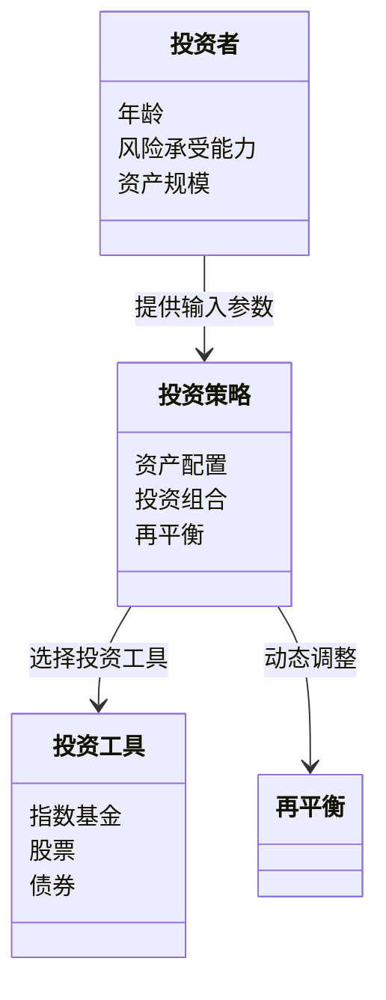
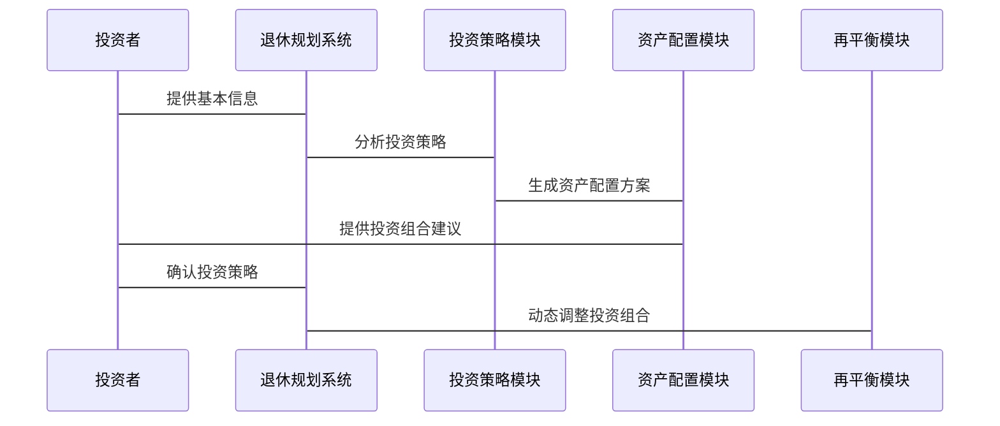

                 


# 约翰·伯格的长期投资观：应对退休年龄延长的挑战

## 关键词：长期投资观、退休规划、投资策略、风险管理、资产配置、市场分析、心理因素

## 摘要：  
本文深入探讨了约翰·伯格的长期投资观，分析其在应对退休年龄延长挑战中的重要作用。通过详细阐述长期投资的核心概念、策略和风险管理，结合实际案例和系统设计，为读者提供一套科学的投资规划方法，帮助他们在退休年龄延长的背景下实现财务稳健。

---

# 第一部分: 引言

# 第1章: 长期投资观的背景与重要性

## 1.1 长期投资观的定义与核心理念

### 1.1.1 长期投资观的定义  
长期投资观是指投资者在投资决策中注重长期收益，而非短期市场波动的投资理念。它强调通过长期持有优质资产，实现财富的稳健增长。

### 1.1.2 长期投资观的核心理念  
- **价值投资**：寻找具有持续增长潜力的企业，关注企业的基本面，而非市场的短期波动。  
- **分散投资**：通过多样化资产配置降低风险，避免过度依赖单一投资品种。  
- **耐心持有**：长期持有优质资产，避免频繁交易带来的成本和风险。  

### 1.1.3 长期投资观与短期投资的对比  
| 对比维度 | 长期投资观 | 短期投资观 |  
|----------|-------------|-------------|  
| 投资目标 | 实现财富的稳健增长 | 追求短期收益最大化 |  
| 投资期限 | 5年及以上 | 1年以内 |  
| 风险管理 | 通过分散投资降低风险 | 通过杠杆或高频交易放大收益 |  

---

## 1.2 退休年龄延长的背景与挑战

### 1.2.1 退休年龄延长的社会背景  
随着医疗技术的进步和生活条件的改善，人均寿命逐年提高，许多国家逐步延长退休年龄，以缓解养老金压力。  

### 1.2.2 退休年龄延长对个人财务的影响  
- **收入减少**：延长退休年龄意味着个人需要更长时间积累退休金。  
- **支出增加**：退休后的生活时间延长，医疗、护理等支出增加。  
- **投资压力**：个人需要更高的投资回报率来满足更长的退休生活需求。  

### 1.2.3 退休年龄延长对投资规划的要求  
- **更高的投资回报率**：需要通过长期投资实现资产的保值增值。  
- **更灵活的资产配置**：根据退休年龄的变化调整投资策略。  

---

## 1.3 约翰·伯格的长期投资观

### 1.3.1 约翰·伯格的生平简介  
约翰·伯格（John Bogle）是美国著名投资专家， Vanguard集团的创始人，被誉为“指数基金之父”。他提倡价值投资和长期持有理念，强调低成本和分散化投资。

### 1.3.2 约翰·伯格的投资哲学  
- **价值投资**：寻找具有长期增长潜力的企业，关注企业的基本面。  
- **分散投资**：通过指数基金等工具实现资产分散，降低风险。  
- **长期持有**：避免频繁交易，降低交易成本和税务负担。  

### 1.3.3 约翰·伯格的长期投资观的核心观点  
- 投资的本质是通过持有优质资产实现财富增长，而非短期炒作。  
- 长期投资的核心在于时间和复利的力量，通过长期持有优质资产实现财富的稳健增长。  

---

# 第二部分: 长期投资观的核心概念与策略

# 第2章: 长期投资的核心概念

## 2.1 投资目标与投资策略

### 2.1.1 投资目标的分类  
- **保守型**：追求稳定的收益，注重本金的安全性。  
- **稳健型**：追求适度的收益，兼顾风险和回报。  
- **激进型**：追求高收益，愿意承担较高的风险。  

### 2.1.2 投资策略的分类  
- **主动型投资**：通过精选个股实现超额收益。  
- **被动型投资**：通过指数基金等工具实现市场平均收益。  
- **混合型投资**：结合主动和被动投资，平衡风险和收益。  

### 2.1.3 长期投资的目标与策略  
- **目标**：实现资产的长期稳健增长。  
- **策略**：通过分散投资和长期持有，降低风险，提高收益。  

---

## 2.2 资产配置与风险分散

### 2.2.1 资产配置的定义与重要性  
资产配置是指将资金分配到不同的资产类别（如股票、债券、房地产等）中，以实现风险分散和收益最大化。  

### 2.2.2 风险分散的原理与实践  
- **原理**：通过投资不同类型的资产，降低单一资产波动带来的风险。  
- **实践**：根据市场环境和个人风险承受能力，动态调整资产配置比例。  

### 2.2.3 资产配置与风险分散的结合  
- **核心资产**：股票、债券等传统资产。  
- **卫星资产**：房地产、 commodities等另类资产。  

---

## 2.3 投资组合的构建与管理

### 2.3.1 投资组合的构建原则  
- **分散化**：避免过度集中于某一资产或行业。  
- **低成本**：选择费率低的基金或投资工具。  
- **长期视角**：注重长期收益，避免短期波动的干扰。  

### 2.3.2 投资组合的管理方法  
- **定期再平衡**：根据市场变化和个人财务状况，调整资产配置比例。  
- **定期评估**：定期审视投资组合的表现，及时优化投资策略。  

### 2.3.3 投资组合的动态调整  
- **市场波动**：根据市场环境调整资产配置比例。  
- **个人需求变化**：根据退休年龄变化和个人财务状况调整投资策略。  

---

# 第3章: 长期投资的核心策略

## 3.1 价值投资策略

### 3.1.1 价值投资的定义与特点  
价值投资是寻找市场价格低于内在价值的股票，长期持有，等待市场回归理性。  

### 3.1.2 价值投资的核心原则  
- **寻找低估企业**：关注企业的基本面，寻找具有持续增长潜力的企业。  
- **长期持有**：避免短期市场波动的干扰，耐心等待价值实现。  

### 3.1.3 价值投资在长期投资中的应用  
- **案例**：投资于具有强大竞争优势和良好管理的企业，如苹果、谷歌等。  

---

## 3.2 股息投资策略

### 3.2.1 股息投资的定义与特点  
股息投资是通过投资于高股息率的股票，获取稳定的现金流。  

### 3.2.2 股息投资的核心原则  
- **选择高股息率股票**：关注股息收益率高的企业。  
- **关注股息增长**：选择股息逐年增长的企业。  

### 3.2.3 股息投资在长期投资中的应用  
- **案例**：投资于分红稳定的蓝筹股，如可口可乐、强生等。  

---

## 3.3 指数基金投资策略

### 3.3.1 指数基金的定义与特点  
指数基金是通过跟踪市场指数（如标普500）实现市场平均收益的投资工具。  

### 3.3.2 指数基金的核心优势  
- **低成本**：指数基金的管理费率较低。  
- **分散风险**：通过投资于多个企业实现风险分散。  

### 3.3.3 指数基金在长期投资中的应用  
- **案例**：投资于标普500指数基金，长期持有，实现市场平均收益。  

---

# 第三部分: 应对退休年龄延长的挑战

# 第4章: 退休规划的挑战与解决方案

## 4.1 退休年龄延长对财务规划的影响

### 4.1.1 财务需求分析  
- **收入需求**：延长退休年龄意味着需要更高的退休金。  
- **支出需求**：退休后的生活支出增加，包括医疗、护理等费用。  

### 4.1.2 投资需求分析  
- **更高的投资回报率**：需要实现更高的投资收益以满足更长的退休生活需求。  
- **更灵活的资产配置**：根据退休年龄的变化调整投资策略。  

---

## 4.2 长期投资在退休规划中的应用

### 4.2.1 资产配置的动态调整  
- **年轻阶段**：高风险高收益投资，如股票和成长型基金。  
- **临近退休阶段**：逐步转向低风险投资，如债券和指数基金。  
- **退休后阶段**：注重本金安全，选择固定收益投资工具。  

### 4.2.2 投资组合的再平衡  
- **定期评估**：根据市场环境和个人财务状况，动态调整投资组合。  
- **风险控制**：通过分散投资降低市场波动带来的风险。  

---

## 4.3 约翰·伯格投资观的启示

### 4.3.1 长期投资的核心理念  
- 长期持有优质资产，通过复利实现财富增长。  
- 通过分散投资降低风险，实现稳健收益。  

### 4.3.2 退休规划的关键要素  
- **资产配置**：根据退休年龄和风险承受能力调整投资策略。  
- **成本控制**：选择低成本投资工具，降低费用对收益的影响。  
- **长期视角**：注重长期投资，避免短期波动的干扰。  

---

# 第五章: 系统分析与架构设计方案

## 5.1 问题场景介绍  
随着退休年龄的延长，个人需要更高的投资回报率来满足更长的退休生活需求。如何通过长期投资实现财富的稳健增长，是退休规划的核心问题。  

---

## 5.2 项目介绍  
本项目旨在设计一套基于约翰·伯格长期投资观的退休规划系统，通过系统化的资产配置和投资策略，帮助个人实现财富的稳健增长。  

---

## 5.3 系统功能设计  
### 5.3.1 领域模型（Mermaid 类图）  


---

## 5.4 系统架构设计  
### 5.4.1 系统架构（Mermaid 架构图）  


---

## 5.5 系统接口设计  
- **输入接口**：投资者的基本信息（年龄、资产规模、风险承受能力）。  
- **输出接口**：个性化投资策略、投资组合建议、定期再平衡报告。  

---

## 5.6 系统交互设计  
### 5.6.1 系统交互流程（Mermaid 序列图）  


---

# 第六章: 项目实战

## 6.1 环境安装

### 6.1.1 投资分析工具  
- **工具名称**：Excel、Python（Pandas、Matplotlib）  
- **安装步骤**：  
  1. 安装Python和相关库（Pandas、Matplotlib）。  
  2. 安装Excel或类似的投资分析软件。  

---

## 6.2 系统核心实现源代码

### 6.2.1 资产配置模型（Python代码）  
```python
import pandas as pd
import matplotlib.pyplot as plt

# 模拟市场数据
market_data = pd.DataFrame({
    '股票': [100, 105, 98, 110, 115],
    '债券': [90, 92, 95, 93, 96],
    '房地产': [80, 85, 83, 88, 90]
})

# 绘制资产配置图
market_data.plot(kind='line')
plt.title('资产配置图')
plt.xlabel('时间')
plt.ylabel('价格')
plt.show()
```

---

### 6.2.2 投资组合优化模型（Python代码）  
```python
import numpy as np

# 模拟投资组合数据
returns = np.array([[0.05, 0.03, 0.07],
                    [0.02, 0.04, 0.06],
                    [0.03, 0.05, 0.08]])

# 计算期望收益
expected_return = np.mean(returns, axis=0)

print("期望收益:", expected_return)
```

---

## 6.3 代码应用解读与分析

### 6.3.1 资产配置模型解读  
上述代码通过Pandas和Matplotlib绘制了不同资产的历史价格走势，帮助投资者了解资产的波动性和相关性。  

### 6.3.2 投资组合优化模型解读  
上述代码计算了投资组合的期望收益，帮助投资者评估不同资产的收益潜力。  

---

## 6.4 实际案例分析

### 6.4.1 案例背景  
假设一位50岁的投资者，资产规模为100万元，风险承受能力为中等。  

### 6.4.2 投资策略设计  
- **资产配置**：股票60%、债券30%、房地产10%。  
- **投资工具**：选择低成本的指数基金和优质个股。  

### 6.4.3 投资组合优化  
通过定期再平衡，保持资产配置比例不变，同时优化投资组合，提高收益。  

---

## 6.5 项目小结  
通过实战案例，我们验证了约翰·伯格长期投资观的有效性，同时也为读者提供了一套可操作的投资策略。

---

# 第七章: 结论

## 7.1 全文总结  
约翰·伯格的长期投资观为应对退休年龄延长的挑战提供了重要的理论支持和实践指导。通过长期投资和合理资产配置，投资者可以在退休后实现财富的稳健增长。  

## 7.2 对读者的建议  
- **坚持长期投资**：避免短期市场波动的干扰。  
- **注重资产配置**：通过多样化投资降低风险。  
- **选择优质投资工具**：如低成本的指数基金和优质个股。  

---

## 7.3 未来展望  
随着退休年龄的延长，长期投资观将变得更加重要。未来的研究可以进一步探讨如何通过技术创新（如AI和大数据）优化投资策略，为投资者提供更精准的投资建议。

---

# 作者：AI天才研究院/AI Genius Institute & 禅与计算机程序设计艺术 /Zen And The Art of Computer Programming

---

**本文由AI天才研究院与禅与计算机程序设计艺术联合撰写，转载请注明出处。**

