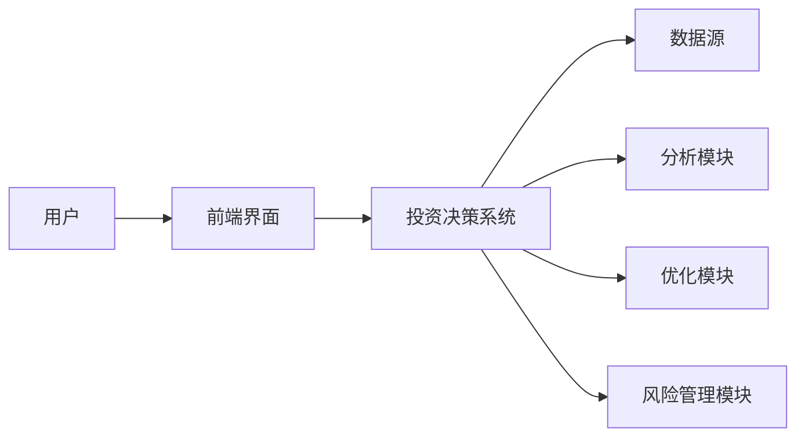

                 


# 约翰·伯格的长期投资观：时间是你的朋友

## 关键词：约翰·伯格，长期投资，时间价值，复利效应，价值投资策略

## 摘要：本文深入探讨了约翰·伯格的长期投资理念，分析了时间在投资中的重要性，结合数学模型和实际案例，展示了如何通过长期投资和价值投资策略实现财富增长。

---

## 第1章：投资的基本概念与重要性

### 1.1 投资的基本概念

- **投资**是指将资金投入某个项目或资产，以期在未来获得收益或资本增值的过程。
- 投资的目的在于通过资产配置和风险管理，实现财富的保值与增值。
- 投资可以分为**股票、债券、房地产**等多种形式，每种形式都有其特点和风险。

### 1.2 长期投资的重要性

- **长期投资**是指持有资产超过一年的投资行为，其核心理念是通过时间的积累实现复利效应。
- 长期投资的优势在于能够分散短期波动的风险，捕捉长期经济增长的机会。
- 长期投资与短期投资的主要区别在于**时间跨度**和**风险承受能力**。

### 1.3 时间在投资中的作用

- **时间的价值**体现在复利效应上，即“钱生钱”的过程。复利效应能够显著提高投资回报率。
- 复利效应的公式为：$$ FV = PV \times (1 + r)^n $$
  其中，FV为终值，PV为现值，r为年化收益率，n为投资年数。

---

## 第2章：约翰·伯格的生平与投资理念

### 2.1 约翰·伯格的生平简介

- 约翰·伯格是**Vanguard集团**的创始人，被誉为“指数基金之父”。
- 他早年就读于宾夕法尼亚大学，后加入菲利普斯·哈内姆公司，致力于研究投资策略。
- 伯格的主要成就是发明了指数基金，为普通投资者提供了低成本、分散化的投资工具。

### 2.2 约翰·伯格的投资理念

- **价值投资**：伯格认为，投资的本质是购买企业的一部分，而非单纯追求价格波动。
- **长期持有**：他强调，长期持有优质资产能够避免短期波动的影响，实现稳定增长。
- **分散投资**：通过分散投资降低风险，指数基金是实现分散投资的有效工具。

### 2.3 约翰·伯格的著作与影响

- 伯格的著作《**约翰·伯格的投资之道**》是投资领域的经典读物，书中详细阐述了他的投资哲学和策略。
- 他的投资理念对全球资产管理行业产生了深远影响，推动了低成本投资工具的发展。

---

## 第3章：时间价值与复利效应的数学模型

### 3.1 复利的数学公式

- **复利计算公式**：$$ FV = PV \times (1 + r)^n $$
  其中，FV为终值，PV为现值，r为年化收益率，n为投资年数。
- **年金计算公式**：$$ FV = PMT \times \frac{(1 + r)^n - 1}{r} $$
  其中，PMT为每期支付的金额。

### 3.2 复利效应的图表分析


### 3.3 时间与投资回报的关系

- **时间对复利的影响**：投资时间越长，复利效应越显著。例如，投资10年和20年的回报率差异可能超过一倍。
- **不同时间段的投资回报对比**：通过绘制复利增长曲线，可以直观看到长期投资的回报优势。

---

## 第4章：价值投资的核心策略

### 4.1 价值投资的基本原则

- **买入低于内在价值的股票**：通过基本面分析，寻找被市场低估的资产。
- **长期持有优质资产**：避免频繁交易，降低交易成本和税收负担。
- **分散投资以降低风险**：通过投资多个资产类别，降低单一资产的风险。

### 4.2 约翰·伯格的价值投资模型

- **股票估值的方法**：包括市盈率、市净率等指标，评估资产的内在价值。
- **公司基本面分析**：关注公司的财务状况、盈利能力和发展前景。
- **行业分析与竞争地位**：选择具有竞争优势和良好发展前景的行业。

### 4.3 投资组合的构建与管理

- **投资组合的分散化**：通过配置不同资产类别和行业，降低投资风险。
- **定期调整投资组合**：根据市场变化和个人财务状况，进行适当调整。

---

## 第5章：系统分析与架构设计

### 5.1 投资决策系统的功能设计

- **系统功能模块**：
  - 数据采集与处理
  - 资产估值与分析
  - 投资组合优化
  - 风险管理与预警

### 5.2 系统架构设计



### 5.3 系统交互设计


---

## 第6章：项目实战与案例分析

### 6.1 环境安装与配置

- **工具安装**：安装Python、Pandas、Matplotlib等工具。
- **数据获取**：从金融数据源获取历史数据。

### 6.2 核心代码实现

```python
import pandas as pd
import matplotlib.pyplot as plt

# 示例代码：计算复利增长
pv = 10000
r = 0.07
n = 10

fv = pv * (1 + r) ** n
print(f"终值：${fv:.2f}")
```

### 6.3 实际案例分析

- 通过构建一个简单的投资组合，展示如何应用约翰·伯格的方法进行投资。
- 分析不同投资策略下的回报率和风险水平。

---

## 第7章：总结与最佳实践

### 7.1 投资的注意事项

- **避免过度杠杆**：过高的杠杆会增加投资风险。
- **分散投资**：不要将所有资金投入单一资产。
- **定期复盘**：根据市场变化和个人情况调整投资策略。

### 7.2 小结

- 时间是投资的朋友，长期投资能够充分利用复利效应。
- 约翰·伯格的价值投资策略强调基本面分析和长期持有，为投资者提供了有效的指导。

---

## 作者：AI天才研究院 & 禅与计算机程序设计艺术

---

以上是完整的博客文章结构，涵盖了从基础概念到实际应用的各个方面，结合了技术分析和投资策略，适合对长期投资感兴趣的技术读者阅读。

