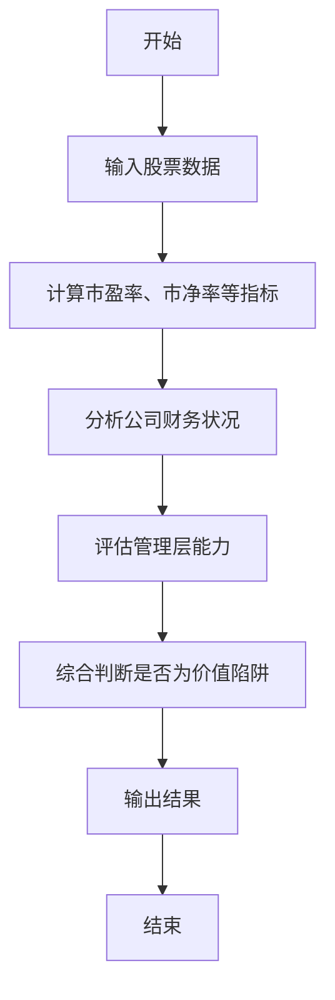
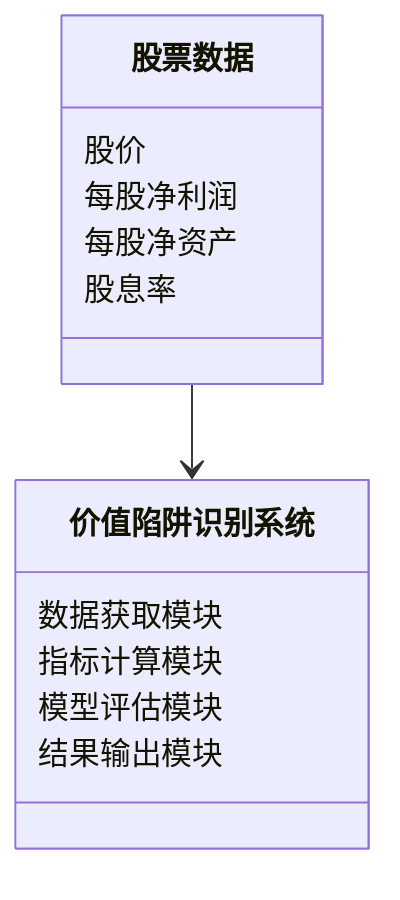
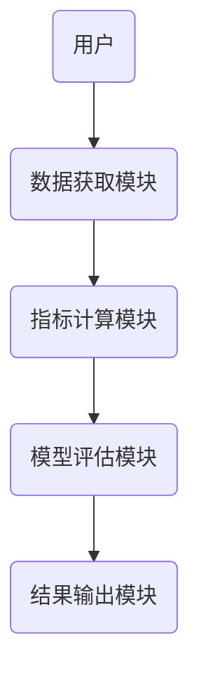

                 


# 约翰·内夫的价值陷阱识别技巧

**关键词**：约翰·内夫，价值陷阱，价值投资，投资策略，风险管理，投资组合优化

**摘要**：  
约翰·内夫是价值投资领域的传奇人物，他通过长期的投资实践总结出了一套独特的方法来识别和避开价值陷阱。本文将从内夫的价值投资理念出发，详细分析价值陷阱的核心概念、识别方法、数学模型和算法实现，并结合实际案例进行深入探讨。通过本文，读者将能够掌握内夫的价值陷阱识别技巧，并将其应用到实际投资中。

---

## 第一部分：价值陷阱识别的背景与核心概念

### 第1章：价值陷阱的定义与问题背景

#### 1.1 价值陷阱的定义与特征
- **1.1.1 价值陷阱的定义**  
  价值陷阱是指那些表面上看似估值低廉，但实际上存在严重问题（如财务困境、行业衰退或管理层问题）的公司。投资者如果误判，可能会买入看似便宜但实际无法创造价值的股票。

- **1.1.2 价值陷阱的核心特征**  
  价值陷阱的核心特征包括：  
  - 公司基本面持续恶化，但估值指标（如市盈率、市净率）看似低廉。  
  - 行业处于衰退期或竞争激烈，公司难以维持竞争优势。  
  - 管理层存在问题（如财务造假、内部腐败）。  
  - 财务数据虚假或不可靠，掩盖了公司的实际问题。

- **1.1.3 价值陷阱与价值投资的区别**  
  价值投资追求的是找到市场价格低于内在价值的公司，而价值陷阱则是指市场价格看似低于内在价值，但实际内在价值本身存在问题。内夫强调，价值投资者必须避免陷入价值陷阱。

#### 1.2 价值陷阱识别的必要性
- **1.2.1 投资者为何需要识别价值陷阱**  
  投资者如果不具备识别价值陷阱的能力，很容易买入看似便宜但实际存在严重问题的股票，导致投资损失。

- **1.2.2 价值陷阱对投资组合的影响**  
  价值陷阱可能导致投资组合的收益下降甚至亏损，尤其是在市场低迷时期，这类股票的表现往往更差。

- **1.2.3 价值陷阱识别的挑战与机遇**  
  识别价值陷阱的挑战在于需要综合分析财务数据、行业趋势和公司管理等多个方面，但这也为投资者提供了通过深入研究发现优质投资标的的机会。

#### 1.3 约翰·内夫的价值投资理念
- **1.3.1 内夫的投资哲学概述**  
  内夫是价值投资的倡导者，他认为市场先生是机会的仆人，而不是主人。他强调通过深入研究找到那些具有持续竞争优势和良好治理的公司。

- **1.3.2 内夫对价值陷阱的独特见解**  
  内夫认为，价值陷阱的核心问题在于公司的内在价值存在严重缺陷，而非仅仅估值指标的偏差。他提醒投资者要避免买入那些看似便宜但实际存在问题的股票。

- **1.3.3 内夫投资策略的核心要素**  
  内夫的投资策略包括：  
  - 专注于具有持续竞争优势的公司。  
  - 重视管理层的道德和能力。  
  - 坚持长期投资，避免短期波动的干扰。  

---

## 第二部分：价值陷阱识别的核心概念与模型

### 第2章：内夫的价值评估模型

#### 2.1 内部价值评估的关键指标
- **2.1.1 市盈率（P/E）的计算与应用**  
  市盈率 = 股价 / 每股净利润。市盈率过低可能表明股票被低估，但也可能是公司盈利能力持续下降的结果。  
  $$ P/E = \frac{\text{股价}}{\text{每股净利润}} $$  

- **2.1.2 市净率（P/B）的计算与应用**  
  市净率 = 股价 / 每股净资产。市净率过低可能表明股票被低估，但需要结合行业特性分析（如银行业和制造业的市净率通常较低）。  
  $$ P/B = \frac{\text{股价}}{\text{每股净资产}} $$  

- **2.1.3 股息率与股息支付率的分析**  
  股息率 = 每股股息 / 股价。股息支付率 = 股息 / 净利润。高股息率可能表明公司盈利能力下降，而低股息支付率可能表明公司缺乏派息能力。

#### 2.2 内夫的多因子模型
- **2.2.1 多因子模型的构建逻辑**  
  内夫的多因子模型结合了多个财务指标和非财务因素，以全面评估公司的内在价值和风险。模型的核心在于通过多维度分析，避免单一指标的误导。

- **2.2.2 各因子的权重分配与计算**  
  - 财务指标权重：市盈率、市净率、股息率等。  
  - 非财务指标权重：行业地位、管理层能力、企业治理等。  

- **2.2.3 多因子模型的优缺点分析**  
  优点：全面考虑了影响公司价值的多个因素；缺点：计算复杂，需要大量数据支持。

#### 2.3 价值陷阱识别的逻辑框架
- **2.3.1 识别价值陷阱的逻辑步骤**  
  1. 筛选低估值股票（市盈率、市净率低于行业平均水平）。  
  2. 分析公司的财务健康状况（如盈利能力、资产负债率）。  
  3. 调查管理层能力和企业治理情况。  
  4. 结合行业趋势和宏观经济环境进行综合判断。  

- **2.3.2 各步骤之间的关系与依赖**  
  低估值股票可能是价值陷阱，也可能是价值投资标的，因此需要通过多维度分析进行区分。

- **2.3.3 逻辑框架的优缺点分析**  
  优点：逻辑清晰，易于操作；缺点：需要大量数据和时间支持，对投资者的专业能力要求较高。

---

## 第三部分：价值陷阱识别的算法原理与数学模型

### 第3章：内夫价值评估算法的实现

#### 3.1 内夫价值评估算法的流程图


#### 3.2 内部价值评估的数学模型
- **3.2.1 市盈率模型的数学公式**  
  $$ \text{市盈率} = \frac{\text{股价}}{\text{每股净利润}} $$  

- **3.2.2 市净率模型的数学公式**  
  $$ \text{市净率} = \frac{\text{股价}}{\text{每股净资产}} $$  

- **3.2.3 股息率模型的数学公式**  
  $$ \text{股息率} = \frac{\text{每股股息}}{\text{股价}} $$  

#### 3.3 算法实现的Python代码示例
```python
import pandas as pd

def calculate_pe_ratio(df):
    df['PE'] = df['股价'] / df['每股净利润']
    return df

def calculate_pb_ratio(df):
    df['PB'] = df['股价'] / df['每股净资产']
    return df

def is_value_trap(df):
    value_traps = []
    for index, row in df.iterrows():
        if row['PE'] < 15 and row['PB'] < 1 and row['股息率'] < 2:
            value_traps.append(True)
        else:
            value_traps.append(False)
    df['价值陷阱'] = value_traps
    return df

# 示例数据
data = {
    '股价': [10, 20, 30],
    '每股净利润': [0.5, 1.0, 1.5],
    '每股净资产': [5, 10, 15],
    '股息率': [2, 3, 4]
}

df = pd.DataFrame(data)
df = calculate_pe_ratio(df)
df = calculate_pb_ratio(df)
df = is_value_trap(df)
print(df)
```

---

## 第四部分：价值陷阱识别的系统分析与架构设计

### 第4章：价值陷阱识别系统的架构设计

#### 4.1 系统功能需求分析
- **系统目标**：开发一个基于内夫价值评估模型的自动化价值陷阱识别系统。  
- **功能模块**：数据获取、指标计算、模型评估、结果输出。  

#### 4.2 系统功能设计(领域模型)


#### 4.3 系统架构设计


---

## 第五部分：价值陷阱识别的项目实战

### 第5章：价值陷阱识别的Python实现

#### 5.1 环境安装
- 安装必要的库：`pandas`、`numpy`、`scikit-learn`。

#### 5.2 系统核心实现源代码
```python
import pandas as pd
import numpy as np

# 示例数据
data = {
    '股票代码': ['A', 'B', 'C'],
    '股价': [10, 20, 30],
    '每股净利润': [0.5, 1.0, 1.5],
    '每股净资产': [5, 10, 15],
    '股息率': [2, 3, 4]
}

df = pd.DataFrame(data)

# 计算市盈率和市净率
df['PE'] = df['股价'] / df['每股净利润']
df['PB'] = df['股价'] / df['每股净资产']

# 价值陷阱识别逻辑
df['价值陷阱'] = False
for index, row in df.iterrows():
    if (row['PE'] < 15) and (row['PB'] < 1) and (row['股息率'] < 2):
        df.loc[index, '价值陷阱'] = True

print(df)
```

---

## 第六部分：价值陷阱识别的最佳实践

### 第6章：最佳实践与小结

#### 6.1 小结
- 价值陷阱识别是一个复杂但重要的过程，需要结合财务数据、行业趋势和管理层能力等多方面因素。
- 内夫的价值投资理念提醒我们，投资不仅要关注估值指标，还要关注公司的内在价值和风险。

#### 6.2 注意事项
- 避免仅依赖单一指标进行判断，要结合多维度分析。
- 定期复盘和调整投资策略，避免被市场情绪干扰。

#### 6.3 拓展阅读
- 内夫的书籍《价值投资》。
- 其他价值投资经典著作，如巴菲特的《聪明的投资者》。

---

## 作者：AI天才研究院/AI Genius Institute & 禅与计算机程序设计艺术/Zen And The Art of Computer Programming

