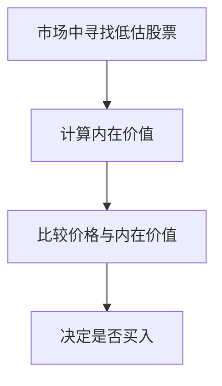
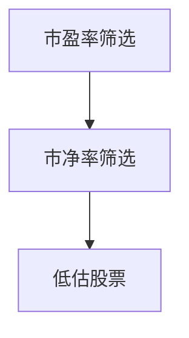
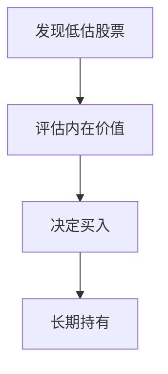

                 

# 约翰·内夫的低估值投资：简单而有效的价值策略

---

## 关键词：
低估值投资，约翰·内夫，价值投资，市盈率，市净率，内在价值

---

## 摘要：
本文深入探讨了约翰·内夫的低估值投资策略，分析了其核心理念、筛选标准、投资组合构建方法以及风险管理策略。通过案例分析和数学模型，本文揭示了低估值投资的逻辑和优势，帮助读者理解如何在市场中找到低估的优质股票，实现长期稳定的收益。

---

# 第一部分：低估值投资的背景与基础

## 第1章：低估值投资的起源与核心概念

### 1.1 低估值投资的起源
#### 1.1.1 价值投资的定义与历史
价值投资是一种以低于内在价值的价格买入优质股票的投资策略，起源于20世纪初。其核心理念是寻找市场低估的公司，长期持有，等待其价值回归。

> **公式：**
> 内在价值（Intrinsic Value）= 未来现金流的现值

**案例：** 1929年经济大萧条期间，价值投资者抓住了市场的低估机会，实现了超额收益。

#### 1.1.2 约翰·内夫的投资理念
约翰·内夫是低估值投资的代表人物，他强调以合理价格买入优质企业，注重企业的竞争优势和长期盈利能力。

> **公式：**
> 价格（Price）= 市盈率（P/E） × 每股收益（EPS）

**图1-1：价值投资的简单流程图**

#### 1.1.3 低估值投资的理论基础
低估值投资基于市场有效性和非理性假设，认为短期价格波动不影响长期价值。

---

### 1.2 低估值投资的核心概念
#### 1.2.1 低估值的定义
低估值是指股票的市场价格低于其内在价值。这种差异为投资者提供了安全边际。

> **公式：**
> 安全边际 = 内在价值 - 市场价格

**图1-2：低估值与市场价格的关系**

#### 1.2.2 市盈率与市净率的计算公式
市盈率（P/E）= 股价 / 每股收益  
市净率（P/B）= 股价 / 每股净资产

**表1-1：市盈率与市净率的对比**

| 指标 | 公式 | 适用场景 |
|------|------|----------|
| P/E  | 股价 / EPS | 利润稳定的公司 |
| P/B  | 股价 / BPS | 资产密集型行业 |

#### 1.2.3 低估值投资的边界与外延
低估值投资的边界包括行业选择和估值区间，外延则包括成长性和周期性行业的应用。

---

## 第2章：低估值投资的逻辑与优势

### 2.1 低估值投资的逻辑框架
#### 2.1.1 价值与价格的辩证关系
价格波动是短期的，而价值是长期稳定的。

> **公式：**
> 价格 = 市场情绪 × 价值

**图2-1：价值与价格的动态关系**

#### 2.1.2 市场情绪与价格波动的分析
市场情绪影响价格波动，低估值投资通过逆向思维寻找低估机会。

**图2-2：市场情绪与价格波动的关系**

#### 2.1.3 低估值投资的长期有效性
低估值投资通过长期持有优质资产，实现复利效应。

---

### 2.2 低估值投资的优势
#### 2.2.1 低估值投资的风险控制优势
低估值股票的风险较低，具有较高的安全边际。

> **公式：**
> 风险 = 标准差（价格波动） / 投资额

#### 2.2.2 低估值投资的收益潜力分析
低估值股票的收益潜力来源于价值回归和长期增长。

> **公式：**
> 收益率 = （内在价值 - 购买价格） / 购买价格

#### 2.2.3 低估值投资的长期稳定性
低估值投资通过长期持有优质资产，抵御短期市场波动。

---

# 第二部分：低估值投资的核心策略

## 第3章：低估值股票的筛选与评估

### 3.1 低估值股票的筛选标准
#### 3.1.1 市盈率与市净率的双重筛选
通过同时考虑市盈率和市净率，筛选出低估股票。

**图3-1：市盈率与市净率的双重筛选**

#### 3.1.2 盈利能力与成长性的综合评估
通过ROE和收入增长率评估公司的盈利能力。

> **公式：**
> ROE = 净利润 / 净资产  
> 收入增长率 = （当前收入 - 上期收入） / 上期收入

#### 3.1.3 行业地位与竞争优势的分析
选择行业龙头或具有竞争优势的公司。

---

### 3.2 低估值股票的内在价值评估
#### 3.2.1 内在价值的计算公式
内在价值是未来现金流的现值。

> **公式：**
> 内在价值 = ∑（CF_t / (1 + r)^t）

**图3-2：现金流折现模型**

#### 3.2.2 现金流折现模型的应用
通过DCF模型评估公司的内在价值。

#### 3.2.3 相对估值法的优缺点分析
相对估值法通过比较同行业公司进行估值。

---

## 第4章：低估值投资的组合管理与风险控制

### 4.1 投资组合的构建策略
#### 4.1.1 股票配置的比例分配
低估值股票占总投资比例的建议。

> **公式：**
> 配置比例 = （低估值股票数量 / 总股票数量） × 100%

#### 4.1.2 行业分散与个股集中度的平衡
分散投资行业，集中持有优质个股。

**图4-1：投资组合的分散与集中**

#### 4.1.3 低估值组合的风险控制
通过止损和分散投资控制风险。

---

### 4.2 低估值投资的风险管理
#### 4.2.1 市场波动对低估值投资的影响
市场波动可能导致低估值股票短期下跌。

#### 4.2.2 个股风险与组合风险的区分
区分个股风险和系统性风险，采取不同的应对策略。

#### 4.2.3 低估值投资的止损策略
设置止损点，避免重大损失。

---

# 第三部分：低估值投资的实践与案例分析

## 第5章：低估值投资的成功案例

### 5.1 约翰·内夫的经典投资案例
#### 5.1.1 某公司投资案例分析
详细分析内夫如何通过低估值投资获得成功。

**图5-1：投资决策的流程图**

#### 5.1.2 投资决策背后的
内夫的投资决策基于对公司基本面的深入分析。

---

## 第6章：低估值投资的风险与应对策略

### 6.1 低估值投资的风险
#### 6.1.1 市场风险
市场整体下跌影响低估值股票的价格。

#### 6.1.2 个股风险
个别公司基本面恶化导致股价下跌。

---

## 第7章：低估值投资的未来展望

### 7.1 低估值投资的未来趋势
随着市场发展，低估值投资策略将不断创新。

### 7.2 低估值投资的创新方向
结合大数据和人工智能，优化低估值股票的筛选和评估。

---

# 结语

低估值投资是一种简单而有效的价值策略，通过深入分析公司基本面和市场估值，寻找低估的优质股票，实现长期稳定的收益。投资者需要耐心和纪律，坚持长期持有优质资产，避免短期波动的干扰。

---

# 作者：AI天才研究院/AI Genius Institute & 禅与计算机程序设计艺术 /Zen And The Art of Computer Programming

