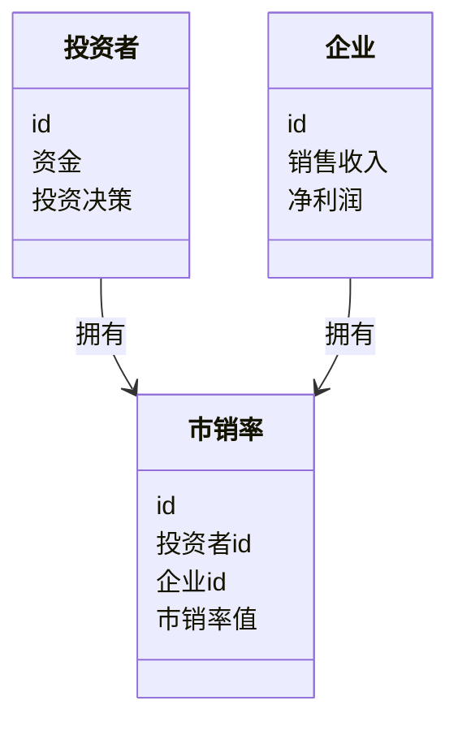
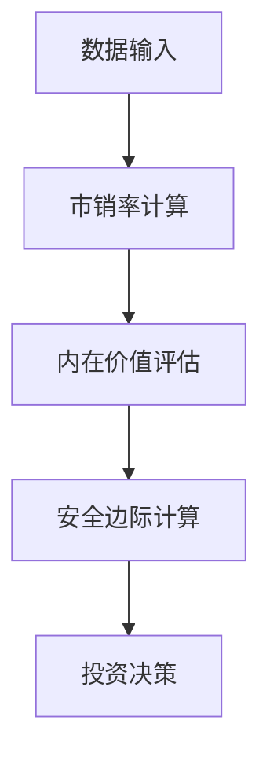
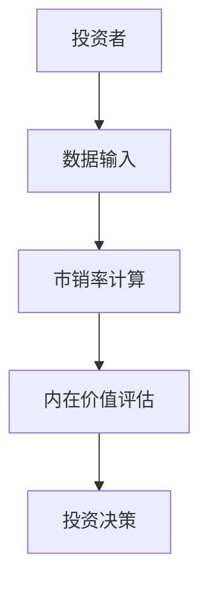

                 


# 约翰·内夫的低市销率投资：另一种价值投资视角

## 关键词：约翰·内夫、低市销率、价值投资、市销率、内在价值、投资策略、系统架构

## 摘要：本文详细探讨了约翰·内夫的低市销率投资策略，从其理论基础、数学模型、系统架构到实际应用进行了全面分析，展示了如何通过低市销率投资实现长期价值增长。

---

## 第1章: 低市销率投资的背景与问题背景

### 1.1 价值投资的演变与低市销率投资的兴起

#### 1.1.1 价值投资的起源与发展
价值投资是一种长期投资策略，起源于20世纪初，由本杰明·格雷厄姆和戴维·多德提出。其核心思想是寻找市场价格低于其内在价值的股票。20世纪70年代，约翰·内夫在这一理论基础上，提出了低市销率投资策略，进一步丰富了价值投资的内涵。

#### 1.1.2 低市销率投资的定义与特点
低市销率投资是价值投资的一种形式，专注于寻找市销率（Price-to-Sales Ratio，P/S）低于其内在价值的企业。其特点是：
1. **低市销率**：即P/S < 1，表示市场价格低于企业销售收入。
2. **长期价值**：关注企业的持续盈利能力，而非短期市场波动。
3. **逆向投资**：在市场低迷时买入，市场繁荣时卖出。

#### 1.1.3 低市销率投资在现代投资环境中的重要性
在当前市场环境下，低市销率投资的重要性体现在：
1. **抵御市场波动**：通过低市销率筛选，降低投资风险。
2. **挖掘潜在价值**：发现被市场低估的企业，实现长期收益。
3. **适应经济周期**：在经济下行期，低市销率企业更具防御性。

---

### 1.2 低市销率投资的核心问题背景

#### 1.2.1 投资者为何关注市销率
市销率是衡量企业价值的重要指标，尤其适用于销售收入较高的企业。投资者关注市销率的原因包括：
1. **评估企业价值**：市销率反映了市场价格与企业销售收入的比例，帮助投资者判断企业是否被低估。
2. **风险控制**：低市销率意味着较低的市场风险。
3. **投资机会**：市销率低于1的企业通常具有较高的投资潜力。

#### 1.2.2 低市销率投资与企业内在价值的关系
低市销率投资的核心是通过市销率与企业内在价值的对比，找到市场价格低于内在价值的企业。企业内在价值是其未来现金流的现值，通过低市销率投资，投资者可以以更低的价格买入高价值企业。

#### 1.2.3 低市销率投资的边界与外延
低市销率投资的边界包括：
1. **行业限制**：适用于销售收入稳定且可预测的行业。
2. **企业规模**：适用于中大型企业，小型企业可能因数据不足而难以评估。
3. **时间窗口**：长期投资，避免短期市场波动的影响。

---

## 第2章: 低市销率投资的核心概念与联系

### 2.1 核心概念原理

#### 2.1.1 市销率的定义与计算公式
市销率（P/S）是衡量企业价值的重要指标，计算公式为：
$$市销率 = \frac{股票价格}{每股销售收入}$$
其中，每股销售收入是企业销售收入除以总股本。

#### 2.1.2 低市销率投资的基本原理
低市销率投资的核心是通过寻找市销率低于1的企业，以低于其内在价值的价格买入。其基本原理包括：
1. **价值低估**：市场价格低于企业价值。
2. **长期增长**：企业具有持续增长潜力。
3. **安全边际**：买入价格与内在价值之间的差距提供安全边际。

#### 2.1.3 低市销率与企业价值评估的关系
低市销率是企业价值评估的重要指标，通过市销率与企业内在价值的对比，投资者可以判断企业是否被低估。

---

### 2.2 核心概念对比分析

#### 2.2.1 市盈率与市销率的对比
市盈率（P/E）与市销率（P/S）的对比：
| 指标 | 市盈率（P/E） | 市销率（P/S） |
|------|----------------|---------------|
| 定义 | 股价/每股净利润 | 股价/每股销售收入 |
| 适用场景 | 盈利稳定的企业 | 销售收入稳定的企业 |
| 优缺点 | 优点：反映盈利能力；缺点：净利润可能为负 | 优点：反映销售能力；缺点：销售收入可能波动较大 |

#### 2.2.2 低市销率与高市盈率投资的对比
低市销率与高市盈率投资的对比：
| 指标 | 低市销率 | 高市盈率 |
|------|----------|----------|
| 投资理念 | 买入被低估的企业 | 买入高增长潜力的企业 |
| 风险 | 较低 | 较高 |
| 收益 | 稳定 | 波动较大 |

#### 2.2.3 低市销率与PEG估值法的对比
PEG（Price/Earnings to Growth）估值法与低市销率的对比：
| 指标 | PEG | 低市销率 |
|------|------|----------|
| 定义 | 股价/每股净利润 | 股价/每股销售收入 |
| 适用场景 | 高增长企业 | 低增长企业 |
| 优缺点 | 优点：反映增长潜力；缺点：增长预测难 | 优点：反映销售能力；缺点：销售数据波动大 |

---

### 2.3 实体关系图（ER图）



---

## 第3章: 低市销率投资的数学模型与算法原理

### 3.1 低市销率投资的数学模型

#### 3.1.1 市销率计算公式
$$市销率 = \frac{股票价格}{每股销售收入}$$

#### 3.1.2 企业内在价值评估模型
$$内在价值 = \frac{净利润}{加权平均资本成本}$$

---

### 3.2 低市销率投资的算法原理



---

## 第4章: 低市销率投资的系统分析与架构设计

### 4.1 投资决策支持系统架构

#### 4.1.1 系统功能模块
1. 数据输入模块：接收企业财务数据和市场数据。
2. 市销率计算模块：计算市销率。
3. 内在价值评估模块：评估企业内在价值。
4. 投资决策模块：基于市销率和内在价值，生成投资建议。

#### 4.1.2 系统架构图



---

## 第5章: 低市销率投资的项目实战

### 5.1 环境配置

```python
# 安装必要的库
pip install pandas numpy matplotlib
```

### 5.2 核心代码实现

```python
import pandas as pd
import numpy as np

# 示例数据
data = {
    '股票代码': ['A', 'B', 'C'],
    '股票价格': [50, 60, 40],
    '销售收入': [100, 150, 80]
}
df = pd.DataFrame(data)

# 计算市销率
df['市销率'] = df['股票价格'] / df['销售收入']

# 筛选低市销率股票（市销率 < 1）
low_ps_stocks = df[df['市销率'] < 1]
```

### 5.3 案例分析

```python
# 案例：股票A
stock_A_price = 50
stock_A_sales = 100
stock_A_ps = stock_A_price / stock_A_sales = 0.5 < 1
# 结论：股票A符合低市销率投资条件
```

---

## 第6章: 总结与注意事项

### 6.1 总结
低市销率投资是一种有效的价值投资策略，通过寻找市销率低于1的企业，实现长期价值增长。投资者需要结合企业内在价值和市场环境，制定合理的投资策略。

### 6.2 注意事项
1. **风险控制**：低市销率投资并非无风险，需关注企业财务状况和行业前景。
2. **长期投资**：避免短期市场波动的影响，坚持长期投资。
3. **持续学习**：关注市场变化，不断优化投资策略。

---

## 作者：AI天才研究院/AI Genius Institute & 禅与计算机程序设计艺术 /Zen And The Art of Computer Programming

