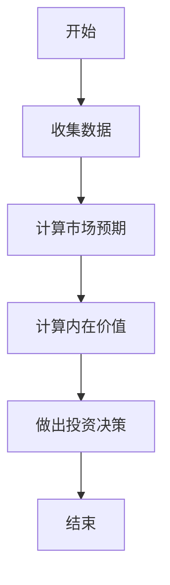
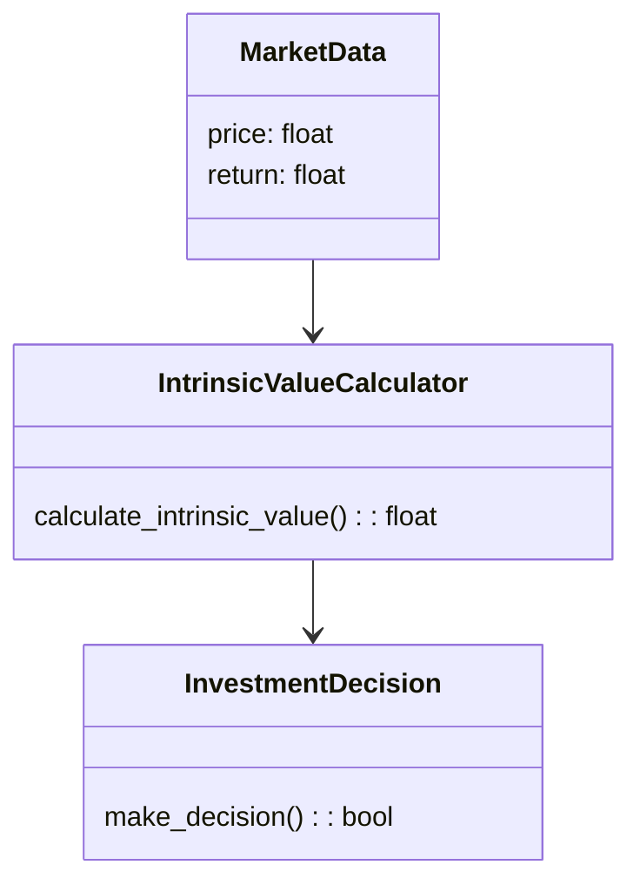
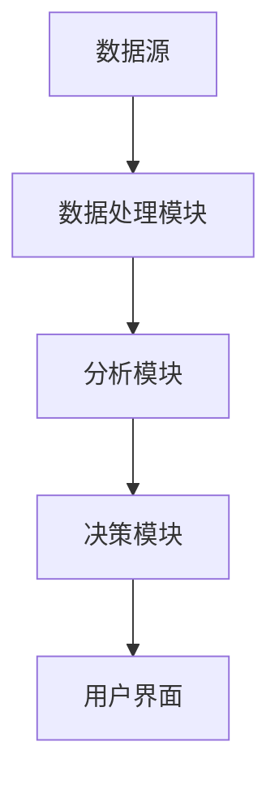
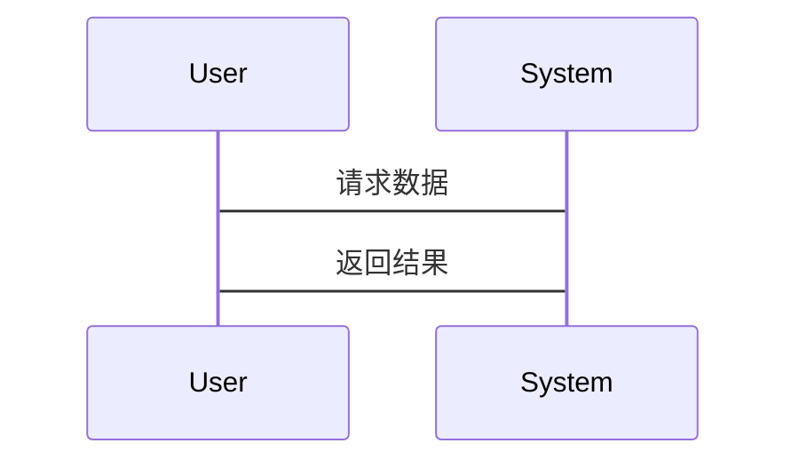

                 


# 约翰·内夫的低预期投资策略

## 关键词：
约翰·内夫、低预期投资、投资策略、价值投资、投资分析

## 摘要：
本文深入分析了约翰·内夫的低预期投资策略，探讨其核心原理、算法模型和实际应用。通过详细阐述低预期投资的识别方法、估值技术以及风险管理，结合数学公式和系统架构设计，帮助读者全面理解这一策略的精髓。

---

# 第一部分: 低预期投资策略的背景与基础

## 第1章: 低预期投资策略概述

### 1.1 低预期投资的核心概念

#### 1.1.1 低预期投资的定义与背景
低预期投资是指在市场参与者对某只股票的预期较低时，选择投资该股票的一种策略。这种策略的核心在于利用市场的低估机会，通过长期持有实现超额收益。

#### 1.1.2 投资市场的预期形成机制
市场的预期形成机制包括市场参与者的心理预期、历史表现、行业趋势和宏观经济环境等多重因素。低预期投资策略关注的是市场预期与实际价值的偏离。

#### 1.1.3 低预期投资的目标与意义
低预期投资的目标是通过识别市场低估的股票，实现长期资本增值。其意义在于利用市场的非理性波动，捕捉价值低估的机会。

### 1.2 约翰·内夫的投资理念

#### 1.2.1 约翰·内夫的生平与投资风格
约翰·内夫是美国著名投资家，以其独特的低预期投资策略闻名。他强调长期投资、价值发现和风险管理。

#### 1.2.2 内夫的低预期投资策略
内夫的核心策略是通过分析公司的基本面，识别市场预期低于实际价值的股票，长期持有，等待市场重新评估。

#### 1.2.3 内夫投资理念的现代价值
内夫的理念在现代投资中依然具有重要价值，尤其是在市场波动加剧的情况下，低预期策略可以帮助投资者规避风险。

### 1.3 低预期投资与价值投资的联系与区别

#### 1.3.1 价值投资的基本原理
价值投资强调以低于内在价值的价格买入优质股票，注重公司的基本面分析。

#### 1.3.2 低预期投资的独特性
低预期投资关注市场预期的偏离，强调在市场低估时介入，而非单纯依赖价格与价值的差异。

#### 1.3.3 两者的异同对比
| 投资策略 | 价值投资 | 低预期投资 |
|----------|-----------|-------------|
| 核心理念 | 价格低于价值 | 市场预期低于实际价值 |
| 适用场景 | 长期结构性低估 | 市场周期性低估 |
| 风险管理 | 侧重于价格波动 | 侧重于预期偏差 |

### 1.4 低预期投资的适用场景与限制

#### 1.4.1 低预期投资的适用市场环境
适用于市场波动较大、投资者情绪低迷的时期。

#### 1.4.2 低预期投资的局限性
低预期策略在市场过热或公司基本面恶化时可能失效。

#### 1.4.3 投资者需注意的事项
投资者需具备长期持有的耐心，并持续关注公司的基本面变化。

## 1.5 本章小结

---

# 第二部分: 低预期投资策略的核心原理

## 第2章: 低预期投资的识别与评估

### 2.1 低预期公司的识别标准

#### 2.1.1 市场预期的衡量指标
常用的市场预期衡量指标包括市盈率（P/E）、市净率（P/B）和股息率（Dividend Yield）。

#### 2.1.2 公司基本面的分析方法
通过分析公司的收入、利润、资产负债表和现金流等指标，评估其实际价值。

#### 2.1.3 行业环境与竞争分析
关注行业趋势和竞争对手的动态，判断公司的市场地位和竞争优势。

### 2.2 低预期投资的估值方法

#### 2.2.1 市盈率与市净率分析
市盈率（P/E）=股价/每股收益，市净率（P/B）=股价/每股净资产。

#### 2.2.2 内在价值的计算公式
$$ V = \sum_{t=1}^{n} \frac{CF_t}{(1 + r)^t} $$
其中，$V$为内在价值，$CF_t$为第$t$年的现金流，$r$为折现率。

#### 2.2.3 股价与价值的偏离度分析
通过比较股价与内在价值的偏离程度，判断是否存在低估机会。

### 2.3 低预期投资的决策模型

#### 2.3.1 内部收益率（IRR）的计算
$$ IRR = r \text{ 使得 } \sum_{t=1}^{n} \frac{CF_t}{(1 + r)^t} = 0 $$
#### 2.3.2 净现值（NPV）的评估方法
$$ NPV = \sum_{t=1}^{n} \frac{CF_t}{(1 + r)^t} $$
#### 2.3.3 投资风险的量化分析
通过波动率、贝塔系数等指标量化投资风险。

### 2.4 低预期投资的风险管理

#### 2.4.1 风险的分类与识别
包括市场风险、流动性风险和公司特定风险。

#### 2.4.2 风险控制的策略与工具
使用多样化投资、止损策略和定期再平衡等方法控制风险。

#### 2.4.3 风险调整后的投资决策
根据风险承受能力调整投资组合的构成。

## 2.5 本章小结

---

# 第三部分: 低预期投资策略的算法与数学模型

## 第3章: 低预期投资的数学模型

### 3.1 低预期投资的核心公式

#### 3.1.1 市场预期的数学表达
$$ E = \frac{P}{D} $$
其中，$E$为市场预期，$P$为市场报价，$D$为公司基本面数据。

#### 3.1.2 内在价值的计算公式
$$ V = \sum_{t=1}^{n} \frac{CF_t}{(1 + r)^t} $$

### 3.2 低预期投资的算法流程

#### 3.2.1 数据收集与预处理
```python
import pandas as pd
data = pd.read_csv('market_data.csv')
data = data.dropna().reset_index()
```

#### 3.2.2 市场预期的计算
```python
def calculate_expected_return(data):
    return data['return'].mean()
```

#### 3.2.3 内在价值的评估
```python
def calculate_intrinsic_value(data, discount_rate):
    cf = data['cash_flow'].values
    n = len(cf)
    iv = sum(cf / (1 + discount_rate) ** t for t in range(1, n+1))
    return iv
```

#### 3.2.4 投资决策
```python
expected_return = calculate_expected_return(data)
intrinsic_value = calculate_intrinsic_value(data, 0.05)
if intrinsic_value > data['price'].mean():
    print("投资")
else:
    print("不投资")
```

### 3.3 算法的可视化流程图


### 3.4 本章小结

---

# 第四部分: 低预期投资策略的系统分析与架构设计

## 第4章: 系统分析与架构设计

### 4.1 系统分析

#### 4.1.1 问题场景介绍
低预期投资系统用于辅助投资者识别市场低估的股票，优化投资组合。

#### 4.1.2 系统功能设计
- 数据采集模块：收集市场数据。
- 分析模块：计算市场预期和内在价值。
- 决策模块：生成投资建议。

### 4.2 系统架构设计

#### 4.2.1 领域模型类图


#### 4.2.2 系统架构图


### 4.3 系统交互设计

#### 4.3.1 序列图


## 4.4 本章小结

---

# 第五部分: 低预期投资策略的项目实战

## 第5章: 项目实战

### 5.1 环境配置

```python
import pandas as pd
import numpy as np
```

### 5.2 核心实现

#### 5.2.1 数据获取与预处理
```python
data = pd.read_csv('market_data.csv')
data = data.dropna().reset_index()
```

#### 5.2.2 低预期股票识别
```python
def identify_low_expectation(data):
    mean_price = data['price'].mean()
    low_expectation = data[data['price'] < 0.9 * mean_price]
    return low_expectation
```

#### 5.2.3 投资决策
```python
low_expectation_stocks = identify_low_expectation(data)
for stock in low_expectation_stocks:
    if stock['intrinsic_value'] > stock['price']:
        print(f"投资股票{stock['name']}")
    else:
        print(f"不投资股票{stock['name']}")
```

### 5.3 案例分析

#### 5.3.1 案例背景
分析一只市场预期低于实际价值的股票。

#### 5.3.2 数据分析与解读
使用上述算法识别低预期股票，并计算其内在价值。

#### 5.3.3 投资决策与结果
根据分析结果做出投资决策，并跟踪投资表现。

### 5.4 项目小结

---

# 第六部分: 低预期投资策略的最佳实践

## 第6章: 最佳实践

### 6.1 小结

### 6.2 注意事项

#### 6.2.1 市场周期的影响
低预期策略在市场低迷时表现较好，但在市场过热时可能失效。

#### 6.2.2 风险管理的重要性
投资者需严格控制仓位和风险，避免过度集中。

#### 6.2.3 持续学习与调整
市场环境不断变化，投资者需持续学习和调整策略。

### 6.3 拓展阅读

#### 6.3.1 推荐书籍
- 《价值》——约翰·内夫
- 《投资之道》——彼得·林奇

#### 6.3.2 网络资源
- 约翰·内夫的投资演讲
- 低预期投资策略的学术论文

---

# 作者：AI天才研究院/AI Genius Institute & 禅与计算机程序设计艺术 /Zen And The Art of Computer Programming

---

本文通过详细分析约翰·内夫的低预期投资策略，结合理论、算法和实际案例，帮助读者全面理解这一投资策略的精髓。希望读者能够通过本文，在实际投资中灵活运用这一策略，实现长期稳健的投资回报。

