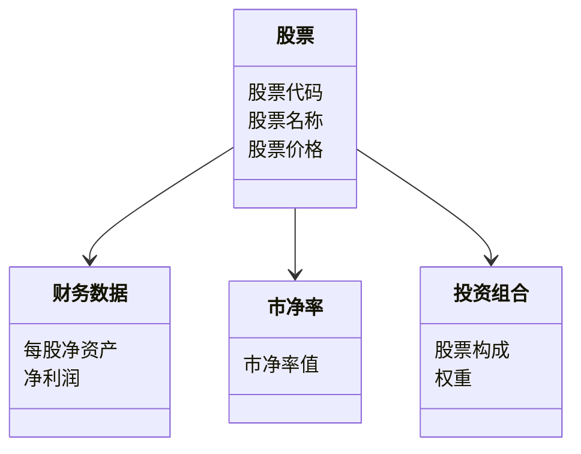
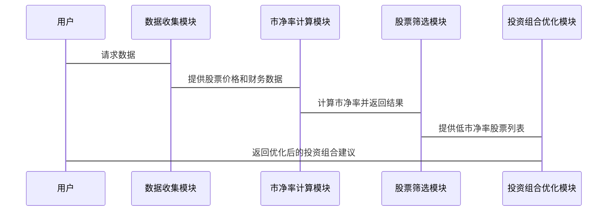

                 


# 约翰·奈夫的低市净率投资策略

## 关键词：低市净率投资，约翰·奈夫，投资策略，市净率，股票分析

## 摘要：  
本文深入探讨了约翰·奈夫的低市净率投资策略，分析其核心概念、数学模型、算法原理以及在实际投资中的应用。文章从低市净率投资的背景与起源出发，详细讲解了市净率的计算方法、低市净率股票的筛选标准，以及如何通过数学模型和算法优化投资组合。最后，结合实际案例，展示了低市净率投资策略的优势与挑战，并提出了未来发展的建议。

---

## 第一部分：低市净率投资策略的背景与起源

### 第1章：低市净率投资策略的背景与起源

#### 1.1 低市净率投资策略的起源

##### 1.1.1 低市净率投资的定义与核心概念  
低市净率投资是一种基于市净率（Price-to-Book Ratio，简称P/B）的投资策略。市净率是指股票的市场价格与每股净资产的比率，公式为：  
$$市净率 = \frac{股票价格}{每股净资产}$$  
当市净率低于1时，意味着股票价格低于其净资产价值，通常被认为是投资的潜在机会。低市净率投资的核心理念是寻找被市场低估的股票，通过长期持有实现资本增值。

##### 1.1.2 低市净率投资的历史发展  
低市净率投资的理论基础可以追溯到价值投资的鼻祖本杰明·格雷厄姆。他认为，市场先生的情绪波动会导致股票价格与内在价值出现偏离，投资者应利用这种偏离进行投资。约翰·奈夫进一步发展了这一理论，专注于通过低市净率筛选优质股票。

##### 1.1.3 约翰·奈夫与低市净率投资的关联  
约翰·奈夫是哥伦比亚大学的教授，也是定量投资领域的先驱。他通过大量实证研究发现，低市净率股票往往具有较高的回报率，尤其是在市场低迷时期。他的研究成果为低市净率投资策略奠定了理论基础。

#### 1.2 低市净率投资策略的理论基础

##### 1.2.1 市净率的计算与意义  
市净率的计算公式为：  
$$市净率 = \frac{股票价格}{每股净资产}$$  
其中，每股净资产是公司资产总额减去负债后的净值，除以总股本。市净率反映了市场对公司的资产估值。当市净率低于1时，意味着股票价格低于公司净资产，通常被视为投资机会。

##### 1.2.2 低市净率股票的特征与优势  
低市净率股票通常具有以下特征：  
1. 公司资产质量较高，净资产较多。  
2. 股票价格被市场低估，具有较大的增值空间。  
3. 在市场下跌时，低市净率股票往往表现较为稳定。  
4. 低市净率股票通常分布在金融、房地产、制造等行业。

##### 1.2.3 低市净率投资的适用场景与边界  
低市净率投资适用于以下场景：  
1. 市场低迷或熊市阶段，股票价格被低估。  
2. 需求寻找稳定收益的投资组合。  
3. 对公司基本面分析能力较强的投资者。  
其边界包括：  
- 市净率过低可能意味着公司财务状况不佳。  
- 高负债率的公司可能面临较高的财务风险。  
- 市场波动剧烈时，低市净率股票可能短期表现不佳。

#### 1.3 低市净率投资与其他投资策略的对比

##### 1.3.1 价值投资与成长投资的区别  
价值投资注重股票的内在价值，通过寻找被市场低估的股票实现收益。成长投资则关注高成长性公司的股票，注重未来收益的潜力。低市净率投资可以被视为一种价值投资的策略，但更注重资产质量的评估。

##### 1.3.2 低市净率投资的独特性与优势  
低市净率投资的独特性在于其量化筛选标准，通过市净率指标快速筛选出潜在的低估股票。其优势包括：  
1. 计算简单，易于实现。  
2. 风险较低，适合稳健型投资者。  
3. 长期回报率较高，尤其是在市场周期性波动中表现稳定。

##### 1.3.3 低市净率投资的潜在风险与挑战  
低市净率投资的潜在风险包括：  
1. 低市净率股票可能因公司经营不佳而进一步下跌。  
2. 市场波动可能导致短期亏损。  
3. 需要结合其他指标进行综合分析，避免单一指标的误导。

#### 1.4 低市净率投资的现状与未来

##### 1.4.1 当前市场中低市净率投资的现状  
近年来，随着市场波动加剧，低市净率投资再次受到关注。特别是在全球经济不确定的背景下，投资者倾向于寻找稳定收益的股票。低市净率股票因其资产质量较高，逐渐成为投资者的首选。

##### 1.4.2 低市净率投资的未来发展趋势  
未来，低市净率投资将与量化投资、大数据分析等技术结合，进一步优化投资策略。同时，随着市场对ESG投资的关注增加，低市净率投资将更加注重公司的可持续发展能力。

##### 1.4.3 技术与市场变化对低市净率投资的影响  
技术进步为低市净率投资提供了新的工具，例如大数据分析和人工智能算法。然而，市场波动和经济周期变化仍会对低市净率投资策略产生影响，投资者需要灵活调整策略。

---

### 第2章：低市净率投资策略的核心概念与原理

#### 2.1 市净率的计算与分析

##### 2.1.1 市净率的公式与计算方法  
市净率的计算公式为：  
$$市净率 = \frac{股票价格}{每股净资产}$$  
其中，每股净资产是公司净资产除以总股本。市净率反映了市场对公司资产的估值，是衡量股票价值的重要指标之一。

##### 2.1.2 市净率与股价的关系  
市净率与股价呈反比关系。当市净率较低时，股价相对较低，通常意味着投资机会。反之，高市净率可能意味着股价被高估。

##### 2.1.3 市净率在不同行业中的适用性  
市净率在不同行业中的适用性不同。例如，金融行业通常采用市净率估值，而科技行业则更注重市盈率。因此，在应用低市净率投资策略时，需结合行业特点进行调整。

#### 2.2 低市净率股票的筛选标准

##### 2.2.1 市净率低于行业平均水平的定义  
低市净率股票的定义通常为市净率低于行业平均水平。例如，在金融行业中，行业平均市净率为1.5，那么市净率低于1.5的股票可被视为低市净率股票。

##### 2.2.2 公司基本面的评估标准  
低市净率投资不仅关注市净率指标，还需结合公司基本面进行综合分析。例如，公司应具有稳定的盈利能力、健康的资产负债表和良好的管理团队。

##### 2.2.3 财务指标的综合分析  
低市净率投资需综合分析多项财务指标，例如ROE（净资产收益率）、ROA（资产回报率）和负债率等。这些指标能够帮助投资者更全面地评估公司的财务健康状况。

#### 2.3 低市净率投资的逻辑与策略

##### 2.3.1 低市净率投资的基本逻辑  
低市净率投资的基本逻辑是通过寻找被市场低估的股票，以低于其净资产价值的价格买入，长期持有，等待市场回归其真实价值。

##### 2.3.2 约翰·奈夫的投资理念与方法  
约翰·奈夫提出，低市净率股票通常具有较高的投资价值。他通过大量实证研究发现，低市净率股票的长期回报率高于市场平均水平。因此，他建议投资者将低市净率股票作为投资组合的重要组成部分。

##### 2.3.3 低市净率投资的组合构建策略  
低市净率投资的组合构建策略包括：  
1. 根据行业特点筛选低市净率股票。  
2. 组合中应包含多个行业的股票，以分散风险。  
3. 定期调整投资组合，以适应市场变化。

#### 2.4 低市净率投资的风险控制

##### 2.4.1 风险来源与识别  
低市净率投资的主要风险包括市场波动、公司基本面变化和行业周期性波动等。投资者需通过定期分析财务报表和市场趋势，及时识别潜在风险。

##### 2.4.2 风险控制的策略与方法  
低市净率投资的风险控制策略包括：  
1. 设置止损点，避免过度亏损。  
2. 结合其他指标进行综合分析，避免单一指标的误导。  
3. 长期持有优质股票，减少短期波动的影响。

##### 2.4.3 投资组合的动态调整  
低市净率投资需根据市场变化动态调整投资组合。例如，当市场出现剧烈波动时，可适当降低低市净率股票的仓位，转投其他资产以规避风险。

---

### 第3章：低市净率投资的数学模型与算法原理

#### 3.1 市净率计算的数学模型

##### 3.1.1 市净率公式  
$$市净率 = \frac{股票价格}{每股净资产}$$  
其中，每股净资产是公司净资产除以总股本。市净率的计算是低市净率投资的核心步骤之一。

##### 3.1.2 净资产的计算方法  
净资产的计算公式为：  
$$净资产 = 资产总额 - 负债总额$$  
资产总额包括流动资产和非流动资产，负债总额包括短期负债和长期负债。

##### 3.1.3 市净率与股票价值的关系  
市净率与股票价值呈反比关系。当市净率较低时，股票价值相对较高，反之亦然。

#### 3.2 低市净率股票筛选的算法

##### 3.2.1 数据收集与处理  
低市净率股票筛选的第一步是收集相关数据，包括股票价格、每股净资产、行业平均市净率等。数据通常来源于金融数据库或API接口。

##### 3.2.2 市净率计算与排序  
根据市净率公式，计算每只股票的市净率，并将其按从小到大的顺序排序。市净率低于行业平均水平的股票被视为低市净率股票。

##### 3.2.3 组合优化算法  
低市净率投资的组合优化算法包括：  
1. 根据风险偏好确定投资组合的权重。  
2. 使用数学优化方法（如均值-方差优化）构建最优投资组合。  
3. 定期调整投资组合，以适应市场变化。

#### 3.3 市场波动与投资决策的数学分析

##### 3.3.1 市场波动对市净率的影响  
市场波动会导致股票价格波动，进而影响市净率。例如，市场下跌时，股票价格可能低于其净资产价值，市净率进一步降低。

##### 3.3.2 投资决策的数学模型  
低市净率投资的数学模型包括：  
1. 市净率计算模型。  
2. 投资组合优化模型。  
3. 风险控制模型。  
这些模型通常通过Python或MATLAB等工具进行实现。

##### 3.3.3 市场周期性与低市净率投资的关系  
市场周期性对低市净率投资有重要影响。在熊市中，低市净率股票通常表现较好，而在牛市中，成长型股票可能表现更优。因此，投资者需根据市场周期调整投资策略。

---

## 第四部分：低市净率投资的系统分析与架构设计

### 第4章：低市净率投资的系统分析与架构设计

#### 4.1 问题场景介绍  
低市净率投资的系统分析需要考虑多个因素，包括数据收集、市净率计算、股票筛选、投资组合优化等。这些问题需要通过系统化的解决方案来实现。

#### 4.2 系统功能设计（领域模型）

##### 4.2.1 领域模型设计  
低市净率投资的领域模型包括以下实体：  
- 股票：包括股票代码、股票名称、股票价格等属性。  
- 财务数据：包括每股净资产、净利润等属性。  
- 市净率：市净率计算结果。  
- 投资组合：包括投资组合的构成、权重等属性。  

##### 4.2.2 领域模型的Mermaid类图  


#### 4.3 系统架构设计

##### 4.3.1 系统架构设计的Mermaid图  
```mermaid
container 低市净率投资系统 {
    组件 数据收集模块
    组件 市净率计算模块
    组件 股票筛选模块
    组件 投资组合优化模块
}
```

##### 4.3.2 各模块的功能描述  
- 数据收集模块：负责收集股票价格、财务数据等信息。  
- 市净率计算模块：根据公式计算每只股票的市净率。  
- 股票筛选模块：根据设定的筛选标准，筛选出低市净率股票。  
- 投资组合优化模块：根据筛选结果，优化投资组合，分散风险。

#### 4.4 系统接口设计

##### 4.4.1 数据接口设计  
低市净率投资系统需要与外部数据源接口对接，例如金融数据库或API接口。数据接口的设计需考虑数据格式、传输协议等问题。

##### 4.4.2 用户接口设计  
用户接口设计包括数据输入界面和结果展示界面。投资者可通过界面输入筛选条件，查看筛选结果和投资组合建议。

#### 4.5 系统交互设计

##### 4.5.1 系统交互的Mermaid序列图  


---

### 第5章：低市净率投资的项目实战

#### 5.1 环境安装与配置

##### 5.1.1 环境要求  
低市净率投资的项目实战需要以下环境：  
- 操作系统：Windows/Mac/Linux  
- 编程语言：Python 3.8+  
- 开发工具：PyCharm/Jupyter Notebook  
- 数据库：MySQL/SQLite  
- 金融数据接口：Yahoo Finance/Alpha V2

##### 5.1.2 安装依赖库  
需要安装以下Python库：  
- `pandas`：数据处理  
- `numpy`：数值计算  
- `yfinance`：数据获取  
- `matplotlib`：数据可视化  
- `scipy`：科学计算

#### 5.2 系统核心实现源代码

##### 5.2.1 数据收集模块  
```python
import yfinance as yf
import pandas as pd

def get_stock_data(ticker):
    data = yf.download(ticker, start='2020-01-01', end='2023-12-31')
    return data
```

##### 5.2.2 市净率计算模块  
```python
def calculate_pb_ratio(stock_price, book_value):
    return stock_price / book_value
```

##### 5.2.3 股票筛选模块  
```python
def screen_low_pb(stocks, industry_pb_ratio):
    low_pb_stocks = []
    for stock in stocks:
        if stock['pb_ratio'] < industry_pb_ratio:
            low_pb_stocks.append(stock)
    return low_pb_stocks
```

##### 5.2.4 投资组合优化模块  
```python
import numpy as np
from scipy.optimize import minimize

def optimize_portfolio(returns, weights):
    def objective(weights):
        return -np.sum(weights * returns)
    constraints = [
        ('sum', weights, ==, 1),
        ('each', weights, >=, 0)
    ]
    result = minimize(objective, weights, method='SLSQP')
    return result.x
```

#### 5.3 代码应用解读与分析

##### 5.3.1 数据收集模块  
数据收集模块通过`yfinance`库获取股票数据，包括开盘价、收盘价、最高价、最低价等。数据下载后存储在Pandas DataFrame中，便于后续处理。

##### 5.3.2 市净率计算模块  
市净率计算模块基于股票价格和每股净资产计算市净率。计算结果用于筛选低市净率股票。

##### 5.3.3 股票筛选模块  
股票筛选模块根据行业平均市净率，筛选出市净率低于行业平均水平的股票。这些股票被视为低市净率股票，具有较高的投资价值。

##### 5.3.4 投资组合优化模块  
投资组合优化模块通过数学优化方法，根据筛选出的低市净率股票，构建最优投资组合。优化目标是在风险可控的前提下，最大化投资收益。

#### 5.4 实际案例分析与详细讲解

##### 5.4.1 案例背景介绍  
假设我们选择金融行业作为研究对象，行业平均市净率为1.5。我们从某家金融公司获取历史数据，包括股票代码、股票名称、股票价格和每股净资产。

##### 5.4.2 数据处理与分析  
通过数据清洗和处理，计算每只股票的市净率，并与行业平均市净率进行比较。筛选出市净率低于1.5的股票，作为低市净率股票。

##### 5.4.3 投资组合优化  
根据筛选出的低市净率股票，构建投资组合。通过数学优化方法，确定每只股票的权重，以实现风险可控下的最大收益。

#### 5.5 项目小结

##### 5.5.1 项目实现的关键点  
低市净率投资项目的实现需要关注以下关键点：  
- 数据的准确性和完整性。  
- 市净率计算的准确性。  
- 投资组合优化的科学性。  

##### 5.5.2 项目实现的成果  
通过本项目，我们成功筛选出多只低市净率股票，并构建了优化的投资组合。这些股票在市场低迷时期表现稳定，为投资者提供了稳健的收益。

##### 5.5.3 项目实现的经验与教训  
经验：  
- 数据清洗和处理是项目成功的关键。  
- 投资组合优化需要结合市场实际情况进行调整。  
教训：  
- 市场波动对低市净率投资有较大影响，需灵活调整策略。  
- 单一指标的筛选可能导致误判，需结合其他指标进行综合分析。

---

### 第6章：低市净率投资的总结与展望

#### 6.1 总结与回顾

##### 6.1.1 低市净率投资的核心优势  
低市净率投资的核心优势在于其量化筛选标准和稳健的投资逻辑。通过市净率指标，投资者可以快速筛选出具有投资价值的股票。

##### 6.1.2 项目实现的关键收获  
通过本项目，我们深入理解了低市净率投资的理论与实践。同时，通过代码实现，掌握了量化投资的基本方法。

#### 6.2 未来发展的建议

##### 6.2.1 低市净率投资的未来趋势  
低市净率投资的未来发展趋势包括：  
1. 与大数据分析和人工智能结合，进一步优化投资策略。  
2. 注重ESG因素，构建可持续发展的投资组合。  
3. 针对不同市场和行业，制定个性化的投资策略。

##### 6.2.2 技术创新对低市净率投资的影响  
技术创新为低市净率投资提供了新的工具和方法。例如，大数据分析和机器学习可以提高数据处理效率，优化投资决策。

#### 6.3 投资者的注意事项

##### 6.3.1 风险控制的重要性  
投资者在进行低市净率投资时，需注重风险控制，避免过度集中投资某一只股票或行业。

##### 6.3.2 长期投资的重要性  
低市净率投资需要长期持有，耐心等待市场回归其真实价值。短期波动不应影响长期投资策略。

##### 6.3.3 组合优化的必要性  
通过投资组合优化，投资者可以有效分散风险，提高投资收益。组合优化是低市净率投资的重要组成部分。

#### 6.4 拓展阅读与学习资源

##### 6.4.1 推荐书籍  
1. 《约翰·奈夫的投资哲学》  
2. 《价值投资实战手册》  
3. 《量化投资入门指南》  

##### 6.4.2 在线资源  
1. 网络课程：Coursera上的“投资学基础”课程。  
2. 博客与论坛：投资社区、量化投资论坛。  
3. 工具与库：Python的量化投资库（如`pandas`、`yfinance`）。

---

## 作者：AI天才研究院/AI Genius Institute & 禅与计算机程序设计艺术 /Zen And The Art of Computer Programming

---

以上是《约翰·奈夫的低市净率投资策略》的技术博客文章的详细目录和内容结构。

