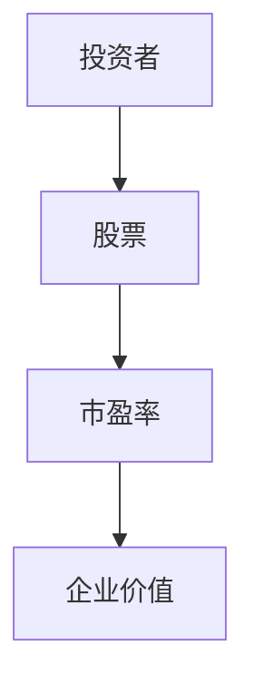
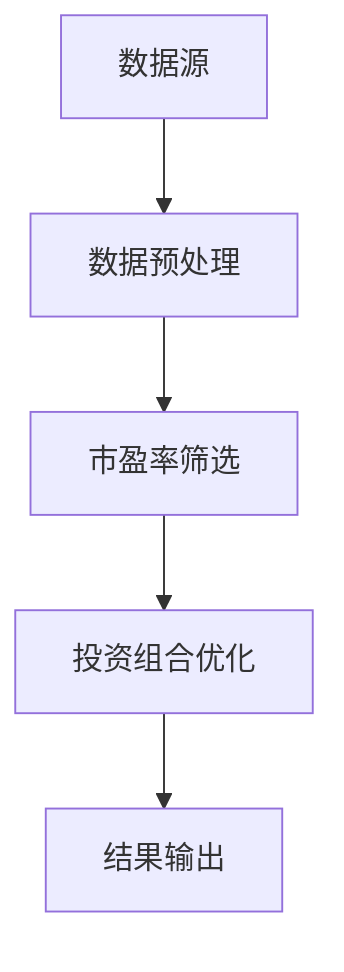

                 


# 约翰·奈夫的低市盈率投资法：简单而有效的价值策略

## 关键词：
低市盈率投资法, 价值投资, 约翰·奈夫, 股票估值, 投资策略

## 摘要：
低市盈率投资法是一种简单而有效的价值投资策略，由投资大师约翰·奈夫提出。该方法通过寻找市盈率低于市场平均水平的股票，利用市场低估的机会，实现长期稳定的收益。本文将详细解析低市盈率投资法的理论基础、数学模型、系统架构以及实战应用，帮助读者全面理解并掌握这一经典的投资策略。

---

## 第一部分: 约翰·奈夫的低市盈率投资法概述

### 第1章: 低市盈率投资法的定义与背景

#### 1.1 低市盈率投资法的定义
- **市盈率的定义与计算公式**  
  市盈率（Price-to-Earnings Ratio，简称P/E）是衡量股票价值的重要指标，计算公式为：  
  $$\text{市盈率} = \frac{\text{股价}}{\text{每股收益}}$$  
  市盈率反映了市场对每股收益的定价，市盈率越低，通常意味着股票越便宜。

- **低市盈率投资法的核心理念**  
  低市盈率投资法的核心在于寻找市盈率显著低于行业平均水平的股票，认为这些股票被市场低估，具有长期增值的潜力。  
  - 例如，若市场平均市盈率为15，而某股票的市盈率为10，则该股票可能具有投资价值。

- **约翰·奈夫的贡献与历史背景**  
  约翰·奈夫是低市盈率投资法的代表人物，他通过长期实践证明，低市盈率股票组合能够实现超越市场平均水平的收益。这种方法在20世纪中叶被广泛应用于机构投资，成为价值投资的重要流派之一。

#### 1.2 低市盈率投资法的理论基础
- **价值投资的基本原理**  
  价值投资的核心在于寻找市场价格低于内在价值的股票。低市盈率投资法通过市盈率这一指标，量化地寻找被低估的股票。

- **市盈率与股票估值的关系**  
  市盈率是连接股票价格与企业盈利能力的桥梁。低市盈率意味着投资者为每一份利润支付的成本较低，从而可能获得更高的投资回报。

- **低市盈率策略与高市盈率策略的对比**  
  - 低市盈率策略注重安全边际，适合稳健型投资者。  
  - 高市盈率策略则关注成长性，适合风险承受能力较高的投资者。

#### 1.3 低市盈率投资法与其他投资策略的对比
- **市场择时与股票选择的差异**  
  低市盈率投资法更注重股票选择，而非市场择时。  
  - **对比表格**：表1-1展示了低市盈率投资法与其他策略的核心区别。

### 表1-1: 低市盈率投资法与其他策略的核心区别

| 投资策略       | 核心关注点         | 适用场景               |
|----------------|------------------|-----------------------|
| 市场择时       | 市场走势           | 牛市或熊市判断           |
| 价值投资       | 内在价值           | 股票估值分析           |
| 低市盈率投资法 | 市盈率指标         | 寻找低估股票             |

#### 1.4 约翰·奈夫的低市盈率投资法的特点
- **长期视角**：低市盈率投资法强调长期投资，避免频繁交易。  
- **稳健性**：通过选择低市盈率股票，降低投资风险，确保收益的稳定性。  
- **逆向思维**：在市场恐慌时买入，市场狂热时卖出，注重逆向操作。

---

## 第二部分: 低市盈率投资法的核心概念与联系

### 第2章: 核心概念原理与联系

#### 2.1 核心概念原理
- **市盈率的计算与应用**  
  市盈率不仅是估值指标，也是衡量企业盈利能力的重要工具。通过对比不同股票的市盈率，投资者可以找到具有吸引力的投资标的。

- **企业内在价值的评估方法**  
  内在价值是股票的理论上的合理价格，计算方法包括DCF模型（现金流贴现法）和股利折现模型。  
  - **公式**：$$\text{内在价值} = \sum_{t=1}^{n} \frac{CF_t}{(1+r)^t}$$  
    其中，\( CF_t \) 是第t年的自由现金流，\( r \) 是折现率。

- **低市盈率股票的筛选标准**  
  低市盈率投资法通常筛选市盈率低于行业平均值且具有稳定盈利能力的股票。

#### 2.2 核心概念属性特征对比表格
- 表2-1展示了低市盈率与高市盈率股票的核心特征对比。

### 表2-1: 低市盈率与高市盈率股票的核心特征对比

| 特性         | 低市盈率股票         | 高市盈率股票         |
|--------------|---------------------|---------------------|
| 市盈率       | 低于行业平均值       | 高于行业平均值       |
| 股价         | 相对较低             | 相对较高             |
| 盈利能力     | 稳定且可预测         | 高增长但可能波动大   |
| 风险         | 较低                 | 较高                 |

#### 2.3 ER实体关系图
- 下图展示了低市盈率投资法中的核心实体关系。



---

## 第三部分: 低市盈率投资法的数学模型与公式

### 第3章: 低市盈率投资法的数学模型与公式

#### 3.1 市盈率计算公式
- $$\text{市盈率} = \frac{\text{股价}}{\text{每股收益}}$$  
  - 示例：某股票价格为10元，每股收益为2元，则市盈率为5。

#### 3.2 企业内在价值评估模型
- **DCF模型**：$$\text{内在价值} = \sum_{t=1}^{n} \frac{CF_t}{(1+r)^t}$$  
  - 其中，\( r \) 是折现率，\( CF_t \) 是第t年的现金流。

#### 3.3 投资组合优化模型
- 通过优化市盈率组合，最大化收益并最小化风险。  
  - **公式**：$$\min \sigma^2 \quad \text{subject to} \quad \mu \geq \text{目标收益}$$  
    其中，\( \mu \) 是组合的平均收益，\( \sigma^2 \) 是组合的方差。

---

## 第四部分: 低市盈率投资法的系统架构与实现

### 第4章: 系统架构设计

#### 4.1 系统功能设计
- **数据收集模块**：获取股票的市盈率、净利润等数据。  
- **筛选模块**：根据市盈率筛选出符合条件的股票。  
- **组合管理模块**：优化投资组合，降低风险。

#### 4.2 系统架构图
- 下图展示了低市盈率投资法的系统架构。



---

## 第五部分: 低市盈率投资法的实战应用

### 第5章: 实战篇

#### 5.1 环境安装与数据获取
- 使用Python和相关库（如Pandas、NumPy）进行数据处理。

#### 5.2 核心代码实现
- 示例代码：计算股票的市盈率并筛选低市盈率股票。

```python
import pandas as pd

# 假设df是包含股票数据的DataFrame，包括'股价'和'每股收益'列
df['市盈率'] = df['股价'] / df['每股收益']
# 筛选市盈率低于行业平均值的股票
平均市盈率 = df['市盈率'].mean()
低市盈率股票 = df[df['市盈率'] < 平均价]
```

#### 5.3 代码解读与分析
- 计算每只股票的市盈率，然后与行业平均市盈率进行比较，筛选出市盈率低于平均的股票。

#### 5.4 案例分析
- 通过实际案例，展示如何应用低市盈率投资法进行投资决策。

---

## 第六部分: 总结与展望

### 第6章: 总结与小结

#### 6.1 小结
低市盈率投资法是一种简单而有效的价值投资策略，通过寻找被市场低估的股票，实现长期稳定的收益。

#### 6.2 注意事项
- **风险提示**：低市盈率股票可能隐藏财务风险，需结合其他指标进行分析。  
- **市场环境**：低市盈率策略在熊市或震荡市中表现更佳，牛市中可能跑输市场。

#### 6.3 最佳实践
- **持续学习**：关注市场动态，及时调整投资策略。  
- **分散投资**：通过组合投资降低风险。  
- **长期持有**：避免短期波动影响投资决策。

---

## 作者：AI天才研究院/AI Genius Institute & 禅与计算机程序设计艺术 /Zen And The Art of Computer Programming

---

### 拓展阅读：
1. 约翰·奈夫的经典著作《投资中最简单的事》。  
2. 《低市盈率投资法的现代应用》。

