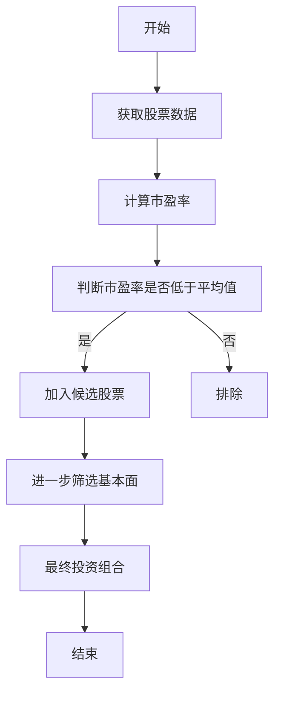
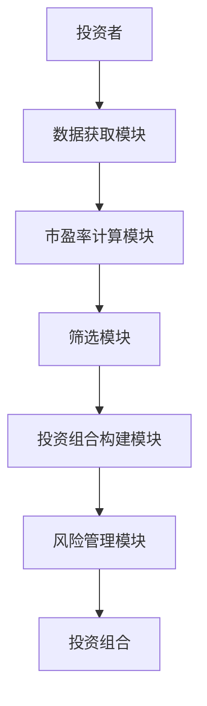

                 


# 约翰·奈夫的低市盈率投资策略

> 关键词：低市盈率投资，约翰·奈夫，投资策略，股票筛选，价值投资

> 摘要：本文深入分析了约翰·奈夫的低市盈率投资策略，从策略背景、核心概念、算法原理到系统设计和项目实战，全面解读这一经典投资方法。通过技术化的语言和详细的分析，帮助读者理解并应用这一策略。

---

# 第一部分: 约翰·奈夫的低市盈率投资策略概述

## 第1章: 低市盈率投资策略的背景与起源

### 1.1 低市盈率投资策略的起源

#### 1.1.1 低市盈率投资策略的定义
低市盈率投资策略是一种通过寻找市盈率低于市场平均水平的股票来进行投资的方法。市盈率（P/E Ratio）是衡量股票价值的重要指标，计算公式为：
$$\text{市盈率} = \frac{\text{股票价格}}{\text{每股收益}}$$

该策略的核心在于发现被市场低估的股票，这些股票通常具有较高的安全边际，适合风险偏好较低的投资者。

#### 1.1.2 约翰·奈夫的贡献
约翰·奈夫（John Neff）是低市盈率投资策略的代表人物，他在20世纪80年代管理着著名的30亿美元基金（Tweedy Bridge Fund），取得了显著的超额收益。他通过系统地筛选低市盈率股票，构建了一个稳健的投资组合。

#### 1.1.3 低市盈率投资策略在投资中的地位
低市盈率策略属于价值投资的一种，与其他策略（如成长型投资、股息投资）相比，它更注重股票的内在价值，而非未来的增长潜力。该策略在市场波动较大时表现尤为突出，能够为投资者提供稳定回报。

### 1.2 低市盈率投资策略的核心概念

#### 1.2.1 低市盈率的定义与计算
低市盈率股票是指市盈率低于市场平均水平的股票。计算市盈率时，通常使用当前市价和过去一年的每股收益（EPS）。公式为：
$$\text{市盈率} = \frac{\text{当前股价}}{\text{每股收益}}$$

#### 1.2.2 低市盈率股票的特点
- **估值低**：市盈率低于市场平均水平，通常被认为是被低估的股票。
- **稳定收益**：公司具有稳定的盈利能力，每股收益相对稳定。
- **风险较低**：相比高市盈率股票，低市盈率股票的风险较低，波动性较小。

#### 1.2.3 低市盈率投资策略的应用场景
- **熊市或市场低迷时期**：低市盈率股票往往表现较好，能够在市场下跌时提供保护。
- **防御性投资**：适合保守型投资者，寻求稳定回报。
- **长期投资**：通过长期持有优质低市盈率股票，获得复利效应。

---

## 第2章: 低市盈率投资策略的核心概念与联系

### 2.1 核心概念原理

#### 2.1.1 市盈率的计算公式
市盈率计算公式：
$$\text{市盈率} = \frac{\text{股票价格}}{\text{每股收益}}$$

例如，如果一只股票的价格是20元，每股收益是2元，则市盈率为10倍。

#### 2.1.2 低市盈率股票的筛选标准
- 市盈率低于市场平均值（通常以行业或市场整体市盈率为基准）。
- 公司基本面良好，具有持续的盈利能力。
- 财务状况健康，负债率低，现金流稳定。

### 2.2 核心概念对比表格

| 概念       | 低市盈率投资策略 | 其他投资策略（如成长型） |
|------------|------------------|---------------------------|
| 核心指标   | 市盈率           | 市净率、市销率             |
| 投资目标   | 寻找低估股票      | 追求高成长性             |
| 适用场景   | 稳定投资，降低风险 | 高风险高回报             |
| 风险偏好   | 低风险           | 高风险                   |

### 2.3 ER实体关系图

```mermaid
er
  actor 投资者
  entity 股票
  entity 市盈率
  entity 投资组合
  投资者 --> 股票: 获取数据
  股票 --> 市盈率: 计算市盈率
  投资者 --> 投资组合: 构建组合
```

---

## 第3章: 低市盈率投资策略的算法原理

### 3.1 算法原理概述

低市盈率投资策略的算法流程如下：
1. 获取市场数据，包括股票价格和每股收益。
2. 计算每只股票的市盈率。
3. 筛选市盈率低于市场平均值的股票。
4. 根据公司基本面进一步筛选，如行业地位、财务状况等。
5. 构建投资组合，分配资金。

### 3.2 算法流程图



### 3.3 Python实现示例

以下是一个简单的Python代码示例，用于筛选低市盈率股票：

```python
import pandas as pd

# 假设我们有一个包含股票数据的DataFrame，包括'股价'和'每股收益'两列
# 数据获取可以使用pandas从数据库或CSV文件读取
# 这里我们用示例数据
data = {
    '股票': ['A', 'B', 'C', 'D', 'E'],
    '股价': [50, 60, 40, 70, 30],
    '每股收益': [5, 6, 4, 7, 3]
}
df = pd.DataFrame(data)

# 计算市盈率
df['市盈率'] = df['股价'] / df['每股收益']

# 筛选市盈率低于市场平均值的股票
market_pe = df['市盈率'].mean()
low_pe_stocks = df[df['市盈率'] < market_pe]

# 输出结果
print("市场平均市盈率:", market_pe)
print("低市盈率股票:")
print(low_pe_stocks)
```

### 3.4 算法数学模型

低市盈率筛选的数学模型：
$$\text{筛选条件} = \text{市盈率} < \text{市场平均市盈率}$$

其中，市场平均市盈率计算为：
$$\text{市场平均市盈率} = \frac{1}{N}\sum_{i=1}^{N}\text{市盈率}_i$$

---

## 第4章: 低市盈率投资策略的系统分析与架构设计

### 4.1 系统分析

低市盈率投资策略的系统设计需要考虑以下方面：
- 数据获取：从可靠的金融数据源获取股票数据。
- 数据处理：计算市盈率，筛选低市盈率股票。
- 投资组合管理：根据筛选结果构建投资组合。
- 风险管理：监控市场变化，及时调整投资组合。

### 4.2 系统架构设计



---

## 第5章: 低市盈率投资策略的项目实战

### 5.1 环境安装

为了实现低市盈率投资策略，需要以下工具：
- Python编程语言
- 数据分析库：pandas、numpy
- 数据获取工具：Yahoo Finance API或其他金融数据API

### 5.2 核心实现代码

以下是一个完整的Python代码示例：

```python
import pandas as pd
import requests

# 获取股票数据（以Yahoo Finance为例）
def get_stock_data(ticker):
    url = f"https://query1.finance.yahoo.com/finance/quote/{ticker}/key-statistics"
    response = requests.get(url)
    data = response.json()
    pe_ratio = data['Financials']['TTM']['PE ratio']
    return {'Ticker': ticker, 'PE Ratio': pe_ratio}

# 筛选低市盈率股票
def screen_low_pe_stocks(tickers):
    stocks = []
    for ticker in tickers:
        stock_data = get_stock_data(ticker)
        stocks.append(stock_data)
    df = pd.DataFrame(stocks)
    market_pe = df['PE Ratio'].mean()
    low_pe = df[df['PE Ratio'] < market_pe]
    return low_pe

# 示例代码
tickers = ['AAPL', 'MSFT', 'GOOGL', 'AMZN', 'FB']
low_pe_stocks = screen_low_pe_stocks(tickers)
print("低市盈率股票:", low_pe_stocks)
```

### 5.3 案例分析

以某段时间的股票数据为例，假设市场平均市盈率为15倍，筛选出市盈率低于15倍的股票。通过分析这些股票的历史表现，验证低市盈率策略的有效性。

---

## 第6章: 低市盈率投资策略的最佳实践

### 6.1 注意事项

- **数据准确性**：确保使用的股票数据准确可靠。
- **市场变化**：定期重新评估和调整投资组合。
- **组合分散**：避免过度集中于某一行业或股票，降低风险。

### 6.2 小结

低市盈率投资策略是一种有效的价值投资方法，通过系统化筛选和分析，能够在市场中找到被低估的投资机会。结合技术手段，如Python和数据分析，可以进一步提升策略的效率和准确性。

### 6.3 拓展阅读

- 《约翰·奈夫的投资哲学》
- 《价值投资：从格雷厄姆到巴菲特》

### 6.4 拓展思考

低市盈率策略可以与其他策略结合使用，如结合股息率，筛选出低市盈率且高股息的股票，进一步优化投资组合。

---

# 结语

约翰·奈夫的低市盈率投资策略为投资者提供了一种稳健的投资方法。通过系统化的筛选和分析，投资者可以在市场中找到被低估的股票，实现长期稳定的收益。结合现代技术手段，如Python和数据分析工具，可以进一步提升策略的实施效率和效果。

作者：AI天才研究院 & 禅与计算机程序设计艺术

