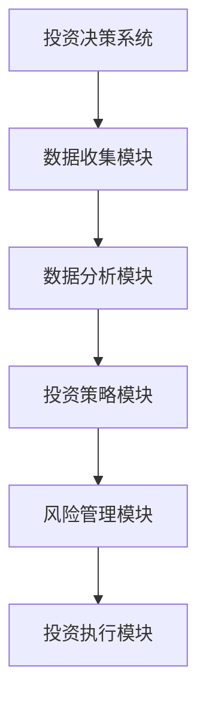

                 


# 约翰·汤普金斯的耐心型价值投资：长期持有创造价值

## 关键词：约翰·汤普金斯，耐心型价值投资，长期持有，价值创造，投资策略，风险管理，案例分析

## 摘要：耐心型价值投资是一种注重长期持有、注重公司基本面分析的投资策略，强调通过深入研究和耐心等待，实现价值创造和资本增值。本文将详细介绍约翰·汤普金斯的耐心型价值投资理念，包括其核心概念、策略、风险管理方法以及实际案例分析，帮助投资者更好地理解和应用这一投资方法。

---

## 第一部分：引言

### 第1章：价值投资的基石

#### 1.1 投资的基本概念

##### 1.1.1 投资的定义与分类
- **投资**是指将资金投入到某一资产或项目中，期望在未来获得收益或资本增值的行为。
- **主要分类**包括股票投资、债券投资、房地产投资等。

##### 1.1.2 价值投资的核心理念
- **价值投资**是一种以公司基本面分析为基础的投资策略，旨在通过识别市场低估的公司，长期持有以实现资本增值。
- **核心理念**：买 cheap，卖 expensive。

##### 1.1.3 耐心型投资的定义与特点
- **耐心型投资**强调长期持有，不因短期市场波动而改变投资策略。
- **特点**：注重长期价值，避免频繁交易，降低交易成本。

#### 1.2 耐心型投资的重要性
- **长期持有与价值创造**：通过长期持有优质资产，投资者能够分享公司成长的成果。
- **耐心型投资与市场波动的关系**：市场波动为长期投资者提供了买入低估资产的机会。
- **耐心型投资的心理与行为特征**：需要克服短期波动的干扰，保持纪律性和耐心。

---

## 第二部分：价值投资的基础

### 第2章：价值投资的基本原理

#### 2.1 价值投资的核心概念

##### 2.1.1 内在价值与市场价值
- **内在价值**是公司未来现金流的现值，是衡量公司价值的客观标准。
- **市场价值**是市场参与者对公司价值的主观定价，可能高于或低于内在价值。

##### 2.1.2 安全边际的定义与作用
- **安全边际**是内在价值与市场价值之间的差距，用于降低投资风险。
- **作用**：提供缓冲，减少市场波动对投资组合的影响。

##### 2.1.3 股票估值的基本公式
- 内在价值公式：
  $$ \text{内在价值} = \sum_{t=1}^{\infty} \frac{\text{现金流}_t}{(1 + r)^t} $$
  其中，\( r \) 是折现率。

---

## 第三部分：耐心型投资的策略

### 第3章：耐心型投资的策略与实践

#### 3.1 长期持有的原则

##### 3.1.1 长期持有的优势
- **长期持有的优势**：避免短期波动的干扰，获得复利效应。
- **长期持有与复利**：通过长期持有，投资者能够最大化复利效应，实现财富的快速增长。

##### 3.1.2 长期持有的风险与应对
- **长期持有的风险**：市场波动可能导致短期亏损，投资者需要具备心理承受能力。
- **应对策略**：分散投资，选择优质资产，定期复盘和调整。

#### 3.2 分散投资的策略

##### 3.2.1 分散投资的定义与作用
- **分散投资**是指将资金分配到不同的资产类别或行业中，以降低风险。
- **作用**：降低单一资产波动对整体投资组合的影响。

##### 3.2.2 分散投资的实现方式
- **资产类别分散**：将资金分配到股票、债券、房地产等多种资产。
- **行业分散**：选择不同行业的优质公司进行投资。

#### 3.3 安全边际的应用

##### 3.3.1 安全边际的计算与应用
- **安全边际的计算**：通过比较内在价值与市场价值，确定安全边际的宽度。
- **应用策略**：选择安全边际较高的资产进行投资，降低风险。

##### 3.3.2 安全边际的动态调整
- **动态调整**：随着市场变化，定期评估安全边际，及时调整投资组合。

---

## 第四部分：风险管理

### 第4章：耐心型投资中的风险管理

#### 4.1 风险识别与评估

##### 4.1.1 风险的定义与分类
- **系统性风险**：影响整个市场的风险，如经济衰退、政策变化等。
- **非系统性风险**：特定资产或行业的风险。

#### 4.2 风险管理策略

##### 4.2.1 风险控制的实现方式
- **分散投资**：通过投资多样化降低非系统性风险。
- **止损策略**：设定止损点，避免重大损失。

##### 4.2.2 风险管理的数学模型
- 风险调整后的回报模型：
  $$ \text{风险调整后回报} = \text{预期回报} - \text{风险溢价} $$

---

## 第五部分：成功案例分析

### 第5章：耐心型投资的成功案例

#### 5.1 案例分析：约翰·汤普金斯的经典投资

##### 5.1.1 案例背景介绍
- 约翰·汤普金斯通过长期持有优质资产，实现了稳定的资本增值。

##### 5.1.2 投资策略的分析
- 选择具有强大竞争优势和良好管理的公司。
- 长期持有，耐心等待市场低估时期。

#### 5.2 案例分析：长期持有的收益

##### 5.2.1 长期持有的收益计算
- 假设投资一只股票，年化回报率为7%，30年后的收益：
  $$ \text{最终收益} = \text{初始投资} \times (1 + 0.07)^{30} $$

---

## 第六部分：系统设计与架构

### 第6章：投资决策系统的架构设计

#### 6.1 投资决策系统的功能设计

##### 6.1.1 数据收集模块
- **数据来源**：包括财务报表、市场数据、行业分析报告等。

##### 6.1.2 数据分析模块
- **分析工具**：包括财务指标分析、市场趋势分析等。

#### 6.2 系统架构设计

##### 6.2.1 系统架构图


---

## 第七部分：项目实战

### 第7章：耐心型投资的项目实战

#### 7.1 项目环境安装

##### 7.1.1 投资分析工具的安装
- **工具**：包括Excel、Python、数据分析库（如Pandas、NumPy）等。

#### 7.2 核心代码实现

##### 7.2.1 股票估值代码
```python
import pandas as pd
import numpy as np

def calculate_intrinsic_value(cash_flows, discount_rate):
    present_value = 0
    for year, cash_flow in enumerate(cash_flows):
        present_value += cash_flow / (1 + discount_rate) ** (year + 1)
    return present_value

# 示例数据
cash_flows = [100, 120, 130, 150]
discount_rate = 0.08

intrinsic_value = calculate_intrinsic_value(cash_flows, discount_rate)
print(f"内在价值：{intrinsic_value}")
```

---

## 第八部分：总结与小结

### 第8章：总结与展望

#### 8.1 小结
- 耐心型价值投资是一种注重长期持有、注重基本面分析的投资策略。
- 通过分散投资、安全边际和风险管理，投资者能够更好地实现资本增值。

#### 8.2 展望
- 随着市场环境的变化，耐心型投资策略需要不断优化和调整。
- 投资者需要持续学习和实践，提升自身的投资能力。

---

## 作者：AI天才研究院 & 禅与计算机程序设计艺术

---

这篇文章详细介绍了约翰·汤普金斯的耐心型价值投资理念，结合理论与实践，帮助读者更好地理解和应用这一投资策略。

