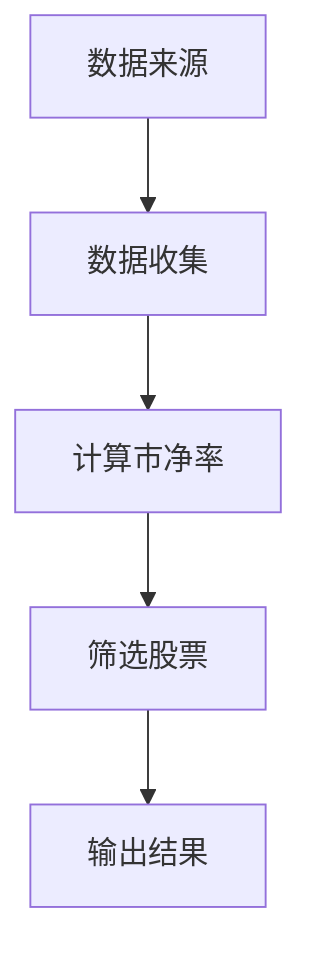
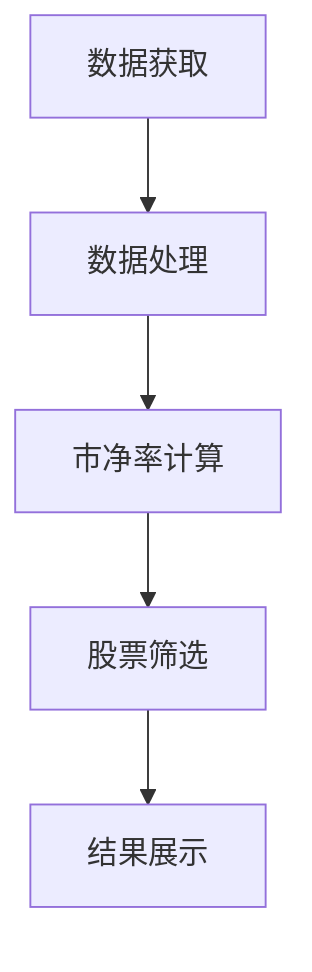

                 


# 约翰·聂夫的低市净率投资：简单有效的价值筛选

---

## 关键词：
约翰·聂夫、低市净率投资、价值投资、股票筛选、投资策略、投资分析

---

## 摘要：
约翰·聂夫是低市净率投资策略的代表人物，该策略通过筛选市净率低于行业平均水平的股票，寻找被市场低估的投资标的。本文详细解析低市净率投资的核心概念、筛选模型、系统架构以及实际案例，帮助投资者掌握这一简单而有效的价值投资方法。

---

## 第1章: 低市净率投资的起源与发展

### 1.1 低市净率投资的起源
低市净率投资起源于价值投资理念，强调以低于内在价值的价格购买优质资产。约翰·聂夫作为该领域的权威，提出通过市净率指标筛选具有长期稳定增长潜力的公司。

#### 1.1.1 价值投资的起源
价值投资由本杰明·格雷厄姆提出，强调寻找市场价格低于内在价值的股票。约翰·聂夫在这一理念基础上，发展出低市净率投资策略。

#### 1.1.2 约翰·聂夫的贡献
约翰·聂夫是哥伦比亚大学的教授，也是著名的投资专家，他在20世纪60年代开始研究低市净率投资，强调通过市净率指标筛选股票。

#### 1.1.3 低市净率投资的核心理念
低市净率投资的核心理念是寻找市场价格低于账面价值的公司，这些公司通常具有较高的安全边际和长期增长潜力。

---

### 1.2 低市净率投资与其他投资策略的对比
低市净率投资与其他价值投资策略（如市盈率投资）在筛选标准和适用场景上有显著区别。

#### 1.2.1 市值投资法
市值投资法基于公司市值进行筛选，注重公司的规模和市场地位，但忽略了价格与价值的关系。

#### 1.2.2 市盈率投资法
市盈率投资法基于市盈率指标，强调低市盈率的股票具有较高的投资价值，但忽略了账面价值的影响。

#### 1.2.3 低市净率投资的独特性
低市净率投资的独特性在于其以市净率作为核心指标，注重公司账面价值与市场价格的关系，适合在市场低迷或经济衰退时期使用。

---

### 1.3 低市净率投资的适用场景
低市净率投资在不同经济周期和行业背景下有不同的表现。

#### 1.3.1 经济周期的影响
在经济衰退或市场低迷时期，低市净率投资表现较好，因为市场往往低估了优质公司的价值。

#### 1.3.2 行业特点的分析
低市净率投资在传统行业（如银行、制造业）表现较好，因为这些行业通常具有较高的账面价值。

#### 1.3.3 公司基本面的考量
公司基本面良好、账面价值稳定增长的公司更适合低市净率投资。

---

## 第2章: 市净率的核心概念与计算方法

### 2.1 市净率的定义
市净率（P/B Ratio）是衡量股票价格与公司账面价值之间关系的重要指标。

#### 2.1.1 市净率的公式
$$ P/B = \frac{P}{B} $$
其中，$P$是股票价格，$B$是每股账面价值。

#### 2.1.2 市净率的计算步骤
1. 收集公司的每股股价和每股账面价值。
2. 使用公式计算市净率。
3. 比较市净率与行业平均水平或目标值。

#### 2.1.3 市净率的单位与意义
市净率是一个无量纲的指标，值越低通常意味着股票价格相对于账面价值越低。

---

### 2.2 低市净率的标准与筛选
低市净率投资的核心在于设定合理的市净率筛选标准。

#### 2.2.1 低市净率的范围
通常，市净率低于1.5倍的股票被视为低估。

#### 2.2.2 市净率与股价的关系
市净率低的股票通常具有较高的安全边际，但需要注意公司基本面的稳定性。

#### 2.2.3 低市净率的动态调整
根据市场环境和行业特点，动态调整市净率的筛选标准。

---

### 2.3 低市净率与市盈率的对比分析
#### 2.3.1 市盈率的定义与计算
市盈率（P/E Ratio）是股票价格与每股收益的比率，公式为：
$$ P/E = \frac{P}{E} $$
其中，$E$是每股收益。

#### 2.3.2 市净率与市盈率的异同
| 指标 | 市净率（P/B） | 市盈率（P/E） |
|------|----------------|----------------|
| 计算基础 | 每股账面价值 | 每股收益 |
| 适用场景 | 适用于账面价值稳定的行业 | 适用于盈利稳定的行业 |

#### 2.3.3 两种指标的适用场景
市净率适用于账面价值稳定的行业，如制造业和银行业；市盈率适用于盈利稳定的行业，如科技行业和消费品行业。

---

## 第3章: 低市净率投资的筛选模型

### 3.1 筛选模型的构建
低市净率投资的筛选模型包括数据收集、计算市净率、筛选股票等步骤。

#### 3.1.1 数据来源与收集
数据来源包括股票价格、每股账面价值等，可以通过金融数据平台获取。

#### 3.1.2 筛选条件的设计
筛选条件包括市净率低于目标值、公司基本面良好、行业地位稳定等。

#### 3.1.3 模型的验证与优化
通过历史数据验证模型的有效性，并根据市场变化优化筛选条件。

---

### 3.2 筛选模型的流程图


---

### 3.3 筛选模型的数学公式
低市净率筛选模型的核心公式：
$$ P/B \leq 1.5 $$

---

## 第4章: 低市净率投资的系统架构

### 4.1 系统功能模块
低市净率投资系统包括数据获取、筛选计算和结果展示三个功能模块。

#### 4.1.1 数据获取模块
负责从金融数据源获取股票价格和账面价值数据。

#### 4.1.2 筛选计算模块
计算市净率并根据筛选条件筛选股票。

#### 4.1.3 结果展示模块
以图表或报告形式展示筛选结果。

---

### 4.2 系统架构设计


---

### 4.3 系统实现的注意事项
- 数据来源的可靠性
- 筛选条件的动态调整
- 系统的可扩展性

---

## 第5章: 低市净率投资的项目实战

### 5.1 项目介绍
本项目旨在通过Python编写一个低市净率股票筛选系统，帮助投资者快速找到低估的股票。

#### 5.1.1 环境安装
需要安装Python和相关金融数据处理库，如Yahoo Finance API。

#### 5.1.2 核心实现
```python
import pandas as pd
import yfinance as yf

# 下载股票数据
tickers = ['AAPL', 'MSFT', 'GOOGL']
data = yf.download(tickers, start='2023-01-01', end='2023-12-31')

# 计算市净率
pb_ratio = data['Adj Close'] / data['Book Value']

# 筛选低市净率股票
low_pb = pb_ratio[pb_ratio <= 1.5]
```

#### 5.1.3 案例分析
以苹果、微软、谷歌为例，计算市净率并筛选出符合条件的股票。

---

### 5.2 项目小结
通过Python代码实现低市净率股票筛选系统，能够帮助投资者快速找到低估的股票，提高投资效率。

---

## 第6章: 低市净率投资的最佳实践

### 6.1 小结
低市净率投资是一种简单有效的价值投资策略，适合在市场低迷时期使用。

### 6.2 注意事项
- 注意公司基本面的变化
- 考虑行业特点和经济周期
- 结合其他指标进行综合分析

### 6.3 拓展阅读
推荐阅读约翰·聂夫的著作《低市净率投资》以及本杰明·格雷厄姆的价值投资经典。

---

## 作者：
AI天才研究院/AI Genius Institute  
禅与计算机程序设计艺术/Zen And The Art of Computer Programming

