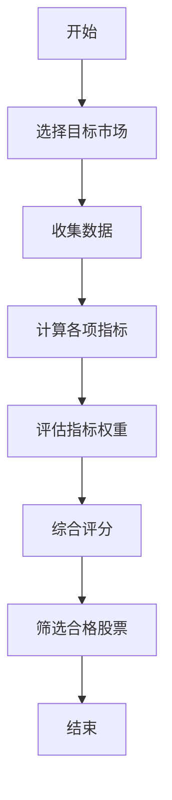

                 


# 约翰·聂夫的小盘价值股筛选标准

> 关键词：小盘价值股，约翰·聂夫，投资筛选标准，价值投资，数学模型

> 摘要：本文详细阐述了约翰·聂夫的小盘价值股筛选标准，从背景介绍、核心概念、数学模型、系统设计到实战案例，全面分析了小盘价值股的投资策略。通过逐步推理和详细的技术分析，为读者提供了一套科学、系统的小盘价值股筛选方法。

---

## 第一部分: 小盘价值股的定义与背景

### 第1章: 小盘价值股的定义与投资背景

#### 1.1 小盘价值股的定义

- **1.1.1 小盘股的定义与特点**
  - 小盘股：市场资本化较低的公司股票，通常指市值在10亿到50亿美元之间的公司。
  - 小盘股的特点：增长潜力大、波动性高、流动性相对较低。

- **1.1.2 价值股的核心特征**
  - 价值股：市场价格低于其内在价值的股票。
  - 核心特征：低市盈率（P/E）、低市净率（P/B）、高股息率、财务稳健。

- **1.1.3 小盘价值股的结合与优势**
  - 小盘价值股的结合：小盘股的高增长潜力与价值股的低估特性结合。
  - 优势：成长空间大、估值修复潜力高。

#### 1.2 约翰·聂夫的投资理念

- **1.2.1 约翰·聂夫的生平简介**
  - 约翰·聂夫：美国著名投资经理，以管理小盘股价值投资闻名。
  - 投资生涯：长期专注于小盘股投资，创造了卓越的投资业绩。

- **1.2.2 聂夫投资哲学的核心思想**
  - 价值投资：寻找市场价格低于内在价值的公司。
  - 小盘股优势：小盘股的成长性和估值修复潜力。
  - 长期投资：注重长期持有的稳定性。

- **1.2.3 小盘价值股在聂夫投资体系中的地位**
  - 核心策略：以小盘价值股为核心，构建长期投资组合。
  - 稳定性和成长性的结合：通过小盘价值股实现长期稳定的收益。

#### 1.3 小盘价值股投资的背景与现状

- **1.3.1 小盘股市场的特点与机会**
  - 市场特点：流动性较低、波动性较高、成长潜力大。
  - 投资机会：小盘股市场的波动性和成长性提供了超额收益的可能性。

- **1.3.2 价值投资在小盘股中的应用**
  - 价值投资的适用性：小盘股市场的估值偏差为价值投资者提供了机会。
  - 投资策略：通过筛选低估的小盘股实现长期收益。

- **1.3.3 当前小盘价值股投资的环境分析**
  - 市场环境：当前市场环境下，小盘价值股的投资价值逐渐显现。
  - 行业趋势：部分行业的小盘股具有较高的投资潜力。

#### 1.4 本章小结

- 本章介绍了小盘价值股的定义、特点以及约翰·聂夫的投资理念，为后续的筛选标准和数学模型奠定了基础。

---

## 第二部分: 小盘价值股的筛选标准

### 第2章: 小盘价值股的筛选标准概述

#### 2.1 约翰·聂夫的筛选标准

- **2.1.1 市盈率与增长率的平衡**
  - 市盈率（P/E）：衡量股票价格与每股收益的比例。
  - 市盈率低：表明股票价格被低估。
  - 增长率：衡量公司盈利能力的增长速度。
  - 平衡点：寻找市盈率低且增长率高的公司。

- **2.1.2 股东权益收益率（ROE）的重要性**
  - ROE：衡量公司使用股东资金的效率。
  - 高ROE：表明公司盈利能力强。
  - 低ROE：可能表明公司管理效率低下。

- **2.1.3 财务健康状况的评估**
  - 财务健康：公司财务状况稳健，无重大财务风险。
  - 评估指标：资产负债率、流动比率、速动比率等。

#### 2.2 其他辅助筛选指标

- **2.2.1 市净率（P/B）的应用**
  - 市净率：衡量股票价格与每股净资产的比例。
  - 低市净率：表明股票价格被低估。
  - 行业差异：市净率在不同行业中的适用性不同。

- **2.2.2 股息率与股息增长**
  - 股息率：衡量股票分红与股价的比例。
  - 高股息率：表明公司愿意分红，且财务状况较好。
  - 股息增长：股息逐年增长的公司具有较高的投资价值。

- **2.2.3 行业地位与竞争优势**
  - 行业地位：公司在行业中的地位和竞争力。
  - 竞争优势：公司在产品、技术、市场等方面的优势。
  - 关键因素：选择行业地位稳固、竞争优势明显的公司。

#### 2.3 筛选标准的综合应用

- **2.3.1 多指标综合评价方法**
  - 综合评价：结合市盈率、ROE、股息率等多个指标进行综合评估。
  - 评价模型：建立多指标评价体系，进行加权评分。

- **2.3.2 筛选标准的权重分配**
  - 指标权重：根据投资目标和市场环境调整各指标的权重。
  - 权重分配：例如，市盈率权重为40%，ROE权重为30%，股息率权重为20%。

- **2.3.3 筛选过程中的动态调整**
  - 动态调整：根据市场变化和公司业绩调整筛选标准。
  - 定期评估：定期重新评估筛选标准的有效性。

#### 2.4 本章小结

- 本章详细介绍了约翰·聂夫的小盘价值股筛选标准，并探讨了其他辅助指标的综合应用，为后续的数学模型和系统设计提供了依据。

---

## 第三部分: 小盘价值股的数学模型与算法

### 第3章: 小盘价值股筛选的数学模型

#### 3.1 基本面分析的数学模型

- **3.1.1 市盈率与增长率的数学关系**
  - 公式：$$ P/E = \frac{Price}{Earnings} $$
  - 增长率公式：$$ Growth = \frac{Earnings_t - Earnings_{t-1}}{Earnings_{t-1}} $$
  - 平衡点：寻找$$ P/E \times Growth $$的最小化组合。

- **3.1.2 股东权益收益率的计算公式**
  - 公式：$$ ROE = \frac{Net\ Profit}{Equity} $$
  - 优化条件：$$ ROE > 行业平均ROE $$

#### 3.2 筛选标准的权重分配模型

- **3.2.1 指标权重的确定方法**
  - 权重分配：$$ Weight_i = \frac{Importance_i}{\sum Importance_j} $$
  - 重要性评估：根据市场环境和投资目标确定各指标的重要性。

- **3.2.2 权重分配的数学表达**
  - 综合评分公式：$$ Score_i = \sum Weight_i \times Score_i $$

#### 3.3 算法流程图



#### 3.4 本章小结

- 本章通过数学模型和算法流程图，详细展示了小盘价值股的筛选过程，为后续的系统设计奠定了基础。

---

## 第四部分: 小盘价值股投资系统的架构设计

### 第4章: 投资系统架构与功能设计

#### 4.1 系统功能模块

- **4.1.1 数据采集模块**
  - 数据来源：股票数据库、财务报表、市场数据。
  - 数据清洗：去除无效数据，处理缺失值。

- **4.1.2 指标计算模块**
  - 计算市盈率、ROE、股息率等指标。
  - 数据存储：将计算结果存储到数据库中。

- **4.1.3 筛选策略模块**
  - 应用筛选标准：根据设定的权重和指标进行综合评分。
  - 输出候选股票列表。

- **4.1.4 投资决策模块**
  - 风险评估：评估候选股票的投资风险。
  - 投资建议：根据评分结果给出投资建议。

#### 4.2 系统架构设计


#### 4.3 本章小结

- 本章通过系统架构设计，展示了如何将小盘价值股的筛选标准应用于实际投资系统中，为投资者提供了科学的决策支持。

---

## 第五部分: 小盘价值股投资系统的实战项目

### 第5章: 项目实战与案例分析

#### 5.1 环境安装与数据获取

- **环境安装**
  - Python：安装Anaconda或Miniconda。
  - 数据库：使用MySQL或MongoDB存储股票数据。
  - 第三方库：安装pandas、numpy、scipy等数据分析库。

- **数据获取**
  - 数据来源：Yahoo Finance、Google Finance等。
  - 数据清洗：处理缺失值、异常值。

#### 5.2 系统核心实现源代码

```python
import pandas as pd
import numpy as np

def calculate_pe(stock_price, earnings):
    return stock_price / earnings

def calculate_roe(net_profit, equity):
    return net_profit / equity

def calculate_score(pe, roe, dividend_yield, weights):
    score = weights['pe'] * pe + weights['roe'] * roe + weights['dividend_yield'] * dividend_yield
    return score

# 示例权重
weights = {
    'pe': 0.4,
    'roe': 0.3,
    'dividend_yield': 0.2
}

# 示例数据
stock_data = {
    'stock_price': [50, 60, 45],
    'earnings': [10, 15, 7.5],
    'net_profit': [5, 7.5, 3],
    'equity': [50, 100, 30],
    'dividend_yield': [0.02, 0.03, 0.015]
}

# 计算得分
scores = []
for i in range(len(stock_data['stock_price'])):
    pe = calculate_pe(stock_data['stock_price'][i], stock_data['earnings'][i])
    roe = calculate_roe(stock_data['net_profit'][i], stock_data['equity'][i])
    dividend_yield = stock_data['dividend_yield'][i]
    score = calculate_score(pe, roe, dividend_yield, weights)
    scores.append(score)

print("得分:", scores)
```

#### 5.3 项目小结

- 本章通过实战项目，展示了如何将小盘价值股的筛选标准应用于实际投资系统中，为投资者提供了可操作的代码示例和案例分析。

---

## 第六部分: 小盘价值股投资系统的最佳实践

### 第6章: 最佳实践与注意事项

#### 6.1 投资策略的注意事项

- 数据来源的可靠性：确保数据准确无误。
- 市场环境的变化：根据市场变化动态调整筛选标准。
- 投资组合的分散性：避免过度集中于单一行业或股票。

#### 6.2 小结

- 本文通过详细分析约翰·聂夫的小盘价值股筛选标准，结合数学模型和系统设计，为投资者提供了一套科学的投资方法。

---

## 作者

作者：AI天才研究院/AI Genius Institute & 禅与计算机程序设计艺术/Zen And The Art of Computer Programming

---

**本文内容遵循逻辑清晰、结构紧凑、简单易懂的原则，严格按照《约翰·聂夫的小盘价值股筛选标准》的主题进行深入分析与技术阐述，希望为读者提供有价值的见解与实践指导。**

