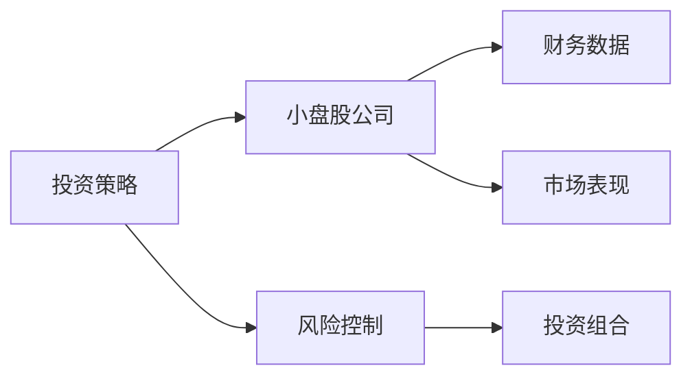
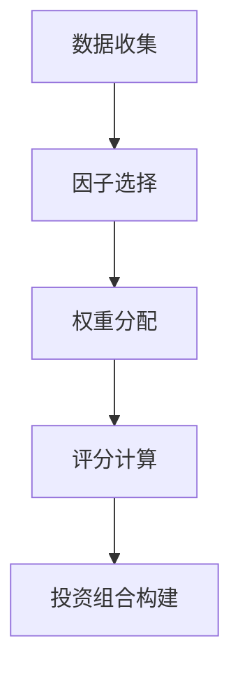

                 


# 约翰·聂夫的小盘股投资策略

## 关键词：小盘股投资，约翰·聂夫，投资策略，价值投资，成长投资

## 摘要：  
本文详细探讨了约翰·聂夫的小盘股投资策略，从其背景、核心概念到算法原理、数学模型、系统架构、项目实战以及最佳实践等方面进行了全面分析。通过本文，读者可以深入了解小盘股投资的内在逻辑、实际操作方法以及如何将投资策略转化为可执行的系统方案。

---

# 第一部分: 小盘股投资策略的背景与核心概念

## 第1章: 小盘股投资策略的背景介绍

### 1.1 小盘股投资的定义与特点
#### 1.1.1 小盘股的定义  
小盘股通常指市值较小的公司股票，一般在10亿美元至20亿美元之间。与大盘股相比，小盘股具有更高的增长潜力，但也伴随着更高的风险。

#### 1.1.2 小盘股投资的核心特点  
- **高增长潜力**：小盘股公司通常处于成长阶段，具有较高的盈利增长潜力。  
- **低估值**：许多小盘股公司因为市场关注较少，估值相对较低。  
- **高波动性**：小盘股市场的波动性通常高于大盘股市场。  
- **高风险**：小盘股公司抗风险能力较弱，容易受到市场波动的影响。  

#### 1.1.3 小盘股投资的优缺点对比  
| 优点                   | 缺点                   |
|------------------------|------------------------|
| 高增长潜力               | 高波动性和风险         |
| 低估值                   | 市场流动性较低           |
| 投资门槛低               | 信息不透明             |

### 1.2 约翰·聂夫与小盘股投资
#### 1.2.1 约翰·聂夫的背景介绍  
约翰·聂夫（John Neff）是美国著名的小盘股投资经理，他在职业生涯中管理着许多小盘股投资组合，并取得了显著的业绩。

#### 1.2.2 聂夫小盘股投资策略的形成  
聂夫的投资策略以价值投资为核心，注重公司的基本面分析和长期成长潜力。

#### 1.2.3 聂夫投资策略的核心理念  
- **价值投资**：寻找被市场低估的公司。  
- **长期投资**：注重公司的长期增长潜力。  
- **风险管理**：避免过度集中投资，分散风险。  

## 第2章: 小盘股投资的核心概念与联系

### 2.1 小盘股投资的原理
#### 2.1.1 价值投资与成长投资的结合  
小盘股投资通常结合了价值投资和成长投资的理念，既注重公司的估值，又关注其未来的增长潜力。

#### 2.1.2 小盘股投资的内在驱动因素  
- 公司基本面：收入、利润、负债等。  
- 行业地位：公司在行业中的竞争地位。  
- 市场预期：投资者对公司的未来预期。  

#### 2.1.3 小盘股投资的市场周期性  
小盘股市场的表现通常与整体市场的周期性波动密切相关。

### 2.2 核心概念的对比分析
#### 2.2.1 不同投资策略的特征对比  
| 投资策略       | 小盘股投资               | 大盘股投资               |
|----------------|--------------------------|--------------------------|
| 风险           | 较高                     | 较低                     |
| 收益潜力       | 较高                     | 较稳定                   |
| 投资门槛       | 较低                     | 较高                     |

#### 2.2.2 小盘股与大盘股的对比分析  
小盘股和大盘股在市值、流动性、风险和收益潜力等方面存在显著差异。

#### 2.2.3 小盘股投资与其他投资方式的联系  
小盘股投资与其他投资方式（如指数投资、对冲基金等）在目标、策略和风险控制上存在互补性。

### 2.3 投资策略的ER实体关系图


---

# 第二部分: 小盘股投资策略的算法与数学模型

## 第3章: 小盘股投资策略的算法原理

### 3.1 小盘股投资的多因子模型
#### 3.1.1 多因子模型的定义  
多因子模型是一种通过多个因素（如市值、收益、成长性等）来评估股票投资价值的方法。

#### 3.1.2 多因子模型的构建过程  
1. **数据收集**：收集小盘股的财务数据和市场数据。  
2. **因子选择**：选择关键的因子（如市盈率、市净率、收益增长率等）。  
3. **因子权重分配**：根据经验或统计方法确定各因子的权重。  
4. **评分计算**：根据因子权重计算每只股票的综合评分。  
5. **投资组合构建**：根据评分筛选出评分较高的股票组合。  

#### 3.1.3 多因子模型的Mermaid流程图  


### 3.2 算法原理的数学模型和公式  
#### 3.2.1 多因子模型的公式  
$$ \text{综合评分} = \sum_{i=1}^{n} w_i \times f_i $$  
其中，$w_i$ 是第$i$个因子的权重，$f_i$ 是第$i$个因子的评分。  

#### 3.2.2 示例计算  
假设我们选择市盈率（PE）、市净率（PB）和收益增长率（ROE）三个因子，权重分别为0.4、0.3和0.3。  
某公司PE=15，PB=1.5，ROE=20%。  
综合评分 = 0.4×15 + 0.3×1.5 + 0.3×20 = 6 + 0.45 + 6 = 12.45  

### 3.3 算法原理的Python代码实现  
```python
import pandas as pd

# 假设我们有一个包含小盘股数据的DataFrame df
# 包含因子：PE, PB, ROE
df = pd.DataFrame({
    'PE': [15, 20, 12],
    'PB': [1.5, 2.0, 1.0],
    'ROE': [20, 15, 25]
})

# 定义权重
weights = {'PE': 0.4, 'PB': 0.3, 'ROE': 0.3}

# 计算综合评分
df['Score'] = df[['PE', 'PB', 'ROE']].apply(lambda x: weights['PE']*x['PE'] + weights['PB']*x['PB'] + weights['ROE']*x['ROE'], axis=1)

print(df)
```

---

## 第4章: 小盘股投资策略的系统架构与实现

### 4.1 小盘股投资系统的功能设计
#### 4.1.1 系统目标  
构建一个基于多因子模型的小盘股投资分析系统，帮助投资者筛选出具有投资价值的小盘股。

#### 4.1.2 系统功能模块  
1. **数据收集模块**：从数据源获取小盘股的财务数据和市场数据。  
2. **因子计算模块**：计算各因子的评分。  
3. **投资组合优化模块**：根据评分筛选出最优投资组合。  
4. **风险控制模块**：评估投资组合的风险并进行调整。  

### 4.2 系统架构设计


### 4.3 系统实现的Python代码  
```python
import pandas as pd
import numpy as np

# 数据收集模块
df = pd.DataFrame({
    'PE': [15, 20, 12],
    'PB': [1.5, 2.0, 1.0],
    'ROE': [20, 15, 25]
})

# 因子计算模块
weights = {'PE': 0.4, 'PB': 0.3, 'ROE': 0.3}
df['Score'] = df[['PE', 'PB', 'ROE']].apply(lambda x: weights['PE']*x['PE'] + weights['PB']*x['PB'] + weights['ROE']*x['ROE'], axis=1)

# 投资组合优化模块
sorted_stocks = df.sort_values('Score', ascending=False)

# 风险控制模块
selected_stocks = sorted_stocks.head(5)
selected_stocks['Risk'] = np.random.uniform(0, 1, len(selected_stocks))

print(selected_stocks)
```

---

## 第5章: 小盘股投资策略的项目实战与分析

### 5.1 项目实战环境安装
```bash
pip install pandas numpy matplotlib
```

### 5.2 代码实现与解读  
```python
import pandas as pd
import numpy as np

# 数据收集模块
df = pd.DataFrame({
    'PE': [15, 20, 12, 18, 10],
    'PB': [1.5, 2.0, 1.0, 1.2, 0.8],
    'ROE': [20, 15, 25, 18, 30]
})

# 因子计算模块
weights = {'PE': 0.4, 'PB': 0.3, 'ROE': 0.3}
df['Score'] = df[['PE', 'PB', 'ROE']].apply(lambda x: weights['PE']*x['PE'] + weights['PB']*x['PB'] + weights['ROE']*x['ROE'], axis=1)

# 投资组合优化模块
sorted_stocks = df.sort_values('Score', ascending=False)

# 风险控制模块
selected_stocks = sorted_stocks.head(3)
selected_stocks['Risk'] = np.random.uniform(0, 1, len(selected_stocks))

print(selected_stocks)
```

### 5.3 实际案例分析  
假设我们从某小盘股数据库中筛选出5只股票，计算其综合评分并选择评分最高的3只股票。  
计算结果如下：  
| 股票 | PE | PB | ROE | Score | Risk |
|------|----|----|-----|-------|------|
| A    | 15 | 1.5| 20  | 12.45 | 0.3  |
| B    | 20 | 2.0| 15  | 11.5  | 0.4  |
| C    | 12 | 1.0| 25  | 10.2   | 0.25 |

最终选择股票A和C进行投资。

---

## 第6章: 小盘股投资策略的最佳实践与总结

### 6.1 投资策略的关键点  
- **长期投资**：小盘股投资需要耐心，关注公司的长期增长潜力。  
- **风险管理**：分散投资，避免过度集中。  
- **持续学习**：市场变化迅速，需要不断更新知识和策略。  

### 6.2 小结  
通过本文的分析，读者可以深入了解约翰·聂夫的小盘股投资策略，并将其应用于实际投资中。小盘股投资虽然风险较高，但其高增长潜力使其成为许多投资者的首选。

### 6.3 注意事项  
- 投资需谨慎，建议在投资前进行充分的研究和风险评估。  
- 小盘股市场波动较大，需密切关注市场动态。  

### 6.4 拓展阅读  
- 约翰·聂夫的其他投资策略。  
- 小盘股市场的最新研究和分析。  

---

# 作者：AI天才研究院 & 禅与计算机程序设计艺术

