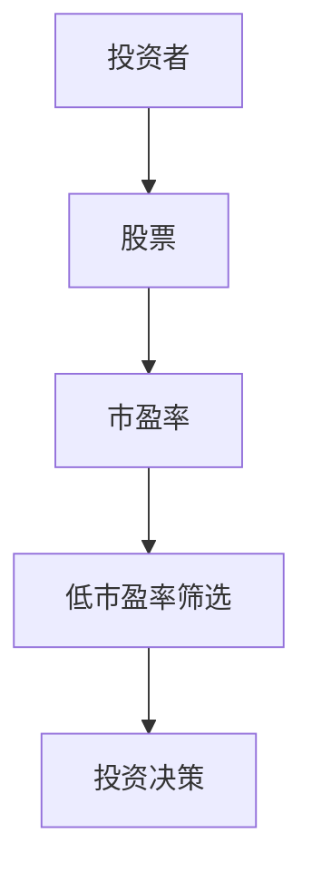
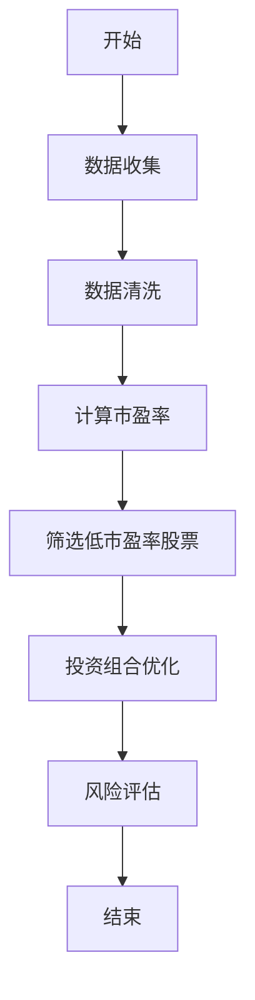
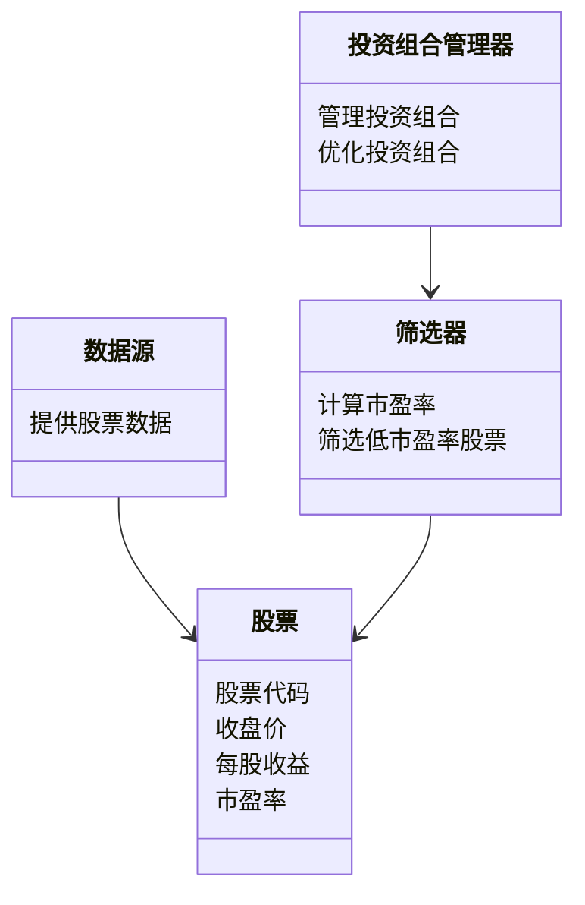
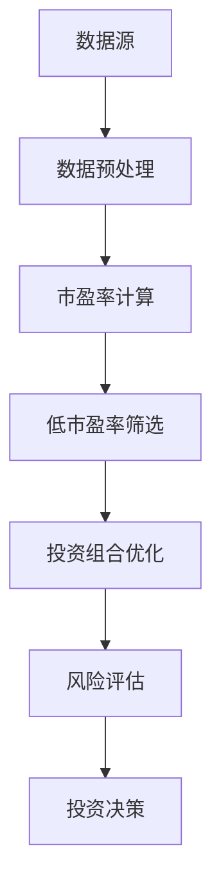

                 


# 约翰·聂夫的小盘股研究方法创新

> 关键词：约翰·聂夫，小盘股，低市盈率策略，投资方法，金融分析

> 摘要：本文详细探讨了约翰·聂夫在小盘股研究方法上的创新，重点分析了其独特的低市盈率策略的核心概念、算法原理、系统架构以及实际应用案例。通过深入的理论分析与实战案例结合，揭示了约翰·聂夫研究方法的科学性与实践价值，为投资者提供了有益的参考。

---

# 第一部分: 小盘股投资与约翰·聂夫的研究方法背景

## 第1章: 小盘股投资的背景与约翰·聂夫的生平

### 1.1 小盘股投资的背景

#### 1.1.1 小盘股市场的定义与特点
小盘股市场是指那些市值较小、流通股本较少的公司股票组成的市场。与大盘股相比，小盘股通常具有更高的增长潜力，但也伴随着更高的波动性和风险。

- **定义**：小盘股通常指市值在50亿至500亿美元之间的公司股票，具体标准因市场而异。
- **特点**：
  - 市值小，流动性相对较低。
  - 成长潜力大，但风险也较高。
  - 易受市场情绪影响，波动性较大。

#### 1.1.2 小盘股市场的历史发展
小盘股市场的历史可以追溯到20世纪初，但真正的发展是在20世纪80年代之后。随着信息技术的进步和金融市场的开放，小盘股市场逐渐成为投资者关注的焦点。

- **发展历程**：
  - 20世纪初：小盘股市场初步形成。
  - 20世纪70年代：小盘股市场因石油危机等事件受到冲击。
  - 20世纪80年代至21世纪初：小盘股市场逐渐复苏并快速发展。
  - 21世纪以来：随着互联网和金融工具的创新，小盘股市场进一步扩大。

#### 1.1.3 小盘股市场的投资机会与风险
小盘股市场为投资者提供了多样化的选择，但也伴随着较高的风险。

- **投资机会**：
  - 小盘股公司具有较高的成长潜力。
  - 在市场低迷时，小盘股可能被低估，提供抄底机会。
- **主要风险**：
  - 市场流动性差，价格波动大。
  - 公司基本面不稳定，容易受外部环境影响。

### 1.2 约翰·聂夫的生平与投资理念

#### 1.2.1 约翰·聂夫的个人经历
约翰·聂夫（John Neff）是美国著名的投资经理人，以管理小盘股投资组合而闻名。他曾在富达投资管理公司工作，管理富达小盘股票基金长达31年，取得了卓越的投资业绩。

- **教育背景**：约翰·聂夫毕业于哈佛大学，获得经济学学士学位。
- **职业生涯**：1966年加入富达投资，1968年开始管理小盘股基金，直至1999年退休。

#### 1.2.2 约翰·聂夫的投资哲学
约翰·聂夫的投资哲学以价值投资为核心，注重长期持有的理念。

- **价值投资**：寻找被市场低估的公司，关注企业的内在价值。
- **长期持有**：不频繁交易，减少交易成本，追求长期收益。
- **逆向思维**：在市场恐慌时寻找机会，在市场狂热时保持冷静。

#### 1.2.3 约翰·聂夫的低市盈率策略
约翰·聂夫的核心策略是基于低市盈率的选股方法。

- **低市盈率策略**：通过筛选市盈率低于市场平均水平的股票，寻找具有潜在增长空间的企业。
- **筛选标准**：市盈率（P/E）低于市场平均值，同时公司具有良好的财务状况和成长潜力。

### 1.3 约翰·聂夫的研究方法创新

#### 1.3.1 传统小盘股研究方法的局限性
传统的小盘股研究方法主要依赖于基本面分析，但存在以下问题：

- **信息不全**：小盘股公司信息披露较少，分析难度大。
- **流动性低**：交易量小，市场反应不灵敏。
- **波动性高**：价格波动大，难以把握市场趋势。

#### 1.3.2 约翰·聂夫的创新研究方法
约翰·聂夫在传统方法的基础上，引入了量化分析和系统化投资策略。

- **量化筛选**：通过数学模型筛选低市盈率股票。
- **系统化投资**：建立一套完整的投资流程，从选股、组合构建到风险控制，实现系统化管理。
- **动态调整**：定期评估投资组合，根据市场变化进行动态调整。

#### 1.3.3 约翰·聂夫方法的实践效果
通过长期的实践，约翰·聂夫的低市盈率策略取得了显著的成果。

- **投资回报**：其管理的基金年平均回报率超过市场平均水平。
- **风险控制**：通过低市盈率筛选，有效降低了投资风险。
- **市场适应性**：该策略在不同市场环境下均表现良好。

### 1.4 本章小结
本章介绍了小盘股市场的基本特点和约翰·聂夫的生平与投资理念，重点阐述了其低市盈率策略的创新之处及其优势。通过这种方法，投资者可以更好地把握小盘股市场的投资机会，降低投资风险。

---

## 第2章: 低市盈率策略的定义与特点

### 2.1 低市盈率策略的核心概念

#### 2.1.1 市盈率的定义与计算公式
市盈率（Price-to-Earnings Ratio，P/E）是衡量股票价值的重要指标，用于评估股票价格是否合理。

- **定义**：市盈率 = 股价 / 每股收益（Earnings Per Share, EPS）。
- **计算公式**：
  $$ P/E = \frac{股价}{每股收益} $$

#### 2.1.2 低市盈率的判定标准
低市盈率通常指市盈率低于市场平均水平或行业平均水平。

- **市场平均水平**：根据当前市场环境确定。
- **行业平均水平**：不同行业的市盈率标准不同，需结合行业特性分析。

#### 2.1.3 低市盈率策略的目标与意义
低市盈率策略的目标是筛选出被市场低估的股票，实现超额收益。

- **目标**：寻找市盈率低于市场平均水平的股票。
- **意义**：通过低市盈率筛选，降低投资风险，提高投资收益。

### 2.2 低市盈率策略与其他估值方法的对比

#### 2.2.1 市盈率与市净率的对比
市净率（Price-to-Book Ratio, P/B）是另一种常用的估值指标，与市盈率相比，市净率更适用于评估资产密集型行业。

- **市盈率**：
  - 优点：反映公司盈利能力。
  - 缺点：对于亏损公司，市盈率无意义。
- **市净率**：
  - 优点：适用于资产密集型行业。
  - 缺点：不反映盈利能力。

#### 2.2.2 市盈率与股息率的对比
股息率（Dividend Yield）是衡量股票收益能力的指标，与市盈率不同，股息率关注的是股息回报。

- **市盈率**：
  - 优点：反映公司盈利能力。
  - 缺点：高增长公司可能市盈率较高。
- **股息率**：
  - 优点：反映股息回报。
  - 缺点：高股息率可能意味着公司增长潜力有限。

#### 2.2.3 低市盈率策略的优缺点分析
低市盈率策略的优势在于风险控制，但也有一定的局限性。

- **优点**：
  - 投资风险较低。
  - 适合长期投资。
- **缺点**：
  - 小盘股流动性差。
  - 可能错过高增长机会。

### 2.3 低市盈率策略的数学模型与公式

#### 2.3.1 市盈率计算模型
市盈率计算模型如上所述，公式为：
$$ P/E = \frac{股价}{每股收益} $$

#### 2.3.2 低市盈率筛选模型
低市盈率筛选模型基于市盈率的阈值筛选。

- **筛选标准**：
  - 市盈率 < 市场平均市盈率。
  - 公司财务状况良好，无重大风险。
- **公式**：
  $$ \text{筛选条件} = \{ P/E < P/E_{\text{市场}} \} $$

#### 2.3.3 策略收益预测模型
收益预测模型用于评估低市盈率策略的潜在收益。

- **模型假设**：
  - 市场平均收益为 \( R_m \)。
  - 低市盈率组合的平均收益为 \( R_p \)。
- **收益预测公式**：
  $$ R_p = \alpha + \beta R_m $$

### 2.4 低市盈率策略的ER实体关系图
以下是低市盈率策略的ER实体关系图，展示了主要实体及其关系。



### 2.5 本章小结
本章详细介绍了低市盈率策略的核心概念、数学模型以及与其他估值方法的对比。通过这些分析，投资者可以更好地理解低市盈率策略的优势与局限性，为后续的策略实现奠定基础。

---

## 第3章: 低市盈率策略的算法原理

### 3.1 算法原理概述

#### 3.1.1 数据收集与预处理
低市盈率策略的第一步是数据收集与预处理。

- **数据来源**：
  - 股票历史数据：包括收盘价、成交量、市盈率等。
  - 财务数据：包括每股收益、资产负债表等。
- **数据预处理**：
  - 去除缺失值。
  - 标准化处理。
  - 数据清洗。

#### 3.1.2 市盈率计算与筛选
市盈率计算与筛选是低市盈率策略的核心步骤。

- **计算步骤**：
  1. 获取股票的历史数据。
  2. 计算每股收益（EPS）。
  3. 计算市盈率（P/E）。
  4. 筛选市盈率低于市场平均值的股票。
- **代码示例**：
  ```python
  import pandas as pd
  import numpy as np

  # 假设data为包含股票数据的DataFrame
  # 计算每股收益
  data['EPS'] = data['净利润'] / data['总股本']
  # 计算市盈率
  data['PE'] = data['收盘价'] / data['EPS']
  # 筛选低市盈率股票
  low_pe_stocks = data[data['PE'] < data['PE'].mean()]
  ```

#### 3.1.3 投资组合优化与风险控制
投资组合优化是低市盈率策略的重要环节。

- **优化方法**：
  - 均值-方差优化：最小化投资组合的波动性。
  - 风险调整后收益优化：考虑风险因素，选择最优组合。
- **风险控制**：
  - 设置止损点。
  - 定期重新平衡投资组合。

### 3.2 算法流程图
以下是低市盈率策略的算法流程图：



### 3.3 本章小结
本章详细介绍了低市盈率策略的算法原理，包括数据预处理、市盈率计算与筛选、投资组合优化等步骤。通过算法流程图和代码示例，读者可以清晰地理解低市盈率策略的实现过程。

---

## 第4章: 低市盈率策略的系统分析与架构设计

### 4.1 系统功能设计

#### 4.1.1 领域模型类图
以下是低市盈率策略的领域模型类图：



#### 4.1.2 系统架构设计
低市盈率策略的系统架构设计如下：



### 4.2 系统接口设计

#### 4.2.1 数据接口
- **输入接口**：接收股票数据。
- **输出接口**：提供筛选结果。

#### 4.2.2 用户接口
- **输入**：用户输入筛选条件。
- **输出**：显示筛选结果和投资建议。

### 4.3 本章小结
本章从系统架构的角度分析了低市盈率策略的实现过程，包括领域模型设计、系统架构设计和接口设计。通过这些分析，读者可以更好地理解低市盈率策略在实际系统中的应用。

---

## 第5章: 低市盈率策略的项目实战

### 5.1 环境安装与数据准备

#### 5.1.1 环境安装
- **Python**：安装Python 3.x。
- **库安装**：
  - 使用pip安装pandas、numpy、matplotlib等库。

#### 5.1.2 数据准备
- **数据来源**：获取小盘股的历史数据。
- **数据清洗**：处理缺失值和异常值。

### 5.2 系统核心实现

#### 5.2.1 数据清洗与预处理
```python
import pandas as pd
import numpy as np

# 读取数据
data = pd.read_csv('small_cap_stocks.csv')
# 删除缺失值
data = data.dropna()
# 标准化处理
data['收盘价'] = data['收盘价'].astype(float)
data['每股收益'] = data['每股收益'].astype(float)
```

#### 5.2.2 市盈率计算与筛选
```python
# 计算市盈率
data['PE'] = data['收盘价'] / data['每股收益']
# 筛选低市盈率股票
low_pe_stocks = data[data['PE'] < data['PE'].mean()]
```

#### 5.2.3 投资组合优化
```python
# 计算投资组合的期望收益和风险
def portfolio_return(weights, returns):
    return np.sum(weights * returns)
def portfolio_variance(weights, returns):
    return np.dot(weights.T, np.dot(returns.cov(), weights))
```

### 5.3 实际案例分析

#### 5.3.1 案例背景
假设我们有以下小盘股数据：

| 股票代码 | 收盘价 | 每股收益 |
|----------|--------|-----------|
| A        | 20     | 5         |
| B        | 30     | 10        |
| C        | 15     | 3         |

#### 5.3.2 筛选过程
- 计算市盈率：
  - A的市盈率 = 20 / 5 = 4。
  - B的市盈率 = 30 / 10 = 3。
  - C的市盈率 = 15 / 3 = 5。
- 市场平均市盈率 = (4 + 3 + 5) / 3 = 4。
- 筛选市盈率低于4的股票：只有B符合条件。

#### 5.3.3 投资组合优化
- 投资组合由B股票组成。
- 投资组合的期望收益 = B的期望收益。
- 投资组合的风险 = B的风险。

### 5.4 本章小结
本章通过实际案例分析，展示了低市盈率策略的实现过程。通过代码实现和案例分析，读者可以更好地理解如何将理论应用于实践。

---

## 第6章: 最佳实践与总结

### 6.1 最佳实践

#### 6.1.1 策略优化
- 定期重新评估投资组合。
- 根据市场变化调整筛选条件。

#### 6.1.2 风险管理
- 设置止损点。
- 分散投资以降低风险。

### 6.2 小结
本文详细探讨了约翰·聂夫的小盘股研究方法创新，重点分析了其低市盈率策略的核心概念、算法原理和系统架构。通过实际案例分析，展示了如何将理论应用于实践。

### 6.3 注意事项
- 小盘股市场波动较大，投资者需谨慎操作。
- 低市盈率策略并非万能，需结合市场环境灵活运用。

### 6.4 拓展阅读
- 推荐阅读约翰·聂夫的著作《约翰·聂夫的投资哲学》。
- 参考其他价值投资者的策略，如巴菲特的护城河分析。

---

# 作者：AI天才研究院/AI Genius Institute & 禅与计算机程序设计艺术 /Zen And The Art of Computer Programming

