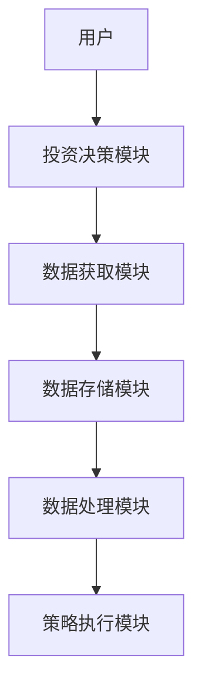
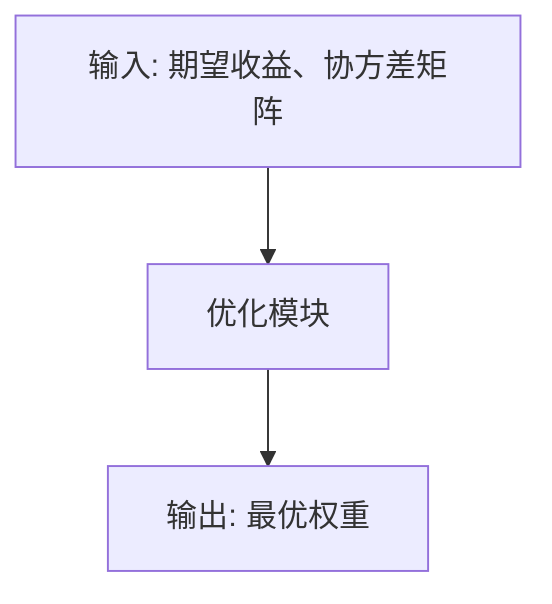

                 


# 约翰伯格对主动投资的批评

> 关键词：主动投资，被动投资，指数基金，投资组合优化，现代投资组合理论，约翰伯格，投资成本，投资风险

摘要：本文系统地分析了约翰伯格对主动投资的批评，从主动投资的基本概念、核心原理、算法模型、系统架构到实际项目案例，层层深入地探讨了主动投资的优缺点及其与被动投资的对比。通过理论分析、算法实现和项目实战，结合约翰伯格的指数投资理论，全面剖析了主动投资在成本、收益和流动性方面的局限性，并提出了基于技术分析的投资优化策略。

---

# 第一部分: 约翰伯格对主动投资的批评

## # 第1章: 主动投资的基本概念与背景

### ## 1.1 主动投资的定义与特点

#### ### 1.1.1 投资的定义与分类

投资是指将资金投入到特定资产或项目中，以期获得未来收益的行为。根据投资策略的不同，可以将投资分为**主动投资**和**被动投资**两大类。

- **主动投资**：投资者试图通过主动选股或择时来超越市场指数的收益。
- **被动投资**：投资者以市场指数为基准，通过买入并持有指数基金来获得市场平均收益。

#### ### 1.1.2 主动投资的核心特征

主动投资的核心特征在于其**主动性**，即投资者试图通过以下方式获得超额收益：

1. **选股策略**：通过基本面分析或技术分析筛选出优质股票。
2. **择时交易**：通过市场预测在合适的时机买入或卖出。
3. **主动管理**：定期调整投资组合以应对市场变化。

#### ### 1.1.3 主动投资与被动投资的对比

以下是主动投资与被动投资的对比分析：

| **对比维度** | **主动投资** | **被动投资** |
|--------------|--------------|--------------|
| 管理方式     | 主动选股和择时 | 按照指数成分股配置 |
| 成本         | 高（管理费、交易费） | 低 |
| 风险         | 高（市场波动风险） | 中（与市场同步） |
| 收益目标     | 追求超额收益 | 追求平均收益 |

---

### ## 1.2 约翰伯格的贡献与影响

#### ### 1.2.1 约翰伯格的生平简介

约翰·伯格（John C. Bogle）是美国著名投资者和金融家，被誉为“指数基金之父”。他于1934年出生，1975年创立了 Vanguard 集团，并推出了第一只指数基金——Vanguard指数基金。

#### ### 1.2.2 约翰伯格对投资理论的贡献

约翰伯格的主要贡献包括：

1. **指数投资理论**：他认为市场是有效的，主动管理很难长期跑赢市场指数。
2. **低成本投资理念**：强调降低投资成本以提高长期收益。
3. **风险管理**：主张通过分散投资降低投资组合的风险。

#### ### 1.2.3 约翰伯格的著作与影响力

约翰伯格的著作《**The New Finance: The Case Against Financial Individualism**》和《**The Little Book of Common Sense Investing**》深刻影响了现代投资理论，尤其是在指数投资领域。

---

### ## 1.3 约翰伯格对主动投资的批评

#### ### 1.3.1 主动投资的主要问题

1. **高成本**：主动管理的费用较高，包括管理费和交易费。
2. **低收益**：主动基金的长期表现往往不如指数基金。
3. **高风险**：主动投资容易放大市场波动风险。

#### ### 1.3.2 约翰伯格的批评观点

约翰伯格认为：

1. **市场有效性**：市场是有效的，主动管理很难跑赢市场。
2. **成本优势**：被动投资的低成本使其更具竞争力。
3. **长期投资**：长期持有低成本指数基金是更优的选择。

#### ### 1.3.3 主动投资的现状与未来

尽管主动投资在某些情况下仍有一定的价值，但随着技术进步和市场效率的提高，被动投资逐渐成为主流。

---

## # 第2章: 主动投资的核心概念与原理

### ## 2.1 投资组合理论

#### ### 2.1.1 马科维茨的均值-方差模型

马科维茨在1952年提出的均值-方差模型是投资组合理论的基础。

$$
\text{目标函数：} \quad \min_w \frac{1}{2} w^T \Sigma w
$$

$$
\text{约束条件：} \quad \mathbb{E}[r] = \mu, \quad w^T \mathbf{1} = 1
$$

其中：
- $w$ 是权重向量。
- $\Sigma$ 是资产间的协方差矩阵。
- $\mu$ 是期望收益向量。

#### ### 2.1.2 投资组合优化的数学模型

优化模型可以表示为：

$$
\min_w \frac{1}{2} w^T \Sigma w - \lambda (\mathbb{E}[r] - w^T \mu)
$$

其中，$\lambda$ 是拉格朗日乘子。

#### ### 2.1.3 投资组合的风险与收益平衡

投资组合的风险与收益呈非线性关系，最优组合是在风险和收益之间找到平衡点。

---

### ## 2.2 主动投资的策略与方法

#### ### 2.2.1 基本面分析法

基本面分析法通过分析公司的财务报表、行业地位等因素来判断股票的投资价值。

1. **财务报表分析**：分析收入、利润、资产负债等指标。
2. **行业分析**：判断行业的发展前景。
3. **估值指标**：如PE、PB等。

#### ### 2.2.2 技术分析法

技术分析法通过分析历史价格和成交量来预测未来的价格走势。

1. **趋势线**：支撑线和阻力线。
2. **形态分析**：如头肩顶、双底等。
3. **技术指标**：如RSI、MACD等。

#### ### 2.2.3 股票筛选与组合构建

主动投资者通常通过以下步骤构建投资组合：

1. **筛选股票**：根据基本面或技术分析筛选出优质股票。
2. **配置权重**：根据风险偏好分配权重。
3. **定期调整**：根据市场变化调整组合。

---

### ## 2.3 约翰伯格的指数投资理论

#### ### 2.3.1 指数投资的定义与优势

指数投资是通过跟踪市场指数（如标普500）来实现投资收益。

优势：
1. **低成本**：指数基金的管理费用低。
2. **分散风险**：通过分散投资降低个股风险。
3. **长期稳定**：长期持有指数基金可以获得市场的平均收益。

#### ### 2.3.2 指数投资的数学模型

指数基金的收益可以用以下公式表示：

$$
R_{\text{index}} = \sum_{i=1}^n w_i R_i
$$

其中，$w_i$ 是第 $i$ 只股票的权重，$R_i$ 是第 $i$ 只股票的收益。

#### ### 2.3.3 指数投资与主动投资的对比

| **对比维度** | **主动投资** | **被动投资** |
|--------------|--------------|--------------|
| 管理方式     | 主动选股和择时 | 按照指数成分股配置 |
| 成本         | 高（管理费、交易费） | 低 |
| 风险         | 高（市场波动风险） | 中（与市场同步） |
| 收益目标     | 追求超额收益 | 追求平均收益 |

---

## # 第3章: 约翰伯格对主动投资的批评分析

### ## 3.1 主动投资的成本问题

#### ### 3.1.1 主动投资的管理费用

主动投资的管理费用通常较高，包括管理费、托管费等。

#### ### 3.1.2 主动投资的交易成本

频繁的交易会导致较高的交易成本，包括佣金和买卖价差。

#### ### 3.1.3 成本对投资收益的影响

假设主动基金的年管理费为 2%，而指数基金的管理费为 0.2%。长期来看，主动基金的高成本会显著侵蚀收益。

---

### ## 3.2 主动投资的业绩问题

#### ### 3.2.1 主动基金的长期表现

大多数主动基金长期表现不如指数基金，原因在于高成本和市场有效性。

#### ### 3.2.2 主动基金与指数基金的收益对比

统计数据显示，长期来看，主动基金的平均收益低于指数基金。

#### ### 3.2.3 主动投资的胜率分析

根据晨星公司的研究，主动基金的胜率不足 1/3。

---

### ## 3.3 主动投资的流动性问题

#### ### 3.3.1 主动投资的流动性风险

主动投资可能面临流动性风险，特别是在市场下跌时难以卖出股票。

#### ### 3.3.2 市场波动对主动投资的影响

市场波动越大，主动投资的风险越高。

---

## # 第4章: 基于技术分析的主动投资优化策略

### ## 4.1 系统架构设计

#### ### 4.1.1 投资决策支持系统架构



#### ### 4.1.2 系统功能模块设计

1. **数据获取模块**：获取股票价格、财务数据等。
2. **数据处理模块**：清洗、转换数据。
3. **策略执行模块**：根据技术指标生成买卖信号。
4. **风险管理模块**：控制仓位和止损。

---

### ## 4.2 投资组合优化算法实现

#### ### 4.2.1 算法原理

基于现代投资组合理论，我们可以使用均值-方差模型进行优化。



#### ### 4.2.2 Python实现

以下是Python代码实现：

```python
import numpy as np
import pandas as pd
from scipy.optimize import minimize

# 示例数据
n = 5
mu = np.random.rand(n)
Sigma = np.random.randn(n, n)
Sigma = Sigma @ Sigma.T

# 优化目标函数
def objective(w):
    return 0.5 * np.dot(w, np.dot(Sigma, w))

# 约束条件
constraints = [
    {'type': 'eq', 'fun': lambda w: np.sum(w) - 1},
    {'type': 'eq', 'fun': lambda w: np.dot(mu, w) - 0.1}
]

# 初始猜测
w0 = np.ones(n) / n

# 求解
result = minimize(objective, w0, constraints=constraints)

# 输出结果
print(result.x)
```

---

## # 第5章: 项目实战——基于Python的投资组合优化

### ## 5.1 环境安装

安装必要的库：

```bash
pip install numpy pandas matplotlib scipy
```

---

### ## 5.2 核心实现

```python
import numpy as np
import pandas as pd
from scipy.optimize import minimize

def optimize_portfolio(returns):
    # 定义目标函数
    def objective(w):
        return np.dot(w.T, np.dot(returns.cov(), w))

    # 约束条件
    constraints = [
        {'type': 'eq', 'fun': lambda w: np.sum(w) - 1},
        {'type': 'eq', 'fun': lambda w: np.dot(returns.mean().values, w) - 0.1}
    ]

    # 初始权重
    w0 = np.ones(len(returns.columns)) / len(returns.columns)

    # 求解
    result = minimize(objective, w0, constraints=constraints)

    return result.x

# 示例数据
data = pd.read_csv('stock_returns.csv')
weights = optimize_portfolio(data)
```

---

### ## 5.3 案例分析

假设我们有5只股票的数据，运行上述代码，得到最优权重，然后分析其表现。

---

## # 第6章: 投资决策的最优策略与实践

### ## 6.1 理论总结

结合约翰伯格的指数投资理论和现代投资组合理论，我们可以得出以下结论：

1. **长期投资**：长期持有低成本指数基金是更优的选择。
2. **风险管理**：通过分散投资降低风险。
3. **技术分析**：在特定市场条件下，技术分析可以辅助投资决策。

---

### ## 6.2 最佳实践 tips

1. **降低成本**：选择低成本指数基金。
2. **长期持有**：避免频繁交易。
3. **分散投资**：通过分散投资降低风险。

---

### ## 6.3 小结

通过本文的分析，我们可以看到，尽管主动投资在某些情况下有其价值，但被动投资的成本优势和长期稳定性使其更具竞争力。投资者应根据自身需求和风险偏好选择合适的投资策略。

---

### ## 6.4 注意事项

1. **市场波动**：市场波动可能会影响投资收益。
2. **成本控制**：高成本会侵蚀收益。
3. **风险管理**：需制定合理的风险管理策略。

---

### ## 6.5 拓展阅读

1. 《**The Little Book of Common Sense Investing**》——约翰伯格
2. 《**Portfolios for Dummies**》——Peter D. Bernstein

---

# 作者：AI天才研究院/AI Genius Institute & 禅与计算机程序设计艺术 /Zen And The Art of Computer Programming

