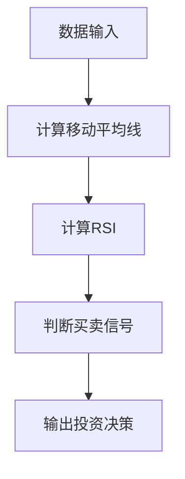
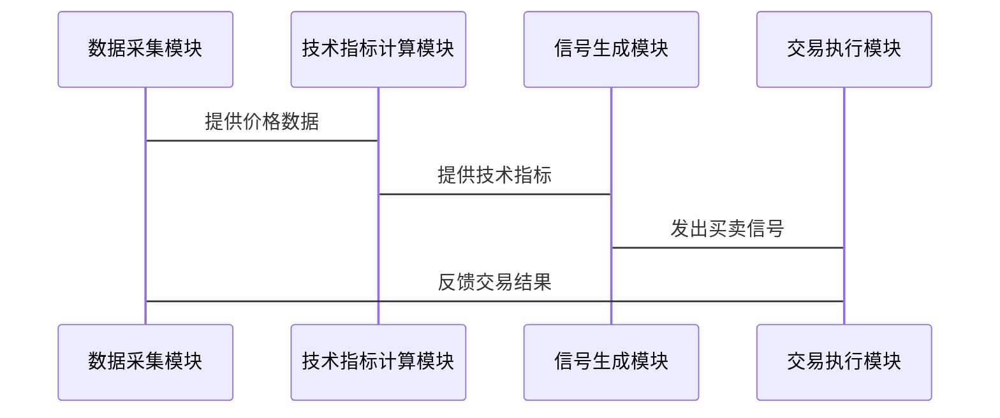

                 


# 约翰·伯格对市场时机选择的看法

> **关键词**：市场时机选择，约翰·伯格，技术分析，投资策略，量化交易，投资风险管理

> **摘要**：  
> 本文深入探讨了约翰·伯格对市场时机选择的看法，结合技术分析与量化交易的方法，分析了市场时机选择的核心概念、数学模型与算法实现。通过实际案例分析，展示了如何基于约翰·伯格的技术分析体系构建投资策略，并提供了一套完整的系统架构设计方案。文章最后总结了市场时机选择的关键要点，并给出了实际投资中的注意事项与最佳实践建议。

---

## 第一部分：市场时机选择的背景与重要性

### 第1章：市场时机选择的背景与意义

#### 1.1 投资市场的基本概念

- **1.1.1 投资市场的定义与分类**
  - 投资市场是指通过购买和出售金融资产（如股票、债券、基金等）进行投资的场所。
  - 市场可以分为一级市场和二级市场，本文主要关注二级市场的投资时机选择。

- **1.1.2 市场时机选择的重要性**
  - 市场时机选择是投资决策中的关键环节，直接影响投资收益和风险。
  - 在市场波动剧烈的情况下，正确的时机选择能够最大化收益并规避风险。

- **1.1.3 约翰·伯格的学术背景与投资理念**
  - 约翰·伯格是投资领域的权威，其技术分析方法被广泛应用于市场时机选择。
  - 伯格强调通过技术分析识别市场趋势和拐点，从而做出科学的投资决策。

---

### 第2章：约翰·伯格的技术分析体系

#### 2.1 技术分析的核心工具

- **2.1.1 K线图的定义与解读**
  - K线图是反映一定时间段内市场价格波动的图形，由开盘价、收盘价、最高价和最低价构成。
  - 通过分析K线图中的趋势、形态和成交量，可以判断市场的买卖力量。

- **2.1.2 移动平均线（MA）的使用方法**
  - 移动平均线是将一定时间内市场价格的平均值连接而成的曲线。
  - 常用的移动平均线有5日、10日、20日、50日和200日均线。
  - 移动平均线可以帮助识别价格趋势，并在趋势反转时发出买卖信号。

- **2.1.3 相对强弱指数（RSI）的应用**
  - RSI是一种衡量市场价格强弱程度的指标，范围在0到100之间。
  - 当RSI高于70时，市场可能超买，价格可能回调；当RSI低于30时，市场可能超卖，价格可能反弹。

#### 2.2 约翰·伯格的技术分析策略

- **2.2.1 支撑线与阻力线的识别**
  - 支撑线是价格下跌时遇到支撑的水平线，通常被视为买入机会。
  - 阻力线是价格上涨时遇到阻力的水平线，通常被视为卖出机会。

- **2.2.2 头肩顶、双底等形态的判断**
  - 头肩顶是一种看跌形态，预示着价格将大幅下跌。
  - 双底是一种看涨形态，预示着价格将大幅上涨。

- **2.2.3 趋势线与通道线的应用**
  - 趋势线是价格波动的支撑或阻力线，用于判断价格的主方向。
  - 通道线是趋势线的平行线，用于判断价格的波动范围。

---

## 第二部分：市场时机选择的数学模型与算法

### 第3章：技术分析的数学模型

#### 3.1 移动平均线（MA）的计算公式

$$
MA_n = \frac{1}{n} \sum_{i=1}^{n} P_i
$$

其中，\( P_i \) 为第 \( i \) 天的收盘价，\( n \) 为天数。

#### 3.2 相对强弱指数（RSI）的计算公式

$$
RSI = \frac{100}{1 + \frac{S}{D}}
$$

其中，\( S \) 为上涨幅度，\( D \) 为下跌幅度。

---

### 第4章：基于约翰·伯格方法的算法实现

#### 4.1 技术指标计算的Python实现

```python
import pandas as pd
import numpy as np

def calculate_MA(data, n):
    """计算n天的移动平均线"""
    return data['Close'].rolling(n).mean()

def calculate_RSI(data, n):
    """计算n天的相对强弱指数(RSI)"""
    diff = data['Close'].diff()
    up = diff.where(diff > 0, 0)
    down = diff.where(diff < 0, 0)
    RS = up.rolling(n).mean() / down.rolling(n).mean()
    return 100 - 100 / (1 + RS)

# 示例数据
data = pd.DataFrame({
    'Close': [100, 102, 101, 103, 104, 105, 106, 107, 108, 109]
})

n = 5
ma = calculate_MA(data, n)
rsi = calculate_RSI(data, n)

print("移动平均线：\n", ma)
print("相对强弱指数：\n", rsi)
```

#### 4.2 技术分析算法的mermaid流程图



---

## 第三部分：系统分析与架构设计

### 第5章：系统分析与架构设计

#### 5.1 问题场景介绍

- **目标**：基于约翰·伯格的技术分析方法，构建一个自动化投资决策系统。
- **输入**：股票价格数据（K线图）。
- **输出**：买卖信号（买入、卖出或持有）。

#### 5.2 系统功能设计

- **功能模块**：
  1. 数据采集模块：从数据源获取股票价格数据。
  2. 技术指标计算模块：计算移动平均线、RSI等指标。
  3. 信号生成模块：基于技术指标生成买卖信号。
  4. 交易执行模块：根据信号执行交易指令。

#### 5.3 系统架构设计


#### 5.4 系统交互设计



---

## 第四部分：项目实战

### 第6章：项目实战与案例分析

#### 6.1 项目环境安装

```bash
pip install pandas numpy matplotlib
```

#### 6.2 核心代码实现

```python
import pandas as pd
import numpy as np
import matplotlib.pyplot as plt

def plot_MA(data, n):
    """绘制n天移动平均线的K线图"""
    plt.figure(figsize=(10, 6))
    plt.plot(data['Close'], label='Price')
    plt.plot(data['Close'].rolling(n).mean(), label=f'{n}天移动平均线')
    plt.title(f'{n}天移动平均线与价格走势')
    plt.xlabel('时间')
    plt.ylabel('价格')
    plt.legend()
    plt.show()

# 示例数据
data = pd.DataFrame({
    'Close': np.random.randint(100, 200, 10)
})

n = 5
plot_MA(data, n)
```

#### 6.3 案例分析与解读

- **案例**：某股票价格数据，使用约翰·伯格的技术分析方法进行买卖信号判断。
- **分析**：通过计算移动平均线和RSI，识别超买超卖信号，并根据K线图形态判断买卖时机。

---

## 第五部分：总结与最佳实践

### 第7章：总结与注意事项

#### 7.1 总结

- 约翰·伯格的技术分析方法为市场时机选择提供了科学的工具和策略。
- 通过数学模型和算法实现，可以将技术分析方法应用于量化交易。

#### 7.2 最佳实践

- **小结**：技术分析是市场时机选择的重要工具，但需要结合市场环境和投资者心理进行综合判断。
- **注意事项**：技术分析并非完美，市场波动受多种因素影响，投资者需保持警惕并做好风险管理。
- **未来趋势**：量化交易和人工智能技术的结合将为市场时机选择提供更强大的工具。

---

## 作者：AI天才研究院/AI Genius Institute & 禅与计算机程序设计艺术 /Zen And The Art of Computer Programming

