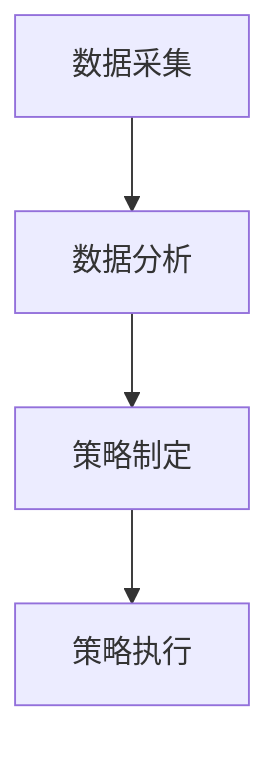

                 


# 约翰伯格的'回归均值'理论：市场长期的自我修正

---

## 关键词：  
- 约翰·伯格  
- 回归均值理论  
- 市场自我修正  
- 投资策略  
- 马科维茨有效前沿  

---

## 摘要：  
本文深入探讨了约翰·伯格的“回归均值”理论，分析其在金融市场中的应用及其对市场长期自我修正的影响。通过结合理论与实践，本文详细阐述了回归均值理论的核心概念、约翰·伯格的理论框架、市场自我修正机制、投资策略的应用，以及系统架构设计等内容。文章通过数学模型、算法实现和项目实战，帮助读者全面理解回归均值理论的内在逻辑与实际应用。

---

## 第1章：回归均值理论的起源与核心概念  

### 1.1 回归均值理论的起源  
回归均值理论是统计学中的一个基本概念，广泛应用于金融市场分析。该理论认为，资产价格或市场回报会围绕其长期均值水平波动，表现出均值回归的特性。这种特性在股票市场、债券市场等金融资产的价格波动中尤为显著。  

#### 1.1.1 统计学中的回归均值概念  
回归均值理论的核心在于，任何偏离均值的行为都会逐渐回归到均值水平。这一理论在金融学中被广泛用于预测市场走势和制定投资策略。  

#### 1.1.2 回归均值理论在金融市场的应用  
在金融市场中，回归均值理论被用来解释资产价格的短期波动与长期趋势之间的关系。例如，股票价格可能在短期内大幅偏离其长期均值水平，但随着时间的推移，价格会逐渐回归均值。  

---

### 1.2 回归均值理论的核心概念  

#### 1.2.1 均值回归的定义与特征  
均值回归是指资产价格或市场回报围绕其长期均值水平波动的现象。其主要特征包括：  
- **短期波动**：资产价格在短期内可能大幅偏离均值水平。  
- **长期回归**：价格会随着时间的推移逐渐回归均值水平。  
- **统计学基础**：基于统计学中的回归分析，资产价格的变化可以用均值回归模型来描述。  

#### 1.2.2 市场的自我修正机制  
市场的自我修正机制是回归均值理论的核心内容之一。市场通过价格波动和交易活动，逐步将价格调整到其长期均值水平。这种机制确保了市场的长期稳定与有效运行。  

#### 1.2.3 回归均值理论的数学表达式  
回归均值理论可以用以下数学公式表示：  
$$E(r) = \alpha + \beta \cdot r_f + \gamma \cdot (r_m - r_f)$$  
其中：  
- $E(r)$ 表示预期回报。  
- $\alpha$ 是截距项。  
- $\beta$ 是回归系数。  
- $r_f$ 是无风险利率。  
- $\gamma$ 是市场风险溢价系数。  
- $r_m$ 是市场回报。  

---

## 第2章：约翰·伯格的回归均值理论  

### 2.1 约翰·伯格的理论概述  

#### 2.1.1 约翰·伯格的学术背景  
约翰·伯格是统计学和金融学领域的权威专家，其研究主要集中在资产定价、风险管理等领域。他的研究为回归均值理论在金融市场中的应用提供了重要的理论基础。  

#### 2.1.2 约翰·伯格的理论贡献  
约翰·伯格提出了回归均值模型，用于解释和预测市场回报的波动性。他的理论认为，资产价格的短期波动可以通过回归均值模型进行建模和预测。  

---

### 2.2 约翰·伯格的理论核心  

#### 2.2.1 回归均值模型的构建  
约翰·伯格的回归均值模型基于统计学中的线性回归方法，将市场回报与无风险利率和市场风险溢价进行回归分析。模型的核心思想是：资产价格的变化可以通过回归分析来预测其回归均值的过程。  

#### 2.2.2 回归均值模型的数学表达  
约翰·伯格的回归均值模型可以表示为：  
$$r_t = \alpha + \beta \cdot r_{t-1} + \epsilon_t$$  
其中：  
- $r_t$ 是当前时间点的市场回报。  
- $r_{t-1}$ 是前一时间点的市场回报。  
- $\alpha$ 是截距项。  
- $\beta$ 是回归系数。  
- $\epsilon_t$ 是误差项。  

---

## 第3章：市场的自我修正机制与回归均值  

### 3.1 市场自我修正机制的分析  

#### 3.1.1 市场波动与回归均值的关系  
市场的自我修正机制通过价格波动将资产价格调整到其长期均值水平。这种机制确保了市场的长期稳定与有效运行。  

#### 3.1.2 回归均值与市场波动的数学关系  
回归均值与市场波动之间的关系可以用以下公式表示：  
$$\text{波动性} = \sigma \cdot \sqrt{t}$$  
其中，$\sigma$ 是标准差，$t$ 是时间跨度。  

---

## 第4章：投资策略与系统设计  

### 4.1 投资策略的应用  

#### 4.1.1 回归均值理论在投资策略中的应用  
回归均值理论可以用于制定投资策略，例如：  
- **均值回归策略**：在资产价格偏离均值水平时进行交易，以期在价格回归均值时获利。  
- **风险管理策略**：通过回归均值模型预测市场波动性，制定相应的风险管理策略。  

#### 4.1.2 投资策略的数学模型  
均值回归策略的数学模型可以表示为：  
$$\text{交易信号} = \text{价格偏离均值的程度}$$  
其中，价格偏离均值的程度可以通过以下公式计算：  
$$z = \frac{p_t - \mu}{\sigma}$$  
其中，$p_t$ 是当前价格，$\mu$ 是均值，$\sigma$ 是标准差。  

---

### 4.2 系统架构设计  

#### 4.2.1 技术实现与系统架构  
系统的架构设计包括数据采集、数据分析、策略制定和策略执行四个模块。  

#### 4.2.2 系统架构图  


---

## 第5章：项目实战与案例分析  

### 5.1 项目实战  

#### 5.1.1 环境安装  
读者需要安装以下Python库：  
- pandas  
- numpy  
- matplotlib  

#### 5.1.2 核心代码实现  
以下是回归均值分析的Python代码示例：  

```python
import pandas as pd
import numpy as np
import matplotlib.pyplot as plt

# 示例数据
data = np.random.normal(0, 1, 100)
df = pd.DataFrame(data, columns=['returns'])

# 计算均值和标准差
mu = df['returns'].mean()
sigma = df['returns'].std()

# 绘制均值回归图
plt.figure(figsize=(10, 6))
plt.plot(df.index, df['returns'], label='Returns')
plt.axhline(y=mu, color='red', linestyle='--', label='Mean')
plt.title('Mean Reversion Analysis')
plt.xlabel('Time')
plt.ylabel('Returns')
plt.legend()
plt.show()
```

---

## 第6章：总结与展望  

### 6.1 总结  
本文深入探讨了约翰·伯格的回归均值理论，分析了其在金融市场中的应用及其对市场长期自我修正的影响。通过结合理论与实践，本文帮助读者全面理解回归均值理论的内在逻辑与实际应用。  

### 6.2 未来展望  
未来的研究可以进一步结合机器学习和大数据分析，探索回归均值理论在复杂市场环境中的应用。同时，也可以研究回归均值理论在风险管理、资产配置等领域的拓展应用。  

---

## 作者：  
AI天才研究院 & 禅与计算机程序设计艺术

