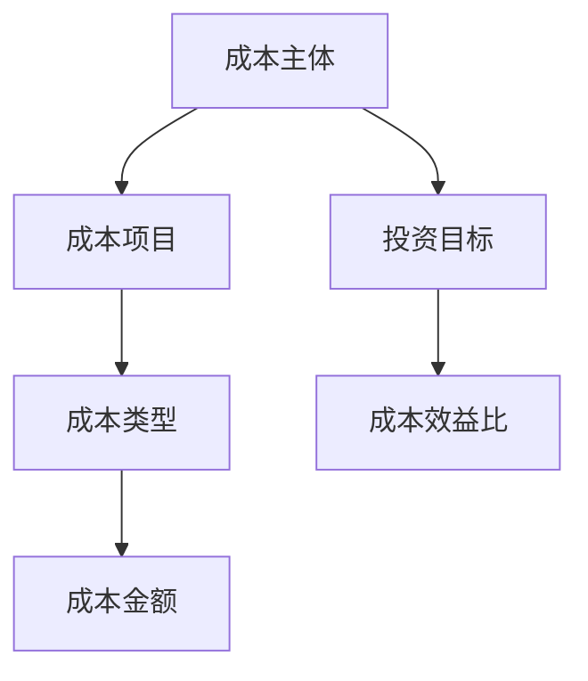

                 


# 约翰伯格的"成本意识"：为什么每一分投资费用都重要

## 关键词：
- 成本意识
- 投资决策
- 财务管理
- 线性规划
- 数字化时代
- 项目管理

## 摘要：
本文深入探讨了约翰伯格的“成本意识”理论，分析了每一分投资费用的重要性。通过系统化的分析，本文从背景介绍、核心概念、算法原理、系统架构设计到项目实战，全面阐述了成本意识在投资决策中的关键作用。通过丰富的案例分析和详细的数学模型，本文为读者提供了从理论到实践的完整指导。

---

# 第一部分：成本意识的核心概念与背景

# 第1章：成本意识的定义与重要性

## 1.1 成本意识的定义
### 1.1.1 成本意识的定义与内涵
成本意识是指在投资或决策过程中，对每一分成本进行细致分析和优化的能力。它不仅关注显性成本，还考虑隐性成本和机会成本。成本意识的核心在于通过最小化成本，实现投资收益的最大化。

### 1.1.2 成本意识的核心要素
- **成本主体**：成本的承担者，如企业或个人。
- **成本项目**：具体的成本支出，如材料费、人工费。
- **成本类型**：固定成本、变动成本、 sunk cost（沉没成本）。
- **成本目标**：通过成本优化实现收益最大化。

### 1.1.3 成本意识与投资决策的关系
在投资决策中，成本意识直接影响项目的可行性评估。例如，在评估一个新项目时，成本意识帮助投资者分析项目的初始投资、运营成本以及可能的收益。

---

## 1.2 成本意识的重要性
### 1.2.1 成本意识在投资中的作用
成本意识帮助投资者在有限资源中做出最优决策，避免浪费。例如，在选择投资项目时，成本意识可以帮助投资者分析不同方案的成本差异，从而选择性价比更高的方案。

### 1.2.2 成本意识对企业管理的影响
在企业管理中，成本意识有助于优化资源配置，提高效率。例如，在生产过程中，成本意识可以帮助企业减少浪费，降低生产成本。

### 1.2.3 成本意识对个人决策的意义
在个人生活中，成本意识同样重要。例如，在购买房产或汽车时，成本意识可以帮助个人分析贷款成本、维护成本等，做出更明智的决策。

---

## 1.3 成本意识的背景与发展趋势
### 1.3.1 经济全球化与成本意识的演变
随着经济全球化的深入，成本意识从单纯的降低生产成本，扩展到供应链优化、全球采购等领域。

### 1.3.2 数字化时代对成本意识的新要求
在数字化时代，成本意识需要结合数据分析、人工智能等技术，实现更精准的成本预测和优化。

### 1.3.3 成本意识的未来发展趋势
未来，成本意识将更加注重可持续性，例如绿色成本、环保成本等。

---

# 第2章：成本意识的核心概念与联系

## 2.1 成本意识的核心原理
### 2.1.1 成本效益分析
成本效益分析是通过比较不同方案的成本与收益，选择最优方案。例如，在选择供应商时，成本效益分析可以帮助企业选择性价比最高的供应商。

### 2.1.2 机会成本与沉没成本
- **机会成本**：是指放弃某项选择所失去的潜在收益。
- **沉没成本**：已经发生的、无法收回的成本。

### 2.1.3 成本分摊与成本转移
成本分摊是指将总成本分摊到不同的部门或项目中。成本转移则是指将成本从一个部门转移到另一个部门。

---

## 2.2 成本意识的关键特征对比
### 2.2.1 成本类型对比表
| 成本类型 | 定义 | 特点 |
|----------|------|------|
| 固定成本 | 不随产量变化的成本 | 例如，厂房租金 |
| 变动成本 | 随产量变化的成本 | 例如，原材料成本 |
| 沉没成本 | 已经发生的成本 | 无法收回 |

### 2.2.2 成本控制与成本优化的区别
- 成本控制：通过管理和监控成本，防止浪费。
- 成本优化：通过调整成本结构，实现成本最小化。

### 2.2.3 成本效益分析的步骤与方法
1. 明确目标。
2. 列出所有可能的方案。
3. 计算每个方案的成本和收益。
4. 比较成本与收益，选择最优方案。

---

## 2.3 成本意识的ER实体关系图


---

# 第3章：成本意识的算法原理与数学模型

## 3.1 成本优化算法概述
### 3.1.1 线性规划模型
线性规划是一种优化技术，用于在满足约束条件的情况下，最大化或最小化目标函数。例如，在生产计划中，可以通过线性规划模型优化生产成本。

### 3.1.2 动态规划算法
动态规划算法用于解决多阶段决策问题。例如，在项目管理中，可以通过动态规划算法优化项目的成本和时间安排。

### 3.1.3 成本最小化算法
通过数学模型，找到成本最小化的最优解。例如，在供应链管理中，可以通过数学模型优化运输成本。

---

## 3.2 成本效益分析的数学模型
### 3.2.1 成本函数：$$C(x) = a x + b$$
其中，\( x \) 是产量，\( a \) 是单位成本，\( b \) 是固定成本。

### 3.2.2 收益函数：$$R(x) = p x - C(x)$$
其中，\( p \) 是单位价格。

### 3.2.3 利润最大化模型：$$\max \pi = R(x) - C(x)$$
即，$$\pi = (p x - a x - b)$$

---

## 3.3 成本优化的Python实现
```python
import numpy as np
from scipy.optimize import minimize

def cost_function(x):
    return 2*x + 5

def objective_function(x):
    return (x - 5)**2

result = minimize(objective_function, x0=10, bounds=[(0, None)])
print(result)
```

---

# 第4章：成本意识的系统分析与架构设计

## 4.1 问题场景介绍
### 4.1.1 投资决策中的成本分析
例如，在选择投资项目时，需要分析项目的初始投资、运营成本等。

### 4.1.2 项目管理中的成本控制
例如，在软件开发项目中，需要通过成本意识控制开发成本。

### 4.1.3 企业运营中的成本优化
例如，在生产过程中，需要通过成本意识优化资源配置。

---

## 4.2 系统功能设计
### 4.2.1 成本计算模块
负责计算项目的总成本和单位成本。

### 4.2.2 成本预算模块
负责制定项目的预算计划。

### 4.2.3 成本优化模块
负责通过算法优化成本结构。

---

## 4.3 系统架构设计


---

## 4.4 系统接口设计
- 输入接口：接收成本数据和投资目标。
- 输出接口：输出成本计算结果和优化方案。

---

## 4.5 系统交互设计


---

# 第5章：成本意识的项目实战与最佳实践

## 5.1 项目实战
### 5.1.1 环境安装
安装Python和相关库（如numpy、scipy）。

### 5.1.2 核心实现
实现成本计算模块和成本优化模块。

### 5.1.3 代码解读与分析
```python
import numpy as np
from scipy.optimize import minimize

def cost_function(x):
    return 2*x + 5

def objective_function(x):
    return (x - 5)**2

result = minimize(objective_function, x0=10, bounds=[(0, None)])
print(result)
```

### 5.1.4 实际案例分析
以某企业为例，分析如何通过成本意识优化生产成本。

---

## 5.2 最佳实践
### 5.2.1 小结
成本意识是投资决策中的重要原则，通过优化成本结构，可以实现收益最大化。

### 5.2.2 注意事项
- 避免忽略沉没成本。
- 注重成本效益分析。
- 结合实际情况，灵活调整成本优化策略。

### 5.2.3 拓展阅读
推荐阅读《约翰伯格的投资哲学》和《成本会计学》。

---

作者：AI天才研究院/AI Genius Institute & 禅与计算机程序设计艺术 /Zen And The Art of Computer Programming

---

以上是《约翰伯格的“成本意识”：为什么每一分投资费用都重要》的技术博客的完整目录大纲和部分详细内容。

