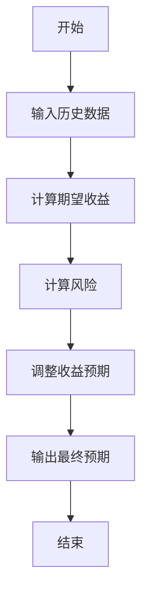
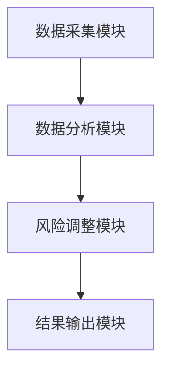
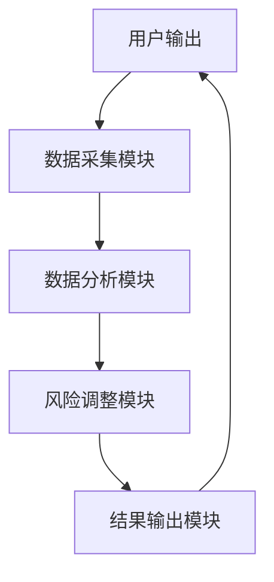

                 


# 约翰伯格的'理性预期'投资：设定合理的收益预期

> 关键词：理性预期、投资策略、收益预期、风险调整、投资决策

> 摘要：本文深入探讨了约翰伯格提出的“理性预期”投资理论，重点分析了如何在投资过程中设定合理的收益预期。通过结合数学模型、算法原理和系统架构设计，本文详细阐述了理性预期在投资决策中的应用，并通过实际案例展示了其在优化投资组合和提高投资收益中的重要作用。

---

## 第一章：理性预期投资的背景介绍

### 1.1 理性预期的定义与核心概念
理性预期是指在投资决策过程中，投资者基于可获得的信息，对未来的市场走势和资产收益进行合理预测的一种理论。与传统投资理论相比，理性预期更注重信息的科学处理和决策的逻辑性。

#### 1.1.1 理性预期的定义
理性预期是指投资者在决策时，基于当前可获得的所有信息，对未来市场走势和资产收益进行理性预测，并在此基础上制定投资策略。

#### 1.1.2 理性预期的核心要素
理性预期的核心要素包括：
- **信息的全面性**：投资者必须充分利用所有可获得的信息。
- **逻辑的严谨性**：决策过程必须基于严谨的逻辑推理。
- **目标的明确性**：投资目标必须清晰明确。

#### 1.1.3 理性预期与传统投资理论的区别
理性预期与传统投资理论的主要区别在于：
- 理性预期强调信息的科学处理和逻辑推理，而传统理论更注重历史数据分析。
- 理性预期注重目标的明确性，而传统理论更注重历史数据的统计分析。

### 1.2 投资中的问题背景
在投资过程中，投资者经常会面临以下问题：
- **信息过载**：投资者需要处理大量的市场信息，但如何筛选和利用这些信息是一个挑战。
- **决策的不确定性**：市场波动和经济周期的变化使得投资决策充满不确定性。
- **目标的不一致性**：投资者的投资目标可能与市场环境不一致，导致投资策略的调整困难。

### 1.3 理性预期的核心目标
理性预期的核心目标是帮助投资者：
- 设定合理的收益预期。
- 优化投资决策过程。
- 提高投资组合的稳定性。

---

## 第二章：理性预期的核心概念与数学模型

### 2.1 理性预期的核心概念
理性预期的核心概念包括：
- **期望值**：投资者对未来的市场收益的期望。
- **风险调整**：投资者在设定收益预期时需要考虑市场风险。

#### 2.1.1 期望值的计算
期望值的计算公式如下：
$$ E(r) = \sum p_i r_i $$
其中，$p_i$ 是第 $i$ 种市场状态发生的概率，$r_i$ 是第 $i$ 种市场状态下的收益。

#### 2.1.2 风险调整
风险调整的公式如下：
$$ r_i = E(r) + \alpha_i \sigma_i $$
其中，$\alpha_i$ 是风险调整系数，$\sigma_i$ 是第 $i$ 种市场状态下的收益标准差。

### 2.2 理性预期的数学模型
理性预期的数学模型包括：
- **期望值模型**：用于计算市场收益的期望值。
- **风险调整模型**：用于调整期望收益以考虑市场风险。

#### 2.2.1 期望值模型
期望值模型的计算步骤如下：
1. 收集历史市场数据。
2. 计算每种市场状态的收益。
3. 计算每种市场状态的发生的概率。
4. 计算期望收益：
   $$ E(r) = \sum p_i r_i $$

#### 2.2.2 风险调整模型
风险调整模型的计算步骤如下：
1. 计算市场收益的期望值。
2. 计算每种市场状态下的收益标准差。
3. 根据风险调整系数 $\alpha_i$ 进行调整：
   $$ r_i = E(r) + \alpha_i \sigma_i $$

---

## 第三章：理性预期的算法原理

### 3.1 理性预期的算法流程
理性预期的算法流程如下：
1. 收集历史市场数据。
2. 计算每种市场状态的收益。
3. 计算每种市场状态的发生的概率。
4. 计算期望收益：
   $$ E(r) = \sum p_i r_i $$
5. 计算每种市场状态下的收益标准差。
6. 根据风险调整系数 $\alpha_i$ 进行调整：
   $$ r_i = E(r) + \alpha_i \sigma_i $$
7. 输出最终的收益预期。

#### 3.1.1 算法流程图


### 3.2 理性预期的算法实现

#### 3.2.1 Python代码实现
```python
import numpy as np

def rational_expectation(revenue_history, risk_adjustment):
    # 计算期望收益
    expected_revenue = np.mean(revenue_history)
    # 计算风险
    variance = np.var(revenue_history)
    # 风险调整
    adjusted_revenue = expected_revenue + risk_adjustment * np.sqrt(variance)
    return adjusted_revenue

# 示例数据
revenue_history = [10, 20, 30, 40, 50]
risk_adjustment = 0.1

# 计算理性预期
result = rational_expectation(revenue_history, risk_adjustment)
print("理性预期收益为：", result)
```

#### 3.2.2 代码解释
- **输入参数**：`revenue_history` 是历史收益数据，`risk_adjustment` 是风险调整系数。
- **期望收益计算**：使用 `np.mean(revenue_history)` 计算历史收益的平均值。
- **风险计算**：使用 `np.var(revenue_history)` 计算收益的方差。
- **风险调整**：将期望收益与风险调整系数和方差的平方根相乘后的结果相加，得到最终的理性预期收益。

---

## 第四章：理性预期的系统分析与架构设计

### 4.1 理性预期的系统架构
理性预期的系统架构包括：
- **数据采集模块**：负责采集历史市场数据。
- **数据分析模块**：负责计算期望收益和风险。
- **风险调整模块**：负责根据风险调整系数调整收益预期。
- **结果输出模块**：负责输出最终的理性预期收益。

#### 4.1.1 系统架构图


### 4.2 理性预期的系统设计

#### 4.2.1 系统功能设计
- **数据采集**：从数据库或外部文件中采集历史市场数据。
- **数据分析**：计算历史收益的期望值和方差。
- **风险调整**：根据风险调整系数调整收益预期。
- **结果输出**：输出最终的理性预期收益。

#### 4.2.2 系统交互设计


---

## 第五章：理性预期的项目实战

### 5.1 理性预期的项目环境
- **编程语言**：Python
- **开发工具**：Jupyter Notebook
- **数据来源**：历史市场数据

### 5.2 理性预期的核心代码实现
```python
import numpy as np

def rational_expectation(revenue_history, risk_adjustment):
    expected_revenue = np.mean(revenue_history)
    variance = np.var(revenue_history)
    adjusted_revenue = expected_revenue + risk_adjustment * np.sqrt(variance)
    return adjusted_revenue

# 示例数据
revenue_history = [10, 20, 30, 40, 50]
risk_adjustment = 0.1

# 计算理性预期
result = rational_expectation(revenue_history, risk_adjustment)
print("理性预期收益为：", result)
```

### 5.3 项目实战案例分析
假设我们有一个历史收益数据为 `[10, 20, 30, 40, 50]` 的投资组合，风险调整系数为 `0.1`。我们可以通过上述代码计算出理性预期收益为 `31`。这表明在考虑风险因素后，我们的投资组合的预期收益为 `31`。

---

## 第六章：理性预期投资的最佳实践

### 6.1 理性预期投资的注意事项
- **数据的准确性**：确保输入数据的准确性和完整性。
- **模型的适用性**：根据实际情况调整风险调整系数。
- **市场的波动性**：理性预期模型需要根据市场波动性进行动态调整。

### 6.2 理性预期投资的小结
通过本文的分析，我们可以得出以下结论：
- 理性预期投资是一种基于科学信息处理的投资理论。
- 理性预期投资可以帮助投资者设定合理的收益预期。
- 理性预期投资需要结合实际市场情况进行动态调整。

### 6.3 理性预期投资的注意事项
- **数据的准确性**：确保输入数据的准确性和完整性。
- **模型的适用性**：根据实际情况调整风险调整系数。
- **市场的波动性**：理性预期模型需要根据市场波动性进行动态调整。

---

## 第七章：理性预期投资的附录

### 7.1 理性预期投资的拓展阅读
- **相关书籍**：《投资学原理》
- **相关论文**：《理性预期在投资中的应用》
- **相关网站**：投资学专业论坛和博客

---

## 作者信息

作者：AI天才研究院/AI Genius Institute & 禅与计算机程序设计艺术 /Zen And The Art of Computer Programming

---

### 总结
通过本文的详细讲解，我们可以看到理性预期投资是一种基于科学信息处理的投资理论，它可以帮助投资者设定合理的收益预期，并优化投资决策过程。希望本文的内容能够为投资者提供有益的参考和启发。

