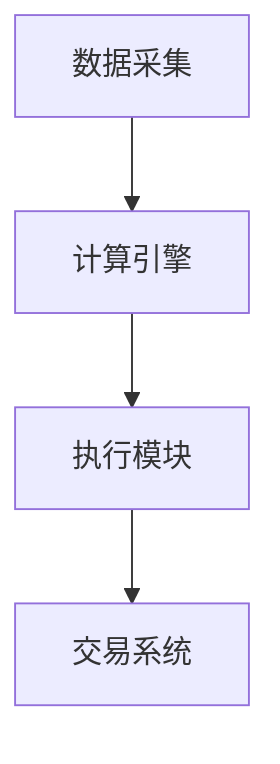
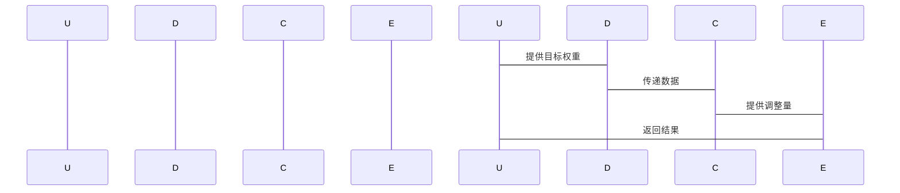

                 


# 约翰伯格的再平衡策略：维持投资组合的健康

## 关键词
再平衡策略, 投资组合管理, 资产配置, 投资组合健康, 约翰伯格投资理念

## 摘要
本文详细探讨了约翰伯格的再平衡策略，解释了其在投资组合管理中的重要性。通过分析策略的核心概念、数学模型、算法实现和系统架构，展示了如何通过再平衡维持投资组合的健康。文章还提供了实际案例和最佳实践建议，帮助读者理解如何在实际投资中应用这一策略。

---

# 第一部分：背景介绍

## 第1章：再平衡策略的背景与意义

### 1.1 投资组合健康的重要性

#### 1.1.1 投资组合健康的概念
投资组合健康指投资组合中的资产配置符合预定目标，确保投资组合的风险和收益在可控范围内。再平衡策略是维持投资组合健康的核心手段。

#### 1.1.2 再平衡策略的目标
再平衡策略旨在调整投资组合，使其恢复到目标配置，降低风险，优化收益。

#### 1.1.3 再平衡策略与投资收益的关系
通过再平衡，投资组合能够适应市场变化，避免过度偏离，从而稳定收益，降低风险。

### 1.2 约翰伯格投资理念的核心

#### 1.2.1 约翰伯格的投资哲学
约翰伯格强调长期投资和价值投资，认为再平衡策略是投资组合管理的关键。

#### 1.2.2 长期投资与价值投资的结合
再平衡策略在伯格的投资体系中，确保投资组合在市场波动中保持稳定。

#### 1.2.3 再平衡策略在伯格投资体系中的地位
再平衡策略是伯格投资体系的重要组成部分，确保投资组合的健康和长期收益。

---

## 第2章：再平衡策略的核心概念

### 2.1 资产配置与再平衡

#### 2.1.1 资产配置的基本原理
资产配置是根据投资目标分配资产比例，再平衡策略确保配置不变。

#### 2.1.2 再平衡策略的定义与分类
再平衡策略通过调整资产比例，恢复目标配置，分为定期和事件驱动两种类型。

#### 2.1.3 再平衡策略的触发条件
市场波动、资产表现差异、资金流入流出等触发再平衡。

### 2.2 再平衡策略的数学模型

#### 2.2.1 投资组合权重的计算公式
$$ w_i = \frac{a_i}{\sum_{j=1}^{n} a_j} $$
其中，\( w_i \) 是第 \( i \) 个资产的权重，\( a_i \) 是投资金额，\( n \) 是资产总数。

#### 2.2.2 理想权重与当前权重的对比
计算理想权重与当前权重的差异，确定调整量。

### 2.3 再平衡策略的实施步骤

#### 2.3.1 确定目标权重
根据投资策略设定目标权重。

#### 2.3.2 计算当前权重
计算当前各资产的权重。

#### 2.3.3 确定再平衡调整量
计算各资产的调整量，确保恢复目标权重。

#### 2.3.4 执行再平衡交易
根据调整量进行买卖操作，恢复目标配置。

---

## 第3章：再平衡策略的数学模型与算法

### 3.1 再平衡策略的数学模型

#### 3.1.1 投资组合的优化目标
最大化预期收益，最小化风险：
$$ \text{最大化} \quad \mu^T w - \frac{1}{2} w^T \Sigma w $$
$$ \text{约束} \quad \sum_{i=1}^{n} w_i = 1 $$

### 3.2 再平衡策略的算法实现

#### 3.2.1 确定目标权重
设定各资产的目标权重。

#### 3.2.2 计算当前权重
计算各资产的当前权重。

#### 3.2.3 确定再平衡调整量
计算偏离量，确定调整量。

#### 3.2.4 执行再平衡交易
根据调整量执行交易，恢复目标权重。

---

# 第二部分：算法实现与系统架构

## 第4章：再平衡策略的算法实现

### 4.1 算法实现步骤

#### 4.1.1 确定目标权重
设定各资产的目标权重。

#### 4.1.2 计算当前权重
计算各资产的当前权重。

#### 4.1.3 计算偏离
计算各资产的偏离量。

#### 4.1.4 确定调整量
计算各资产的调整量。

#### 4.1.5 执行交易
根据调整量进行买卖操作。

### 4.2 算法实现代码

#### 4.2.1 Python代码实现
```python
def calculate_adjustments(current_weights, target_weights):
    deviations = {asset: target - current for asset, target, current in zip(assets, target_weights, current_weights)}
    adjustments = {asset: (target / current - 1) * 100 for asset, target, current in zip(assets, target_weights, current_weights)}
    return deviations, adjustments
```

#### 4.2.2 代码解读
计算偏离和调整量，确定买卖方向和数量。

---

## 第5章：系统架构设计

### 5.1 系统功能设计

#### 5.1.1 数据采集模块
采集市场数据和投资组合信息。

#### 5.1.2 计算引擎模块
计算偏离和调整量。

#### 5.1.3 执行模块
根据调整量执行交易。

### 5.2 系统架构图


### 5.3 接口设计

#### 5.3.1 数据接口
定义数据接口，确保模块间数据传递。

#### 5.3.2 交易接口
定义交易接口，确保系统与交易系统交互。

### 5.4 交互流程图


---

# 第三部分：项目实战与最佳实践

## 第6章：项目实战

### 6.1 环境安装

#### 6.1.1 安装Python和相关库
安装Python和pandas、numpy等库。

### 6.2 核心代码实现

#### 6.2.1 计算偏离和调整量
```python
import pandas as pd
import numpy as np

assets = ['股票', '债券', '现金']
target_weights = [0.6, 0.3, 0.1]
current_weights = [0.5, 0.4, 0.1]

# 计算偏离
deviations = {asset: target - current for asset, target, current in zip(assets, target_weights, current_weights)}
# 计算调整量
adjustments = {asset: (target / current - 1) * 100 for asset, target, current in zip(assets, target_weights, current_weights)}
```

#### 6.2.2 代码解读
计算偏离和调整量，确定买卖方向和数量。

### 6.3 实际案例分析

#### 6.3.1 案例背景
假设投资组合初始权重为股票60%，债券30%，现金10%。

#### 6.3.2 市场变化
股票下跌10%，债券上涨5%，现金不变。

#### 6.3.3 计算偏离
股票权重变为54%，债券31.5%，现金14.5%。

#### 6.3.4 确定调整量
股票需增加6%，债券减少1.5%，卖出债券，买入股票。

### 6.4 项目小结
再平衡策略能够有效应对市场变化，维持目标配置。

## 第7章：最佳实践与注意事项

### 7.1 最佳实践

#### 7.1.1 定期检查
定期检查投资组合，及时调整。

#### 7.1.2 选择合适时机
在市场波动较大时进行再平衡，降低风险。

#### 7.1.3 考虑费用和税务影响
选择低费用和低税务影响的再平衡时机。

### 7.2 注意事项

#### 7.2.1 市场波动风险
再平衡可能导致短期亏损，需耐心等待市场恢复。

#### 7.2.2 资产流动性
确保资产具有足够的流动性，以便快速调整。

#### 7.2.3 税务影响
考虑税务影响，选择最优再平衡时机。

## 第8章：总结与拓展阅读

### 8.1 总结
再平衡策略是维持投资组合健康的关键，通过定期调整，确保投资组合符合目标配置。

### 8.2 拓展阅读
推荐相关书籍和文献，深入理解再平衡策略。

---

# 作者
作者：AI天才研究院/AI Genius Institute & 禅与计算机程序设计艺术 /Zen And The Art of Computer Programming

