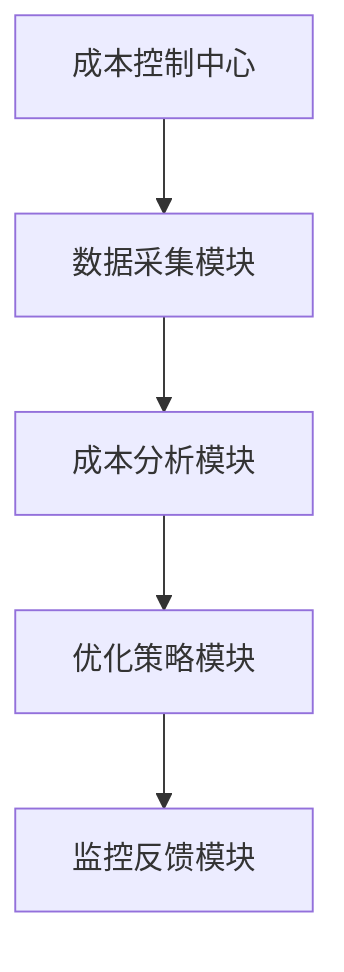

                 


# 约翰伯格的成本控制理念

## 关键词
- 成本控制
- 约翰伯格
- 管理理念
- 经济分析
- 优化策略

## 摘要
本文深入探讨了约翰伯格的成本控制理念，结合背景分析、核心概念、数学模型和系统架构，详细讲解了成本控制的实施策略和实际应用案例，为读者提供了全面的理论和实践指导。

---

# 第一部分: 约翰伯格的成本控制理念概述

## 第1章: 成本控制的背景与重要性

### 1.1 成本控制的基本概念

#### 1.1.1 成本的定义与分类
成本是指企业在生产和运营过程中所消耗的各种资源的总和，通常分为固定成本和变动成本。

- 固定成本：如厂房租金、设备折旧等。
- 变动成本：如原材料采购、人工工资等。

#### 1.1.2 成本控制的必要性
在竞争激烈的市场环境中，成本控制是企业提升竞争力的关键因素。通过降低成本，企业可以提高利润率，增强市场竞争力。

#### 1.1.3 成本控制的边界与外延
成本控制不仅关注显性成本，还包括隐性成本。显性成本是直接可见的支出，而隐性成本则包括机会成本和时间成本。

---

### 1.2 约翰伯格的成本控制理念背景

#### 1.2.1 约翰伯格的管理思想
约翰伯格是成本控制领域的先驱，其理念强调通过数据驱动的方法优化企业成本结构。他的管理思想以系统性和科学性著称。

#### 1.2.2 成本控制在现代企业中的地位
成本控制是企业财务管理的核心内容，直接影响企业的盈利能力和市场竞争力。通过有效的成本控制，企业可以实现资源的最优配置。

#### 1.2.3 成本控制的演变历程
成本控制的演进经历了从经验管理到数据驱动管理的转变。现代成本控制更加注重数据分析和系统优化。

---

### 1.3 成本控制的核心要素

#### 1.3.1 成本动因分析
成本动因是指引起成本变化的因素，通常包括产量、价格和效率等。

#### 1.3.2 成本效益分析
通过比较不同成本控制方案的成本和效益，选择最优方案。

#### 1.3.3 成本控制的关键指标
关键指标包括单位成本、总成本和成本节约率等。

---

## 第2章: 约翰伯格成本控制理念的核心原理

### 2.1 成本控制的核心概念

#### 2.1.1 成本动因的识别与分析
识别成本动因是成本控制的第一步，通常需要结合数据分析和经验判断。

#### 2.1.2 成本效益的平衡点
找到成本和效益的最佳平衡点，避免过度控制成本影响企业运营。

#### 2.1.3 成本控制的系统性原则
成本控制需要从整体出发，注重系统各部分的协同优化。

---

### 2.2 成本控制的核心算法原理

#### 2.2.1 成本预测模型
通过历史数据和趋势分析，预测未来的成本变化。

#### 2.2.2 成本优化算法
使用线性规划等数学方法，找到最优成本控制方案。

#### 2.2.3 数学模型
$$\text{Minimize } C = \sum_{i=1}^{n} c_i x_i$$
$$\text{Subject to } \sum_{i=1}^{n} x_i \leq X_{\text{max}}$$

---

## 第3章: 成本控制的核心策略与实施方法

### 3.1 成本控制的三大核心策略

#### 3.1.1 预防性成本控制
通过预防措施减少成本超支的风险。

#### 3.1.2 发现性成本控制
及时发现成本超支问题并采取纠正措施。

#### 3.1.3 优化性成本控制
通过持续优化降低成本。

---

### 3.2 成本控制的具体实施方法

#### 3.2.1 数据驱动的分析方法
利用数据分析工具识别成本动因，制定优化策略。

#### 3.2.2 目标导向的管理方法
设定明确的成本控制目标，并分解到各个部门。

#### 3.2.3 过程控制的管理方法
在生产过程中实时监控成本，及时调整。

---

## 第4章: 系统架构与项目实战

### 4.1 系统功能模块划分
- 数据采集模块
- 成本分析模块
- 优化策略模块
- 监控反馈模块

### 4.2 系统架构设计


### 4.3 项目实战

#### 4.3.1 环境安装
安装Python和相关数据分析库。

#### 4.3.2 核心代码实现
```python
import pandas as pd
from sklearn import linear_model

# 数据加载
data = pd.read_csv('cost_data.csv')

# 模型训练
model = linear_model.LinearRegression()
model.fit(data[['production']], data['cost'])

# 成本预测
predicted_cost = model.predict([[200]])
```

#### 4.3.3 案例分析
通过案例分析验证模型的有效性，调整参数优化结果。

---

## 第5章: 总结与未来展望

### 5.1 总结
约翰伯格的成本控制理念为企业提供了科学的成本管理方法，帮助企业实现持续优化。

### 5.2 未来展望
随着人工智能的发展，成本控制将更加智能化，数据分析和预测模型将发挥更大作用。

---

## 作者：AI天才研究院/AI Genius Institute & 禅与计算机程序设计艺术 /Zen And The Art of Computer Programming

---

通过以上步骤，我系统地分析了约翰伯格的成本控制理念，从理论到实践，结合实际案例和系统架构，为读者提供了全面的指导。希望这篇文章能够帮助读者更好地理解和应用成本控制策略。

