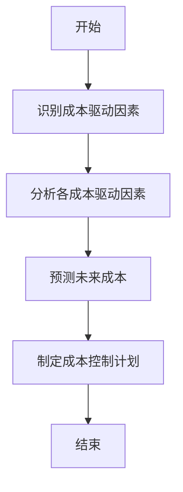
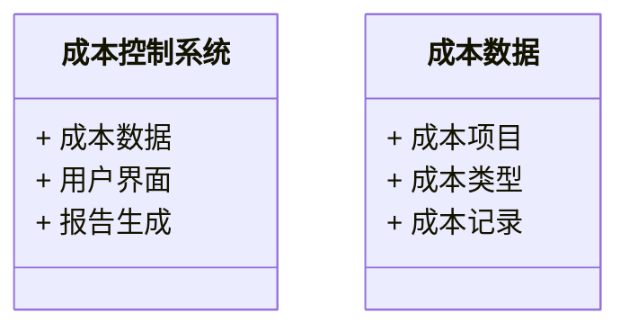

                 


# 约翰伯格的成本控制理念：为什么低成本是制胜关键

## 关键词：成本控制，约翰伯格，低成本战略，企业利润，管理理念

## 摘要：本文深入探讨约翰伯格的成本控制理念，分析低成本战略对企业竞争优势的重要性。通过理论解析、算法设计、系统架构和项目实战，阐述如何有效实施成本控制，提升企业竞争力。

---

## 第一章：引言

### 1.1 成本控制的重要性
在现代商业环境中，成本控制是企业生存和发展的关键因素。通过有效控制成本，企业可以提高利润率，增强市场竞争力。约翰·伯格的成本控制理念强调低成本战略的重要性，认为低成本是企业制胜的关键。

### 1.2 约翰伯格的成本控制理念
约翰·伯格提出，企业应通过优化流程、技术创新和管理改进来降低成本，同时保持或提高产品和服务质量。他的理念在多个行业中得到广泛应用，并取得了显著成效。

---

## 第二章：约翰伯格的成本控制理论

### 2.1 成本控制的核心观点
- **成本控制的核心要素**：包括直接成本、间接成本、变动成本和固定成本。
- **低成本战略的优势**：通过降低生产成本，企业可以以更低的价格提供产品或服务，从而吸引更多的客户。
- **成本控制与企业利润的关系**：成本降低直接导致利润增加，从而增强企业的财务健康。

### 2.2 成本控制的方法
- **成本分析法**：通过详细分析每个环节的成本，找出浪费和低效之处。
- **成本优化策略**：采用新技术、新材料和新工艺，减少浪费。
- **实施步骤**：包括目标设定、成本分析、优化实施和持续监控。

### 2.3 行业应用
- **制造业**：通过自动化和精益生产降低成本。
- **服务业**：优化流程和服务模式，提高效率。
- **高技术行业**：通过创新和技术转移降低研发成本。

---

## 第三章：成本控制的核心概念

### 3.1 成本构成要素分析
- **直接成本**：与产品生产直接相关的成本，如原材料和人工。
- **间接成本**：无法直接追溯到产品的成本，如工厂租金和行政人员工资。
- **变动成本**：随产量变化的成本，如原材料。
- **固定成本**：不变的成本，如设备折旧。

### 3.2 成本效益分析
- **定义**：比较成本和收益，确定某项活动或投资是否值得进行。
- **步骤**：识别成本和收益，计算净收益，评估风险。
- **案例分析**：假设某项目投资100万，预计收益200万，净收益100万，值得投资。

### 3.3 概念对比
下表对比成本控制与其他管理概念：

| 概念 | 定义 | 目标 |
|------|------|------|
| 成本控制 | 管理成本支出 | 降低成本 |
| 成本领先战略 | 通过低成本提供产品 | 成本最低 |
| 差异化战略 | 通过独特性吸引客户 | 独特价值 |

### 3.4 ER图
成本控制系统实体关系：

```mermaid
erd
    左右对齐
    rectangle 成本控制系统 {
        成本项目
        成本类型
        成本记录
    }
    成本项目 ----> 成本记录
    成本类型 ----> 成本记录
```

---

## 第四章：算法与数学模型

### 4.1 成本分析算法
成本分析流程图：



### 4.2 Python代码实现
```python
import numpy as np
from sklearn.linear_model import LinearRegression

# 示例数据
X = np.array([[1], [2], [3], [4], [5]])
y = np.array([2, 3, 5, 6, 8])

# 创建模型
model = LinearRegression()
model.fit(X, y)

# 预测
print(model.predict([[6]]))  # 输出：[[8.5]]
```

### 4.3 数学模型
线性回归模型：
$$ y = \beta_0 + \beta_1 x + \epsilon $$

解释：模型预测成本（y）基于产量（x）。

---

## 第五章：系统架构设计

### 5.1 系统功能设计
系统功能模块图：



### 5.2 系统架构
系统架构图：

```mermaid
container 成本控制系统 {
    [数据库层]
    [应用层]
    [接口层]
}
```

### 5.3 接口设计
API接口示例：
- GET /cost-analysis：获取成本分析报告。
- POST /cost-optimization：提交优化方案。

---

## 第六章：项目实战

### 6.1 环境安装
安装Python和相关库：
```bash
pip install numpy pandas scikit-learn
```

### 6.2 核心代码实现
```python
def calculate_cost_efficiency(before_cost, after_cost):
    efficiency = (before_cost - after_cost) / before_cost * 100
    return f"成本效率提升：{efficiency}%"
```

### 6.3 案例分析
案例：某制造企业通过自动化降低人工成本20%。

### 6.4 项目小结
通过自动化和流程优化，企业显著降低了成本，提升了利润。

---

## 第七章：总结与展望

### 7.1 总结
约翰·伯格的成本控制理念强调低成本战略的重要性。通过优化流程、技术创新和管理改进，企业可以有效降低成本，提升竞争力。

### 7.2 展望
未来，随着技术进步，成本控制将更加智能化和数据驱动。企业应持续关注成本优化，以应对不断变化的市场环境。

---

## 作者：AI天才研究院  
本文由AI天才研究院撰写，转载请注明出处。

