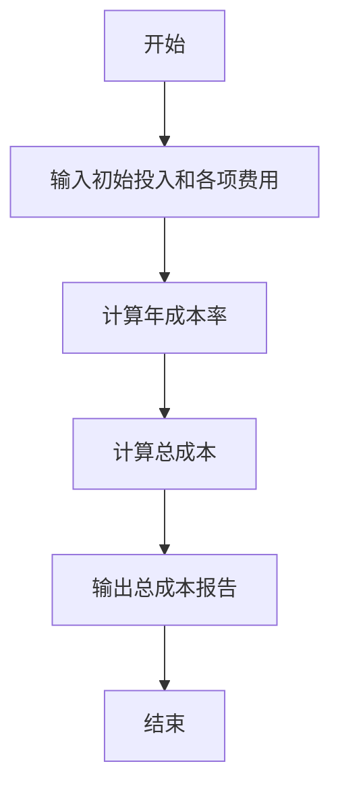
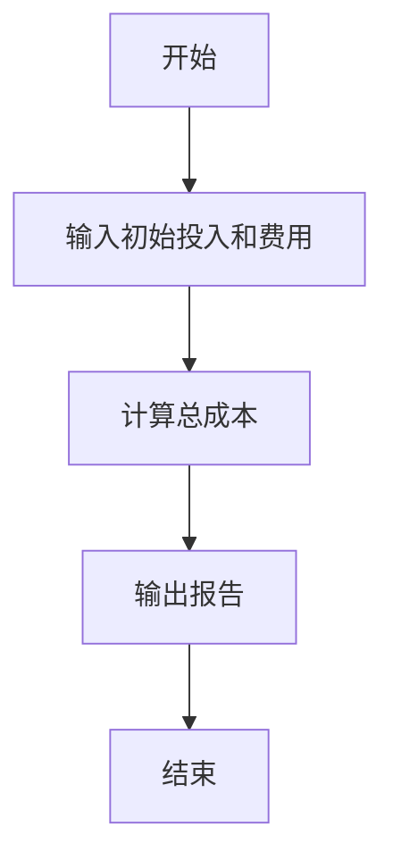
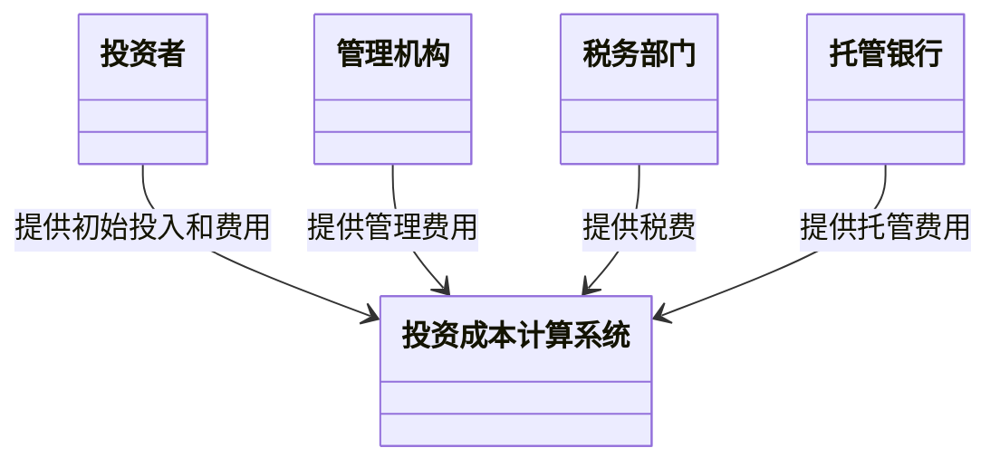
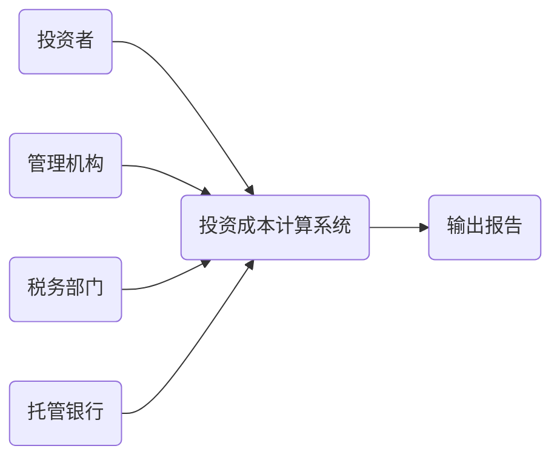

                 


```markdown
# 约翰伯格的投资成本计算

## 关键词：投资成本计算，约翰·伯格，投资决策，成本分析，风险管理

## 摘要：本文深入探讨了约翰·伯格的投资成本计算方法，分析了其核心概念、算法原理、数学模型，并结合系统架构和项目实战，详细阐述了其在投资决策中的应用。文章结构清晰，内容详实，旨在为投资者和金融从业者提供实用的理论与实践指导。

---

# 第一部分: 投资成本计算的背景与重要性

## 第1章: 投资成本计算的背景介绍

### 1.1 投资成本计算的重要性
#### 1.1.1 投资成本的概念与定义
投资成本是指在进行投资活动时所发生的各项费用，包括显性成本和隐性成本。显性成本如交易费用、税费，隐性成本如时间和精力的机会成本。

#### 1.1.2 投资成本计算在投资决策中的作用
投资成本计算是评估投资项目可行性的重要步骤，直接影响投资回报率（ROI）的计算。通过准确计算投资成本，投资者可以做出更明智的决策，优化资源配置。

#### 1.1.3 约翰·伯格投资成本计算方法的背景
约翰·伯格是著名投资家，其投资成本计算方法基于长期投资策略，强调分散投资和成本控制。他的方法在机构投资和个人投资领域具有重要影响。

### 1.2 约翰·伯格的背景与投资理念
#### 1.2.1 约翰·伯格的生平简介
约翰·伯格是美国知名投资家，创办先锋投资公司，被誉为指数基金之父。他倡导低成本、长期投资策略。

#### 1.2.2 伯格的投资哲学与方法
伯格强调分散投资和长期持有，认为长期来看，投资成本是影响收益的关键因素之一。

#### 1.2.3 伯格投资成本计算的核心思想
伯格认为，降低投资成本是提高投资回报的重要途径。他的计算方法注重长期费用累积对投资收益的影响。

### 1.3 投资成本计算的定义与意义
#### 1.3.1 投资成本的定义
投资成本包括初始投入和持续费用，如管理费、托管费等。

#### 1.3.2 投资成本计算的重要性
准确计算投资成本有助于评估投资项目的可行性，优化投资组合，提高整体收益。

#### 1.3.3 伯格投资成本计算方法的特点
伯格方法注重长期成本累积对收益的影响，强调低成本投资策略。

### 1.4 问题背景与解决方法
#### 1.4.1 投资成本计算的主要问题
传统方法往往忽略持续费用对长期收益的影响，导致决策失误。

#### 1.4.2 伯格方法如何解决这些问题
伯格通过详细计算各项费用，评估其对长期收益的影响，提供更准确的投资决策支持。

#### 1.4.3 投资成本计算的边界与外延
投资成本计算的边界包括显性和隐性成本，外延涉及风险管理、税务优化等。

# 第二部分: 投资成本计算的核心概念与联系

## 第2章: 投资成本计算的核心概念

### 2.1 投资成本计算的基本原理
#### 2.1.1 投资成本的构成要素
- 初始投入：如购买股票或基金的本金。
- 管理费用：如基金的管理费。
- 托管费用：如基金托管费。
- 税费：如资本利得税、印花税。

#### 2.1.2 投资成本计算的基本公式
$$ \text{总成本} = \text{初始投入} + \sum (\text{各项费用}) $$

#### 2.1.3 投资成本与投资收益的关系
投资成本影响净收益：$$ \text{净收益} = \text{总收益} - \text{总成本} $$

### 2.2 投资成本计算的模型与方法
#### 2.2.1 简单投资成本计算模型
$$ \text{年成本率} = \frac{\text{年成本}}{\text{初始投入}} \times 100\% $$

#### 2.2.2 复杂投资成本计算模型
$$ \text{总成本} = \text{初始投入} \times (1 + r)^n - \text{初始投入} $$
其中，r 是年成本率，n 是投资年数。

#### 2.2.3 伯格投资成本计算模型的特点
伯格模型综合考虑各项费用对长期收益的影响，采用动态计算方法。

### 2.3 投资成本计算的ER实体关系图
```mermaid
erDiagram
    actor 投资者
    actor 管理机构
    actor 税务部门
    actor 托管银行
    actor 投资成本计算系统
    投资者 --> 投资成本计算系统 : 提供初始投入和费用信息
    管理机构 --> 投资成本计算系统 : 提供管理费用
    税务部门 --> 投资成本计算系统 : 提供税费
    托管银行 --> 投资成本计算系统 : 提供托管费用
    投资成本计算系统 --> 投资者 : 提供总成本报告
```

# 第三部分: 投资成本计算的算法原理

## 第3章: 投资成本计算的算法原理

### 3.1 算法原理讲解
#### 3.1.1 算法流程图


#### 3.1.2 算法实现
```python
def calculate_investment_cost(initial_investment, fees):
    total_cost = initial_investment
    for fee in fees:
        total_cost += fee
    return total_cost
```

### 3.2 数学模型与公式
#### 3.2.1 成本与收益关系公式
$$ \text{净收益} = \text{总收益} - \text{总成本} $$

#### 3.2.2 风险评估模型
$$ \text{风险} = \frac{\text{总成本}}{\text{初始投入}} \times 100\% $$

### 3.3 详细解释与代码实现
#### 3.3.1 算法步骤
1. 输入初始投入和各项费用。
2. 计算年成本率。
3. 计算总成本。
4. 输出总成本报告。

#### 3.3.2 代码实现
```python
def calculate_investment_cost(initial_investment, annual_fees, years):
    total_cost = initial_investment
    for _ in range(years):
        total_cost += total_cost * annual_fees
    return total_cost
```

### 3.4 实际案例分析
假设初始投入为10,000美元，年费用率为2%，投资期限为5年。计算总成本：
$$ \text{总成本} = 10000 \times (1 + 0.02)^5 - 10000 = 11243.6 - 10000 = 1243.6 \text{美元} $$

# 第四部分: 投资成本计算的系统分析与架构设计

## 第4章: 投资成本计算的系统分析

### 4.1 系统功能设计
#### 4.1.1 功能模块
- 输入模块：接收初始投入和各项费用。
- 计算模块：执行成本计算。
- 输出模块：生成总成本报告。

#### 4.1.2 功能流程图


### 4.2 系统架构设计
#### 4.2.1 类图


#### 4.2.2 系统架构图


### 4.3 接口设计与交互
#### 4.3.1 接口设计
- 输入接口：接收投资者提供的初始投入和费用。
- 输出接口：生成总成本报告。

#### 4.3.2 交互序列图
```mermaid
graph LR
    A(投资者) --> B(投资成本计算系统): 提供初始投入和费用
    B --> C(计算结果)
    C --> D(输出报告)
```

# 第五部分: 投资成本计算的项目实战

## 第5章: 投资成本计算的项目实战

### 5.1 项目环境安装
安装Python和相关库，如numpy和pandas。

### 5.2 核心代码实现
```python
def calculate_investment_cost(initial_investment, annual_fees, years):
    total_cost = initial_investment
    for _ in range(years):
        total_cost += total_cost * annual_fees
    return total_cost
```

### 5.3 代码应用解读与分析
通过代码实现计算，分析费用对长期投资的影响。

### 5.4 实际案例分析
以具体案例分析，说明如何应用伯格方法进行成本计算。

### 5.5 项目小结
总结项目实施过程中的关键点和经验教训。

# 第六部分: 投资成本计算的最佳实践

## 第6章: 投资成本计算的最佳实践

### 6.1 小结
总结全文，强调投资成本计算的重要性。

### 6.2 注意事项
- 确保费用数据准确。
- 考虑费用对长期收益的影响。
- 定期更新和调整投资策略。

### 6.3 拓展阅读
推荐相关书籍和资源，如伯格的《投资之道》。

# 作者

作者：AI天才研究院/AI Genius Institute & 禅与计算机程序设计艺术 /Zen And The Art of Computer Programming
```

