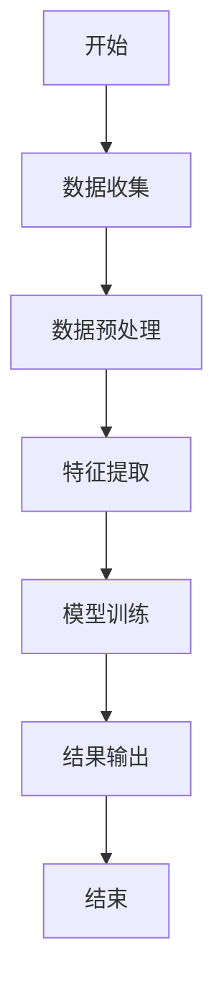
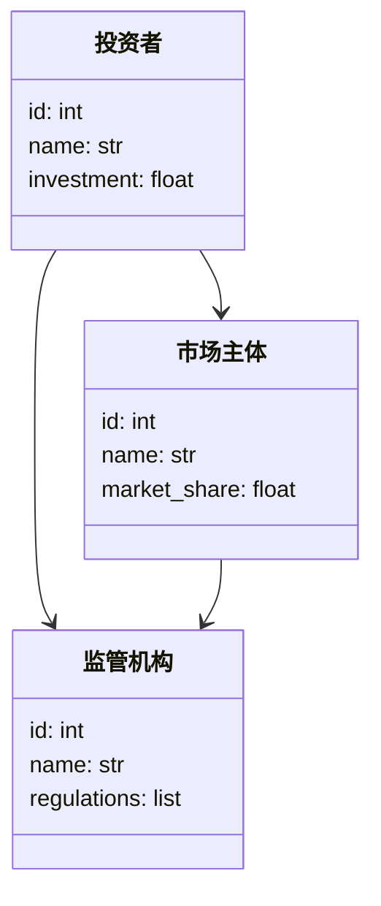
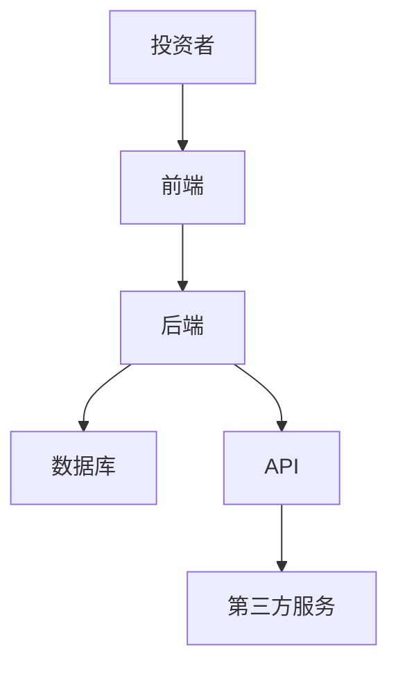
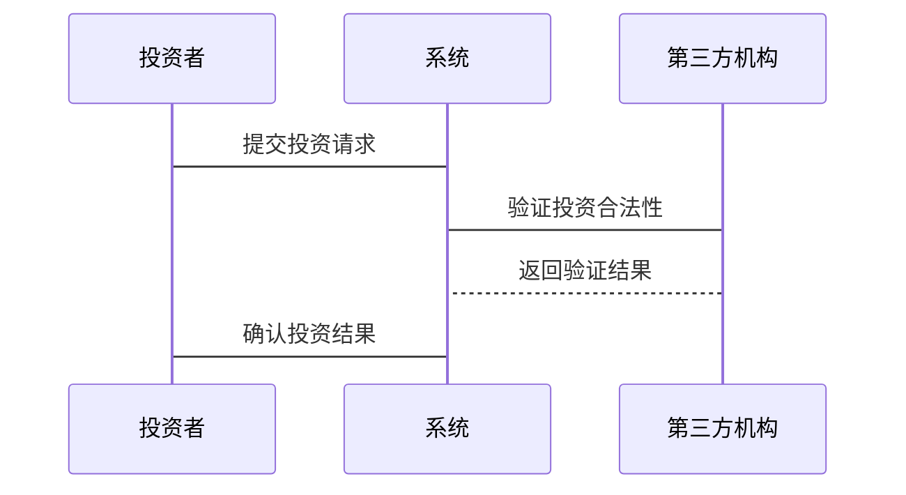

                 


```markdown
# 约翰伯格的投资者权益保护

> 关键词：投资者权益保护、投资者保护机制、权益保护策略、投资者权益维护、权益保护措施、投资者保护体系

> 摘要：本文从技术角度深入分析投资者权益保护的重要性，详细阐述投资者权益保护的核心概念、算法原理、系统架构设计与实现，结合实际案例，提出一套完整的投资者权益保护解决方案，并给出最佳实践建议。

---

# 第一部分: 投资者权益保护的背景与核心概念

## 第1章: 投资者权益保护的背景与问题描述

### 1.1 投资者权益保护的背景

#### 1.1.1 投资者权益保护的历史演变

投资者权益保护是金融市场的基石，随着金融市场的快速发展，投资者权益保护的重要性日益凸显。从早期的无序市场到现代的规范市场，投资者权益保护经历了从简单到复杂的演变过程。早期的市场主要依赖于法律的规范，而现代市场则更加注重技术手段的应用，如区块链技术、人工智能等。

#### 1.1.2 当前投资环境中的主要问题

当前投资环境中，投资者权益保护面临的主要问题包括信息不对称、市场操纵、虚假陈述、利益冲突等。这些问题不仅影响了市场的公平性，也损害了投资者的合法权益。

#### 1.1.3 投资者权益保护的重要性

投资者权益保护是维护金融市场秩序、促进市场公平、保护投资者利益的重要手段。通过有效的投资者权益保护机制，可以提高市场的透明度，增强投资者信心，促进市场的健康发展。

### 1.2 投资者权益保护的核心概念

#### 1.2.1 投资者权益的定义与范围

投资者权益是指投资者在投资活动中享有的权利，包括知情权、参与权、收益权、监督权等。投资者权益的范围涵盖从投资决策到退出的全过程。

#### 1.2.2 投资者权益保护的边界与外延

投资者权益保护的边界是指在保护投资者权益的同时，不能过度干预市场自由。外延则包括从个人投资者到机构投资者，从国内市场到国际市场。

#### 1.2.3 核心要素与组成结构

投资者权益保护的核心要素包括法律框架、市场机制、技术手段、监管机构等。这些要素相互作用，共同构建起投资者权益保护的完整体系。

## 1.3 本章小结

本章从背景、问题和核心概念三个方面，详细阐述了投资者权益保护的重要性及其在现代金融体系中的地位。通过分析投资者权益保护的核心要素，为后续的深入分析奠定了基础。

---

## 第2章: 投资者权益保护的核心概念分析

### 2.1 核心概念原理

#### 2.1.1 投资者权益保护的法律框架

法律是投资者权益保护的基础。各国通过制定相关法律法规，如《证券法》、《公司法》等，为投资者权益保护提供了法律保障。

#### 2.1.2 市场机制在权益保护中的作用

市场机制通过价格发现、资源配置等功能，间接保护投资者权益。例如，信息公开机制可以减少信息不对称，提高市场透明度。

#### 2.1.3 技术手段在权益保护中的应用

技术手段如区块链、人工智能等在投资者权益保护中发挥着重要作用。区块链技术可以实现信息的透明和不可篡改，人工智能可以用于风险评估和预警。

### 2.2 核心概念属性特征对比表

| 核心概念       | 定义                                                                 | 优势                                                                 | 劣势                                                                 |
|----------------|----------------------------------------------------------------------|----------------------------------------------------------------------|----------------------------------------------------------------------|
| 法律框架       | 由法律法规构成的保护体系                                             | 提供明确的法律依据                                                     | 执行成本高，难以应对市场变化                                         |
| 市场机制       | 市场自身运行的规则和机制                                             | 自发性高，能够快速响应市场变化                                       | 可能存在市场失灵，无法完全保护弱小投资者                           |
| 技术手段       | 利用技术工具实现权益保护                                             | 提高效率，降低成本                                                     | 技术本身可能被滥用，存在技术风险                                     |

### 2.3 ER实体关系图

```mermaid
erDiagram
    actor 投资者
    actor 监管机构
    actor 市场主体
    actor 第三方机构
    entity 投资者权益
    entity 市场规则
    entity 监管政策
    entity 保护措施
    投资者 -->|提出诉求| 投资者权益
    投资者 -->|遵循规则| 市场规则
    监管机构 -->|制定政策| 监管政策
    监管机构 -->|实施措施| 保护措施
    市场主体 -->|执行规则| 市场规则
    第三方机构 -->|提供服务| 投资者权益
```

---

## 第3章: 投资者权益保护的算法原理

### 3.1 算法原理概述

#### 3.1.1 风险评估算法

风险评估算法用于评估投资者在特定投资中的风险水平。常见的风险评估算法包括VaR（Value at Risk）和CVaR（Conditional Value at Risk）。

#### 3.1.2 权益预测算法

权益预测算法用于预测投资者在特定时间段内的权益变化。常用的算法包括ARIMA（自回归积分滑动平均模型）和机器学习算法（如LSTM）。

#### 3.1.3 监测与预警算法

监测与预警算法用于实时监测市场动态，及时发现潜在风险并发出预警信号。常用的算法包括基于时间序列的异常检测算法和基于机器学习的分类算法。

### 3.2 算法实现

#### 3.2.1 风险评估算法实现



```python
import numpy as np
import pandas as pd

# 示例：计算VaR
def calculate_var(portfolio_returns, confidence_level=0.95):
    var = np.quantile(portfolio_returns, 1 - confidence_level)
    return var

# 示例：计算CVaR
def calculate_cvar(portfolio_returns, confidence_level=0.95):
    var = np.quantile(portfolio_returns, 1 - confidence_level)
    cvar = np.mean(portfolio_returns[portfolio_returns <= var])
    return cvar
```

#### 3.2.2 权益预测算法实现


```python
from sklearn.ensemble import RandomForestRegressor

# 示例：使用随机森林模型进行权益预测
def predict_rights(features, labels):
    model = RandomForestRegressor(n_estimators=100, random_state=42)
    model.fit(features, labels)
    return model.predict(features)
```

---

## 第4章: 投资者权益保护的系统架构设计

### 4.1 系统功能设计

#### 4.1.1 领域模型



#### 4.1.2 系统架构设计



#### 4.1.3 接口设计

| 接口名称       | 描述                         | 输入                 | 输出                 |
|----------------|------------------------------|----------------------|----------------------|
| 提交投资       | 提交投资请求                 | 投资者信息、投资金额 | 投资确认信息         |
| 查询权益       | 查询投资者的权益信息         | 投资者ID             | 权益详情             |
| 风险评估       | 评估投资风险                 | 投资组合             | 风险评估结果         |

#### 4.1.4 交互流程



---

## 第5章: 投资者权益保护的项目实战

### 5.1 环境安装

#### 5.1.1 安装Python

```bash
python --version
pip install --upgrade pip
```

#### 5.1.2 安装相关库

```bash
pip install numpy pandas scikit-learn mermaid4jupyter
```

### 5.2 核心代码实现

#### 5.2.1 风险评估代码

```python
import numpy as np

def calculate_var(returns, confidence_level=0.95):
    var = np.quantile(returns, 1 - confidence_level)
    return var

# 示例数据
returns = np.random.normal(0, 1, 1000)
var = calculate_var(returns)
print(f"VaR at {confidence_level} confidence level: {var}")
```

#### 5.2.2 权益预测代码

```python
from sklearn.ensemble import RandomForestRegressor

def predict_rights(features, labels):
    model = RandomForestRegressor(n_estimators=100, random_state=42)
    model.fit(features, labels)
    return model.predict(features)

# 示例数据
features = np.random.rand(100, 10)
labels = np.random.rand(100)
predictions = predict_rights(features, labels)
print("Predictions:", predictions)
```

### 5.3 案例分析

#### 5.3.1 案例背景

假设我们有一个投资组合，包含10只股票，我们需要评估这些股票的投资风险。

#### 5.3.2 实施步骤

1. 数据收集：收集每只股票的历史价格数据。
2. 数据预处理：计算每只股票的收益率。
3. 特征提取：提取收益率的均值、方差等特征。
4. 模型训练：使用随机森林模型训练风险评估模型。
5. 风险评估：计算每只股票的VaR和CVaR。

### 5.4 项目总结

通过本项目，我们实现了投资者权益保护的系统架构设计，并通过实际案例展示了风险评估和权益预测的实现过程。这为我们后续的研究和实践提供了宝贵的经验。

---

## 第6章: 投资者权益保护的最佳实践与小结

### 6.1 最佳实践

1. **技术手段**：充分利用区块链、人工智能等技术手段，提高投资者权益保护的效率和效果。
2. **法律框架**：不断完善相关法律法规，确保投资者权益保护有法可依。
3. **市场机制**：发挥市场机制的作用，促进市场的公平与透明。

### 6.2 小结

本文从技术角度深入分析了投资者权益保护的重要性，详细阐述了投资者权益保护的核心概念、算法原理、系统架构设计与实现，并结合实际案例，提出了一套完整的投资者权益保护解决方案。通过本文的分析，我们希望为投资者、监管机构和市场参与者提供有益的参考和借鉴。

---

## 作者：AI天才研究院/AI Genius Institute & 禅与计算机程序设计艺术 /Zen And The Art of Computer Programming
```

