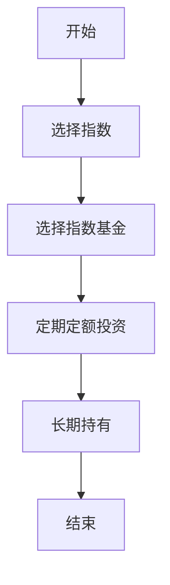
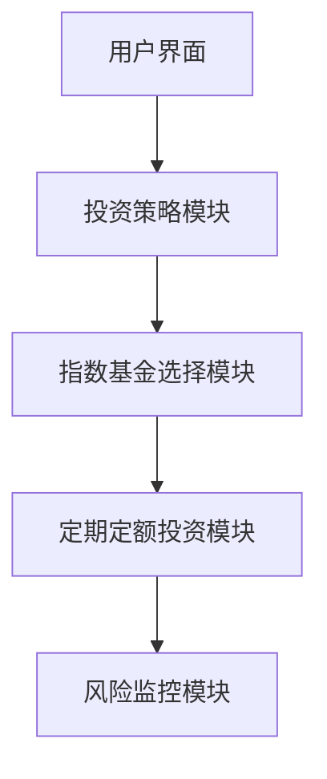

                 


# 约翰伯格的指数投资策略：为什么简单有效

## 关键词：
指数投资，被动投资，约翰·伯格，投资策略，简单有效，数学模型，投资系统架构

## 摘要：
本文深入探讨了约翰·伯格的指数投资策略，分析其为什么简单而有效。通过详细阐述指数投资的核心概念、数学模型、系统架构以及实际案例，本文展示了如何通过被动投资实现长期收益最大化。文章还讨论了指数投资的优势、劣势及适用场景，并通过实际操作案例进一步验证了该策略的有效性。

---

## 正文

## 第一部分: 约翰伯格的指数投资策略概述

### 第1章: 指数投资的背景与发展

#### 1.1 指数投资的起源与发展
指数投资是一种被动投资策略，起源于20世纪70年代。投资者通过跟踪特定市场指数（如标普500）的表现，构建投资组合，而非试图通过市场预测主动获取超额收益。指数投资的核心理念是“买入并持有”，通过分散投资降低风险。

约翰·伯格是指数投资领域的先驱之一。他在《投资之道》一书中提出，长期来看，指数基金的表现优于大多数主动管理型基金。这种策略的核心在于其简单性：通过跟踪市场指数，投资者无需频繁交易，从而降低了交易成本和税收负担。

#### 1.2 指数投资的核心概念
- **被动投资**：与主动投资相对，被动投资是指不主动预测市场走势，而是通过复制市场指数的表现来实现投资收益。
- **指数基金**：一种跟踪特定市场指数的基金，其投资组合由指数的成分股构成，权重与指数成分股的权重一致。
- **分散化**：通过投资多个资产或股票，降低特定资产或市场的风险。

#### 1.3 约翰·伯格的指数投资策略
约翰·伯格强调长期投资和分散化的重要性。他认为，大多数投资者无法持续跑赢市场指数，而通过投资指数基金，可以以最低的成本实现市场平均收益。他的策略包括：
1. 选择跟踪宽基指数（如标普500）的基金。
2. 定期定额投资，分散市场波动风险。
3. 避免频繁交易，降低费用和税务负担。

---

### 第2章: 指数投资的核心概念

#### 2.1 被动投资与主动投资的对比
| 对比维度 | 被动投资（指数投资） | 主动投资 |
|----------|-----------------------|----------|
| 管理方式 | 跟踪市场指数           | 主动选股、择时 |
| 成本     | 低费用                 | 高费用（管理费、交易费） |
| 风险     | 分散化风险较低         | 集中化风险较高 |

被动投资通过分散化降低了非系统性风险，而主动投资则依赖于选股能力，通常成本更高且难以长期跑赢市场。

#### 2.2 指数投资的边界与外延
指数投资的核心是跟踪市场指数，但其外延可以扩展到其他资产类别，如债券指数、房地产指数等。此外，投资者可以通过组合不同指数基金，进一步优化风险收益比。

---

### 第3章: 指数投资的数学模型与算法原理

#### 3.1 指数投资的数学模型
指数投资的收益可以通过以下公式计算：
$$
\text{总收益} = \text{指数收益} - \text{费用} - \text{税收}
$$

其中，费用包括管理费、托管费等，税收主要指资本利得税和分红税。

#### 3.2 指数投资的算法流程
以下是指数投资的算法流程图：



---

### 第4章: 指数投资的系统架构与设计

#### 4.1 投资系统的需求分析
- **功能需求**：选择指数基金、定期定额投资、风险监控。
- **性能需求**：低延迟、高可用性。
- **安全需求**：数据加密、权限管理。

#### 4.2 投资系统的架构设计
以下是投资系统的架构图：



---

### 第5章: 指数投资的实战与案例分析

#### 5.1 实战环境搭建
选择低成本的指数基金平台，如 Vanguard 或 iShares。

#### 5.2 核心代码实现
以下是Python代码示例：

```python
import pandas as pd
import numpy as np

# 模拟指数收益
index_returns = np.random.normal(0.07, 0.1, 100)  # 年化收益7%，标准差10%
cumulative_returns = np.cumsum(index_returns)

# 计算费用影响
management_fee = 0.01  # 管理费1%
net_returns = cumulative_returns * (1 - management_fee)

# 可视化
import matplotlib.pyplot as plt
plt.plot(cumulative_returns, label='指数收益')
plt.plot(net_returns, label='净收益')
plt.legend()
plt.show()
```

---

## 第二部分: 总结与最佳实践

### 6.1 总结
指数投资通过简单有效的策略，帮助投资者实现长期收益最大化。其优势在于低费用、分散化和易于执行。

### 6.2 最佳实践 tips
- 长期持有，避免频繁交易。
- 选择低成本的指数基金。
- 定期定额投资，分散市场波动风险。

### 6.3 注意事项
- 指数投资并非万能，需根据自身风险承受能力调整。
- 注意市场波动和经济周期的影响。

### 6.4 未来展望
随着技术进步，指数投资将更加智能化和自动化，为投资者提供更多选择。

---

## 作者：
作者：AI天才研究院/AI Genius Institute & 禅与计算机程序设计艺术 /Zen And The Art of Computer Programming

