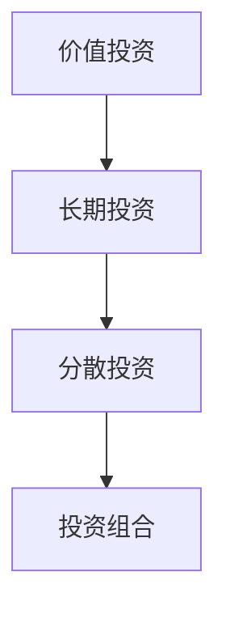
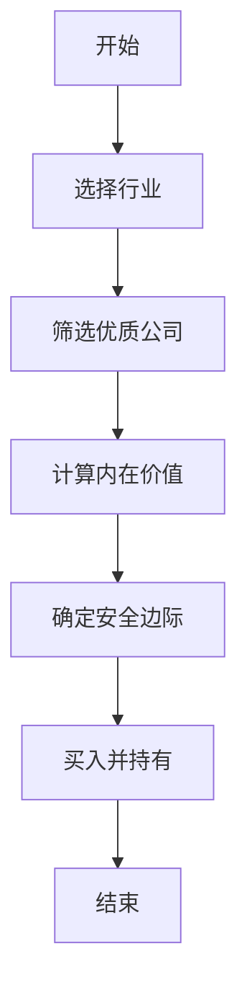
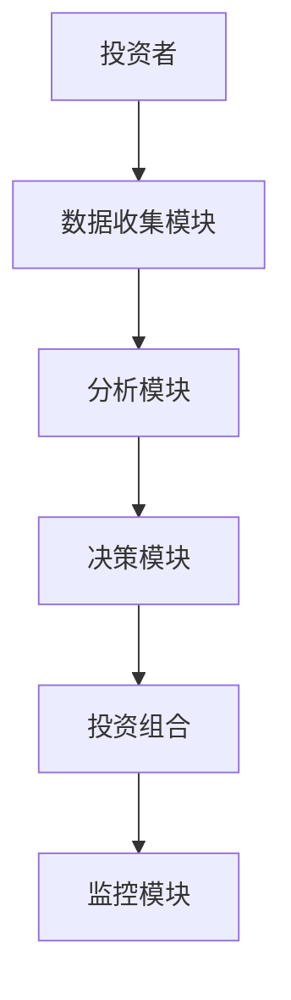

                 


# 约翰伯格的普通投资者观：为什么简单胜于复杂

## 关键词：
约翰·伯格，投资理念，简单投资，长期投资，价值投资，分散投资

## 摘要：
本文深入探讨了约翰·伯格的投资理念，特别是他倡导的简单投资策略。通过分析投资的核心概念、算法原理、数学模型以及系统架构，本文揭示了为何简单投资能够战胜复杂策略。结合实际案例和最佳实践，本文为投资者提供了清晰的指导，帮助他们在复杂市场中实现稳健收益。

---

# 目录大纲：《约翰伯格的普通投资者观：为什么简单胜于复杂》

## 第一部分：背景介绍

### 第1章：投资的基本概念

#### 1.1 投资的定义与分类
- 1.1.1 投资的定义
- 1.1.2 投资的分类与特点
- 1.1.3 投资与投机的区别

#### 1.2 约翰·伯格的生平与成就
- 1.2.1 伯格的早期经历
- 1.2.2 伯格的投资理念
- 1.2.3 伯格的著作与贡献

#### 1.3 简单投资策略的背景
- 1.3.1 现代投资理论的发展
- 1.3.2 复杂投资策略的局限性
- 1.3.3 简单策略的兴起

## 第二部分：核心概念与联系

### 第2章：投资的核心概念

#### 2.1 价值投资
- 2.1.1 价值投资的定义
- 2.1.2 价值投资的关键要素
- 2.1.3 价值投资与成长投资的区别

#### 2.2 长期投资
- 2.2.1 长期投资的定义
- 2.2.2 长期投资的优势
- 2.2.3 长期投资的风险管理

#### 2.3 分散投资
- 2.3.1 分散投资的定义
- 2.3.2 分散投资的原理
- 2.3.3 分散投资的实际应用

#### 2.4 投资组合
- 2.4.1 投资组合的定义
- 2.4.2 投资组合的优化
- 2.4.3 投资组合的风险与收益平衡

### 第3章：核心概念的联系

#### 3.1 投资概念属性对比表
| 概念 | 定义 | 优点 | 缺点 |
|------|------|------|------|
| 价值投资 | 以低于内在价值的价格买入优质股票 | 长期收益稳定 | 需要深入分析 |
| 长期投资 | 长期持有优质股票，避免频繁交易 | 减少交易成本和税费 | 短期内可能表现不佳 |
| 分散投资 | 将资金分配到不同的资产或股票以降低风险 | 降低整体风险 | 可能降低个别高收益机会 |

#### 3.2 价值投资与长期投资的联系
- 使用 Mermaid 绘制价值投资与长期投资的联系图


## 第三部分：算法原理讲解

### 第4章：简单投资策略的算法

#### 4.1 简单投资策略的步骤
- 选择优质股票
- 计算内在价值
- 确定合理价格
- 分散投资
- 定期调整

#### 4.2 价值投资算法
- 使用 Mermaid 绘制算法流程图


#### 4.3 数学模型
- 内在价值计算公式：
$$内在价值 = \frac{预期现金流}{折现率}$$

## 第四部分：系统分析与架构设计

### 第5章：投资系统的架构设计

#### 5.1 问题场景介绍
- 投资者如何在市场中实现稳健收益
- 系统目标：构建简单、高效的长期投资体系

#### 5.2 系统功能设计
- 数据收集模块：收集财务数据
- 分析模块：计算内在价值
- 决策模块：制定投资策略
- 监控模块：跟踪投资组合

#### 5.3 系统架构设计
- 使用 Mermaid 绘制系统架构图


## 第五部分：项目实战

### 第6章：构建一个简单的投资组合

#### 6.1 环境安装
- 数据分析工具：Python、Pandas、NumPy
- 财务分析工具：Morningstar、Yahoo Finance API

#### 6.2 核心实现源代码
```python
import pandas as pd
import numpy as np

def calculate_intrinsic_value(enterprise_value, free_cash_flow):
    return enterprise_value / free_cash_flow

# 示例数据
enterprise_value = 1000000
free_cash_flow = 100000

intrinsic_value = calculate_intrinsic_value(enterprise_value, free_cash_flow)
print(f"内在价值为：{intrinsic_value}")
```

#### 6.3 实际案例分析
- 选择行业：医疗保健
- 筛选公司：强生公司（Johnson & Johnson）
- 计算内在价值
- 构建投资组合

## 第六部分：最佳实践与小结

### 第7章：最佳实践

#### 7.1 投资理念总结
- 长期投资
- 价值投资
- 分散投资

#### 7.2 实际操作中的注意事项
- 避免情绪化决策
- 定期审视投资组合
- 保持耐心

#### 7.3 拓展阅读
- 《投资最重要的事》——约翰·伯格
- 《证券分析》——本杰明·格雷厄姆

---

# 小结

约翰·伯格的简单投资策略不仅是一种投资方法，更是一种生活智慧。通过坚持长期投资、价值投资和分散投资，投资者可以在复杂的市场中实现稳健的收益。本文通过详细的分析和实际案例，为读者提供了清晰的投资指导。

---

# 作者

作者：AI天才研究院/AI Genius Institute & 禅与计算机程序设计艺术 /Zen And The Art of Computer Programming

