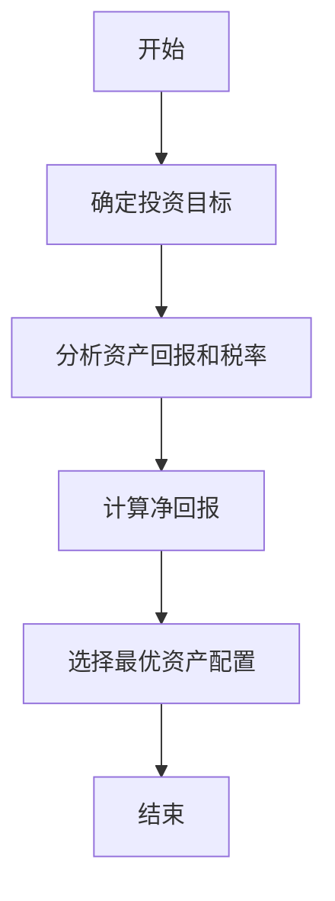
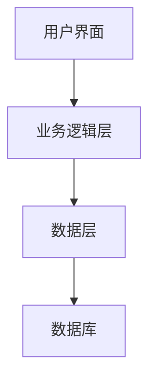
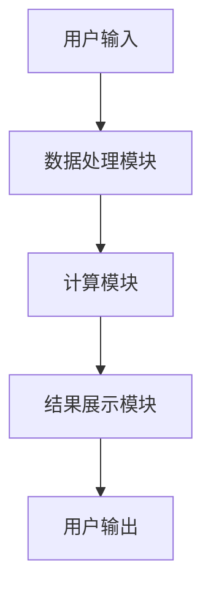

                 


# 约翰伯格的税收敏感投资：如何优化投资回报

> 关键词：税收敏感投资，投资回报，税务优化，投资策略，风险管理

> 摘要：  
税收敏感投资是一种通过优化税务规划来最大化投资回报的策略。本文从税收敏感投资的基本概念出发，结合数学模型和算法原理，详细分析其核心要素、实现路径和实际应用。通过对系统的全面分析与架构设计，结合项目实战案例，为投资者提供一套科学的投资优化方法。本文还探讨了税收敏感投资的未来发展趋势，为读者提供了全面的理论与实践指导。

---

# 第一部分：税收敏感投资概述

## 第1章：税收敏感投资的背景与概念

### 1.1 税收敏感投资的定义与背景
#### 1.1.1 投资与税收的基本概念
投资是通过配置资产以实现财富增值的过程，而税收则是影响投资回报的重要因素。税收敏感投资关注如何在投资决策中考虑税收因素，以优化整体收益。

#### 1.1.2 税收在投资中的重要性
税收是投资者无法忽视的成本。通过合理规划税收，投资者可以在不牺牲收益的前提下降低税负，从而实现更高的净回报。

#### 1.1.3 税收敏感投资的定义与特点
税收敏感投资是指在投资决策中，主动考虑税收因素，通过优化资产配置、选择合适的投资工具和时机，以最小化税收负担并最大化投资回报。

---

### 1.2 税收敏感投资的核心要素
#### 1.2.1 税收敏感投资的主体
- 投资者：个人或机构投资者。
- 资产：股票、债券、房地产、基金等。
- 税收政策：税率、税收优惠、税收递延等。

#### 1.2.2 税收敏感投资的目标
- 最小化税收负担。
- 最大化投资回报。
- 优化资产配置以适应税收政策。

#### 1.2.3 税收敏感投资的边界与外延
- 税收敏感投资的边界：在合法合规的前提下进行优化。
- 外延：涵盖不同资产类别和投资策略。

---

### 1.3 税收敏感投资的理论基础
#### 1.3.1 税收与投资回报的基本关系
税收是投资回报中的一个重要扣减项。合理规划税收可以显著提高净收益。

#### 1.3.2 税收对投资回报的影响
- 短期资本利得税：对短期内资产增值的征税。
- 长期资本利得税：对长期持有资产增值的优惠税率。
- 利息税：对投资收益中利息部分的征税。

#### 1.3.3 税收敏感投资的理论框架
- 税收中性假设：在最优情况下，税收对投资决策的影响最小。
- 税收相关性分析：评估不同投资策略下的税后回报。

---

### 1.4 税收敏感投资的现实意义
#### 1.4.1 税收敏感投资的经济价值
- 提高投资者的整体回报。
- 优化资源配置。
- 促进长期投资行为。

#### 1.4.2 税收敏感投资的社会影响
- 通过税收优惠鼓励长期投资。
- 促进经济的稳定增长。

#### 1.4.3 税收敏感投资的未来发展趋势
- 税收政策的复杂化：不同资产类别和地区的税收政策差异越来越大。
- 技术驱动的优化：通过大数据和人工智能优化税收敏感投资策略。

---

### 1.5 本章小结
本章从税收敏感投资的基本概念出发，详细阐述了其核心要素、理论基础和现实意义。通过理解税收在投资中的重要性，读者可以更好地把握税收敏感投资的核心逻辑。

---

## 第2章：税收敏感投资的核心概念与联系

### 2.1 税收敏感投资的核心概念
#### 2.1.1 税收敏感投资的定义
税收敏感投资是一种通过优化税务规划来实现更高净回报的投资策略。

#### 2.1.2 税收敏感投资的关键要素
- 投资目标：最大化税后回报。
- 税收政策：不同资产类别的税率差异。
- 投资期限：短期与长期投资的税收差异。

#### 2.1.3 税收敏感投资的实现路径
- 资产配置优化。
- 税收递延策略。
- 税收洼地利用。

---

### 2.2 税收敏感投资的核心原理
#### 2.2.1 税收与投资回报的关系
税收是影响投资回报的重要因素。通过合理规划税收，投资者可以在不牺牲收益的前提下降低税负。

#### 2.2.2 税收敏感投资的数学模型
- 投资回报公式：$$\text{净回报} = \text{毛回报} - \text{税金}$$
- 税金计算公式：$$\text{税金} = \text{毛回报} \times \text{税率}$$

#### 2.2.3 税收敏感投资的优化算法
- 确定投资目标和时间范围。
- 分析不同资产类别的税率差异。
- 选择最优的资产配置和投资工具。

---

### 2.3 税收敏感投资与相关概念的对比
#### 2.3.1 税收敏感投资与普通投资的区别
- 普通投资不考虑或较少考虑税收因素。
- 税收敏感投资将税收作为核心决策因素之一。

#### 2.3.2 税收敏感投资与税务规划的关系
- 税务规划是税收敏感投资的重要组成部分。
- 两者都关注如何通过合法手段降低税负。

#### 2.3.3 税收敏感投资与风险管理的联系
- 税收敏感投资需要考虑税收政策的变化。
- 风险管理是实现税收敏感投资目标的重要保障。

---

### 2.4 本章小结
本章详细分析了税收敏感投资的核心概念和相关联系，为读者提供了全面的理论基础。

---

## 第3章：税收敏感投资的数学模型与算法原理

### 3.1 税收敏感投资的数学模型
#### 3.1.1 投资回报的数学表达式
$$\text{净回报} = \text{毛回报} - \text{税金}$$

#### 3.1.2 税收对投资回报的影响公式
$$\text{税金} = \text{毛回报} \times \text{税率}$$

#### 3.1.3 税收敏感投资的优化目标函数
$$\max \text{净回报} = \max (\text{毛回报} - \text{税金})$$

---

### 3.2 税收敏感投资的算法原理
#### 3.2.1 税收敏感投资的优化算法
1. 确定投资目标和时间范围。
2. 分析不同资产类别的税率差异。
3. 选择最优的资产配置和投资工具。

#### 3.2.2 算法的实现步骤
- 数据收集：收集不同资产类别的税率信息。
- 模型构建：建立投资回报的数学模型。
- 优化计算：通过优化算法找到最优解。

#### 3.2.3 算法的收敛性分析
- 算法收敛性：算法是否能够找到全局最优解。
- 参数调整：调整算法参数以提高收敛速度。

---

### 3.3 税收敏感投资的算法实现
#### 3.3.1 算法的Python实现
```python
import numpy as np

def tax_sensitive_investment():
    # 模拟数据：资产回报率和税率
    assets = ['股票', '债券', '房地产']
    returns = [0.1, 0.05, 0.08]
    tax_rates = [0.15, 0.10, 0.05]
    
    # 计算净回报
    net_returns = [(r * (1 - t)) for r, t in zip(returns, tax_rates)]
    
    # 找到最优资产
    max_net_return = max(net_returns)
    optimal_asset = assets[net_returns.index(max_net_return)]
    
    return optimal_asset, max_net_return

optimal_asset, max_net_return = tax_sensitive_investment()
print(f"最优资产：{optimal_asset}，最大净回报：{max_net_return}")
```

#### 3.3.2 算法的流程图


---

### 3.4 本章小结
本章通过数学模型和算法原理，详细分析了税收敏感投资的实现路径，为读者提供了理论与实践相结合的指导。

---

## 第4章：税收敏感投资的系统分析与架构设计

### 4.1 税收敏感投资的系统分析
#### 4.1.1 系统分析的基本方法
- 需求分析：明确投资目标和约束条件。
- 功能分析：分析系统的功能模块。
- 数据分析：收集和处理相关数据。

#### 4.1.2 税收敏感投资的系统构成
- 数据层：资产数据、税率数据。
- 业务逻辑层：投资回报计算、税收优化。
- 用户界面层：结果展示与交互。

---

### 4.2 税收敏感投资的架构设计
#### 4.2.1 系统架构的总体设计


#### 4.2.2 系统架构的模块划分
- 数据处理模块：处理输入数据。
- 计算模块：计算净回报。
- 展示模块：展示结果。

#### 4.2.3 系统架构的交互设计


---

### 4.3 本章小结
本章通过系统分析与架构设计，为读者提供了税收敏感投资的整体视图。

---

## 第5章：税收敏感投资的项目实战

### 5.1 环境安装与配置
#### 5.1.1 环境需求
- Python 3.8 或更高版本。
- 安装必要的库：numpy、pandas、matplotlib。

#### 5.1.2 环境配置
```bash
pip install numpy pandas matplotlib
```

---

### 5.2 系统核心实现
#### 5.2.1 税收敏感投资的代码实现
```python
import numpy as np
import pandas as pd
import matplotlib.pyplot as plt

def calculate_tax_sensitive_investment(assets, returns, tax_rates):
    net_returns = [(r * (1 - t)) for r, t in zip(returns, tax_rates)]
    optimal_asset = assets[net_returns.index(max(net_returns))]
    return optimal_asset, max(net_returns)

assets = ['股票', '债券', '房地产']
returns = [0.1, 0.05, 0.08]
tax_rates = [0.15, 0.10, 0.05]

optimal_asset, max_net_return = calculate_tax_sensitive_investment(assets, returns, tax_rates)
print(f"最优资产：{optimal_asset}，最大净回报：{max_net_return}")
```

#### 5.2.2 代码实现解读
- 数据输入：资产列表、回报率和税率。
- 计算净回报：$$\text{净回报} = \text{毛回报} \times (1 - \text{税率})$$
- 输出结果：最优资产和最大净回报。

---

### 5.3 项目实战案例
#### 5.3.1 案例分析
假设投资者有三个资产选择：
- 股票：回报率10%，税率15%。
- 债券：回报率5%，税率10%。
- 房地产：回报率8%，税率5%。

通过计算，最优资产是房地产，最大净回报为8% × (1 - 5%) = 7.6%。

#### 5.3.2 实战总结
- 选择最优资产：房地产。
- 净回报：7.6%。

---

### 5.4 本章小结
本章通过项目实战，详细讲解了税收敏感投资的实现过程，为读者提供了实际操作的指南。

---

## 第6章：税收敏感投资的最佳实践与未来展望

### 6.1 最佳实践
#### 6.1.1 投资策略建议
- 长期投资：利用长期资本利得税的优惠税率。
- 资产配置：分散投资以降低风险。
- 税收递延：利用税收递延政策降低税负。

#### 6.1.2 风险管理
- 税收政策变化：关注税收政策的变化。
- 市场风险：合理分散投资以降低风险。

---

### 6.2 未来展望
#### 6.2.1 税收政策的变化
- 税收政策的复杂化：不同资产类别和地区的税率差异越来越大。
- 税收优惠的多样化：政府可能推出更多的税收优惠政策。

#### 6.2.2 技术驱动的优化
- 大数据与人工智能：通过大数据分析和人工智能优化税收敏感投资策略。
- 自动化投资工具：开发自动化投资工具以实现税收敏感投资。

---

### 6.3 本章小结
本章总结了税收敏感投资的最佳实践，并展望了其未来发展趋势，为读者提供了长期投资的指导。

---

## 作者信息

作者：AI天才研究院/AI Genius Institute & 禅与计算机程序设计艺术/Zen And The Art of Computer Programming

---

以上是《约翰伯格的税收敏感投资：如何优化投资回报》的技术博客文章目录大纲。

