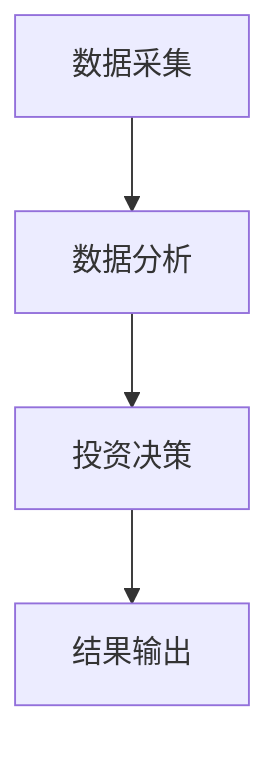
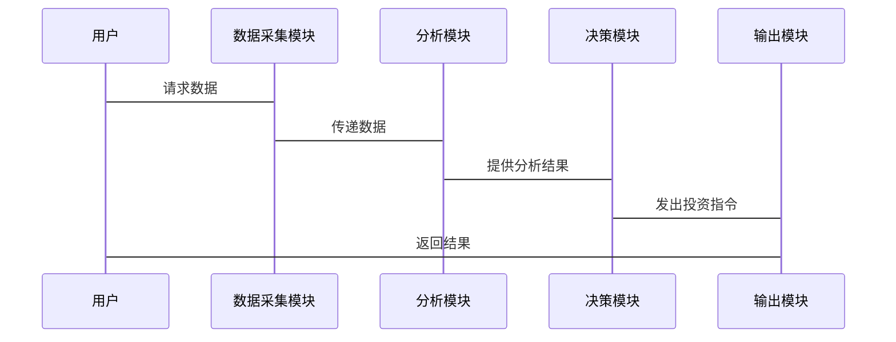

                 


# 约翰伯格的简单投资法则

> 关键词：投资法则，指数基金，分散投资，成本控制，长期投资，约翰·伯格

> 摘要：本文详细探讨了约翰·伯格的简单投资法则，分析了其核心理念、数学模型、系统设计及实际应用。通过理论与实践相结合，为读者提供了一个清晰的投资指导框架。

---

## 第一部分：投资基础与约翰·伯格的背景

### 第1章：投资的基本概念

#### 1.1 投资的基本定义
- **投资的定义**：投资是指将资金投入某个项目或资产，以期获得未来的收益。
- **投资的分类**：包括股票、债券、房地产等多种形式。
- **投资的目标**：追求资产增值，实现财富增长。
- **投资的风险**：与收益成正比，高风险可能带来高回报，但也可能损失本金。

#### 1.2 约翰·伯格的生平与投资理念
- **约翰·伯格的背景**：作为投资界的权威，伯格以其简单投资法则闻名。
- **伯格的投资哲学**：强调长期投资和分散投资的重要性。
- **伯格的贡献**：通过简化投资流程，降低了普通投资者的门槛。

#### 1.3 简单投资法则的核心概念
- **分散投资**：通过投资多种资产降低风险。
- **低成本**：选择低管理费的基金，减少费用对收益的影响。
- **长期视角**：耐心持有优质资产，避免频繁交易。

---

### 第2章：约翰·伯格的简单投资法则

#### 2.1 分散投资的重要性
- **分散投资的原理**：将资金分配到不同资产类别，降低特定资产的风险。
- **实际操作**：通过指数基金实现广泛分散。
- **风险控制**：分散投资能有效降低非系统性风险。

#### 2.2 成本控制的策略
- **成本控制的重要性**：高费用会侵蚀长期收益。
- **低成本基金的选择**：指数基金通常费用较低。
- **长期效果**：低成本投资能显著提升整体收益。

#### 2.3 长期投资的优势
- **长期视角的定义**：持有资产超过十年，忽略短期波动。
- **市场适应性**：长期投资能平滑市场波动。
- **心理挑战**：需要克服短期亏损的焦虑。

---

### 第3章：简单投资法则的数学模型

#### 3.1 投资回报的计算公式
- **简单回报计算**：$R = \frac{P_{final} - P_{initial}}{P_{initial}}$
- **复利计算**：$A = P(1 + r)^t$
- **回报对比分析**：通过公式比较不同投资策略的收益。

#### 3.2 投资风险的量化
- **风险定义**：波动性和损失的可能性。
- **数学模型**：使用标准差衡量风险。
- **风险与回报的平衡**：高风险可能带来高回报，但需谨慎评估。

#### 3.3 简单投资法则的数学证明
- **投资回报推导**：通过公式证明分散投资的有效性。
- **风险分析**：用统计方法验证长期投资的稳定性。

---

### 第4章：投资系统的架构设计

#### 4.1 系统模块划分
- **数据采集模块**：获取市场数据。
- **数据分析模块**：处理数据，计算回报率。
- **投资决策模块**：根据分析结果制定策略。

#### 4.2 系统架构图


#### 4.3 系统接口设计
- **数据接口**：API获取市场数据。
- **用户接口**：图形界面展示结果。
- **输出接口**：生成投资报告。

#### 4.4 系统交互序列图


---

## 第五部分：项目实战与案例分析

### 第5章：指数基金投资组合的构建

#### 5.1 环境安装
- 安装Python和必要的库（如pandas, numpy）。

#### 5.2 核心代码实现
```python
import pandas as pd
import numpy as np

# 示例数据
data = {'回报率': [0.05, 0.06, 0.04, 0.07, 0.03]}
df = pd.DataFrame(data)

# 计算平均回报率
average_return = df['回报率'].mean()

# 计算标准差
risk = df['回报率'].std()

print(f"平均回报率: {average_return}")
print(f"风险（标准差）: {risk}")
```

#### 5.3 案例分析
- 选择多个指数基金，计算其回报率和风险。
- 使用代码优化投资组合，降低整体风险。

---

## 第六部分：最佳实践与总结

### 6.1 投资建议
- 保持长期视角，避免短期波动影响决策。
- 选择低成本基金，降低费用侵蚀收益。
- 定期审视投资组合，根据市场变化调整配置。

### 6.2 注意事项
- 风险控制是投资成功的关键。
- 分散投资需合理配置，避免过度集中在某一资产类别。
- 避免频繁交易，减少交易成本和税收影响。

### 6.3 小结
约翰·伯格的简单投资法则提供了一个易于遵循的投资策略，通过分散投资、成本控制和长期视角，帮助投资者实现稳健的财富增长。

---

## 作者：AI天才研究院/AI Genius Institute & 禅与计算机程序设计艺术 /Zen And The Art of Computer Programming

