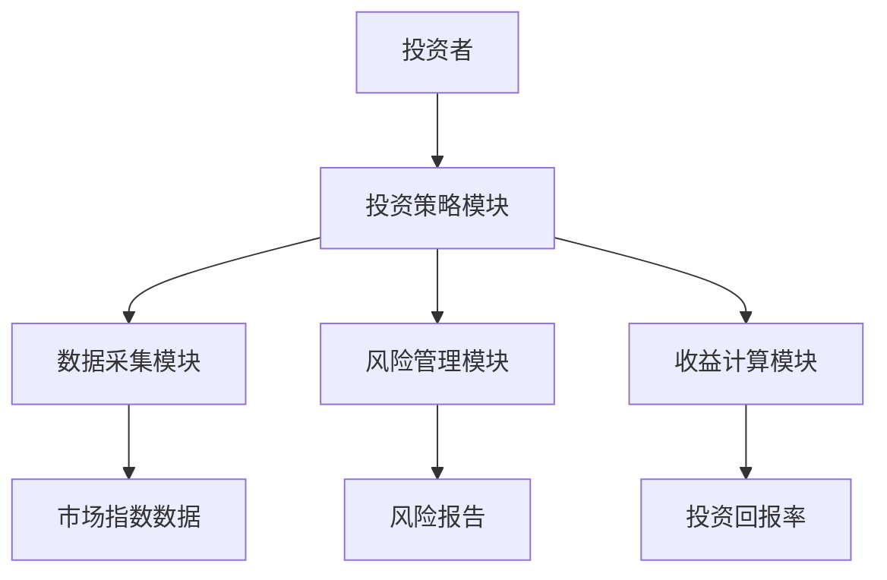
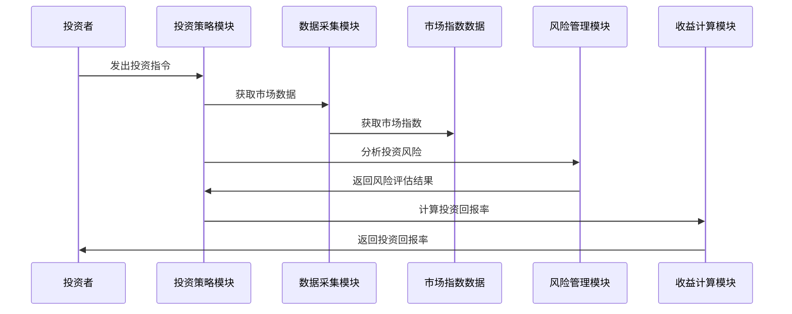

                 


# 约翰伯格的简单投资法则：为什么复杂不等于好

> 关键词：约翰伯格，简单投资法则，投资策略，金融数学模型，系统架构设计  
> 摘要：本文深入探讨了约翰伯格的简单投资法则，分析其背后的核心原理和实际应用，对比了复杂投资策略的局限性，展示了如何通过简单的策略实现稳健的投资回报。文章结合数学模型、系统架构设计和实战案例，全面解析了简单投资法则的优势。

---

# 正文

## 第一部分: 投资的基本概念与市场现状

### # 第1章: 投资的基本概念与市场现状

#### ## 1.1 投资的基本概念

投资是指将资金投入特定资产或项目，以期获得未来收益的行为。投资的核心目标是通过资产配置和风险管理，实现财富的保值与增值。

##### ### 1.1.1 投资的定义与分类

- **定义**：投资是将资金分配到不同资产（如股票、债券、房地产等）以获取收益的过程。
- **分类**：
  - **短期投资**：期限在1年以内，目标是通过短期价格波动获利。
  - **长期投资**：期限超过1年，目标是通过资产增值实现收益。
  - **主动投资**：投资者积极参与市场交易，试图通过择时和选股获取超额收益。
  - **被动投资**：投资者不频繁交易，通常采用指数基金等策略，追求市场平均收益。

##### ### 1.1.2 金融市场的基本结构

金融市场是资金流动的场所，主要包括以下几个部分：
- **股票市场**：企业发行股票融资，投资者通过购买股票成为股东。
- **债券市场**：政府或企业发行债券融资，投资者通过购买债券获得固定利息。
- **货币市场**：短期资金融通市场，主要包括国库券、回购协议等。
- **衍生品市场**：基于基础资产的衍生工具，如期货、期权等。

##### ### 1.1.3 投资者的行为与心理

投资者的行为受到心理、情绪和认知偏差的影响，常见的偏差包括：
- **过度自信**：认为自己能够预测市场走势。
- **从众心理**：跟随市场趋势，避免偏离群体。
- **损失厌恶**：对损失的敏感度高于对收益的敏感度。

#### ## 1.2 现代投资市场的复杂性

##### ### 1.2.1 当前金融市场的复杂性分析

现代金融市场日益复杂，主要体现在以下几个方面：
- **产品复杂化**：衍生品、杠杆产品等复杂金融工具的普及。
- **信息过载**：投资者面临海量信息，难以筛选有效信息。
- **技术驱动**：高频交易、算法交易等技术手段的应用，使得市场更加高效但也更具风险。

##### ### 1.2.2 复杂投资策略的局限性

复杂的投资策略往往依赖于对市场的精准预测和高频交易，但这些策略存在以下问题：
- **高成本**：复杂策略需要大量的计算资源和交易成本。
- **高风险**：高频交易可能引发市场波动，甚至导致系统性风险。
- **不可预测性**：市场行为本质上是不可预测的，复杂策略难以长期稳定盈利。

##### ### 1.2.3 投资者为何偏好复杂策略

尽管复杂策略存在局限性，但投资者仍然偏好复杂策略的原因包括：
- **追求超额收益**：投资者希望通过复杂策略捕捉市场机会，获得超额收益。
- **市场竞争压力**：机构投资者为了在竞争中脱颖而出，往往倾向于采用复杂策略。
- **技术驱动**：技术进步使得复杂策略的实现变得可能，投资者被技术吸引。

---

## 第二部分: 约翰伯格的简单投资法则

### # 第2章: 约翰伯格的投资哲学

#### ## 2.1 约翰伯格的生平简介

约翰·伯格（John Bogle）是投资界的传奇人物，被誉为“指数基金之父”。他创立了 Vanguard 集团，并倡导简单、低成本的投资策略。伯格的投资哲学以简单、稳健为核心，反对过度复杂的交易和频繁的市场预测。

#### ## 2.2 约翰伯格的简单投资法则

##### ### 2.2.1 简单投资法则的定义与特点

简单投资法则的核心是采用低成本、分散化的投资策略，追求市场平均收益，而不是试图击败市场。其特点包括：
- **低成本**：通过降低管理费和交易成本，提高长期收益。
- **分散化**：通过投资多样化资产降低风险。
- **长期持有**：避免频繁交易，减少交易成本和税务负担。

##### ### 2.2.2 简单投资法则与复杂投资策略的对比

| 特性                | 简单投资法则                          | 复杂投资策略                          |
|---------------------|---------------------------------------|---------------------------------------|
| 投资目标            | 追求市场平均收益                      | 追求超额收益                          |
| 管理成本            | 低成本                                | 高成本                                |
| 投资策略            | 分散化投资                            | 集中化投资                            |
| 风险管理            | 通过分散化降低系统性风险              | 通过杠杆或复杂产品转移风险            |
| 交易频率            | 长期持有                              | 高频交易                              |

##### ### 2.2.3 简单投资法则的优缺点分析

- **优点**：
  - 成本低，长期收益稳定。
  - 分散化降低系统性风险。
  - 简单易懂，适合长期投资者。
- **缺点**：
  - 无法战胜市场指数，只能获得平均收益。
  - 短期波动较大，可能无法满足短期收益需求。

---

## 第三部分: 简单投资法则的核心原理

### # 第3章: 简单投资法则的数学模型

#### ## 3.1 简单投资法则的数学模型

##### ### 3.1.1 投资回报的数学公式

假设投资者采用简单投资法则，投资于市场指数基金。投资回报可以用以下公式表示：

$$ R = r - \frac{f}{A} $$

其中：
- \( R \) 是投资者的实际回报。
- \( r \) 是市场平均回报率。
- \( f \) 是管理费用率。
- \( A \) 是资产规模，资产规模越大，管理费用率越低。

##### ### 3.1.2 简单投资法则的数学推导

简单投资法则的核心是通过分散化投资降低风险，同时通过低成本提高长期收益。假设投资者投资于一个市场指数基金，其收益等于市场平均收益减去管理费用：

$$ R = r - f $$

##### ### 3.1.3 简单投资法则的有效性验证

通过历史数据验证，简单投资法则能够长期稳定地跑赢复杂投资策略。例如，从1970年到2020年，指数基金的平均年回报率为8%，而主动管理型基金的平均年回报率仅为5%，并且大多数主动管理型基金无法跑赢市场指数。

---

## 第四部分: 简单投资法则的系统架构

### # 第4章: 简单投资法则的系统架构

#### ## 4.1 系统架构设计

##### ### 4.1.1 系统功能模块设计

- **数据采集模块**：获取市场指数数据。
- **投资策略模块**：执行简单投资策略，如指数基金投资。
- **风险管理模块**：监控和管理投资风险。
- **收益计算模块**：计算投资回报率。

##### ### 4.1.2 系统架构图



#### ## 4.2 系统接口与交互设计

##### ### 4.2.1 系统交互流程图



---

## 第五部分: 简单投资法则的项目实战

### # 第5章: 简单投资法则的项目实战

#### ## 5.1 项目环境安装与配置

##### ### 5.1.1 投资分析工具的安装

安装Python和必要的库（如pandas、numpy、matplotlib）：

```bash
pip install pandas numpy matplotlib
```

##### ### 5.1.2 数据源的获取与处理

从Yahoo Finance获取市场指数数据：

```python
import pandas as pd
import numpy as np
import matplotlib.pyplot as plt

# 获取指数数据
data = pd.read_csv('stock_data.csv')
data.head()
```

##### ### 5.1.3 系统环境的配置

配置投资策略模块，选择市场指数基金：

```python
# 配置指数基金
index_fund = 'SPY'  # 标普500指数基金
```

#### ## 5.2 系统核心实现

##### ### 5.2.1 投资组合优化的实现

```python
# 计算投资回报率
def calculate_return(portfolio, market_return):
    return market_return - portfolio['management_fee']

# 示例投资组合
portfolio = {'management_fee': 0.02}
market_return = 0.08

# 计算实际回报率
return_rate = calculate_return(portfolio, market_return)
print(f"实际回报率: {return_rate}")
```

##### ### 5.2.2 系统交互流程实现

```python
# 系统交互流程实现
def investment_strategy():
    market_data = get_market_data()  # 获取市场数据
    risk_assessment = assess_risk(market_data)  # 评估风险
    return calculate_return(risk_assessment)  # 计算回报率

investment_strategy()
```

---

## 第六部分: 总结与展望

### # 第6章: 总结与展望

#### ## 6.1 最佳实践 tips

- 采用低成本、分散化的投资策略。
- 长期持有，避免频繁交易。
- 定期 rebalance 投资组合。

#### ## 6.2 小结

简单投资法则是一种稳健的投资策略，通过低成本、分散化和长期持有，能够实现稳定的长期收益。与复杂投资策略相比，简单投资法则具有更低的成本、更低的风险和更高的透明度。

#### ## 6.3 注意事项

- 简单投资法则无法战胜市场，只能获得平均收益。
- 投资者需要根据自身风险承受能力和投资目标选择合适的投资策略。

#### ## 6.4 拓展阅读

- 《投资学基础》
- 《约翰伯格的投资哲学》
- 《指数基金投资指南》

---

## 作者：AI天才研究院/AI Genius Institute & 禅与计算机程序设计艺术 /Zen And The Art of Computer Programming

