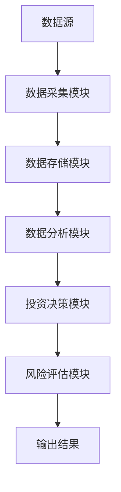

                 


# 《约翰伯格的被动投资优势》

> 关键词：被动投资，约翰·伯格，指数基金，风险管理，投资策略

> 摘要：被动投资是一种以长期持有指数基金等低成本工具来获取市场平均收益的投资策略，其核心理念是通过减少交易成本和管理费用，最大化投资收益。本文将深入分析被动投资的核心概念、数学模型、系统架构及实现，结合实际案例，探讨约翰·伯格在被动投资领域的贡献及其优势。

---

# 第一部分: 被动投资的背景与核心概念

## 第1章: 被动投资的起源与发展

### 1.1 被动投资的定义与背景

#### 1.1.1 什么是被动投资
被动投资是一种通过长期持有低成本投资工具（如指数基金）来获取市场平均收益的投资策略。其核心思想是通过减少交易成本和管理费用，最大化投资收益。

#### 1.1.2 被动投资的起源与演变
被动投资的起源可以追溯到20世纪70年代，当时美国 Vanguard 公司的创始人约翰·伯格（John C. Bogle）提出了指数基金的概念。随着技术的进步和市场的成熟，被动投资逐渐成为一种主流的投资策略。

#### 1.1.3 被动投资与主动投资的对比
| 对比维度       | 被动投资                     | 主动投资                     |
|----------------|-----------------------------|-----------------------------|
| 投资策略       | 追踪市场指数                 | 通过选股或择时主动管理收益   |
| 成本            | 低成本（管理费低）           | 高成本（管理费和交易费用高） |
| 风险            | 风险分散                    | 风险集中                    |
| 适合场景       | 长期稳定收益                | 短期高收益或特定市场机会     |

### 1.2 约翰·伯格的被动投资理念

#### 1.2.1 约翰·伯格的生平简介
约翰·伯格（John C. Bogle）是美国著名的金融家，被誉为“被动投资之父”。他是 Vanguard 集团的创始人，于1975年推出了全球第一只指数基金——Vanguard 指数基金。

#### 1.2.2 伯格对被动投资的贡献
约翰·伯格的贡献主要体现在以下几个方面：
1. **指数基金的创新**：伯格提出了指数基金的概念，认为通过长期持有指数基金可以实现市场平均收益。
2. **低成本策略**：伯格强调通过降低管理费用和交易成本来提高投资收益。
3. **投资者教育**：伯格致力于向普通投资者普及被动投资的理念，帮助他们实现财务自由。

#### 1.2.3 Vanguard 基金的创立与发展
Vanguard 是全球最大的指数基金提供商之一，其成功的核心在于低成本和透明化的运作模式。伯格的理念是“为投资者提供最低成本的产品”，从而实现最大化的净收益。

---

## 第2章: 被动投资的核心策略

### 2.1 指数基金与ETF

#### 2.1.1 指数基金的定义与特点
指数基金是一种以特定市场指数为标的的投资工具，其目标是复制指数的收益。指数基金的特点包括：
- 分散化投资：通过持有大量股票或债券来分散风险。
- 成本低：管理费用较低。
- 长期稳定收益：适合长期投资。

#### 2.1.2 ETF的运作机制与优势
ETF（交易所交易基金）是一种可以在交易所上市交易的开放式基金。其优势包括：
- 灵活性高：可以在交易时间内随时买卖。
- 成本低：ETF的管理费用较低。
- 市场流动性好：ETF的交易量大，易于变现。

#### 2.1.3 指数基金与ETF的对比分析
| 对比维度       | 指数基金                     | ETF                         |
|----------------|-----------------------------|-----------------------------|
| 交易方式       | 按净值申购或赎回             | 在交易所上市交易             |
| 成本            | 管理费用低                   | 管理费用低                   |
| 交易时间       | 非实时交易                   | 实时交易                     |
| 适合场景       | 长期定投                     | 灵活投资                     |

### 2.2 被动投资的组合管理

#### 2.2.1 投资组合的构建原则
被动投资的组合管理主要遵循以下原则：
1. **分散化投资**：通过持有多个资产类别来分散风险。
2. **长期持有**：避免频繁交易以减少成本。
3. **定期再平衡**：定期调整投资比例以保持目标配置。

#### 2.2.2 风险分散与资产配置
资产配置是被动投资的核心，通常包括股票、债券、现金等资产类别。通过合理配置，可以降低投资组合的整体风险。

#### 2.2.3 定期再平衡的重要性
再平衡是指定期调整投资组合的权重，以保持与目标配置的一致性。再平衡的频率通常为每年一次或每季度一次。

### 2.3 被动投资的数学模型与风险评估

#### 2.3.1 被动投资的收益模型
被动投资的收益可以通过以下公式计算：
$$ R_p = w_1 R_1 + w_2 R_2 + \ldots + w_n R_n $$
其中，$R_p$ 是投资组合的收益，$w_i$ 是各资产的权重，$R_i$ 是各资产的收益。

#### 2.3.2 风险与收益的衡量指标
1. **夏普比率**：衡量投资组合的风险调整后收益。
$$ \text{夏普比率} = \frac{E[R_p - R_f]}{\sigma_p} $$
其中，$E[R_p - R_f]$ 是投资组合的超额收益，$\sigma_p$ 是投资组合的波动率。

2. **信息比率**：衡量投资组合相对于其基准的表现。
$$ \text{信息比率} = \frac{Active Return}{Active Risk} $$

---

## 第3章: 被动投资的系统架构与实现

### 3.1 投资管理系统的架构设计

#### 3.1.1 系统功能模块划分
1. **数据采集模块**：采集市场数据（如股票价格、指数值等）。
2. **数据分析模块**：对市场数据进行分析，计算指数基金的收益和风险。
3. **投资决策模块**：根据分析结果生成投资建议。
4. **风险评估模块**：评估投资组合的风险并进行调整。

#### 3.1.2 系统架构设计


#### 3.1.3 系统接口设计
1. **数据接口**：用于与数据源（如金融数据库）进行交互。
2. **用户接口**：用于用户输入投资目标和查看投资建议。
3. **系统交互**：用户通过界面输入需求，系统根据需求生成投资组合。

### 3.2 系统实现与案例分析

#### 3.2.1 环境安装
需要安装以下工具：
1. Python 3.x
2. pandas、numpy、matplotlib 等数据分析库
3. Yahoo Finance API 或其他金融数据接口

#### 3.2.2 核心实现代码
```python
import pandas as pd
import numpy as np
import matplotlib.pyplot as plt
import yfinance as yf

# 下载指数数据
index_ticker = 'SPY'
data = yf.download(index_ticker, start='2000-01-01', end='2023-12-31')

# 计算指数收益
returns = data['Close'].pct_change().dropna()

# 计算指数基金的夏普比率
def sharpe_ratio(returns, risk_free_rate=0.01):
    excess_returns = returns - risk_free_rate
    return excess_returns.mean() / excess_returns.std()

sharpe = sharpe_ratio(returns)
print(f"夏普比率: {sharpe}")
```

#### 3.2.3 代码解读与分析
上述代码展示了如何通过Python下载指数数据并计算其夏普比率。夏普比率是衡量投资组合风险调整后收益的重要指标，值越高表示风险调整后的收益越高。

### 3.3 最佳实践与注意事项

#### 3.3.1 投资组合管理
1. **定期再平衡**：建议每年至少进行一次再平衡。
2. **成本控制**：选择低成本的指数基金或ETF。
3. **长期持有**：避免频繁交易以减少成本和税务负担。

#### 3.3.2 风险管理
1. **分散化投资**：通过持有多个资产类别来分散风险。
2. **定期评估**：根据市场变化和自身财务状况调整投资组合。

#### 3.3.3 拓展阅读
- 《The Intelligent Investor》——本杰明·格雷厄姆
- 《The Global Allocator's Guide to ETFs》——约翰·普林格

---

## 第4章: 项目实战与总结

### 4.1 环境搭建与代码实现
1. **环境搭建**：安装必要的Python库和数据接口。
2. **代码实现**：实现指数基金的收益计算和风险评估。

### 4.2 项目小结
通过本项目，我们了解了被动投资的核心理念和实现方法。指数基金和ETF是实现被动投资的重要工具，而夏普比率和信息比率是衡量投资组合收益与风险的重要指标。

### 4.3 注意事项
1. **市场风险**：指数基金的收益与市场整体表现相关，存在市场波动风险。
2. **流动性风险**：某些ETF或指数基金可能流动性较差，难以快速变现。
3. **税务问题**：不同国家或地区的税务政策不同，需注意税务规划。

---

# 小结

被动投资是一种简单有效的投资策略，通过长期持有低成本的指数基金可以实现市场平均收益。约翰·伯格的贡献不仅在于他创新了指数基金，还在于他推动了低成本投资工具的发展。对于普通投资者来说，被动投资是一种实现财务自由的有效途径。

---

# 作者

作者：AI天才研究院/AI Genius Institute & 禅与计算机程序设计艺术/Zen And The Art of Computer Programming

