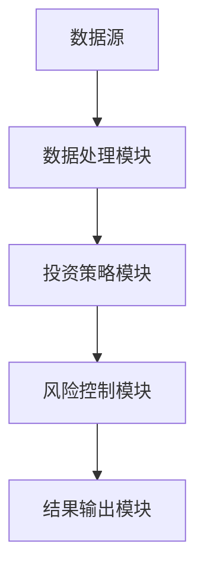
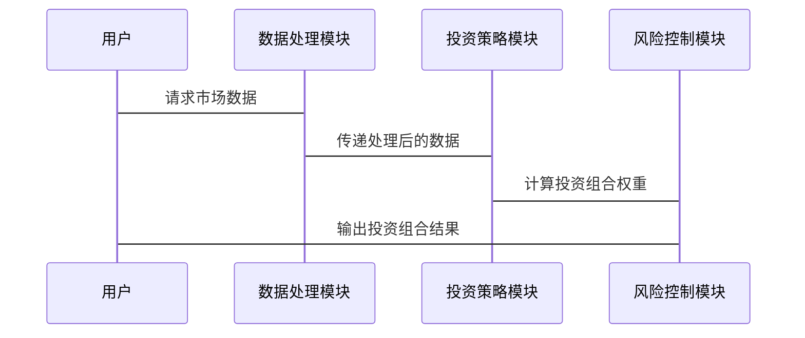

                 


# 约翰伯格的被动投资哲学：战胜市场的不可能任务

> 关键词：被动投资，约翰·伯格，指数基金，投资哲学，投资策略

> 摘要：本文深入探讨了约翰·伯格的被动投资哲学，分析了其在投资领域的核心理念、数学模型、系统架构以及实际应用。通过详细讲解被动投资的背景、原理、策略和系统实现，帮助读者理解被动投资的优势和局限性，以及如何在实际投资中应用这些策略。

---

# 第一部分: 被动投资的哲学基础

## 第1章: 被动投资的核心理念

### 1.1 被动投资的定义与特点

#### 1.1.1 被动投资的定义

被动投资是一种投资策略，其核心理念是通过复制一个特定的市场指数或其组成部分来进行投资。被动投资者相信市场是有效的，即市场的价格反映了所有可用的信息，因此试图通过主动管理超越市场的行为是徒劳的。

#### 1.1.2 被动投资的核心特点

被动投资具有以下几个核心特点：

1. **低成本**：被动投资通过跟踪指数，避免了主动管理中的高额费用。
2. **分散化**：通过投资整个市场或市场的一部分，被动投资降低了特定资产或行业的风险。
3. **长期持有**：被动投资者通常会长期持有投资组合，避免频繁交易带来的额外成本和税务负担。
4. **简单易懂**：被动投资策略基于数学模型，操作简单且易于理解。

#### 1.1.3 被动投资与主动投资的区别

被动投资与主动投资的主要区别如下：

| 对比维度 | 被动投资 | 主动投资 |
|----------|----------|----------|
| 投资目标 | 跟踪市场指数 | 超越市场指数 |
| 成本     | 低成本     | 高成本   |
| 风险     | 分散化     | 高风险   |
| 操作     | 被动跟踪   | 主动管理   |

### 1.2 约翰·伯格的被动投资哲学

#### 1.2.1 约翰·伯格的生平简介

约翰·伯格（John C. Bogle）是美国著名投资家，被誉为“指数基金之父”。他是 Vanguard 集团的创始人，致力于推动低成本指数基金的发展。伯格的投资理念深刻影响了现代投资理论和实践。

#### 1.2.2 伯格的被动投资理念

伯格的核心投资理念可以总结为以下几点：

1. **市场有效**：伯格认为市场是有效的，因此很难通过主动管理超越市场。
2. **低成本**：伯格强调低成本的重要性，认为费用是投资收益的敌人。
3. **分散化**：通过广泛分散投资，降低特定资产或行业的风险。
4. **长期持有**：伯格提倡长期投资，避免频繁交易带来的成本和税务负担。

#### 1.2.3 伯格对投资市场的贡献

伯格的贡献主要体现在以下几个方面：

1. **低成本指数基金**：伯格创立了 Vanguard，推出了一系列低成本指数基金，使普通投资者也能以低成本投资市场。
2. **投资教育**：伯格通过书籍和演讲，向投资者普及被动投资的理念，帮助投资者做出明智的投资决策。
3. **推动行业变革**：伯格的低成本策略迫使传统资产管理行业降低费用，提高了行业的整体效率。

---

## 第2章: 被动投资的数学模型与原理

### 2.1 被动投资的数学基础

#### 2.1.1 投资组合的期望收益与风险

在被动投资中，投资组合的期望收益和风险是两个关键指标。期望收益可以通过以下公式计算：

$$ E(r) = \sum p_i r_i $$

其中，\( p_i \) 是资产 \( i \) 的权重，\( r_i \) 是资产 \( i \) 的期望收益。

投资组合的风险（波动性）可以通过以下公式计算：

$$ \sigma^2 = \sum \sum p_i p_j \sigma_{ij} $$

其中，\( \sigma_{ij} \) 是资产 \( i \) 和 \( j \) 的协方差。

#### 2.1.2 投资组合的夏普比率

夏普比率衡量了投资组合相对于其风险的超额收益：

$$ \text{夏普比率} = \frac{E(r_p) - r_f}{\sigma_p} $$

其中，\( E(r_p) \) 是投资组合的期望收益，\( r_f \) 是无风险利率，\( \sigma_p \) 是投资组合的波动性。

#### 2.1.3 投资组合的波动率

波动率是衡量投资组合风险的重要指标，可以通过以下公式计算：

$$ \text{波动率} = \sqrt{\sum \sum p_i p_j \sigma_{ij}} $$

### 2.2 被动投资的数学公式

#### 2.2.1 投资组合的期望收益公式

$$ E(r) = \sum p_i r_i $$

#### 2.2.2 投资组合的方差公式

$$ \sigma^2 = \sum \sum p_i p_j \sigma_{ij} $$

### 2.3 被动投资与现代投资组合理论

#### 2.3.1 现代投资组合理论的起源

现代投资组合理论（MPT）由哈里·马科维茨在1952年提出，其核心是通过分散化降低投资组合的风险。

#### 2.3.2 被动投资与有效前沿的关系

被动投资的目标是复制市场指数，而有效前沿代表了在给定风险下收益最高的投资组合。被动投资通过跟踪市场指数，通常位于有效前沿附近。

#### 2.3.3 被动投资的风险调整收益分析

被动投资的风险调整收益可以通过夏普比率来衡量，反映了投资组合在承担一定风险后的超额收益能力。

---

# 第二部分: 被动投资的系统架构与实现

## 第3章: 被动投资的系统分析

### 3.1 系统功能模块设计

#### 3.1.1 数据获取模块

数据获取模块负责从数据源获取市场数据，包括股票价格、指数成分等。

#### 3.1.2 投资策略模块

投资策略模块根据被动投资策略计算投资组合的权重。

#### 3.1.3 风险控制模块

风险控制模块监控投资组合的风险，并在风险超过阈值时发出警报。

### 3.2 系统架构设计

#### 3.2.1 系统架构图（Mermaid）



#### 3.2.2 系统交互流程图（Mermaid）



### 3.3 系统接口设计

#### 3.3.1 数据接口设计

接口名称：获取市场数据

输入：无

输出：市场数据，包括指数成分、权重等。

#### 3.3.2 策略接口设计

接口名称：计算投资组合权重

输入：市场数据

输出：投资组合权重。

#### 3.3.3 风险控制接口设计

接口名称：监控投资组合风险

输入：投资组合权重、市场数据

输出：风险报告。

---

## 第4章: 被动投资的系统实现

### 4.1 环境安装与配置

#### 4.1.1 Python环境搭建

安装 Python 和必要的库，如 Pandas、NumPy 等。

#### 4.1.2 数据库安装与配置

安装关系型数据库，如 MySQL 或 PostgreSQL。

#### 4.1.3 开发工具安装

安装 IDE，如 PyCharm 或 VS Code。

### 4.2 系统核心实现代码

#### 4.2.1 数据获取代码

```python
import pandas as pd
data = pd.read_csv('market_data.csv')
```

#### 4.2.2 投资策略实现

```python
def calculate_weights(data):
    return data.returns.mean() / data.returns.mean().sum()
```

#### 4.2.3 风险控制实现

```python
def calculate_risk(weights, covariance_matrix):
    return np.sqrt(weights.T @ covariance_matrix @ weights)
```

---

# 第三部分: 项目实战

## 第5章: 被动投资的实战分析

### 5.1 环境配置

安装必要的 Python 库和工具。

### 5.2 核心代码实现

#### 5.2.1 数据获取与预处理

```python
import pandas as pd
data = pd.read_csv('market_data.csv')
data = data.dropna()
```

#### 5.2.2 投资组合权重计算

```python
from sklearn import preprocessing
normalized_data = preprocessing.normalize(data.returns)
weights = normalized_data.mean() / normalized_data.mean().sum()
```

#### 5.2.3 风险监控与报告

```python
import numpy as np
covariance_matrix = data.returns.cov()
risk = np.sqrt(weights.T @ covariance_matrix @ weights)
print(f"投资组合的波动率为：{risk}")
```

### 5.3 实际案例分析

以 S&P 500 指数为例，计算投资组合的权重和波动率。

---

# 第四部分: 总结与展望

## 第6章: 总结与展望

### 6.1 总结

被动投资是一种简单有效的投资策略，通过跟踪市场指数实现长期稳定的收益。约翰·伯格的被动投资哲学强调低成本、分散化和长期持有，为投资者提供了可靠的投资方法。

### 6.2 展望

随着技术的进步，被动投资将更加智能化和自动化。未来，投资者可以通过人工智能和大数据分析进一步优化投资组合，降低风险，提高收益。

---

作者：AI天才研究院/AI Genius Institute & 禅与计算机程序设计艺术 /Zen And The Art of Computer Programming

