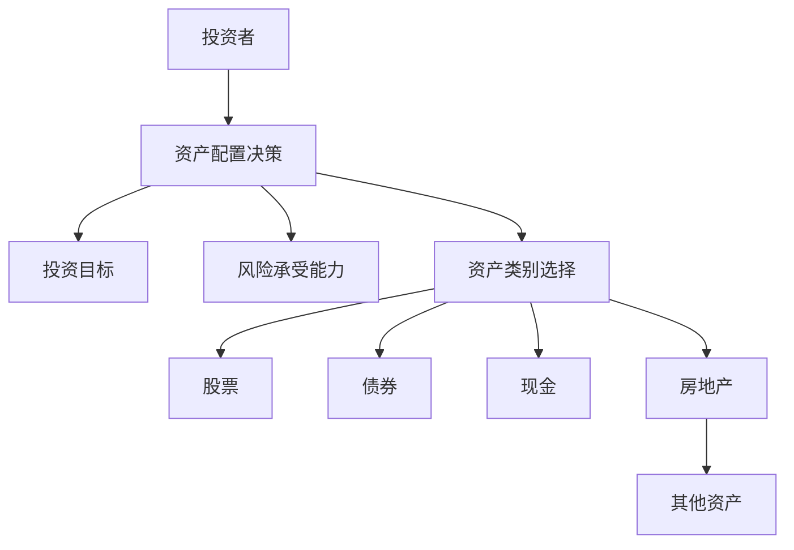
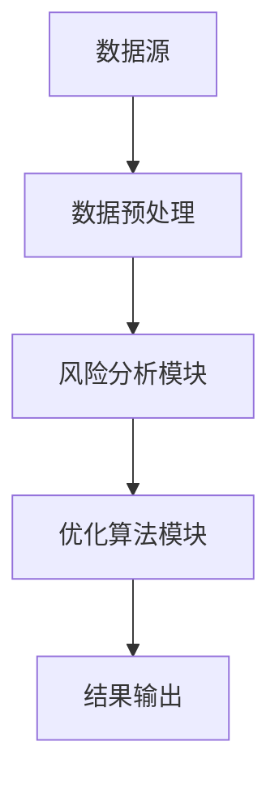

                 


# 约翰伯格的资产配置建议

## 关键词：资产配置，投资策略，约翰·伯格，风险控制，Python算法，投资组合优化

## 摘要：本文详细探讨了约翰·伯格的资产配置理论，分析其核心概念、算法原理，并通过实际案例展示如何运用这些方法进行资产配置。文章内容涵盖从理论到实践的全过程，包括系统设计、代码实现和结果解读，旨在为读者提供全面的资产配置指导。

---

# 第1章: 资产配置的背景与核心概念

## 1.1 资产配置的定义与重要性

### 1.1.1 什么是资产配置
资产配置是指将资金分配到不同的资产类别（如股票、债券、现金等）中，以实现投资目标和风险控制。它是投资组合管理的核心步骤。

### 1.1.2 资产配置的重要性
- **分散风险**：通过投资不同资产类别，降低特定资产的风险。
- **优化收益**：根据市场环境调整资产权重，提高整体收益。
- **长期稳定性**：帮助投资者在不同市场条件下保持投资组合的稳定性。

### 1.1.3 资产配置与其他投资策略的区别
- 资产配置注重全局配置，而个股选择注重局部优化。
- 资产配置关注长期目标，而短期交易关注短期收益。

## 1.2 资产配置的核心要素

### 1.2.1 投资目标与风险承受能力
- **投资目标**：明确投资目的，如保值、增值或收益。
- **风险承受能力**：根据投资者的财务状况和心理承受能力，确定风险容忍度。

### 1.2.2 资产类别与权重分配
- **资产类别**：股票、债券、现金、房地产等。
- **权重分配**：根据目标和风险承受能力，确定各类别在组合中的权重。

### 1.2.3 时间跨度与市场环境
- **时间跨度**：长期投资与短期投资策略不同。
- **市场环境**：根据经济周期调整资产配置。

## 1.3 资产配置的边界与外延

### 1.3.1 资产配置的边界条件
- 资产类别限制：如不投资某些高风险资产。
- 投资期限：明确投资的长短。
- 风险约束：设定最大可承受损失。

### 1.3.2 资产配置的外延领域
- 税务规划：优化税务负担。
- 资产流动性：确保资金流动性需求。

### 1.3.3 资产配置与税务规划的关系
合理配置资产可减少税务负担，如选择不同税率的资产类别。

## 1.4 资产配置的核心要素组成

### 1.4.1 投资目标的分解
- 明确收益目标和风险目标。
- 分解为不同资产类别的具体目标。

### 1.4.2 资产类别的选择
- 根据市场环境和目标选择合适的资产。
- 分析各类资产的风险收益比。

### 1.4.3 风险与收益的平衡
- 在收益与风险之间找到平衡点。
- 使用风险调整后的收益指标评估。

---

# 第2章: 资产配置的核心概念与联系

## 2.1 资产配置的理论基础

### 2.1.1 现代投资组合理论（MPT）
由哈里·马科维茨提出，强调通过分散投资降低风险。

### 2.1.2 均值-方差优化
通过优化资产组合的期望收益和方差，找到最优配置。

### 2.1.3 风险平价理论
将风险均匀分配到不同资产类别，减少尾部风险。

## 2.2 资产类别的特征对比

### 2.2.1 不同资产类别的收益与风险特征
| 资产类别 | 预期收益 | 风险水平 | 流动性 |
|----------|----------|----------|--------|
| 股票     | 高       | 高       | 低     |
| 债券     | 中       | 中       | 高     |
| 现金     | 低       | 低       | 高     |

### 2.2.2 股票、债券、现金等资产的对比
- 股票：高风险，高收益。
- 债券：中风险，稳定收益。
- 现金：低风险，低收益。

### 2.2.3 资产配置的决策依据
- 长期目标：选择高风险资产。
- 短期需求：保留流动性资产。

## 2.3 资产配置的ER实体关系图



---

# 第3章: 资产配置的算法原理

## 3.1 均值-方差优化算法

### 3.1.1 算法原理
目标是最小化投资组合的方差，同时满足收益目标。

### 3.1.2 算法步骤
1. 确定资产的预期收益和协方差矩阵。
2. 使用优化算法求解最优权重。

### 3.1.3 Python代码实现
```python
import numpy as np

def mean_variance_optimization(expected_returns, covariance_matrix, target_return):
    n = len(expected_returns)
    # 目标函数：最小化方差
    # 约束条件：收益等于目标，权重之和为1
    # 使用拉格朗日乘数法求解
    A = np.array([np.ones(n), np.zeros(n)])
    B = np.array([0, 1])
    C = np.array([target_return, 1])
    # 求解方程组
    x = np.linalg.lstsq(np.dot(A.T, A), np.dot(A.T, C), rcond=None)[0]
    return x
```

### 3.1.4 结果解读
通过调整权重，找到在目标收益下的最小方差组合。

---

## 3.2 风险平价优化算法

### 3.2.1 算法原理
将风险均匀分配到不同资产类别，降低尾部风险。

### 3.2.2 算法步骤
1. 计算各资产的风险贡献。
2. 调整权重，使风险贡献相等。

### 3.2.3 Python代码实现
```python
import numpy as np

def risk_parity_optimization(covariance_matrix):
    n = covariance_matrix.shape[0]
    # 计算风险贡献
    inv_cov = np.linalg.inv(covariance_matrix)
    risk_contribution = np.zeros(n)
    for i in range(n):
        risk_contribution[i] = (inv_cov[i].sum()) / (inv_cov.sum().sum())
    return risk_contribution
```

### 3.2.4 结果解读
通过风险平价，实现各资产的风险贡献均衡。

---

## 3.3 数学模型与公式

### 3.3.1 均值-方差优化的数学模型
$$
\min_{w} w^T \sigma^2 w \\
s.t. \\
w^T \mu = T \\
w^T 1 = 1
$$

其中，$w$ 是权重向量，$\sigma^2$ 是协方差矩阵，$\mu$ 是收益向量，$T$ 是目标收益。

### 3.3.2 风险平价优化的数学模型
$$
\min_{w} \sum_{i=1}^n (w_i \sigma_i)^2 \\
s.t. \\
w^T 1 = 1
$$

---

# 第4章: 资产配置的系统分析与架构设计方案

## 4.1 系统架构设计

### 4.1.1 系统功能设计
- 数据获取：获取各资产的历史数据。
- 风险分析：计算各资产的风险指标。
- 优化配置：应用优化算法生成配置方案。

### 4.1.2 系统架构图


## 4.2 系统接口设计
- 输入接口：接收市场数据和目标收益。
- 输出接口：提供最优配置建议。

---

# 第5章: 资产配置的项目实战

## 5.1 环境安装
安装必要的Python库，如numpy、pandas、scipy。

## 5.2 核心代码实现
实现均值-方差优化和风险平价优化的Python代码。

## 5.3 实际案例分析
以股票和债券为例，分析如何进行资产配置。

---

# 第6章: 最佳实践与总结

## 6.1 总结
资产配置是投资成功的关键，需结合理论与实践。

## 6.2 投资建议
根据市场环境和个人情况调整配置。

## 6.3 风险提示
市场波动和模型假设可能影响结果。

## 6.4 拓展阅读
推荐相关书籍和研究论文。

---

# 作者

作者：AI天才研究院 & 禅与计算机程序设计艺术

