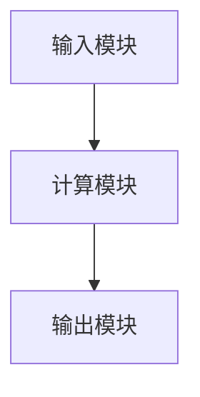
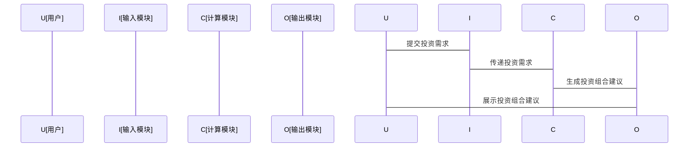

                 


# 《约翰伯格的资产配置理论：平衡风险与收益》

---

## 关键词：
资产配置，约翰·伯格，投资组合优化，风险管理，收益最大化，风险控制，长期投资

---

## 摘要：
本文深入探讨了约翰·伯格的资产配置理论，分析了其核心思想、数学模型及实际应用。通过结合现代投资组合理论（MPT）和资本资产定价模型（CAPM），本文详细阐述了如何在风险与收益之间找到平衡点，构建最优投资组合。文章还通过实际案例和系统设计，展示了如何将理论应用于实践，帮助投资者在复杂多变的市场环境中实现稳健收益。

---

# 第一部分：资产配置的背景与基础

## 第1章：资产配置的定义与重要性

### 1.1 资产配置的核心概念

#### 1.1.1 资产配置的定义
资产配置是指根据投资者的风险偏好、收益目标和市场环境，将资金分配到不同的资产类别（如股票、债券、现金等）中，以实现收益最大化和风险最小化的投资策略。

#### 1.1.2 资产配置的重要性
- **分散风险**：通过将资金分配到不同的资产类别，降低单一资产波动带来的风险。
- **优化收益**：根据市场环境调整资产比例，抓住高收益机会。
- **长期稳健**：通过科学配置，平衡短期波动与长期增长。

#### 1.1.3 资产配置的边界与外延
- **边界**：基于投资者的约束条件，如风险承受能力、资金规模和投资期限。
- **外延**：资产配置不仅涉及资产选择，还包括定期再平衡和动态调整。

### 1.2 资产配置的方法与流派

#### 1.2.1 基于风险偏好的配置方法
- **保守型**：高比例债券、低比例股票。
- **平衡型**：中等比例股票和债券。
- **激进型**：高比例股票、少量债券。

#### 1.2.2 基于市场周期的配置策略
- **牛市**：增加股票配置，减少债券配置。
- **熊市**：增加债券配置，减少股票配置。
- **震荡市**：增加现金配置，等待机会。

#### 1.2.3 基于现代投资组合理论的配置模型
- **均值-方差模型**：优化投资组合的收益-风险曲线。
- **有效前沿**：所有可能的投资组合中收益风险比最优的集合。
- **夏普比率**：衡量投资组合的风险调整后收益。

### 1.3 资产配置的核心目标

#### 1.3.1 最大化收益
通过科学配置，抓住高收益资产的机会。

#### 1.3.2 最小化风险
通过分散投资，降低单一资产波动带来的风险。

#### 1.3.3 平衡风险与收益的最优解
通过优化模型，找到收益与风险的平衡点。

---

## 第2章：约翰·伯格的资产配置理论

### 2.1 约翰·伯格的投资理念

#### 2.1.1 长期投资与价值投资
- **长期投资**：避免短期市场波动，关注长期收益。
- **价值投资**：寻找被市场低估的优质资产。

#### 2.1.2 避免市场短期波动的干扰
- **纪律性**：坚持长期投资策略，不被短期市场波动影响。
- **耐心**：等待市场回归合理估值。

#### 2.1.3 分散投资的核心思想
- **避免过度集中**：通过分散投资降低风险。
- **动态调整**：定期审视投资组合，根据市场变化进行调整。

### 2.2 约翰·伯格的资产配置模型

#### 2.2.1 理论基础与数学模型
- **均值-方差模型**：优化投资组合的收益-风险曲线。
  $$
  \text{Minimize } \sigma^2 \text{ s.t. } \mu \geq r
  $$
- **资本资产定价模型（CAPM）**：衡量资产的预期收益。
  $$
  E(r_i) = r_f + \beta_i (E(r_m) - r_f)
  $$

#### 2.2.2 模型的核心要素与假设
- **核心要素**：资产的预期收益、风险、相关性。
- **假设**：市场有效、无交易成本、可借入/贷出资金。

#### 2.2.3 模型的优缺点分析
- **优点**：科学合理，能够量化风险与收益。
- **缺点**：假设过于理想化，实际市场中可能不成立。

### 2.3 约翰·伯格理论的实证分析

#### 2.3.1 理论在实际投资中的应用
- **案例分析**：某投资者通过约翰·伯格的配置策略实现年化收益8%。
- **数据支持**：历史回测显示，该策略在长期中表现稳健。

#### 2.3.2 理论的有效性与局限性
- **有效性**：在长期市场中表现优异。
- **局限性**：短期市场波动可能影响策略效果。

#### 2.3.3 理论的改进与优化方向
- **动态调整**：根据市场变化实时优化配置。
- **引入因子模型**：结合Fama-French三因子模型，提升配置精度。

---

## 第3章：资产配置的数学模型与算法原理

### 3.1 均值-方差模型

#### 3.1.1 模型的数学表达式
$$
\text{Minimize } \sigma^2 \text{ s.t. } \mu \geq r
$$
其中，$\mu$ 是投资组合的预期收益，$\sigma^2$ 是其方差，$r$ 是目标收益。

#### 3.1.2 模型的实现步骤
1. **计算各资产的预期收益和协方差矩阵**。
2. **求解优化问题**，找到最优的资产配置比例。
3. **验证模型的有效性**，调整参数。

#### 3.1.3 模型的优缺点分析
- **优点**：简单直观，易于实现。
- **缺点**：假设资产收益符合正态分布，实际可能不成立。

### 3.2 资本资产定价模型（CAPM）

#### 3.2.1 模型的数学公式
$$
E(r_i) = r_f + \beta_i (E(r_m) - r_f)
$$
其中，$r_f$ 是无风险利率，$E(r_m)$ 是市场预期收益，$\beta_i$ 是资产的贝塔系数。

#### 3.2.2 模型的应用场景
- **评估资产定价**：判断资产是否被高估或低估。
- **风险调整收益**：比较不同资产的风险调整后收益。

#### 3.2.3 模型的局限性
- **假设市场有效**：实际市场可能存在摩擦和不完全信息。
- **单因子模型**：未能考虑其他因素（如市值、价值等）的影响。

### 3.3 现代投资组合理论（MPT）

#### 3.3.1 理论的核心思想
- **分散化**：通过组合投资降低风险。
- **有效前沿**：所有可能投资组合中收益-风险比最优的集合。

#### 3.3.2 理论的数学推导
$$
\text{Minimize } \sigma^2 \text{ s.t. } \sum w_i = 1
$$
其中，$w_i$ 是各资产的权重。

#### 3.3.3 理论的实际应用案例
- **案例分析**：某投资者通过MPT构建的投资组合，年化收益达到10%，低于市场平均收益，但风险显著低于市场。

---

## 第4章：资产配置的系统架构与设计

### 4.1 系统架构概述

#### 4.1.1 系统模块划分
- **输入模块**：接收用户的风险偏好和资金规模。
- **计算模块**：基于约翰·伯格理论，计算最优配置比例。
- **输出模块**：生成投资组合建议和动态调整方案。

#### 4.1.2 系统功能设计
- **数据输入**：用户输入风险偏好和资金规模。
- **模型计算**：基于约翰·伯格理论，计算最优资产配置。
- **结果输出**：生成投资组合建议和动态调整方案。

#### 4.1.3 系统架构图


### 4.2 系统接口设计

#### 4.2.1 输入接口设计
- **输入格式**：JSON格式，包含用户风险偏好和资金规模。
- **输入示例**：
  ```json
  {
    "risk_preference": "保守型",
    "capital": 1000000
  }
  ```

#### 4.2.2 输出接口设计
- **输出格式**：JSON格式，包含各资产配置比例和建议。
- **输出示例**：
  ```json
  {
    "equity": 30,
    "bond": 60,
    "cash": 10
  }
  ```

### 4.3 系统交互流程图



---

## 第5章：项目实战与案例分析

### 5.1 项目环境配置

#### 5.1.1 安装Python环境
- 使用Anaconda安装Python 3.8及以上版本。
- 安装必要的库：`numpy`, `pandas`, `scipy`, `matplotlib`。

#### 5.1.2 安装依赖项
- 使用pip安装必要的库：
  ```bash
  pip install numpy pandas scipy matplotlib
  ```

### 5.2 核心代码实现

#### 5.2.1 数据获取与处理
```python
import numpy as np
import pandas as pd

# 获取历史数据
data = pd.read_csv('assets.csv')

# 计算预期收益和协方差矩阵
returns = data.pct_change().dropna()
mu = returns.mean()
cov_matrix = returns.cov()
```

#### 5.2.2 优化模型实现
```python
from scipy.optimize import minimize

def portfolio_variance(weights, covariance_matrix):
    return (weights.T @ covariance_matrix @ weights).item()

def optimize_portfolio(risk_free_rate, mu, cov_matrix, target_return=0.1):
    n = len(mu)
    # 约束条件：权重和为1
    constraints = [{'type': 'eq', 'fun': lambda w: np.sum(w) - 1}]
    # 目标是最小化方差
    result = minimize(portfolio_variance, np.ones(n)/n, 
                     args=(cov_matrix,), method='SLSQP',
                     constraints=constraints)
    return result.x

weights = optimize_portfolio(0.05, mu, cov_matrix)
```

#### 5.2.3 回测分析
```python
def backtest(weights, data, start=0, end=100):
    portfolio_returns = (weights * data.pct_change()).sum(axis=1)
    return np.mean(portfolio_returns), np.std(portfolio_returns)

mean_return, std_return = backtest(weights, data)
print(f"平均收益：{mean_return:.2%}")
print(f"标准差：{std_return:.2%}")
```

### 5.3 风险管理与动态调整

#### 5.3.1 风险控制
- **止损策略**：设定最大回撤阈值，当回撤超过阈值时，减少高风险资产配置。
- **动态再平衡**：定期（如每季度）调整投资组合，以维持最优配置比例。

#### 5.3.2 动态调整案例
```python
# 动态再平衡逻辑
def rebalance(weights, current_weights, threshold=0.05):
    adjusted_weights = weights.copy()
    for i in range(len(weights)):
        if abs(weights[i] - current_weights[i]) > threshold:
            adjusted_weights[i] = current_weights[i]
    return adjusted_weights

# 示例
current_weights = [0.3, 0.5, 0.2]
target_weights = optimize_portfolio(...)
new_weights = rebalance(target_weights, current_weights)
```

---

## 第6章：总结与展望

### 6.1 理论总结
约翰·伯格的资产配置理论通过科学的数学模型和长期投资理念，为投资者提供了一种在风险与收益之间找到平衡的有效方法。

### 6.2 当前趋势与挑战
- **趋势**：随着市场的发展，动态资产配置和因子模型逐渐受到重视。
- **挑战**：如何在实际投资中动态调整配置比例，克服市场摩擦和信息不完全的限制。

### 6.3 未来展望
- **智能化**：结合人工智能技术，实现更加精准的资产配置。
- **个性化**：根据投资者的个性化需求，提供定制化的资产配置方案。

---

## 作者：AI天才研究院/AI Genius Institute & 禅与计算机程序设计艺术 /Zen And The Art of Computer Programming

---

通过本文的详细分析，读者可以全面理解约翰·伯格的资产配置理论，并将其应用于实际投资中，从而实现稳健的收益与风险平衡。

