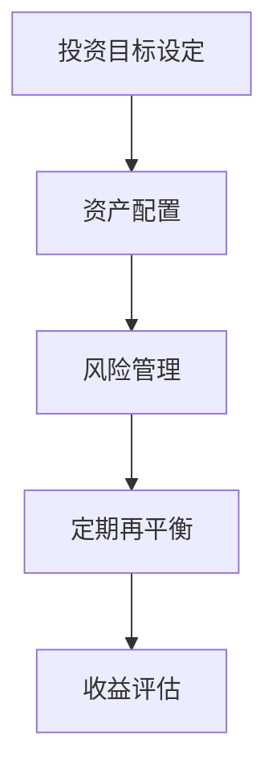

                 


# 约翰伯格的长期投资观

> 关键词：长期投资，约翰·伯格，价值投资，风险管理，投资组合

> 摘要：本文深入探讨了约翰·伯格的长期投资理念，结合数学模型和系统架构，分析了长期投资的核心概念、策略、心理因素、风险管理及系统实现。通过实际案例，展示了如何将理论应用于实践，帮助投资者在长期投资中实现稳健收益。

---

## 第一部分：长期投资的背景与核心概念

### 第1章：长期投资的背景与重要性

#### 1.1 长期投资的定义与特点

长期投资是指投资者将资金投入某一资产或项目，期望在未来较长时间内获得收益的行为。其核心特点包括时间跨度长、注重资产增值和风险分散。与短期投资相比，长期投资更关注资产的内在价值和长期增长潜力。

#### 1.2 约翰·伯格的投资哲学

约翰·伯格是长期投资领域的权威，他的投资哲学强调价值投资和安全边际。他认为，投资者应选择具有稳定增长潜力的企业，并以合理的价格买入，长期持有。

#### 1.3 投资的基本概念与框架

投资是指将资金投入特定资产以获得收益的行为。长期投资的框架包括资产配置、风险管理、投资策略和心理调节等多个方面。以下是投资的基本要素对比：

| 投资类型 | 长期投资 | 短期投资 |
|----------|----------|----------|
| 时间跨度 | 多年     | 几个月   |
| 收益来源 | 资本增值 | 利息收益 |
| 风险承受 | 较低     | 较高     |

---

## 第二部分：约翰·伯格的长期投资策略

### 第2章：约翰·伯格的投资策略与实践

#### 2.1 伯格的投资策略概述

伯格的投资策略以价值投资为核心，注重企业的基本面分析。他强调选择具有强大竞争优势和良好管理团队的企业，并长期持有。

#### 2.2 伯格的安全边际理论

安全边际是指资产的市场价格低于其内在价值的部分。伯格认为，安全边际提供了抵御市场波动的保护，是长期投资的重要保障。

#### 2.3 价值投资与成长投资的结合

伯格将价值投资和成长投资相结合，既关注企业的当前价值，也关注其未来的成长潜力。这种策略在长期投资中表现优异。

---

## 第三部分：长期投资的核心概念与数学模型

### 第3章：长期投资的核心概念分析

#### 3.1 长期投资的核心概念

长期投资的核心概念包括内在价值、风险调整后的收益和时间的复利效应。以下是资产定价模型的数学公式：

$$E(R_i) = R_f + β_i (E(R_m) - R_f)$$

其中，$E(R_i)$ 是资产的预期收益率，$R_f$ 是无风险利率，$β_i$ 是资产的贝塔系数，$E(R_m)$ 是市场预期收益率。

#### 3.2 长期投资的核心模型

投资组合理论是长期投资的重要工具。以下是夏普比率的计算公式：

$$\text{夏普比率} = \frac{E(R_p) - R_f}{\sigma_p}$$

其中，$E(R_p)$ 是投资组合的预期收益，$R_f$ 是无风险利率，$\sigma_p$ 是投资组合的收益标准差。

---

## 第四部分：投资心理与行为分析

### 第4章：投资心理与行为对长期投资的影响

#### 4.1 投资者心理与决策偏差

投资者常见的心理偏差包括羊群效应、过度自信和损失厌恶。这些偏差可能导致短期决策失误。

#### 4.2 长期投资中的心理调节

投资者需要培养理性决策能力，建立长期视角，并保持投资耐心。以下是克服短期诱惑的策略：

1. 设定明确的投资目标和计划。
2. 避免频繁关注市场波动。
3. 坚持长期持有优质资产。

---

## 第五部分：风险管理与投资组合优化

### 第5章：长期投资中的风险管理

#### 5.1 风险管理的基本原则

风险管理是长期投资的重要环节。以下是风险管理的关键点：

- 风险与收益的平衡。
- 风险分散化的重要性。
- 定期再平衡的重要性。

#### 5.2 投资组合优化策略

通过合理的资产配置和定期再平衡，可以优化投资组合的风险收益比。以下是投资组合优化的步骤：

1. 确定投资目标和风险承受能力。
2. 分散投资于不同资产类别。
3. 定期评估并调整投资组合。

---

## 第六部分：系统分析与架构设计方案

### 第6章：长期投资系统的架构与实现

#### 6.1 投资系统的需求分析

投资系统需要满足以下需求：

- 资产配置模块。
- 风险管理模块。
- 定期再平衡模块。

#### 6.2 投资系统的核心功能设计

以下是投资系统的功能模块设计：



---

## 第七部分：项目实战

### 第7章：长期投资实战案例

#### 7.1 环境安装

建议使用Python和相关库（如Pandas、NumPy）进行数据分析和投资组合管理。

#### 7.2 核心实现源代码

以下是投资组合优化的Python代码示例：

```python
import numpy as np
import pandas as pd

# 假设我们有三个资产，分别为股票、债券和现金
returns = pd.DataFrame({
    '股票': [0.1, 0.05, 0.07],
    '债券': [0.03, 0.04, 0.02],
    '现金': [0, 0, 0]
})

# 计算投资组合的预期收益和风险
def portfolio_return(weights):
    return np.dot(weights, returns.mean())

def portfolio_variance(weights):
    return np.dot(weights, np.dot(returns.cov(), weights))

# 使用优化算法寻找最优权重
weights = np.array([1/3, 1/3, 1/3])
print("预期收益:", portfolio_return(weights))
print("风险:", portfolio_variance(weights))
```

#### 7.3 案例分析与解读

通过上述代码，我们可以计算出投资组合的预期收益和风险。在实际操作中，投资者可以根据市场变化调整权重，以实现收益最大化。

---

## 小结

约翰·伯格的长期投资观强调价值投资和安全边际，注重资产的长期增值。通过系统的风险管理、心理调节和投资组合优化，投资者可以在长期投资中实现稳健收益。

---

**作者：AI天才研究院/AI Genius Institute & 禅与计算机程序设计艺术 /Zen And The Art of Computer Programming**

