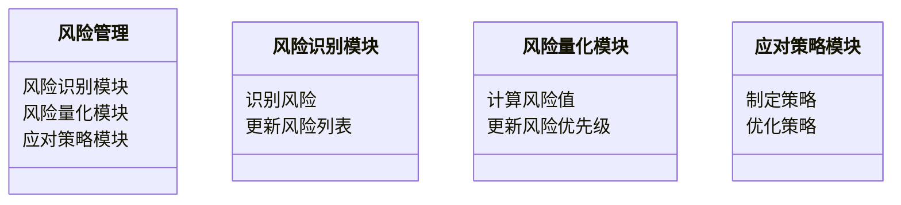
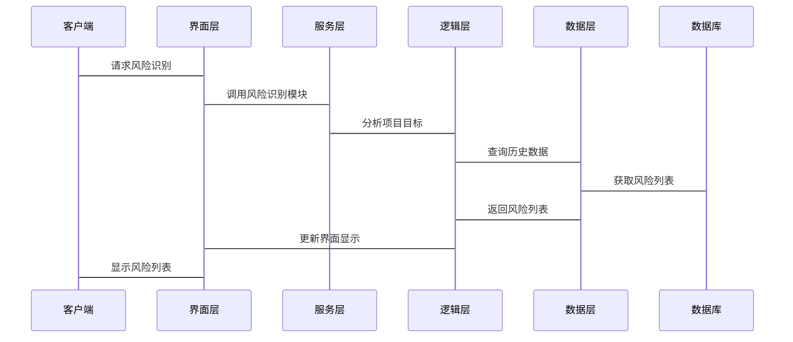

                 


# 约翰伯格的风险管理方法

## 关键词：风险管理，约翰伯格方法，风险识别，风险量化，风险应对策略，系统架构，风险管理模型，风险控制

## 摘要：  
本文详细介绍了约翰伯格的风险管理方法，从背景、核心概念到算法原理、系统架构，再到项目实战，全面解析了这一方法的理论基础与实际应用。通过案例分析和代码实现，帮助读者掌握如何在实际项目中应用约翰伯格的风险管理方法，以降低风险、提高项目成功率。

---

# 第一部分：风险管理背景与概述

## 第1章：风险管理的基本概念

### 1.1 风险管理的定义与重要性

#### 1.1.1 风险的定义  
风险是指在特定条件下，某一事件可能发生的不确定性及其对目标的影响。在项目管理、金融等领域，风险是影响目标实现的潜在障碍。

#### 1.1.2 管理的定义  
管理是指通过计划、组织、指挥、控制等手段，协调资源以实现目标的过程。风险管理则是管理的一部分，专注于识别、分析和应对风险。

#### 1.1.3 风险管理的核心概念  
风险管理的核心在于通过系统的方法，识别潜在风险，量化其影响，并制定应对策略，以最小化风险对目标的负面影响。

---

### 1.2 约翰伯格的生平与风险管理方法的起源

#### 1.2.1 约翰伯格的生平简介  
约翰伯格是风险管理领域的先驱，他的研究和实践为现代风险管理方法奠定了基础。

#### 1.2.2 风险管理方法的提出背景  
在20世纪末，随着全球化和复杂项目的增多，传统风险管理方法逐渐暴露出不足。约翰伯格提出了一种基于概率和系统分析的新方法。

#### 1.2.3 方法的核心思想  
约翰伯格认为，风险管理不仅是对风险的被动应对，更是通过系统分析主动降低风险影响的过程。

---

### 1.3 约翰伯格风险管理方法的特点

#### 1.3.1 方法的独特性  
约翰伯格方法的独特性在于其系统性和科学性，结合了概率论和系统工程的方法。

#### 1.3.2 方法的适用范围  
该方法适用于金融、建筑、制造等多个领域，尤其适合复杂项目的风险管理。

#### 1.3.3 方法的优缺点  
优点：系统性强、可量化；缺点：实施成本较高，需要专业的知识和工具支持。

---

# 第二部分：约翰伯格风险管理方法的核心概念

## 第2章：风险管理的三要素模型

### 2.1 风险识别

#### 2.1.1 风险识别的定义  
风险识别是通过系统分析，识别可能影响项目的所有风险的过程。

#### 2.1.2 风险识别的方法  
- **头脑风暴法**：通过团队讨论识别风险。
- **问卷调查法**：通过问卷收集相关人员的风险观点。
- **德尔菲法**：通过专家意见汇总识别风险。

#### 2.1.3 风险识别的步骤  
1. 确定项目目标和范围。
2. 分析项目各阶段可能的风险。
3. 列出所有潜在风险。

---

### 2.2 风险量化

#### 2.2.1 风险量化的核心概念  
风险量化是通过数学模型，评估风险对项目的影响程度。

#### 2.2.2 风险量化的方法  
- **概率分析法**：计算风险发生的概率及其对目标的影响。
- **蒙特卡洛模拟法**：通过模拟大量场景，评估风险的影响。

#### 2.2.3 风险量化工具  
- **概率-影响矩阵**：将风险按概率和影响程度分类。
- **风险评分法**：根据评分系统评估风险优先级。

---

### 2.3 风险应对策略

#### 2.3.1 应对策略的分类  
- **规避策略**：完全避免风险。
- **减轻策略**：降低风险的影响。
- **转移策略**：将风险转移给第三方。
- **接受策略**：接受风险并制定应对措施。

#### 2.3.2 策略的选择与实施  
选择应对策略时，需综合考虑风险的概率、影响程度和应对成本。

#### 2.3.3 策略的评估与优化  
定期评估应对策略的有效性，并根据实际情况进行优化。

---

## 第3章：风险管理的核心原理

### 3.1 风险识别原理

#### 3.1.1 识别过程的系统性  
风险识别需要从项目的整体出发，分析各部分的潜在风险。

#### 3.1.2 识别过程的动态性  
随着项目的进展，风险可能发生变化，识别过程需要动态调整。

#### 3.1.3 识别过程的准确性  
准确识别风险是后续量化和应对的基础。

---

### 3.2 风险量化原理

#### 3.2.1 风险量化的基础假设  
- 风险是独立的，互不影响。
- 风险的影响是可量化的。

#### 3.2.2 风险量化的数学模型  
$$ R = P \times I $$
其中，$R$ 表示风险值，$P$ 是风险发生的概率，$I$ 是风险的影响程度。

---

### 3.3 风险应对策略的制定原理

#### 3.3.1 策略制定的系统性  
从整体出发，制定全面的应对方案。

#### 3.3.2 策略制定的动态调整  
根据风险的变化，及时调整应对策略。

#### 3.3.3 策略制定的经济性  
在有限的资源下，选择最优的应对策略。

---

# 第三部分：约翰伯格风险管理方法的数学模型与算法

## 第4章：风险管理的数学模型

### 4.1 风险识别的数学模型

#### 4.1.1 风险识别的系统模型  
$$ S = \{ R_1, R_2, ..., R_n \} $$
其中，$S$ 表示风险集合，$R_i$ 表示第 $i$ 个风险。

#### 4.1.2 风险识别的概率模型  
$$ P(R_i) = \frac{N_i}{N} $$
其中，$N_i$ 是风险 $R_i$ 发生的次数，$N$ 是总次数。

---

### 4.2 风险量化的核心公式

#### 4.2.1 风险值计算公式  
$$ R = P \times I $$
其中，$R$ 是风险值，$P$ 是概率，$I$ 是影响程度。

#### 4.2.2 风险影响程度计算公式  
$$ I = \sum_{j=1}^{m} w_j \times i_j $$
其中，$w_j$ 是第 $j$ 个影响因素的权重，$i_j$ 是第 $j$ 个影响因素的值。

---

### 4.3 风险应对策略的优化模型

#### 4.3.1 策略优化的线性规划模型  
$$ \text{Minimize} \quad C = \sum_{k=1}^{l} c_k \times s_k $$
其中，$c_k$ 是第 $k$ 种策略的成本，$s_k$ 是第 $k$ 种策略的实施程度。

---

## 第5章：风险管理的系统架构

### 5.1 系统功能设计

#### 5.1.1 领域模型（Mermaid 类图）  


---

### 5.2 系统架构设计（Mermaid 架构图）


---

### 5.3 系统接口设计

#### 5.3.1 风险识别接口  
- 输入：项目目标和范围
- 输出：风险列表

#### 5.3.2 风险量化接口  
- 输入：风险列表和概率影响矩阵
- 输出：风险值排序

---

### 5.4 系统交互流程（Mermaid 序列图）



---

# 第四部分：项目实战

## 第6章：风险管理系统的实现

### 6.1 环境安装

#### 6.1.1 系统需求  
- 操作系统：Windows 10 或更高版本，Linux 或 macOS
- 开发工具：Python 3.8+，IDE（PyCharm 或 VS Code）
- 其他依赖：Mermaid 图表生成工具，matplotlib 图库

---

### 6.2 系统核心实现源代码

#### 6.2.1 风险识别模块（Python 实现）

```python
def identify_risks(project_goals):
    risks = []
    for goal in project_goals:
        # 分析每个目标可能的风险
        risks.extend(analyze_goal(goal))
    return risks
```

#### 6.2.2 风险量化模块（Python 实现）

```python
def calculate_risk_value(risks):
    risk_values = []
    for risk in risks:
        p = get_probability(risk)
        i = get_impact(risk)
        risk_values.append(p * i)
    return risk_values
```

---

### 6.3 案例分析

#### 6.3.1 项目背景  
假设我们正在开发一个在线电商系统，项目目标包括用户注册、订单处理和支付功能。

#### 6.3.2 风险识别  
通过分析，我们识别出以下风险：
- 网站被攻击的风险（高概率，高影响）
- 支付系统故障的风险（中概率，高影响）

#### 6.3.3 风险量化  
计算风险值：
- 网站被攻击的风险值：0.8（概率） × 0.9（影响） = 0.72
- 支付系统故障的风险值：0.6 × 0.8 = 0.48

---

### 6.4 项目小结

通过实际案例分析，我们验证了约翰伯格风险管理方法的有效性。风险识别和量化过程帮助我们更好地理解项目中的潜在问题，并通过制定应对策略降低了项目失败的风险。

---

# 第五部分：总结与展望

## 第7章：总结与最佳实践

### 7.1 小结

约翰伯格的风险管理方法通过系统的风险识别、量化和应对策略制定，为项目管理提供了科学的工具和方法。本文详细讲解了该方法的核心概念、数学模型和系统架构，并通过实际案例展示了其应用。

---

### 7.2 注意事项

- 风险管理是一个动态过程，需要持续关注和调整。
- 风险量化需要准确的数据支持，避免主观判断。
- 应对策略的选择应综合考虑成本和效果。

---

### 7.3 未来展望

随着人工智能和大数据技术的发展，风险管理方法将更加智能化和精准化。未来的研究方向包括：
- 基于机器学习的风险预测模型。
- 更加复杂的系统架构设计。
- 全球化背景下的风险管理策略。

---

# 作者：AI天才研究院/AI Genius Institute & 禅与计算机程序设计艺术 /Zen And The Art of Computer Programming

---

本文通过详细讲解约翰伯格的风险管理方法，帮助读者掌握了这一重要的风险管理工具。从理论到实践，从概念到代码，读者可以全面理解并应用这一方法，从而在实际项目中降低风险，确保目标的实现。

