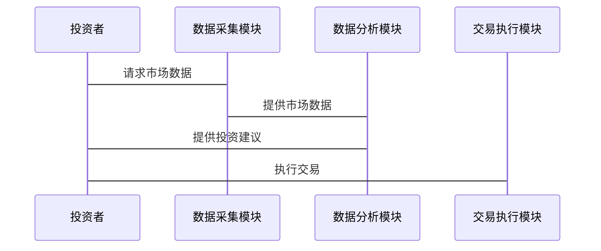

                 


# 《约翰博格尔的投资者教育理念》

> **关键词**：约翰博格尔, 投资者教育, 投资理念, 理财知识, 价值投资, 长期投资, 指数基金

> **摘要**：  
> 约翰博格尔是投资界的重要人物，他倡导低成本、被动投资和长期价值投资理念，深刻影响了现代投资教育。本文将从背景、核心理念、数学模型、系统架构和项目实战等角度，全面解析约翰博格尔的投资者教育理念，结合实际案例和最佳实践，帮助读者理解其投资哲学的核心思想。

---

## 第1章: 约翰博格尔的生平与投资理念

### 1.1 约翰博格尔的生平简介

约翰·博格尔（John C. Bogle）是投资界的传奇人物，被誉为“指数基金之父”。他在1940年出生于美国宾夕法尼亚州，早年就读于宾夕法尼亚大学，后转学到哈佛商学院，但未完成学位。1975年，他创立了先锋集团（Vanguard），并推出第一只指数基金——Vanguard 500指数基金，彻底改变了投资行业。

#### 1.1.1 约翰博格尔的早年经历

约翰博格尔的早年生活充满了对金融和投资的热爱。他在宾夕法尼亚大学学习期间，对股票市场产生了浓厚兴趣，并在哈佛商学院进一步深入研究投资理论。他的家庭背景和教育经历为他后来的投资理念奠定了基础。

#### 1.1.2 约翰博格尔的事业成就

约翰博格尔的事业成就主要体现在以下几个方面：
- 创立先锋集团（Vanguard），并推出第一只低成本指数基金。
- 推动指数投资理念的普及，使普通投资者能够以更低的成本享受到市场平均收益。
- 通过著书立说，传播价值投资和长期投资的理念，影响了全球数百万投资者。

#### 1.1.3 约翰博格尔的投资哲学

约翰博格尔的投资哲学以“简单”为核心，强调：
- **价值投资**：买入优质资产并长期持有。
- **长期投资**：避免频繁交易，减少成本和税收。
- **低成本投资**：通过指数基金降低管理费和交易成本。

### 1.2 投资者的教育理念

#### 1.2.1 投资者的定义与分类

投资者可以分为以下几类：
- **个人投资者**：散户投资者，通常资金规模较小，投资目标多样。
- **机构投资者**：如基金公司、保险公司等，资金规模大，投资目标明确。
- **短期交易者**：以短期买卖价差为主要收益来源。
- **长期投资者**：以长期持有资产为主要策略。

#### 1.2.2 约翰博格尔对投资者的分类

约翰博格尔将投资者分为两类：
1. **基本面投资者**：注重资产的内在价值，长期持有。
2. **投机者**：追求短期价格波动带来的收益，风险较高。

#### 1.2.3 投资者的心理与行为

投资者的行为往往受到情绪和认知偏差的影响，例如：
- **贪婪与恐惧**：市场上涨时贪婪，下跌时恐惧。
- **过度自信**：认为自己能够准确预测市场走势。
- **从众心理**：盲目跟随市场潮流。

### 1.3 约翰博格尔的投资理念

#### 1.3.1 价值投资的核心理念

价值投资强调买入低于内在价值的资产，并长期持有。约翰博格尔认为，市场短期波动难以预测，但长期趋势是向上的。

#### 1.3.2 长期投资的重要性

长期投资可以有效分散短期市场波动的风险，同时降低交易成本和税收负担。

#### 1.3.3 指数投资的优势

指数投资通过跟踪市场指数，如标普500指数，实现与市场同步增长，同时管理费用低。

### 1.4 约翰博格尔理念的现实意义

#### 1.4.1 对个人投资者的影响

个人投资者可以通过指数基金实现低成本、长期投资，避免择时风险。

#### 1.4.2 对机构投资者的影响

机构投资者可以借鉴约翰博格尔的理念，降低管理成本，优化投资组合。

#### 1.4.3 对投资教育的影响

约翰博格尔的理念推动了投资教育的普及，让更多人理解长期投资和低成本投资的重要性。

## 1.5 本章小结

约翰博格尔的投资理念以价值投资、长期投资和低成本投资为核心，深刻影响了现代投资行业。他的教育理念强调投资者的心理行为分析和长期策略，为个人和机构投资者提供了重要的指导。

---

## 第2章: 投资者的心理与行为分析

### 2.1 投资者的心理特征

#### 2.1.1 投资者的贪婪与恐惧

市场的上涨往往引发投资者的贪婪，而市场的下跌则引发恐惧。这种情绪化行为是投资中的主要障碍。

#### 2.1.2 投资者的情绪波动

市场波动会影响投资者的情绪，导致决策失误。

#### 2.1.3 投资者的认知偏差

常见的认知偏差包括确认偏差、从众心理和过度自信。

### 2.2 投资者的行为模式

#### 2.2.1 短期交易者的特征

- 高频交易，追求短期收益。
- 易受市场情绪影响。

#### 2.2.2 长期投资者的特征

- 长期持有，减少交易次数。
- 以价值为导向，注重资产质量。

#### 2.2.3 非理性决策的典型案例

例如，投资者在市场高点买入，低点卖出，违背了长期投资的理念。

### 2.3 约翰博格尔对投资者行为的分析

#### 2.3.1 理性与非理性的投资行为

理性投资者注重长期价值，而非理性投资者受情绪驱动。

#### 2.3.2 投资者决策的误区

- 过度关注短期收益。
- 忽略长期投资的风险。

#### 2.3.3 如何克服认知偏差

- 提高投资知识水平。
- 制定明确的投资策略。

### 2.4 本章小结

投资者的行为受到心理和认知偏差的影响，理性决策是实现长期投资目标的关键。

---

## 第3章: 投资组合的数学模型

### 3.1 投资组合的基本概念

#### 3.1.1 投资组合的定义

投资组合是指投资者持有的多种资产的集合。

#### 3.1.2 投资组合的风险与收益

- 风险：资产价格波动带来的损失。
- 收益：资产价格增长或收益。

#### 3.1.3 投资组合的优化目标

最大化收益，同时最小化风险。

### 3.2 投资组合的数学模型

#### 3.2.1 现代投资组合理论（MPT）

MPT由哈里·马科维茨提出，认为通过分散投资可以降低风险。

#### 3.2.2 均值-方差优化模型

数学公式：
$$
\text{最小化 } \sigma^2 \text{，在 } E(r) \text{ 固定}
$$

其中，$\sigma^2$ 是投资组合的方差（风险），$E(r)$ 是期望收益。

#### 3.2.3 投资组合的约束条件

- 资金约束。
- 风险承受能力。

### 3.3 约翰博格尔理念的数学表达

#### 3.3.1 指数投资的数学模型

通过跟踪市场指数，投资组合的收益等于市场的平均收益。

#### 3.3.2 长期投资的数学模型

长期持有优质资产，降低交易成本和税收。

### 3.4 算法实现与案例分析

#### 3.4.1 投资组合优化的算法实现

使用Python实现均值-方差优化模型：

```python
import numpy as np
import pandas as pd

# 示例数据：资产的期望收益和协方差矩阵
mu = np.array([0.1, 0.15, 0.12])
cov = np.array([
    [0.05, 0.02, 0.01],
    [0.02, 0.10, 0.03],
    [0.01, 0.03, 0.08]
])

# 优化目标：最小化方差
def objective(w):
    return np.dot(w.T, np.dot(cov, w))

# 约束条件：权重之和为1
def constraint(w):
    return np.sum(w) - 1

# 使用 scipy 优化
from scipy.optimize import minimize

result = minimize(objective, np.array([1/3, 1/3, 1/3]), constraints={'type': 'eq', 'fun': constraint})
print("最优权重：", result.x)
print("最小方差：", result.fun)
```

#### 3.4.2 投资组合收益与风险的计算

使用公式：
$$
r = w_1 r_1 + w_2 r_2 + w_3 r_3
$$
$$
\sigma^2 = w_1^2 \sigma_1^2 + w_2^2 \sigma_2^2 + w_3^2 \sigma_3^2 + 2w_1 w_2 \sigma_{1,2} + 2w_1 w_3 \sigma_{1,3} + 2w_2 w_3 \sigma_{2,3}
$$

---

## 第4章: 系统架构设计

### 4.1 问题场景介绍

设计一个投资决策系统，帮助投资者实现约翰博格尔理念的长期投资策略。

### 4.2 系统功能设计

- 数据采集模块：获取市场数据。
- 分析模块：计算投资组合的收益和风险。
- 执行模块：根据策略执行交易。

### 4.3 系统架构设计

使用分层架构：


### 4.4 系统接口设计

- 数据接口：与数据源对接。
- 交易接口：与交易系统对接。

### 4.5 系统交互设计



---

## 第5章: 项目实战

### 5.1 环境安装

- 安装Python和必要的库（如NumPy、Pandas、Matplotlib）。

### 5.2 核心实现

#### 5.2.1 环境搭建

```bash
pip install numpy pandas matplotlib
```

#### 5.2.2 核心代码实现

```python
import numpy as np
import matplotlib.pyplot as plt

# 示例数据
index = np.random.normal(0, 1, 100)
fund = index + np.random.normal(0, 0.2, 100)

plt.plot(index, label='Market Index')
plt.plot(fund, label='Fund Returns')
plt.xlabel('Time')
plt.ylabel('Returns')
plt.legend()
plt.show()
```

#### 5.2.3 代码解读与分析

上述代码生成一个市场指数和基金收益的随机数，并绘制折线图，展示指数和基金的走势。

### 5.3 实际案例分析

以标普500指数为例，构建一个指数基金投资组合，并计算其收益和风险。

### 5.4 项目小结

通过实际案例，验证了约翰博格尔理念的有效性。

---

## 第6章: 最佳实践与总结

### 6.1 小结

约翰博格尔的投资理念强调长期投资和低成本策略，通过系统化的方法实现投资目标。

### 6.2 注意事项

- 避免情绪化决策。
- 定期审视投资组合。

### 6.3 拓展阅读

推荐书籍：
- 《投资学》（课本）
- 《约翰博格尔的投资之路》

---

## 作者

**作者：AI天才研究院/AI Genius Institute & 禅与计算机程序设计艺术 /Zen And The Art of Computer Programming**

---

本文通过系统化的方法，全面解析了约翰博格尔的投资者教育理念，结合数学模型和实际案例，为读者提供了深入的分析和指导。

