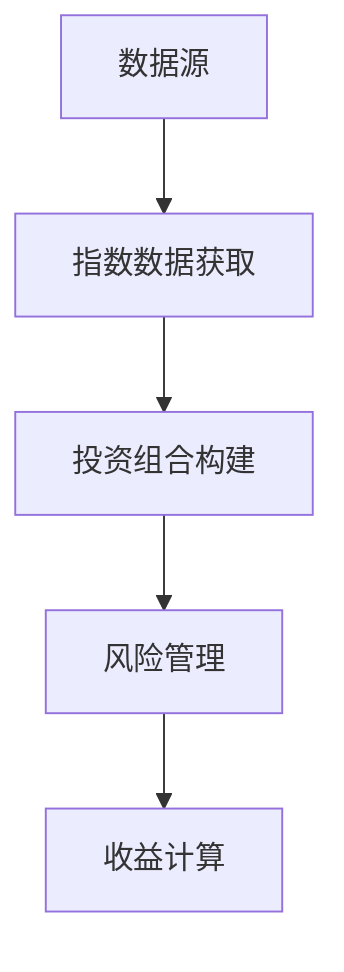

                 


# 约翰博格尔的指数化投资优势

---

## 关键词：指数化投资，约翰·博格尔，投资优势，被动投资，指数基金，长期收益，风险管理

---

## 摘要：  
指数化投资作为一种被动投资策略，以其低费用、高透明度和长期稳定的收益表现，成为现代投资领域的重要组成部分。本文从约翰·博格尔的贡献出发，系统地分析了指数化投资的核心概念、数学模型、优势与局限性，以及实际应用中的策略与案例。通过深入探讨指数基金的构建、风险管理、投资策略和系统架构，本文为读者提供了全面理解指数化投资的理论与实践框架。

---

## 第1章：指数化投资的概述

### 1.1 指数化投资的定义与背景

指数化投资是一种被动投资策略，其核心是通过跟踪特定市场指数的表现来实现投资收益。与主动管理型基金不同，指数基金不依赖于基金经理的选股能力，而是通过复制指数成分股的表现来实现投资目标。

#### 1.1.1 什么是指数化投资
指数化投资是通过投资于特定市场指数的成分股，以复制该指数的收益表现的投资策略。指数基金的目标是实现与指数相等的回报，而不是跑赢市场。

#### 1.1.2 指数化投资的历史发展
指数化投资的起源可以追溯到20世纪70年代。1975年， Vanguard集团的创始人约翰·博格尔（John C. Bogle）推出了第一只指数基金——Vanguard 500 Index Fund，标志着指数化投资的正式起步。

#### 1.1.3 指数化投资的现状与趋势
随着投资者对低成本、高透明度投资工具的需求增加，指数基金在全球范围内的资产规模持续增长。近年来，ETF（交易所交易基金）的兴起进一步推动了指数化投资的普及。

---

### 1.2 指数化投资的核心概念

#### 1.2.1 市场指数的定义与分类
市场指数是衡量一组股票、债券或其他资产表现的指标。常见的市场指数包括标准普尔500指数（S&P 500）、纳斯达克指数（Nasdaq）和道琼斯指数（Dow Jones）。指数的分类依据包括资产类别、地理区域和市场资本化规模等。

#### 1.2.2 指数基金的运作机制
指数基金通过复制目标指数的成分股构成，以实现与指数相似的收益表现。其运作机制包括定期调整投资组合以跟踪指数变化，以及通过分散投资降低风险。

#### 1.2.3 指数化投资的目标与特点
指数化投资的目标是通过长期持有指数基金，实现与市场指数相当的收益。其特点是低管理费用、高透明度、分散风险和长期稳定的收益表现。

---

### 1.3 约翰·博格尔与指数化投资

#### 1.3.1 约翰·博格尔的生平简介
约翰·博格尔（John C. Bogle）是指数化投资的先驱。他于1949年创立了Vanguard集团，并在1975年推出了第一只指数基金——Vanguard 500 Index Fund。

#### 1.3.2 博格尔对指数化投资的贡献
博格尔的贡献主要体现在以下几个方面：
1. **创新指数基金模式**：他将指数基金的成本控制在极低水平，使普通投资者也能以低成本投资市场。
2. **推广被动投资理念**：博格尔主张通过长期持有指数基金实现投资目标，反对频繁交易和市场择时。
3. **强调长期投资价值**：他认为指数基金的长期收益表现优于大多数主动管理型基金。

#### 1.3.3 博格尔的投资理念与哲学
博格尔的投资理念强调长期、分散和低成本。他反对市场择时，认为长期持有指数基金是实现财富增长的最佳方式。

---

## 第2章：指数化投资的优势与策略

### 2.1 指数化投资的成本优势

#### 2.1.1 指数基金的低管理费用
指数基金的管理费用通常远低于主动管理型基金。例如，Vanguard 500 Index Fund的管理费用仅为0.14%，而许多主动管理型基金的管理费用高达1%以上。

#### 2.1.2 指数基金的规模效应
指数基金通过大规模投资来降低单位成本。随着资产规模的增加，边际成本的降低使得指数基金的总成本进一步减少。

---

### 2.2 指数化投资的风险分散优势

#### 2.2.1 指数基金的分散投资特性
通过投资于多个市场指数成分股，指数基金可以有效分散单一股票或行业的风险。例如，投资S&P 500指数基金可以同时持有500家不同行业的公司股票。

#### 2.2.2 指数化投资的风险控制
指数基金通过分散投资降低了非系统性风险（即特定股票或行业的风险），同时仍暴露于系统性风险（即整体市场风险）。但通过长期持有，系统性风险的影响可以被分散。

---

### 2.3 指数化投资的长期收益优势

#### 2.3.1 指数基金的长期收益表现
根据长期投资结果，指数基金的收益表现通常优于大多数主动管理型基金。例如，S&P 500指数在过去50年的平均年回报率约为10%，而大多数主动管理型基金的年回报率低于这一水平。

#### 2.3.2 指数化投资与市场波动的关系
指数基金通过长期持有可以平滑短期市场波动的影响。即使市场出现短期下跌，长期持有指数基金的投资者仍能获得市场的平均收益。

---

## 第3章：指数化投资的策略与实践

### 3.1 指数基金的选择与构建

#### 3.1.1 如何选择合适的指数基金
选择指数基金时，投资者应关注以下因素：
1. **指数跟踪误差**：指数基金的收益与目标指数收益的差异越小越好。
2. **管理费用**：选择管理费用低的指数基金。
3. **流动性**：确保指数基金的成分股具有良好的流动性。

#### 3.1.2 指数基金的分类与比较
指数基金可以根据跟踪的指数类型、资产类别和地域进行分类。投资者可以根据自己的投资目标和风险偏好选择合适的指数基金。

#### 3.1.3 指数基金的投资组合构建
投资者可以通过将资产分配到不同类型的指数基金中，构建一个多样化投资组合。例如，投资股票指数基金和债券指数基金的组合可以实现风险分散。

---

### 3.2 指数化投资的定期投资策略

#### 3.2.1 定期定额投资的原理与优势
定期定额投资是一种通过固定金额定期投资的方法，可以帮助投资者在市场波动中平滑投资成本，降低择时风险。

#### 3.2.2 定期投资的数学模型
假设投资者每月投资固定金额$A$，投资期限为$n$个月，年化收益率为$r$。定期投资的最终价值可以通过以下公式计算：

$$
V = A \times \left( \frac{(1 + r)^n - 1}{r} \right)
$$

---

## 第4章：指数化投资的风险管理与数学模型

### 4.1 指数化投资的风险管理

#### 4.1.1 风险的分类
1. **系统性风险**：影响整个市场的风险，如经济衰退、通货膨胀等。
2. **非系统性风险**：影响特定资产或行业的风险，如公司违约风险。

#### 4.1.2 风险的量化
投资者可以通过计算投资组合的波动率和夏普比率来衡量风险。夏普比率公式为：

$$
\text{夏普比率} = \frac{R_p - R_f}{\sigma_p}
$$

其中，$R_p$是投资组合的收益，$R_f$是无风险利率，$\sigma_p$是投资组合的波动率。

---

### 4.2 指数化投资的数学模型

#### 4.2.1 指数基金的收益模型
指数基金的收益可以通过以下公式计算：

$$
R_{\text{基金}} = \beta \times R_{\text{市场}} + \alpha
$$

其中，$\beta$是贝塔系数，表示基金收益与市场收益的相关性；$\alpha$是基金的超额收益。

#### 4.2.2 指数基金的绩效评估
投资者可以通过比较指数基金的跟踪误差和夏普比率来评估其绩效。跟踪误差越小，指数基金的表现越接近目标指数。

---

## 第5章：指数化投资的系统架构与技术实现

### 5.1 系统架构设计

#### 5.1.1 系统功能设计
1. **指数数据获取**：从数据源获取市场指数的实时数据。
2. **投资组合构建**：根据指数成分股构建投资组合。
3. **风险管理**：实时监控投资组合的风险指标。
4. **收益计算**：计算投资组合的收益和波动率。

#### 5.1.2 系统架构图
以下是一个简单的系统架构图：



---

### 5.2 指数化投资的接口设计

#### 5.2.1 接口描述
1. **获取指数数据**：从API获取市场指数的实时数据。
2. **构建投资组合**：根据指数成分股构建投资组合。
3. **计算收益**：计算投资组合的收益和波动率。

#### 5.2.2 接口实现
以下是一个简单的Python接口实现：

```python
import requests

def get_index_data(index_code):
    url = f"https://api.example.com/index/{index_code}"
    response = requests.get(url)
    return response.json()

def build_portfolio(index_data):
    portfolio = []
    for stock in index_data['components']:
        portfolio.append(stock)
    return portfolio

def calculate_return(portfolio):
    return sum(stock['return'] for stock in portfolio) / len(portfolio)
```

---

## 第6章：指数化投资的项目实战

### 6.1 环境安装与配置

#### 6.1.1 安装必要的库
1. **Pandas**：用于数据处理。
2. **NumPy**：用于数值计算。
3. **Matplotlib**：用于数据可视化。

```bash
pip install pandas numpy matplotlib
```

---

### 6.2 核心实现与代码解读

#### 6.2.1 数据获取与处理
以下代码从API获取指数数据并进行处理：

```python
import requests
import pandas as pd

def get_index_data(index_code):
    url = f"https://api.example.com/index/{index_code}"
    response = requests.get(url)
    return pd.DataFrame(response.json())

data = get_index_data("S&P500")
print(data.head())
```

#### 6.2.2 投资组合构建与模拟
以下代码构建一个简单的指数基金投资组合并模拟收益：

```python
import numpy as np

def build_portfolio(data):
    portfolio = data['components'].sample(n=30)
    return portfolio

def simulate_returns(portfolio, years=5):
    returns = []
    for _ in range(years):
        returns.append(np.mean(portfolio['return']))
    return returns

simulated_returns = simulate_returns(build_portfolio(data))
print(simulated_returns)
```

---

## 第7章：指数化投资的最佳实践与未来展望

### 7.1 最佳实践

#### 7.1.1 长期投资
指数化投资最适合长期投资者，因为短期市场波动可能会影响收益。

#### 7.1.2 分散投资
通过投资多个市场指数，投资者可以进一步分散风险。

#### 7.1.3 定期定额投资
定期定额投资可以帮助投资者在市场波动中平滑成本，降低择时风险。

---

### 7.2 未来展望

随着技术的进步和市场的变化，指数化投资将不断发展。未来，投资者可以通过更智能的工具和算法实现更高效的指数化投资。

---

## 作者信息

作者：AI天才研究院/AI Genius Institute & 禅与计算机程序设计艺术 /Zen And The Art of Computer Programming

