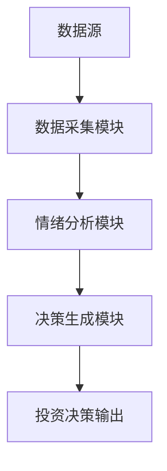
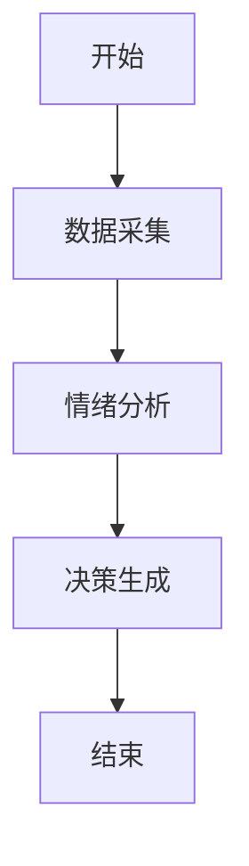

                 


# 约翰·聂夫的Contrarian投资法

---

## 关键词：
- Contrarian投资法
- 逆向思维
- 投资策略
- 市场情绪
- 约翰·聂夫
- 投资哲学
- 系统架构

---

## 摘要：
Contrarian投资法是一种基于逆向思维的投资策略，强调在市场恐慌时买入，在市场狂热时卖出。本文深入分析了Contrarian投资法的核心思想、数学模型、系统架构以及实际应用场景，结合约翰·聂夫的经典投资理念，为投资者提供了从理论到实践的全面指导。通过详细讲解Contrarian投资法的决策流程、算法实现以及系统架构设计，本文为投资者提供了一种在复杂市场环境中获利的新思路。

---

# 正文部分

## 第一部分：Contrarian投资法的背景与核心理念

## 第1章：Contrarian投资法的概述

### 1.1 Contrarian投资法的背景与起源
#### 1.1.1 投资学派的演变与Contrarian的定位
Contrarian投资法作为一种逆向投资策略，起源于20世纪70年代，由美国著名投资者约翰·聂夫（John Neff）提出。它与传统的价值投资、趋势投资等方法不同，强调在市场恐慌时寻找低估资产，在市场狂热时规避风险。

#### 1.1.2 Contrarian投资法的核心思想
Contrarian投资法的核心思想是“逆市而行”。它认为市场的非理性行为会导致资产价格偏离其内在价值，因此在市场情绪极度悲观时买入，在市场情绪极度乐观时卖出。

#### 1.1.3 Contrarian投资法与其他投资策略的对比
| 投资策略      | 理论基础       | 适用场景                     |
|---------------|----------------|------------------------------|
| 价值投资      | 资产的内在价值 | 市场低估时                   |
| 趋势投资      | 市场趋势       | 市场趋势明显时               |
| Contrarian投资法 | 市场情绪的非理性 | 市场情绪极端时               |

### 1.2 Contrarian投资法的核心概念
#### 1.2.1 逆向思维的定义与特征
逆向思维是指在市场参与者普遍乐观时保持谨慎，在市场参与者普遍悲观时保持乐观。其核心特征包括：
1. **反向操作**：与市场情绪相反。
2. **非线性关系**：市场情绪与资产价格之间存在非线性关系。
3. **周期性**：Contrarian策略适用于市场周期的波动阶段。

#### 1.2.2 市场情绪与Contrarian策略的关系
市场情绪是Contrarian策略的核心变量。通过分析市场情绪，投资者可以判断市场的过度反应，并采取相应的投资策略。

#### 1.2.3 Contrarian投资法的哲学基础
Contrarian投资法的哲学基础是“物极必反”。它认为市场情绪的极端化会导致价格的极端波动，从而为逆向投资者提供机会。

### 1.3 Contrarian投资法的适用场景与边界
#### 1.3.1 市场周期与Contrarian策略的应用
Contrarian策略适用于市场周期的底部和顶部阶段。在市场底部，投资者可以通过买入低估资产获利；在市场顶部，通过卖出高估资产规避风险。

#### 1.3.2 Contrarian投资法的局限性
1. **市场波动性**：在市场波动剧烈时，Contrarian策略可能面临较大的短期亏损。
2. **市场参与者行为**：如果市场参与者行为趋于理性，Contrarian策略的效果可能减弱。
3. **市场环境**：在某些市场环境中，Contrarian策略可能失效。

#### 1.3.3 Contrarian与价值投资的异同
| 投资策略      | 理论基础       | 适用场景                     |
|---------------|----------------|------------------------------|
| 价值投资      | 资产的内在价值 | 市场低估时                   |
| Contrarian投资法 | 市场情绪的非理性 | 市场情绪极端时               |

## 第2章：Contrarian投资法的核心原理

### 2.1 Contrarian投资法的逻辑框架
#### 2.1.1 市场情绪分析的数学模型
市场情绪指数的计算公式为：
$$ E = \frac{M}{N} $$
其中，E为市场情绪指数，M为市场参与者的情绪强度，N为参与者数量。

#### 2.1.2 Contrarian决策树的构建
Contrarian决策树的构建基于市场情绪的分析。当市场情绪低于阈值时，投资者买入；当市场情绪高于阈值时，投资者卖出。

#### 2.1.3 市场参与者行为的博弈论分析
市场参与者的行为可以通过博弈论模型进行分析。当市场参与者的行为趋于一致时，市场可能出现反转。

### 2.2 Contrarian投资法的数学模型
#### 2.2.1 市场情绪指数的计算公式
$$ E = \frac{M}{N} $$

#### 2.2.2 Contrarian策略的数学表达
Contrarian策略的数学表达可以表示为：
$$ S = \begin{cases} 
\text{买入} & \text{如果 } E < E_{\text{threshold}} \\
\text{卖出} & \text{否则}
\end{cases} $$

### 2.3 Contrarian投资法的决策流程
#### 2.3.1 数据采集与处理
数据采集包括市场指数、交易量、投资者情绪等数据。数据处理包括清洗、标准化等步骤。

#### 2.3.2 市场情绪分析
市场情绪分析可以通过统计方法、机器学习方法等进行。

#### 2.3.3 投资决策生成
基于市场情绪分析结果，生成投资决策。

## 第3章：Contrarian投资法的系统架构设计

### 3.1 系统功能设计
#### 3.1.1 数据采集模块
数据采集模块负责采集市场数据，包括指数、交易量、投资者情绪等。

#### 3.1.2 情绪分析模块
情绪分析模块负责分析市场情绪，生成市场情绪指数。

#### 3.1.3 决策生成模块
决策生成模块基于市场情绪指数，生成投资决策。

### 3.2 系统架构图


### 3.3 系统接口设计
#### 3.3.1 数据接口
数据接口用于接收市场数据。

#### 3.3.2 情绪分析接口
情绪分析接口用于接收市场情绪指数。

#### 3.3.3 决策输出接口
决策输出接口用于输出投资决策。

## 第4章：Contrarian投资法的算法实现

### 4.1 算法流程图


### 4.2 算法实现代码
```python
def contrarian_strategy():
    data = collect_data()
    emotion = analyze_emotion(data)
    decision = make_decision(emotion)
    return decision
```

---

## 第二部分：Contrarian投资法的系统实现

## 第5章：Contrarian投资法的系统实现

### 5.1 系统环境安装
#### 5.1.1 系统依赖
- Python 3.8+
- 数据处理库（如Pandas）
- 可视化库（如Matplotlib）

### 5.2 系统核心实现
#### 5.2.1 数据采集模块
```python
import pandas as pd

def collect_data():
    # 从数据库中采集数据
    data = pd.read_sql(...)
    return data
```

#### 5.2.2 情绪分析模块
```python
def analyze_emotion(data):
    # 计算市场情绪指数
    emotion = data['情绪'].mean()
    return emotion
```

#### 5.2.3 决策生成模块
```python
def make_decision(emotion):
    # 判断市场情绪是否超过阈值
    if emotion < threshold:
        return '买入'
    else:
        return '卖出'
```

### 5.3 实际案例分析
#### 5.3.1 案例背景
假设市场指数为3000点，市场情绪指数为0.8，阈值为0.7。

#### 5.3.2 案例分析
根据市场情绪指数，投资者应该买入。

---

## 第三部分：Contrarian投资法的最佳实践

## 第6章：Contrarian投资法的最佳实践

### 6.1 小结
Contrarian投资法是一种有效的投资策略，但需要结合市场环境和投资者自身情况灵活运用。

### 6.2 注意事项
1. **市场波动性**：在市场波动剧烈时，Contrarian策略可能面临较大的短期亏损。
2. **市场参与者行为**：如果市场参与者行为趋于理性，Contrarian策略的效果可能减弱。

### 6.3 拓展阅读
- 约翰·聂夫的其他投资理念。
- 其他逆向投资策略。

---

## 作者：AI天才研究院/AI Genius Institute & 禅与计算机程序设计艺术 /Zen And The Art of Computer Programming

