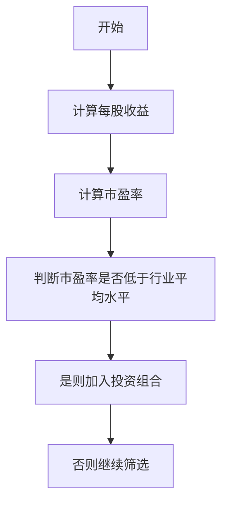
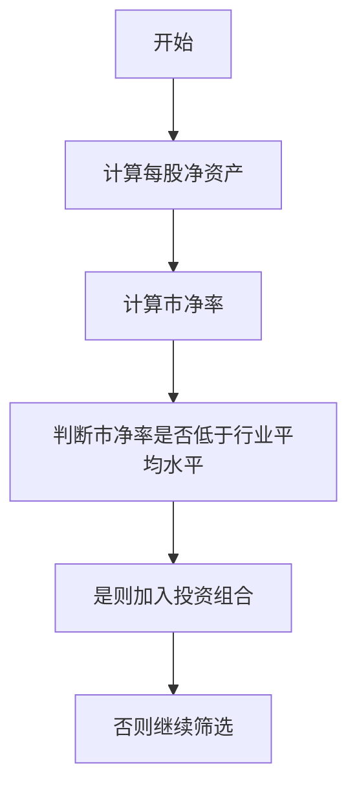
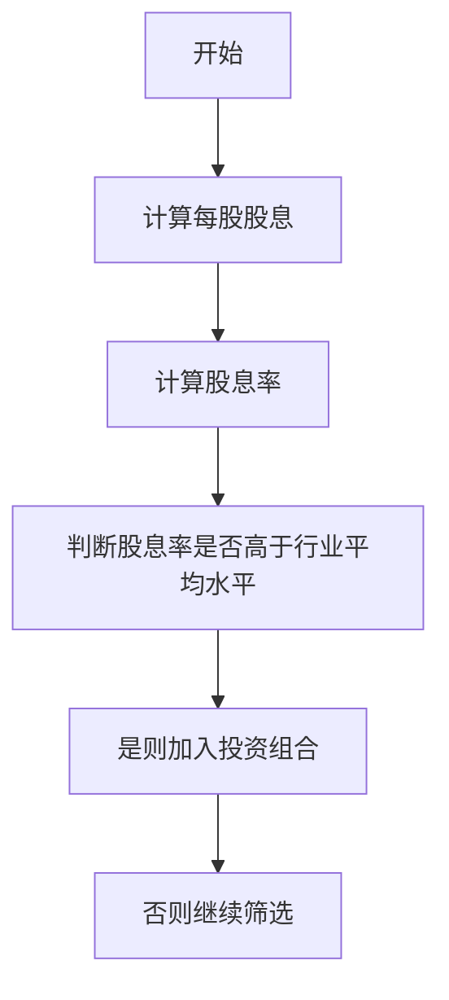

                 


# 约翰·聂夫的价值投资实践经验

> 关键词：价值投资，约翰·聂夫，投资策略，数学模型，系统架构，项目实战

> 摘要：本文详细探讨了约翰·聂夫的价值投资理念、策略及其在实践中的应用。通过分析其核心概念、算法原理、系统架构和项目实战，为读者提供一个全面而深入的理解框架，帮助读者掌握价值投资的核心要素和实际操作方法。

---

# 第一部分: 价值投资的背景与发展

## 第1章: 价值投资的起源与发展

### 1.1 价值投资的起源

#### 1.1.1 投资学的基本概念
投资学是研究如何有效配置资源以实现财富最大化的一门学科。它涵盖了股票、债券、基金等多种金融工具的分析与选择。价值投资作为一种重要的投资策略，强调以低于内在价值的价格购买优质资产。

#### 1.1.2 价值投资的定义与特点
价值投资的核心在于寻找市场价格低于内在价值的资产。其特点包括：
- **长期视角**：关注企业的长期价值，而非短期市场波动。
- **基本面分析**：通过分析企业的财务状况、行业地位和盈利能力来评估其价值。
- **安全边际**：买入价格低于内在价值，以降低风险。

#### 1.1.3 约翰·聂夫与价值投资的关系
约翰·聂夫是价值投资的代表人物之一，他将基本面分析与量化方法相结合，形成了独特的投资体系。他的投资理念强调安全边际和长期持有的策略，为价值投资领域做出了重要贡献。

### 1.2 约翰·聂夫的投资理念

#### 1.2.1 约翰·聂夫的生平简介
约翰·聂夫（John Neff）是美国著名的投资经理人，曾管理富达投资的“华盛顿投资组合”超过30年。他的投资业绩卓越，年均回报率超过市场平均水平。

#### 1.2.2 约翰·聂夫的投资哲学
聂夫的投资哲学强调：
- **安全边际**：买入价格远低于内在价值的股票，以确保投资的安全性。
- **长期持有**：避免频繁交易，降低交易成本，同时捕捉企业成长的长期收益。
- **逆向思维**：在市场恐慌时寻找被低估的资产，在市场狂热时保持冷静。

#### 1.2.3 约翰·聂夫的投资策略
聂夫的投资策略包括以下几个方面：
1. **选股标准**：选择具有强大竞争优势、良好财务状况和稳定收益的公司。
2. **估值方法**：通过市盈率、市净率等指标评估股票的内在价值。
3. **组合管理**：分散投资，定期调整持仓，确保投资组合的风险可控。

### 1.3 价值投资的核心要素

#### 1.3.1 内在价值的定义与计算
内在价值是指一家公司基于其未来现金流的现值。计算公式如下：
$$ \text{内在价值} = \frac{\text{预期现金流}}{\text{折现率}} $$

#### 1.3.2 安全边际的概念与应用
安全边际是指市场价格与内在价值之间的差额。当市场价格低于内在价值时，差额越大，安全边际越高，投资风险越小。

#### 1.3.3 市场先生的比喻与启示
富兰克·邓普雷（Ben Graham）提出了“市场先生”的概念，认为市场情绪波动会影响资产价格。投资者应利用市场先生的错误，寻找被低估的资产。

### 1.4 价值投资的适用场景与边界

#### 1.4.1 价值投资的适用领域
价值投资适用于那些具有明确财务数据和竞争优势的企业，尤其是那些被市场短期波动所低估的资产。

#### 1.4.2 价值投资的局限性
- **市场短期波动**：市场可能长期被高估或低估，投资者需要有足够的耐心等待价值回归。
- **竞争优势消失**：企业可能因为行业变化或管理问题失去竞争优势。

#### 1.4.3 价值投资与其他投资策略的对比
- **成长投资**：注重企业的成长潜力，愿意为高增长支付更高价格。
- **趋势投资**：跟随市场趋势，利用技术分析进行买卖决策。
- **价值投资**：寻找被低估的资产，注重安全边际和长期价值。

### 1.5 本章小结
本章介绍了价值投资的起源与发展，详细阐述了约翰·聂夫的投资理念和策略。通过分析价值投资的核心要素，为后续章节的深入讨论奠定了基础。

---

## 第2章: 约翰·聂夫的价值投资方法论

### 2.1 约翰·聂夫的投资策略

#### 2.1.1 约翰·聂夫的选股标准
聂夫选股时注重以下几个方面：
1. **低市盈率**：市盈率低于行业平均水平。
2. **低市净率**：市净率低于行业平均水平。
3. **高股息率**：股息率稳定且高于行业平均水平。

#### 2.1.2 约翰·聂夫的估值方法
聂夫常用的估值方法包括：
1. **市盈率模型**：计算股票的市盈率与行业平均水平的对比。
2. **市净率模型**：计算股票的市净率与行业平均水平的对比。
3. **股息率模型**：计算股票的股息率与行业平均水平的对比。

#### 2.1.3 约翰·聂夫的组合管理
聂夫的组合管理策略包括：
1. **分散投资**：将资金分配到多个行业中，降低风险。
2. **定期调整**：根据市场变化和企业基本面调整持仓。
3. **长期持有**：避免频繁交易，降低成本。

### 2.2 约翰·聂夫的选股模型

#### 2.2.1 市盈率模型
市盈率模型通过比较股票的市盈率与行业平均水平，寻找被低估的股票。

公式：
$$ \text{市盈率} = \frac{\text{股价}}{\text{每股收益}} $$

#### 2.2.2 市净率模型
市净率模型通过比较股票的市净率与行业平均水平，寻找被低估的股票。

公式：
$$ \text{市净率} = \frac{\text{股价}}{\text{每股净资产}} $$

#### 2.2.3 股息率模型
股息率模型通过比较股票的股息率与行业平均水平，寻找高分红的股票。

公式：
$$ \text{股息率} = \frac{\text{每股股息}}{\text{股价}} $$

### 2.3 约翰·聂夫的组合管理策略

#### 2.3.1 约翰·聂夫的分散投资
分散投资通过将资金分配到不同的行业和资产类别，降低投资组合的整体风险。

#### 2.3.2 约翰·聂夫的再平衡策略
再平衡策略是指定期调整投资组合的持仓比例，以保持风险和收益的均衡。

#### 2.3.3 约翰·聂夫的风险控制
风险控制包括设定止损点和定期评估投资组合的持仓质量。

### 2.4 约翰·聂夫的经典案例分析

#### 2.4.1 某某公司的投资案例
以某公司为例，分析聂夫如何通过基本面分析和估值模型选择投资标的。

#### 2.4.2 投资决策的复盘与总结
通过案例分析，总结投资决策中的成功与失败经验。

#### 2.4.3 案例中的经验与教训
案例分析表明，基本面分析和安全边际是价值投资成功的关键。

### 2.5 本章小结
本章详细探讨了约翰·聂夫的投资策略和选股模型，通过案例分析，总结了其投资方法的优缺点。

---

## 第3章: 价值投资的核心算法与数学模型

### 3.1 价值投资的数学模型

#### 3.1.1 内在价值的计算公式
$$ \text{内在价值} = \frac{\text{预期现金流}}{\text{折现率}} $$

#### 3.1.2 安全边际的计算公式
$$ \text{安全边际} = \text{内在价值} - \text{市场价格} $$

### 3.2 价值投资的算法实现

#### 3.2.1 市盈率模型的实现步骤


#### 3.2.2 市净率模型的实现步骤


#### 3.2.3 股息率模型的实现步骤


### 3.3 算法的Python实现

#### 3.3.1 市盈率模型的Python代码
```python
def calculate_pe_ratio(price, earnings_per_share):
    return price / earnings_per_share

# 示例数据
price = 50
earnings_per_share = 10
pe_ratio = calculate_pe_ratio(price, earnings_per_share)
print(f"市盈率为: {pe_ratio}")
```

#### 3.3.2 市净率模型的Python代码
```python
def calculate_pb_ratio(price, book_value_per_share):
    return price / book_value_per_share

# 示例数据
price = 50
book_value_per_share = 20
pb_ratio = calculate_p

