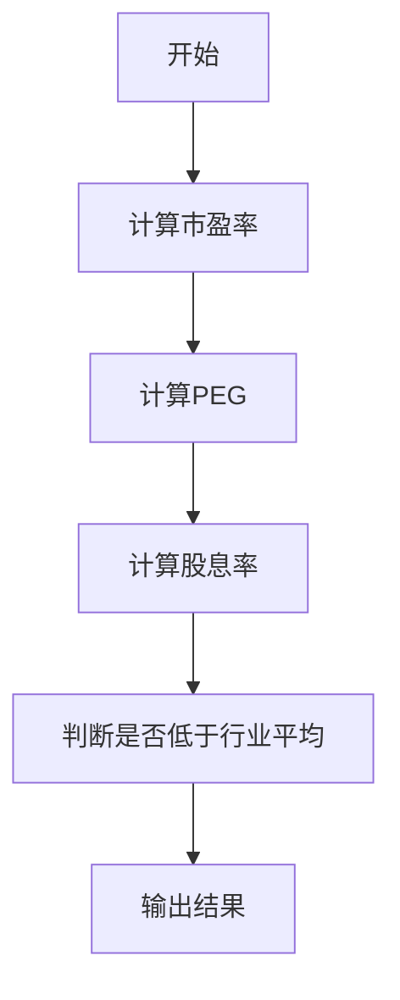
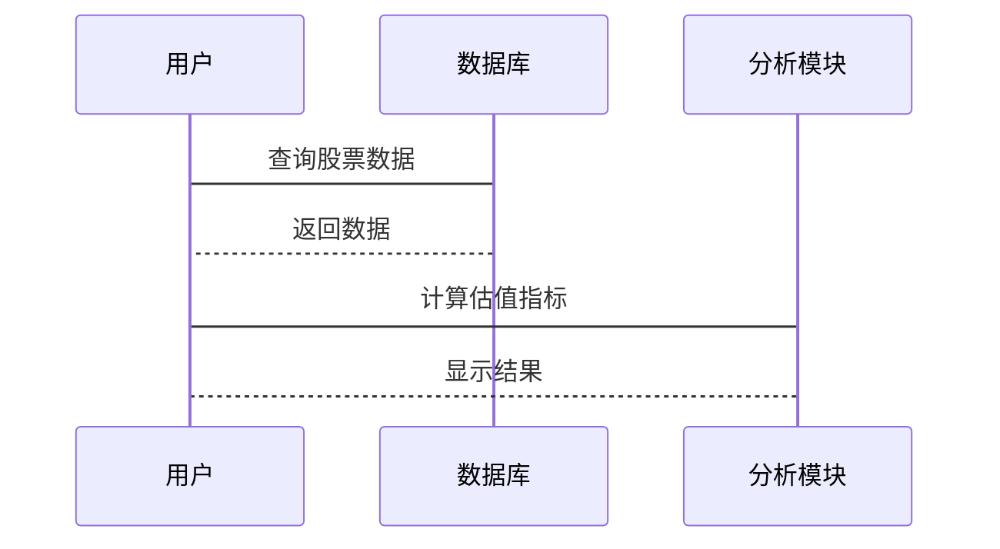

                 


```markdown
# 约翰·聂夫的市场泡沫识别

> 关键词：市场泡沫识别、约翰·聂夫、投资策略、估值指标、风险控制

> 摘要：本文深入探讨了约翰·聂夫在市场泡沫识别方面的独特见解和方法。通过分析其投资理念、核心概念和具体指标，结合实际案例和系统设计，为投资者提供一套识别和应对市场泡沫的有效策略。文章不仅详细讲解了相关的数学模型和算法，还通过项目实战展示了如何在实际投资中应用这些方法，最后总结了最佳实践和未来展望。

---

# 正文

## 第1章 市场泡沫的定义与历史案例

### 1.1 市场泡沫的定义与特征
市场泡沫是指资产价格在短期内急剧上涨，远远超过其内在价值的现象。其特征包括价格虚高、交易量激增和市场情绪过热。

### 1.2 历史案例分析
- **郁金香泡沫**：17世纪荷兰的郁金香狂热，价格在短时间内暴涨，最终暴跌。
- **互联网泡沫**：20世纪90年代末，互联网公司的股票价格虚高，最终泡沫破裂导致市场崩盘。
- **2008年金融危机**：次贷危机引发的全球金融危机，暴露了市场的过度投机行为。

### 1.3 约翰·聂夫的投资理念
- **价值投资**：聂夫强调投资于具有持续盈利能力且估值合理的公司。
- **逆向投资**：在市场恐慌时寻找被低估的资产，避免追涨杀跌。
- **长期持有**：注重长期投资，避免频繁交易以减少成本。

---

## 第2章 市场泡沫识别的核心概念与联系

### 2.1 市场泡沫的形成机制
- **心理因素**：投资者的贪婪和恐惧导致价格波动。
- **市场行为**：投资者的羊群效应和情绪化决策。
- **市场结构**：市场的流动性和信息不对称影响泡沫的形成。

### 2.2 投资者心理与市场波动
- **认知偏差**：投资者的过度自信和确认偏差导致错误决策。
- **情绪波动**：贪婪和恐惧情绪推动市场价格偏离理性区间。
- **社会影响**：市场参与者的相互影响加剧了泡沫的形成。

### 2.3 约翰·聂夫的市场分析框架
- **基本面分析**：通过财务指标评估公司的内在价值。
- **相对估值法**：比较同类资产的估值差异。
- **市场情绪指标**：利用成交量、换手率等指标判断市场热度。

---

## 第3章 约翰·聂夫的市场泡沫识别算法原理

### 3.1 市盈率（P/E）计算
- **公式**：$$P/E = \frac{股价}{每股收益}$$
- **解读**：P/E低于行业平均水平可能表明低估。

### 3.2 市盈率增长比（PEG）计算
- **公式**：$$PEG = \frac{P/E}{净利润增长率}$$
- **解读**：PEG小于1通常被视为合理估值。

### 3.3 股息率计算
- **公式**：$$股息率 = \frac{每股股息}{股价} \times 100\%$$
- **解读**：股息率过高可能暗示股价被高估。

### 3.4 算法流程图


### 3.5 Python代码实现
```python
def calculate_pe(stock_price, eps):
    return stock_price / eps

def calculate_peg(pe, growth_rate):
    if growth_rate == 0:
        return float('inf')
    return pe / growth_rate

def calculate_dividend_yield(dividend, stock_price):
    return (dividend / stock_price) * 100

# 示例数据
stock_price = 50
eps = 5
growth_rate = 10
dividend = 2

pe = calculate_pe(stock_price, eps)
peg = calculate_peg(pe, growth_rate)
dividend_yield = calculate_dividend_yield(dividend, stock_price)

print(f"PE: {pe}, PEG: {peg}, 股息率: {dividend_yield}%")
```

---

## 第4章 市场泡沫识别的系统分析与架构设计

### 4.1 系统功能设计
- **数据获取模块**：从数据库或API获取实时数据。
- **指标计算模块**：计算市盈率、PEG等指标。
- **风险评估模块**：评估市场整体风险。
- **预警模块**：设置阈值，触发警报。

### 4.2 系统架构设计


### 4.3 系统接口设计
- **输入接口**：接收股票代码和时间范围。
- **输出接口**：显示计算结果和预警信息。

### 4.4 系统交互流程图


---

## 第5章 项目实战：识别市场泡沫

### 5.1 环境安装
- 安装Python和相关库（pandas、numpy、matplotlib）。

### 5.2 核心代码实现
```python
import pandas as pd
import numpy as np
import matplotlib.pyplot as plt

# 示例数据加载
data = pd.read_csv('stock_data.csv')

# 计算市盈率
data['PE'] = data['股价'] / data['每股收益']

# 计算PEG
data['PEG'] = data.apply(lambda x: x['PE'] / x['净利润增长率'], axis=1)

# 可视化
plt.figure(figsize=(10,6))
plt.plot(data['日期'], data['PE'], label='PE')
plt.plot(data['日期'], data['PEG'], label='PEG')
plt.xlabel('日期')
plt.ylabel('指标值')
plt.legend()
plt.show()
```

### 5.3 案例分析
以苹果公司为例，分析其市盈率和PEG的变化趋势，判断是否存在泡沫。

### 5.4 项目小结
通过实际案例分析，验证了算法的有效性，并总结了识别市场泡沫的关键点。

---

## 第6章 最佳实践与注意事项

### 6.1 约翰·聂夫的投资策略
- **长期持有**：避免频繁交易，降低成本。
- **分散投资**：降低单一资产的风险。
- **估值优先**：优先选择估值合理的资产。

### 6.2 风险控制
- **设置止损**：控制潜在亏损。
- **定期复盘**：评估投资组合的表现。

### 6.3 注意事项
- **数据质量**：确保数据的准确性和完整性。
- **模型局限性**：指标仅供参考，需结合其他因素综合判断。

---

## 第7章 小结与未来展望

### 7.1 小结
本文详细介绍了约翰·聂夫的市场泡沫识别方法，包括核心概念、算法原理和项目实战。通过系统的分析和实际案例，帮助投资者掌握识别市场泡沫的技巧。

### 7.2 未来展望
未来的研究可以结合机器学习和大数据分析，进一步优化市场泡沫识别的算法和模型。

---

## 作者

作者：AI天才研究院/AI Genius Institute & 禅与计算机程序设计艺术/Zen And The Art of Computer Programming
```

