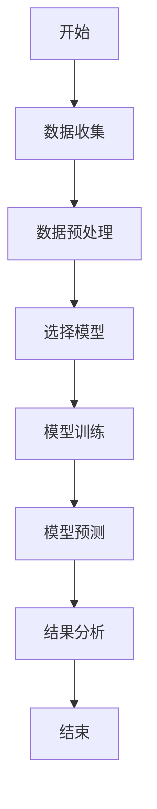
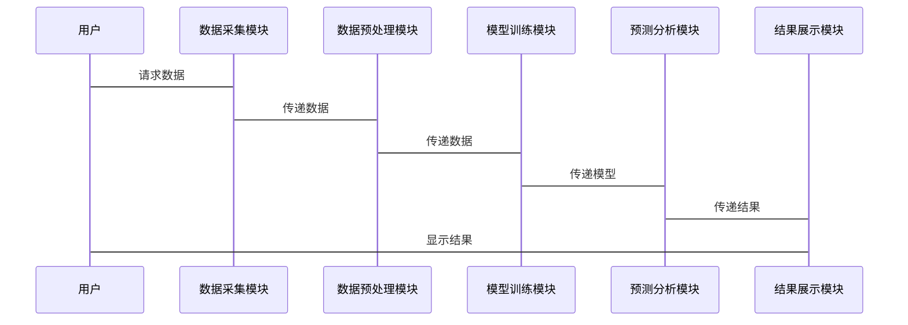

                 


# 《约翰邓普顿的全球经济周期研究》

## 关键词：全球经济周期、经济预测、投资策略、约翰·邓普顿、经济模型

## 摘要：
本文深入分析了约翰·邓普顿的全球经济周期研究，探讨其理论基础、核心概念、算法原理及实际应用。通过系统分析和项目实战，展示了如何利用经济模型和算法预测全球经济周期，并结合实际案例进行详细解读。文章最后总结了研究的启示与建议，为投资者和研究者提供了宝贵的经验。

---

## 第1章: 全球经济周期的背景与基本概念

### 1.1 经济周期的基本概念
#### 1.1.1 经济周期的定义
经济周期是指经济活动在时间上的波动，通常分为复苏、繁荣、衰退和萧条四个阶段。经济周期的研究对于预测市场趋势、制定投资策略具有重要意义。

#### 1.1.2 经济周期的特征
经济周期具有波动性、周期性、不对称性和不可预测性。这些特征使得经济周期的预测和分析具有挑战性。

#### 1.1.3 经济周期与经济波动的关系
经济周期是经济波动的核心表现形式，经济波动则是经济周期变化的具体体现。理解经济周期有助于更好地预测和应对经济波动。

### 1.2 全球经济周期的背景介绍
#### 1.2.1 全球化对经济周期的影响
全球化使得各国经济相互依存，全球经济周期的影响范围更加广泛，波动也更加复杂。

#### 1.2.2 当前全球经济周期的特殊性
当前全球经济周期受到地缘政治、技术变革和疫情等多种因素的影响，表现出前所未有的复杂性。

#### 1.2.3 经济周期研究的重要性
经济周期研究对于政府政策制定、企业投资决策和个体投资行为具有重要的指导意义。

### 1.3 约翰·邓普顿的全球经济周期研究
#### 1.3.1 约翰·邓普顿的生平简介
约翰·邓普顿是著名的投资家，以其对经济周期的深刻理解和独特的投资策略闻名。

#### 1.3.2 约翰·邓普顿的经济周期理论
邓普顿提出，经济周期的变化可以通过分析关键经济指标和市场情绪来预测，并据此制定投资策略。

#### 1.3.3 约翰·邓普顿研究的现实意义
邓普顿的研究为现代经济周期分析提供了重要的理论和实践参考，帮助投资者在复杂市场中做出明智决策。

### 1.4 本章小结
本章介绍了经济周期的基本概念、全球化背景下的全球经济周期及其特殊性，重点阐述了约翰·邓普顿的经济周期研究及其重要意义。

---

## 第2章: 全球经济周期的核心概念与联系

### 2.1 经济周期的核心驱动因素
#### 2.1.1 经济政策的影响
政府的货币政策和财政政策对经济周期具有重要影响，例如利率调整和财政支出的变化。

#### 2.1.2 经济指标的作用
GDP、失业率、通胀率等关键经济指标是分析经济周期的重要依据。

#### 2.1.3 市场情绪与预期
市场情绪和投资者预期对经济周期的变化具有显著的推动作用。

### 2.2 经济周期与经济指标的关系
#### 2.2.1 主要经济指标的分类
经济指标可以分为滞后指标、同步指标和先行指标，每类指标在经济周期分析中的作用不同。

#### 2.2.2 经济指标与经济周期的关联
通过分析经济指标的变化趋势，可以预测经济周期的走向。

#### 2.2.3 经济指标的预警作用
经济指标的变化能够提前预警经济周期的转折点，帮助投资者做好准备。

### 2.3 经济周期与全球经济体的相互影响
#### 2.3.1 全球化背景下的经济联动
全球经济体之间的相互依赖使得经济周期的变化具有全球性影响。

#### 2.3.2 区域经济周期的差异性
不同区域的经济周期可能存在差异，这需要投资者在分析时加以区分。

#### 2.3.3 经济周期的传导机制
经济周期的变化可以通过贸易、资本流动和技术转移等方式在全球范围内传导。

### 2.4 本章小结
本章分析了经济周期的核心驱动因素，探讨了经济指标与经济周期的关系，并阐述了全球经济体之间的相互影响。

---

## 第3章: 全球经济周期预测的算法原理

### 3.1 经济周期预测的基本原理
#### 3.1.1 经济预测的定义与目标
经济预测是通过分析历史数据和当前趋势，预测未来经济走势的过程。

#### 3.1.2 经济预测的常用方法
常用的经济预测方法包括时间序列分析、回归分析和机器学习算法。

#### 3.1.3 经济预测的挑战与难点
经济预测的复杂性主要来源于数据的不完全性、模型的局限性和外部事件的不确定性。

### 3.2 常用经济预测算法介绍
#### 3.2.1 时间序列分析
时间序列分析是通过分析历史数据，预测未来趋势的方法。常用模型包括ARIMA和GARCH。

#### 3.2.2 自回归积分滑动模型（ARIMA）
ARIMA模型是一种广泛应用于时间序列预测的线性模型，适用于具有趋势和季节性的数据。

#### 3.2.3 向量自回归模型（VAR）
VAR模型用于分析多个经济指标之间的相互关系，适用于多变量经济预测。

### 3.3 经济周期预测算法的流程图


### 3.4 本章小结
本章介绍了经济周期预测的基本原理，详细讲解了时间序列分析、ARIMA和VAR等常用算法，并通过流程图展示了预测的完整流程。

---

## 第4章: 经济周期预测的系统分析与架构设计

### 4.1 问题场景介绍
经济周期预测是一个复杂的系统工程，需要整合多种数据源和分析方法。

### 4.2 系统功能设计
系统功能包括数据采集、模型训练、预测分析和结果展示。

### 4.3 系统架构设计


### 4.4 系统接口设计
系统接口包括数据接口、模型接口和用户接口，确保各模块之间的高效协作。

### 4.5 系统交互设计


### 4.6 本章小结
本章通过系统分析和架构设计，展示了如何构建一个高效的经济周期预测系统。

---

## 第5章: 项目实战——全球经济周期预测案例

### 5.1 环境安装
安装Python、Pandas、NumPy、Matplotlib和Scikit-learn等工具。

### 5.2 系统核心实现源代码
```python
import pandas as pd
from statsmodels.tsa.arima.model import ARIMA
import matplotlib.pyplot as plt

# 数据加载
data = pd.read_csv('economic_data.csv')

# 数据预处理
data = data['GDP'].dropna()

# 模型训练
model = ARIMA(data, order=(5,1,0))
model_fit = model.fit()

# 预测
future_predictions = model_fit.forecast(steps=10)

# 结果展示
plt.plot(data)
plt.plot(future_predictions)
plt.xlabel('时间')
plt.ylabel('GDP')
plt.title('经济周期预测')
plt.show()
```

### 5.3 代码应用解读与分析
上述代码展示了如何使用ARIMA模型进行经济周期预测，包括数据加载、预处理、模型训练和预测展示。

### 5.4 实际案例分析
以某国经济数据为例，展示如何通过代码实现经济周期预测，并解读结果。

### 5.5 本章小结
本章通过实际案例分析，展示了如何将理论应用于实践，帮助读者更好地理解和掌握经济周期预测的方法。

---

## 第6章: 研究启示与最佳实践

### 6.1 研究启示
经济周期研究对于政策制定和投资决策具有重要意义，未来研究需要结合更多数据和复杂模型。

### 6.2 投资策略建议
投资者应结合经济周期变化，制定灵活的投资策略，避免过度依赖单一指标。

### 6.3 小结
本文通过系统分析和实践案例，展示了如何利用经济周期理论和算法进行预测和投资决策。

### 6.4 注意事项
在实际应用中，需注意数据的完整性和模型的适用性，避免因数据偏差导致预测错误。

### 6.5 拓展阅读
建议读者进一步学习时间序列分析、机器学习算法和经济预测模型，以提升预测能力。

---

## 作者：AI天才研究院/AI Genius Institute & 禅与计算机程序设计艺术 /Zen And The Art of Computer Programming

