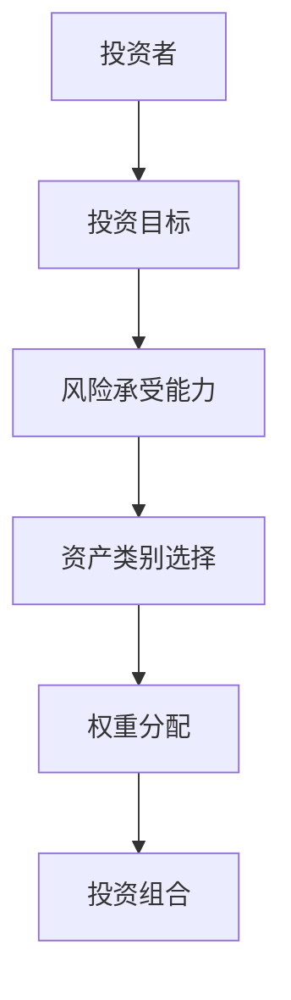
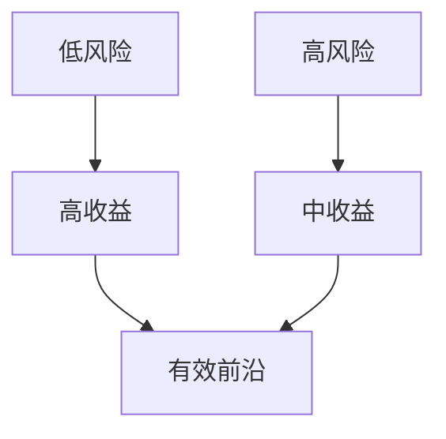
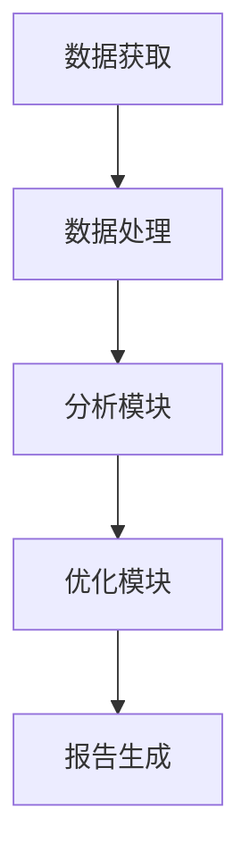

                 


# 约翰邓普顿的全球资产配置

## 关键词：约翰·邓普顿，全球资产配置，投资策略，风险管理，数学模型，系统设计

## 摘要：本文深入探讨了约翰·邓普顿的投资哲学及其在全球资产配置中的应用。通过分析其核心理念、数学模型、系统架构和实际案例，本文为投资者提供了科学的资产配置策略和风险管理方法。

---

## 第1章 约翰·邓普顿投资哲学与生平

### 1.1 约翰·邓普顿的生平简介

#### 1.1.1 早年经历与职业生涯
约翰·邓普顿（John Templeton）出生于1912年，是英国的投资家和慈善家。他在美国宾夕法尼亚州的哈弗福德学院获得经济学学位后，开始从事金融投资工作。他的职业生涯始于1930年代的大萧条时期，这使他学会了在逆境中寻找投资机会。

#### 1.1.2 投资领域的成就与荣誉
邓普顿是全球首位绕世界投资的基金经理之一，他通过全球资产配置帮助投资者分散风险并实现稳定收益。他的投资策略被广泛认可，成为现代投资学的重要组成部分。

### 1.2 投资哲学的核心理念

#### 1.2.1 长期投资与价值投资
邓普顿强调长期投资和价值投资，认为市场波动为投资者提供了以低于内在价值的价格买入的机会。

#### 1.2.2 风险管理的重要性
他提倡严格的风险管理，通过分散投资降低风险，避免单一市场的波动对整体投资组合的影响。

#### 1.2.3 全球资产配置的策略
邓普顿提出在全球范围内配置资产，以利用不同市场的差异，平衡风险和收益。

---

## 第2章 全球资产配置的背景与意义

### 2.1 全球化经济的现状

#### 2.1.1 经济全球化的趋势
经济全球化促进了跨国投资，使投资者能够接触到更多市场和资产类别。

#### 2.1.2 不同地区的经济特点
不同地区有不同的经济结构和市场波动，这为全球资产配置提供了多样化的机会。

### 2.2 资产配置的重要性

#### 2.2.1 资产配置的基本概念
资产配置是将资金分配到不同资产类别以实现风险和收益的平衡。

#### 2.2.2 资产配置在投资中的作用
资产配置能有效降低风险，提高投资组合的稳定性。

### 2.3 约翰·邓普顿的全球资产配置策略

#### 2.3.1 策略的核心思想
通过在全球范围内分散投资，捕捉不同市场的增长机会，降低区域风险。

#### 2.3.2 策略的优势与适用性
该策略适用于长期投资，尤其在市场波动较大时表现优异。

---

## 第3章 全球资产配置的核心概念与联系

### 3.1 核心概念的定义

#### 3.1.1 资产配置的定义
资产配置是根据投资目标和风险承受能力，将资金分配到不同资产类别。

#### 3.1.2 全球资产配置的定义
在全球范围内配置资产，包括股票、债券、房地产等不同市场和资产类别。

### 3.2 核心概念的属性特征对比

#### 3.2.1 股票与债券的对比
股票具有高收益潜力，风险较高；债券收益稳定，风险较低。

#### 3.2.2 不同地区的市场对比
新兴市场增长快，风险高；成熟市场稳定，风险低。

### 3.3 ER实体关系图

以下是资产配置的核心要素关系图：



---

## 第4章 全球资产配置的数学模型与算法

### 4.1 数学模型的建立

#### 4.1.1 现代投资组合理论
由哈里·马科维茨提出，用于优化投资组合的风险和收益。

#### 4.1.2 风险调整后的收益模型
$$ E(r_p) = \sum w_i E(r_i) $$
$$ \sigma_p^2 = \sum w_i^2 \sigma_i^2 + 2 \sum w_i w_j \sigma_i \sigma_j \rho_{ij} $$

### 4.2 算法原理的详细讲解

#### 4.2.1 均值-方差优化模型
通过优化算法确定最优投资组合。

#### 4.2.2 马科维茨的有效前沿

以下是有效前沿的示意图：



---

## 第5章 系统分析与架构设计

### 5.1 投资系统的需求分析

#### 5.1.1 系统目标
构建一个能够进行全球资产配置的投资系统。

#### 5.1.2 功能需求
包括数据获取、分析、配置优化和风险评估。

### 5.2 系统架构设计

#### 5.2.1 分层架构
包括数据层、计算层和用户层。

#### 5.2.2 模块划分
数据获取模块、分析模块、优化模块和报告生成模块。

以下是系统架构图：



---

## 第6章 项目实战与应用

### 6.1 工具选择与安装

#### 6.1.1 数据获取工具
使用Yahoo Finance API获取市场数据。

#### 6.1.2 数据分析工具
使用Python的Pandas和NumPy进行数据分析。

### 6.2 核心实现代码

#### 6.2.1 数据处理代码
```python
import pandas as pd
data = pd.read_csv('market_data.csv')
```

#### 6.2.2 模型实现代码
```python
from pypfolio import Portfolio
port = Portfolio(data)
port.optimize()
```

### 6.3 实际案例分析
分析全球市场波动，配置资产以平衡风险和收益。

---

## 第7章 总结与最佳实践

### 7.1 最佳实践与小结

#### 7.1.1 投资策略的总结
通过全球资产配置实现长期稳定收益。

#### 7.1.2 实战经验的总结
结合数学模型和实际市场情况制定策略。

### 7.2 注意事项与风险提示

#### 7.2.1 投资风险的管理
定期重新平衡投资组合，应对市场变化。

#### 7.2.2 市场波动的应对
保持灵活性，及时调整配置。

### 7.3 拓展阅读与深入学习

#### 7.3.1 推荐书籍
《投资学》（书籍名称）

#### 7.3.2 进一步研究的方向
深入研究其他投资策略和市场分析方法。

---

## 作者：AI天才研究院/AI Genius Institute & 禅与计算机程序设计艺术 /Zen And The Art of Computer Programming

