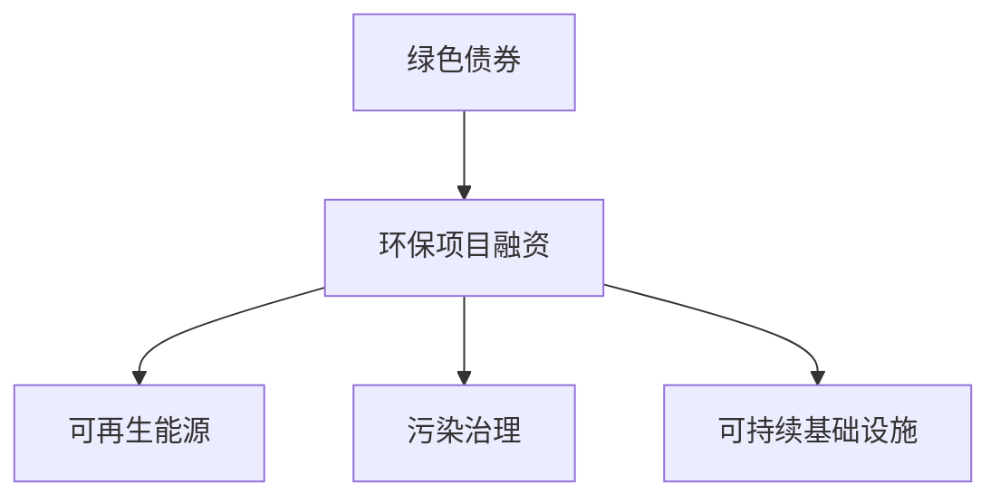
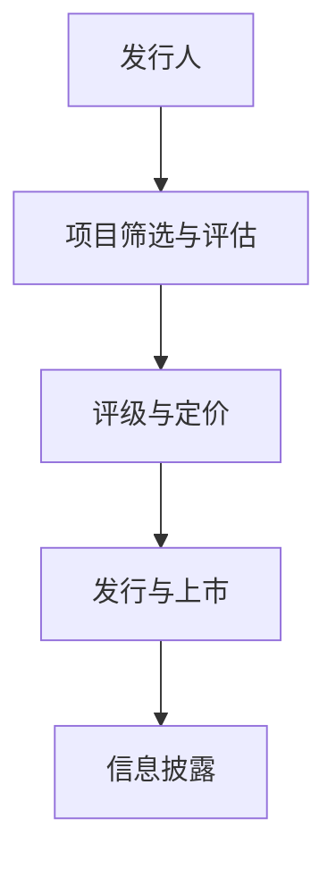

                 

# 绿色债券：可持续发展融资的投资机会

---

## 关键词
绿色债券, 可持续发展, 投资机会, 环境效益, 经济效益, 绿色金融

---

## 摘要
绿色债券作为一种新兴的可持续发展融资工具，正在全球范围内迅速崛起。本文从绿色债券的核心概念、发行流程、市场现状、评估方法、风险管理及投资机会等多维度进行详细分析，旨在为投资者和相关机构提供深入的理论支持和实践指导。通过探讨绿色债券的系统架构与设计，本文进一步揭示了绿色债券在实现可持续发展目标中的重要作用，并为未来的投资决策提供了有益的参考。

---

# 第一部分: 绿色债券概述与背景

## 第1章: 绿色债券的核心概念与背景

### 1.1 什么是绿色债券
绿色债券是一种专门用于支持环境友好型项目的债务融资工具。其核心目标是通过筹集资金，支持可再生能源、污染治理、可持续基础设施等环保项目的发展。绿色债券的发行主体通常是政府、企业和金融机构，而投资者则包括个人、机构投资者和养老基金等。

绿色债券的起源可以追溯到20世纪70年代，当时全球环境问题日益严重，各国政府开始寻求通过金融工具来支持环保项目。随着气候变化和可持续发展理念的普及，绿色债券逐渐成为全球金融市场的重要组成部分。

### 1.2 绿色债券的特点
绿色债券具有以下几个核心特点：

1. **专款专用**：绿色债券的募集资金必须用于特定的环保项目，确保资金的使用符合可持续发展的目标。
2. **环境效益显著**：通过支持环保项目，绿色债券能够有效减少碳排放、改善空气质量、保护生物多样性等。
3. **低风险高收益**：相较于传统债券，绿色债券的风险较低，同时由于其支持的项目具有较高的社会价值，长期来看收益潜力较大。

### 1.3 绿色债券的分类
绿色债券可以根据不同的标准进行分类，主要包括以下几种：

1. **按发行主体分类**：
   - **政府绿色债券**：由政府发行，用于支持国家层面的环保项目。
   - **企业绿色债券**：由企业发行，用于支持企业的环保项目。
   - **金融机构绿色债券**：由银行、保险公司等金融机构发行，用于支持环保相关的金融产品。

2. **按债券类型分类**：
   - **普通绿色债券**：募集资金直接用于环保项目。
   - **绿色债券基金**：通过基金形式投资于多个绿色项目。
   - **绿色资产支持债券**：以环保项目产生的现金流为支持发行的债券。

### 1.4 绿色债券与可持续发展
可持续发展是全球关注的焦点，绿色债券在其中扮演着重要角色。通过支持环保项目，绿色债券能够促进经济发展与环境保护的协调发展。绿色债券不仅能够帮助发行人降低融资成本，还能够提升发行人的社会形象和品牌价值。

---

## 第2章: 绿色债券的发行与投资

### 2.1 绿色债券的发行流程
绿色债券的发行流程通常包括以下几个步骤：

1. **项目筛选与评估**：发行人需要选择符合绿色债券标准的环保项目，并对其环境效益和经济效益进行评估。
2. **评级与定价**：绿色债券需要经过专业机构的评级，确定其信用等级和票面利率。
3. **发行与上市**：发行人通过承销商将绿色债券发行至市场，并在交易所上市交易。
4. **信息披露**：发行人需要定期披露绿色债券的使用情况和项目的进展情况。

### 2.2 绿色债券的投资者
绿色债券的投资者主要包括以下几个类别：

1. **个人投资者**：个人投资者可以通过购买绿色债券直接支持环保项目，同时获得一定的投资收益。
2. **机构投资者**：包括保险公司、 pension funds 等大型机构投资者，他们通常通过购买绿色债券来优化投资组合的风险和收益。
3. **政府机构**：政府可以通过发行绿色债券支持国家层面的环保项目，同时吸引国内外投资者。

### 2.3 绿色债券的投资机会
绿色债券的投资机会主要体现在以下几个方面：

1. **政策支持**：各国政府纷纷出台政策支持绿色债券的发展，为投资者提供了良好的政策环境。
2. **市场需求增长**：随着环保意识的增强，绿色债券的市场需求持续增长，为投资者提供了更多的投资机会。
3. **长期收益潜力**：绿色债券支持的项目具有长期的环境效益和经济效益，能够为投资者带来稳定的长期收益。

---

## 第3章: 绿色债券的评估与评级

### 3.1 绿色债券的评级标准
绿色债券的评级通常基于以下几个方面：

1. **项目的环境效益**：评估项目的环境效益，包括减少碳排放、改善空气质量等。
2. **项目的财务可行性**：评估项目的财务可行性，包括投资回报率、还款能力等。
3. **发行人的信用状况**：评估发行人的信用状况，包括财务状况、管理水平等。

### 3.2 绿色债券的环境效益评估
绿色债券的环境效益评估可以通过以下方法进行：

1. **环境影响评估**：通过环境影响评估方法（EIA）对项目的环境影响进行评估。
2. **环境效益量化**：通过量化方法计算项目的环境效益，例如减少的碳排放量、节约的水量等。

### 3.3 绿色债券的经济效益评估
绿色债券的经济效益评估可以通过以下方法进行：

1. **财务可行性分析**：通过财务可行性分析方法（如净现值法、内部收益率法）评估项目的经济效益。
2. **市场风险分析**：通过市场风险分析方法（如VaR方法）评估绿色债券的市场风险。

---

## 第4章: 绿色债券的风险管理与投资策略

### 4.1 绿色债券的主要风险
绿色债券的主要风险包括：

1. **信用风险**：发行人无法按时偿还债券本金和利息的风险。
2. **市场风险**：债券价格受市场波动影响的风险。
3. **环境风险**：环保项目未能实现预期环境效益的风险。

### 4.2 绿色债券的风险管理策略
绿色债券的风险管理策略包括：

1. **分散投资**：通过分散投资降低风险。
2. **风险对冲**：通过金融衍生品对冲市场风险。
3. **持续监控**：定期监控发行人的信用状况和项目的进展情况。

### 4.3 绿色债券的投资策略
绿色债券的投资策略包括：

1. **长期投资策略**：通过长期持有绿色债券获得稳定的收益。
2. **短期投资策略**：通过短期交易赚取市场波动带来的收益。
3. **组合投资策略**：将绿色债券与其他资产类别进行组合投资，以实现风险和收益的平衡。

---

## 第5章: 绿色债券的系统架构与设计

### 5.1 绿色债券的系统架构
绿色债券的系统架构主要包括以下几个模块：

1. **发行模块**：负责绿色债券的发行和登记。
2. **交易模块**：负责绿色债券的交易和结算。
3. **信息披露模块**：负责绿色债券相关信息的披露。
4. **风险管理模块**：负责绿色债券的风险管理和监控。

### 5.2 绿色债券的系统设计
绿色债券的系统设计可以通过以下步骤进行：

1. **需求分析**：明确系统的需求和目标。
2. **模块划分**：将系统划分为不同的功能模块。
3. **流程设计**：设计系统的流程和交互。
4. **系统实现**：根据设计进行系统的开发和实现。

---

## 结语

绿色债券作为一种新兴的可持续发展融资工具，正在全球范围内迅速崛起。通过本文的分析，我们可以看到绿色债券在实现可持续发展目标中的重要作用。未来，随着全球环保意识的增强和政策支持力度的加大，绿色债券的投资机会将更加广阔。投资者和相关机构可以通过深入了解绿色债券的核心概念、发行流程、评估方法和风险管理策略，抓住这一重要的投资机会。

---

## 作者

作者：AI天才研究院/AI Genius Institute & 禅与计算机程序设计艺术 /Zen And The Art of Computer Programming

