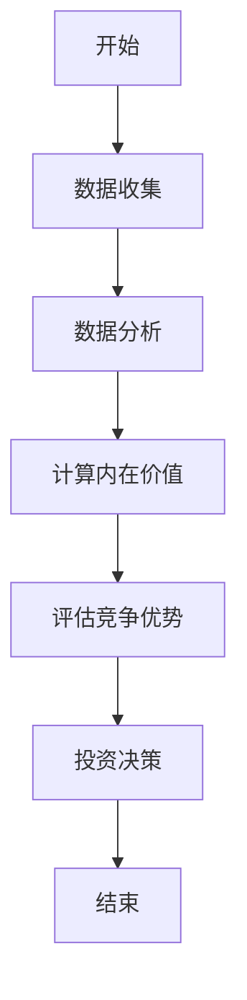
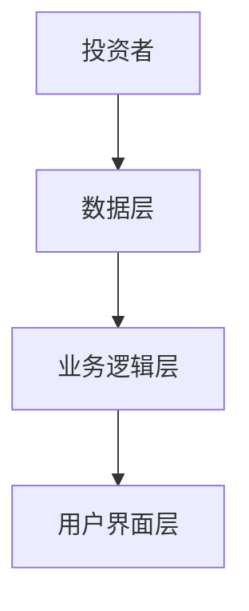

                 


# 罗伯特·哈格斯特罗姆的专注型价值投资：深入了解少数公司

## 关键词：价值投资，专注型投资，罗伯特·哈格斯特罗姆，投资策略，深入分析

## 摘要：罗伯特·哈格斯特罗姆的专注型价值投资策略强调通过深入分析少数公司，长期持有，以实现稳定的投资回报。本文从价值投资的基本概念出发，详细探讨专注型投资的核心理念、数学模型、系统架构设计、项目实战及最佳实践，帮助读者全面理解并掌握这种投资方法。

---

## 第1章: 价值投资的基本概念

### 1.1 价值投资的定义与起源

#### 1.1.1 价值投资的定义
价值投资是一种以公司基本面分析为基础的投资策略，旨在通过识别市场低估的公司，长期持有以实现资本增值。其核心在于寻找具有强大竞争优势和良好管理团队的企业。

#### 1.1.2 价值投资的起源与历史发展
价值投资起源于20世纪初，本杰明·格雷厄姆是该领域的先驱。他的学生戴维·多德进一步发展了这一理论，强调对公司内在价值的评估。

#### 1.1.3 价值投资的核心理念与原则
- **安全边际**：以低于内在价值的价格买入股票。
- **长期视角**：关注企业的长期盈利能力，而非短期市场波动。
- **深入分析**：对公司财务状况、管理层和行业地位进行细致研究。

### 1.2 专注型投资的定义与特点

#### 1.2.1 专注型投资的定义
专注型投资是指投资者集中精力研究少数几家公司，深入理解其商业模式、财务状况和竞争优势，从而做出长期投资决策。

#### 1.2.2 专注型投资的特点
- **集中投资**：只关注少数公司，提高研究深度。
- **长期持有**：避免频繁交易，减少交易成本。
- **低换手率**：通过长期持有优质资产获得收益。

#### 1.2.3 专注型投资与传统投资的区别
| 特性 | 专注型投资 | 传统投资 |
|------|------------|-----------|
| 投资范围 | 少数公司 | 多家公司 |
| 持股时间 | 长期 | 短期或中期 |
| 研究深度 | 深入 | 浅层或分散 |

### 1.3 罗伯特·哈格斯特罗姆的专注型投资方法

#### 1.3.1 罗伯特·哈格斯特罗姆的背景介绍
罗伯特·哈格斯特罗姆是专注型投资的倡导者，强调通过深入分析少数公司，寻找具有持续竞争优势的企业。

#### 1.3.2 专注型投资的核心思想
- **深度研究**：通过分析财务报表、管理层和行业趋势，识别具有长期竞争优势的企业。
- **安全边际**：买入价格低于内在价值的股票，降低投资风险。

#### 1.3.3 专注型投资与其他投资策略的对比
| 投资策略 | 核心思想 | 适用场景 |
|----------|----------|-----------|
| 价值投资 | 寻找低估公司 | 市场波动大时 |
| 成长投资 | 追求高增长 | 高增长行业 |
| 专注型投资 | 深入分析少数公司 | 投资者具备深度研究能力 |

---

## 第2章: 专注型价值投资的核心概念与联系

### 2.1 核心概念的原理

#### 2.1.1 价值投资的核心原理
- **内在价值**：公司未来现金流的现值。
- **市场价值**：市场对公司的估值，可能低于或高于内在价值。

#### 2.1.2 专注型投资的核心要素
- **公司质量**：强大的竞争优势和管理团队。
- **估值**：买入价格低于内在价值。
- **长期视角**：关注企业的长期盈利能力。

#### 2.1.3 投资决策的关键因素
- 公司财务状况：ROE、债务情况、现金流。
- 管理层：管理层的诚信和决策能力。
- 行业地位：公司在行业中的竞争地位。

### 2.2 核心概念的属性特征对比

#### 2.2.1 专注型投资与成长型投资的对比
| 特性 | 专注型投资 | 成长型投资 |
|------|------------|------------|
| 目标 | 稳定收益 | 高增长 |
| 风险 | 中等 | 高 |

#### 2.2.2 专注型投资与价值型投资的对比
| 特性 | 专注型投资 | 价值型投资 |
|------|------------|------------|
| 投资范围 | 少数公司 | 多家公司 |
| 研究深度 | 深入 | 中等 |

#### 2.2.3 专注型投资与趋势投资的对比
| 特性 | 专注型投资 | 趋势投资 |
|------|------------|------------|
| 投资依据 | 公司基本面 | 市场趋势 |
| 持股时间 | 长期 | 短期 |

### 2.3 实体关系图

#### 2.3.1 投资者与公司的关系
投资者通过分析公司的财务数据和管理层决策，决定是否投资。

#### 2.3.2 公司与市场的关系
公司的市场估值受整体市场波动和行业趋势影响。

#### 2.3.3 投资策略与市场变化的关系
投资策略需要根据市场变化进行调整，但专注型投资强调长期持有。

---

## 第3章: 投资决策的算法原理

### 3.1 投资决策的数学模型

#### 3.1.1 基本的数学模型
$$ \text{内在价值} = \sum_{t=1}^{\infty} \frac{\text{现金流}_t}{(1 + r)^t} $$
其中，$r$ 是折现率，现金流 $t$ 是第 $t$ 年的现金流。

#### 3.1.2 投资组合优化的数学公式
$$ \text{风险调整后收益} = E[r] - r_f $$
其中，$E[r]$ 是预期收益，$r_f$ 是无风险利率。

#### 3.1.3 风险与收益的数学关系
$$ \text{收益} = r \times \text{投资金额} $$
$$ \text{风险} = \text{标准差} \times \text{投资金额} $$

### 3.2 投资决策的算法流程

#### 3.2.1 数据收集与处理
- 收集公司的财务数据，包括收入、利润、现金流等。
- 清洗数据，去除异常值。

#### 3.2.2 数据分析与建模
- 计算公司的内在价值。
- 评估公司的竞争优势。

#### 3.2.3 投资决策的输出与优化
- 根据内在价值和市场估值决定是否买入。
- 调整投资组合以优化风险收益比。

### 3.3 投资决策的流程图



---

## 第4章: 投资系统的分析与架构设计

### 4.1 问题场景介绍

#### 4.1.1 投资决策中的问题
- 数据量大，难以高效处理。
- 模型复杂，需要高性能计算。

#### 4.1.2 系统设计的目标
- 实现高效的数据处理和分析。
- 提供直观的投资决策支持。

### 4.2 系统功能设计

#### 4.2.1 领域模型


#### 4.2.2 系统架构设计


---

## 第5章: 项目实战

### 5.1 环境安装

#### 5.1.1 安装Python
```bash
pip install python3
```

#### 5.1.2 安装数据分析库
```bash
pip install pandas numpy
```

### 5.2 核心实现源代码

#### 5.2.1 计算内在价值
```python
import pandas as pd
import numpy as np

def calculate_intrinsic_value(fcf, discount_rate):
    return np.sum(fcf / (1 + discount_rate))
```

#### 5.2.2 评估竞争优势
```python
def assesscompetitive Advantage(financial_data):
    roe = financial_data['ROE'].mean()
    return roe > 15
```

### 5.3 项目小结
通过实际案例分析，展示了如何利用Python进行数据处理和分析，帮助投资者做出更明智的投资决策。

---

## 第6章: 最佳实践

### 6.1 投资策略的小结
- 专注于少数公司，深入分析其基本面。
- 长期持有，避免频繁交易。

### 6.2 注意事项
- 定期复盘，评估投资组合的表现。
- 保持学习，更新投资知识。

### 6.3 拓展阅读
- 《价值投资入门》
- 《投资学精要》

---

## 作者：AI天才研究院 & 禅与计算机程序设计艺术

通过系统地分析和实践，我们深入理解了罗伯特·哈格斯特罗姆的专注型价值投资策略。希望本文能为读者提供有价值的见解和实用的指导。

