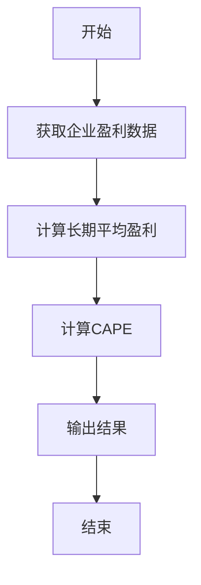

                 


```
# 罗伯特·希勒的周期性调整市盈率(CAPE)指标

> 关键词：周期性调整市盈率，CAPE，罗伯特·希勒，市场估值，投资策略，风险管理

> 摘要：本文详细探讨了罗伯特·希勒提出的周期性调整市盈率（CAPE）指标，分析其在市场估值中的应用、理论基础、实际案例以及与其他估值方法的对比。文章旨在帮助读者理解CAPE的核心概念、算法原理及其在投资决策中的实际应用价值。

---

# 第1章: 罗伯特·希勒的周期性调整市盈率(CAPE)概述

## 1.1 什么是周期性调整市盈率(CAPE)

周期性调整市盈率（Cyclically Adjusted Price-to-Earnings Ratio，CAPE）是由罗伯特·希勒提出的，用于评估市场估值的一个重要指标。与传统市盈率（PE）不同，CAPE考虑了市场周期性波动的影响，通过将股价与长期平均盈利进行对比，提供更准确的市场估值。

## 1.2 CAPE与传统PE的区别

- **时间范围**：传统PE基于单期数据，而CAPE使用长期平均盈利数据。
- **数据来源**：CAPE综合考虑多个周期的盈利数据，传统PE仅基于当前或最近一期的盈利。
- **应用场景**：CAPE适用于长期市场估值与预测，传统PE适用于个股估值。

## 1.3 CAPE的应用价值

- **市场预测**：CAPE能够帮助投资者预测长期市场走势。
- **资产配置**：CAPE为投资者提供资产配置的参考依据。
- **风险管理**：CAPE帮助投资者识别市场泡沫与低估区域。

---

# 第2章: CAPE的理论基础

## 2.1 CAPE的数学模型

CAPE的计算公式为：
$$ CAPE = \frac{P_0}{\text{长期平均盈利}} $$
其中，$P_0$是当前市场价格，长期平均盈利是一定时期内的平均盈利。

## 2.2 CAPE的核心概念与属性特征

| 特性 | CAPE | 传统PE |
|------|------|--------|
| 时间范围 | 长期周期性调整 | 单期数据 |
| 数据来源 | 综合企业盈利 | 单期企业盈利 |
| 应用场景 | 市场估值与预测 | 个股估值 |

## 2.3 CAPE的算法原理与流程

1. 获取企业盈利数据。
2. 计算长期平均盈利。
3. 计算CAPE。
4. 输出结果。



---

# 第3章: CAPE在经济周期中的表现

## 3.1 CAPE在牛市中的表现

在牛市中，CAPE通常会高于长期平均水平，表明市场可能存在泡沫。

## 3.2 CAPE在熊市中的表现

在熊市中，CAPE会低于长期平均水平，表明市场可能被低估。

## 3.3 CAPE在经济周期中的预测能力

通过分析CAPE的变化趋势，投资者可以预测市场的未来走势。

---

# 第4章: CAPE的实际应用

## 4.1 CAPE在投资策略中的应用

投资者可以根据CAPE的值来制定买入或卖出策略。

## 4.2 CAPE在风险管理中的应用

CAPE可以帮助投资者识别市场风险，避免过度投资。

---

# 第5章: CAPE的有效性与局限性

## 5.1 CAPE的有效性分析

CAPE能够提供更准确的市场估值，帮助投资者做出更明智的决策。

## 5.2 CAPE的局限性分析

- **数据依赖性**：CAPE的准确性依赖于长期盈利数据的准确性。
- **市场波动**：短期市场波动可能会影响CAPE的准确性。

---

# 第6章: CAPE的编程实战

## 6.1 环境安装

安装必要的Python库，如Pandas、NumPy等。

## 6.2 核心实现代码

```python
import pandas as pd
import numpy as np

# 获取企业盈利数据
def get_profit_data():
    # 示例数据，实际应从数据库或API获取
    return pd.DataFrame({'year': [2018, 2019, 2020, 2021, 2022], 'profit': [100, 120, 110, 130, 140]})

# 计算长期平均盈利
def calculate_long_term_profit(profit_data, window=5):
    return profit_data['profit'].rolling(window).mean().iloc[-1]

# 计算CAPE
def calculate_cape(price, long_term_profit):
    return price / long_term_profit

# 示例计算
price = 1000
profit_data = get_profit_data()
lt_profit = calculate_long_term_profit(profit_data)
cape = calculate_cape(price, lt_profit)
print(f"CAPE值为: {cape}")
```

---

# 第7章: 总结与展望

## 7.1 总结

本文详细介绍了罗伯特·希勒提出的周期性调整市盈率（CAPE）指标，分析了其在市场估值中的应用价值和实际案例。

## 7.2 展望

未来，随着人工智能和大数据技术的发展，CAPE指标的应用将更加广泛和精准。

---

# 作者：AI天才研究院/AI Genius Institute & 禅与计算机程序设计艺术 /Zen And The Art of Computer Programming
```

