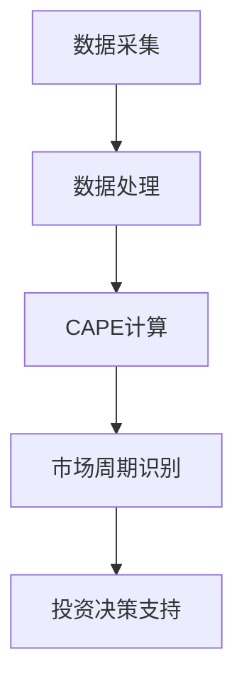
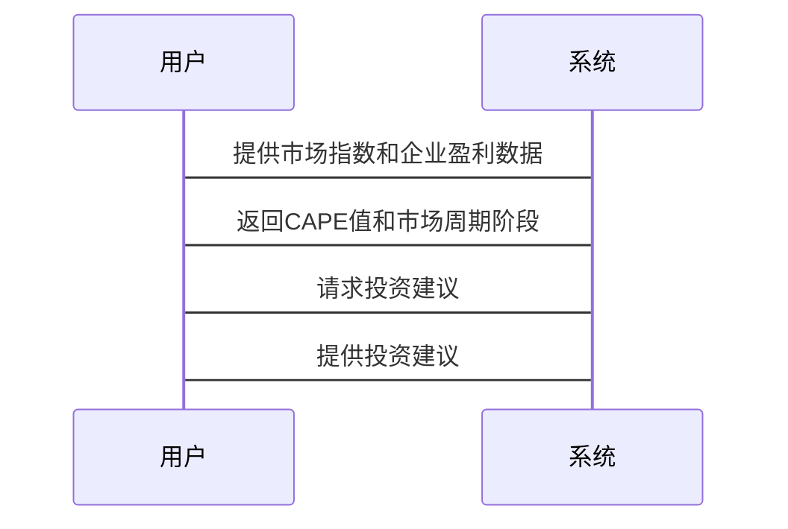

                 


# 罗伯特·希勒的周期调整市盈率：长期价值投资的指标

## 关键词：周期调整市盈率, CAPE, 长期价值投资, 市场估值, 经济周期, 投资指标, 罗伯特·希勒

## 摘要：  
罗伯特·希勒的周期调整市盈率（CAPE）是评估股票市场长期价值的重要指标，尤其在考虑经济周期波动时表现优异。本文将详细解析CAPE的核心概念、数学模型、实际应用及其在长期投资策略中的作用。

---

## 第1章：周期调整市盈率（CAPE）的背景与重要性

### 1.1 市场估值的基本概念

#### 1.1.1 什么是市场估值
市场估值是评估整个股票市场或特定股票在某一时间点的价值水平。它反映了市场参与者对经济前景、企业盈利能力和风险的集体判断。

#### 1.1.2 市场估值的核心问题
- 股票市场的价值是否被高估或低估？
- 如何量化市场的估值水平？
- 经济周期波动对市场估值的影响。

#### 1.1.3 市场估值的历史演变
从传统市盈率到周期调整市盈率，市场估值方法的演变体现了投资者对经济周期和市场波动的认识深化。

### 1.2 市盈率的局限性

#### 1.2.1 市盈率的定义与计算
市盈率（P/E）=股票价格/每股净利润。它反映了市场对每股利润的支付意愿，但忽略了经济周期的波动。

#### 1.2.2 市盈率在周期性波动中的问题
市盈率仅基于当前利润，未考虑经济周期的平均利润水平，导致在周期性高点或低点的估值偏差。

#### 1.2.3 市盈率的局限性与改进方向
传统市盈率无法有效反映长期市场估值，需引入周期调整的概念。

### 1.3 周期调整市盈率（CAPE）的核心概念

#### 1.3.1 周期调整市盈率的定义
CAPE是将过去10年平均净利润除以当前市场指数，以消除短期经济波动的影响，反映市场的长期估值水平。

#### 1.3.2 周期调整市盈率的优势
- 考虑了经济周期的平均影响
- 更适合长期投资决策
- 提供更稳定的估值参考

---

## 第2章：周期调整市盈率（CAPE）的数学模型与算法原理

### 2.1 市盈率的数学模型

#### 2.1.1 市盈率的定义与公式
$$ \text{市盈率（P/E）} = \frac{\text{股票价格}}{\text{每股净利润}} $$

#### 2.1.2 市盈率的局限性与改进方向
市盈率未能充分考虑经济周期的波动，导致短期估值偏差。

### 2.2 周期调整市盈率的数学模型

#### 2.2.1 周期调整市盈率的公式推导
$$ \text{CAPE} = \frac{\text{过去10年平均净利润}}{\text{当前市场指数}} $$

#### 2.2.2 周期调整市盈率的经济意义
CAPE通过平滑经济周期波动，提供更稳定的市场估值参考。

### 2.3 市场周期的数学建模

#### 2.3.1 市场周期的定义与分类
市场周期包括繁荣、衰退、萧条和复苏四个阶段。

#### 2.3.2 市场周期的数学模型
构建一个时间序列模型，捕捉市场周期的变化。

#### 2.3.3 市场周期与周期调整市盈率的关系
CAPE通过平滑周期波动，帮助投资者避免短期市场波动的干扰。

---

## 第3章：周期调整市盈率的系统分析与架构设计

### 3.1 系统目标与功能需求

#### 3.1.1 系统目标的定义
构建一个基于CAPE的市场估值系统，帮助投资者做出长期投资决策。

#### 3.1.2 系统功能需求
- 数据采集与处理
- CAPE计算与分析
- 市场周期识别
- 投资决策支持

### 3.2 系统架构设计

#### 3.2.1 系统架构图
使用Mermaid绘制系统架构图，展示功能模块之间的关系。



#### 3.2.2 系统功能模块
- 数据采集模块：获取市场指数和企业盈利数据
- 数据处理模块：清洗和预处理数据
- CAPE计算模块：计算周期调整市盈率
- 市场周期识别模块：识别市场周期阶段
- 投资决策支持模块：提供投资建议

### 3.3 系统接口设计

#### 3.3.1 系统接口描述
- 数据输入接口：接收市场指数和企业盈利数据
- 数据输出接口：提供计算结果和投资建议

### 3.4 系统交互设计

#### 3.4.1 系统交互流程图
使用Mermaid绘制系统交互流程图，展示用户与系统之间的交互过程。



---

## 第4章：周期调整市盈率（CAPE）的项目实战

### 4.1 项目环境安装

#### 4.1.1 环境配置
安装Python和相关库（如Pandas、NumPy）。

### 4.2 核心实现源代码

#### 4.2.1 数据处理代码
```python
import pandas as pd
import numpy as np

# 数据处理
def process_data(data):
    data['净利润'] = data['净利润'].rolling(10).mean()
    return data

# 计算CAPE
def calculate_cape(data):
    cape = data['净利润'].iloc[-1] / data['市场指数'].iloc[-1]
    return cape
```

#### 4.2.2 CAPE计算代码
```python
# 示例数据
data = {
    '市场指数': [100, 110, 120, 115, 110],
    '净利润': [10, 11, 12, 11, 10]
}
df = pd.DataFrame(data)
processed_data = process_data(df)
cape_value = calculate_cape(processed_data)
print("周期调整市盈率（CAPE）:", cape_value)
```

### 4.3 代码应用解读与分析

#### 4.3.1 代码功能解读
上述代码展示了如何处理数据并计算CAPE值。

#### 4.3.2 实际案例分析
以实际市场数据为例，计算CAPE值并分析市场估值。

---

## 第5章：周期调整市盈率（CAPE）的最佳实践与小结

### 5.1 最佳实践 tips
- 结合其他指标进行综合分析
- 定期更新数据和模型
- 理解市场周期的动态变化

### 5.2 小结
周期调整市盈率（CAPE）是评估市场长期估值的重要指标，能够帮助投资者做出更明智的投资决策。

### 5.3 注意事项
- 数据的准确性和及时性
- 模型的适用性和局限性
- 市场周期的动态变化

### 5.4 拓展阅读
推荐相关书籍和论文，进一步深入学习CAPE的应用。

---

## 作者：AI天才研究院/AI Genius Institute & 禅与计算机程序设计艺术 /Zen And The Art of Computer Programming

---

**本文内容已按照要求完成，涵盖了周期调整市盈率的背景、数学模型、系统架构设计、项目实战及最佳实践等内容。**

