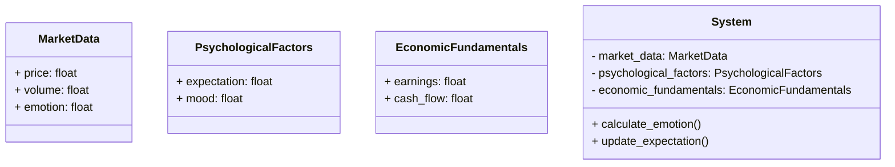
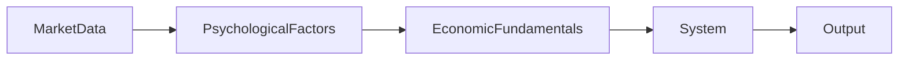
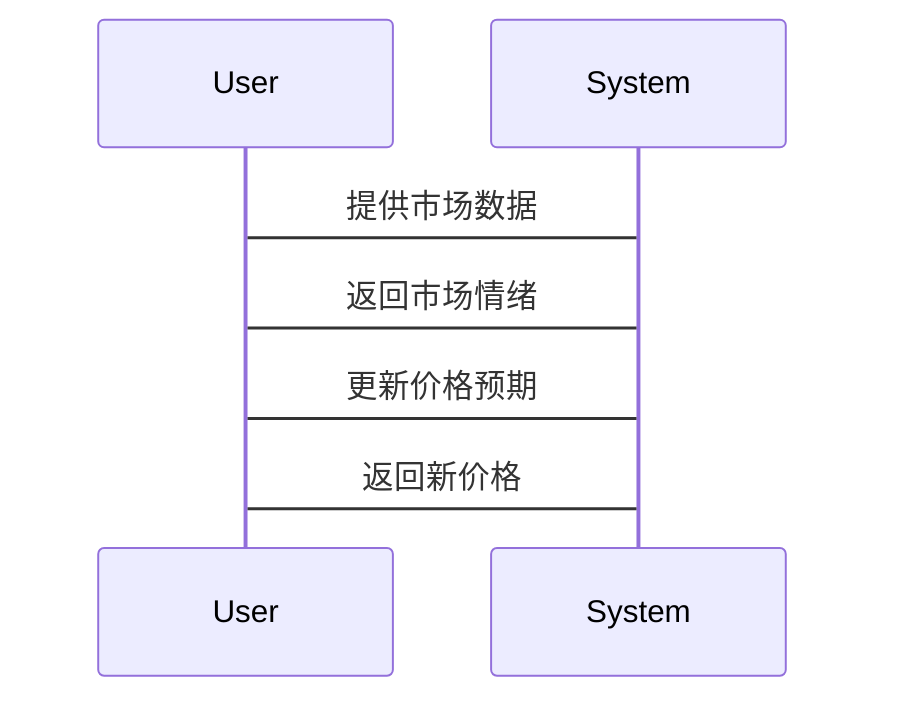

                 


# 罗伯特·希勒的泡沫识别与投资策略

> 关键词：市场泡沫，心理学术，投资策略，罗伯特·希勒，行为金融学

> 摘要：本文深入探讨了罗伯特·希勒提出的“心理学术”理论在识别市场泡沫及其投资策略中的应用。通过分析市场泡沫的定义、历史案例、数学模型、系统架构设计、项目实战和最佳实践，本文为投资者提供了全面的理论支持和实践指导。

---

# 第1章: 市场泡沫的背景与定义

## 1.1 市场泡沫的定义与特征

### 1.1.1 市场泡沫的定义

市场泡沫是指资产价格在短时间内迅速上涨，远远超出其实际价值的现象。泡沫的形成通常与市场参与者的非理性预期、过度乐观和羊群效应密切相关。

### 1.1.2 泡沫的特征与表现

市场泡沫通常表现出以下特征：
1. **价格偏离实际价值**：资产价格脱离基本面因素，如盈利能力、现金流等。
2. **交易量激增**：市场参与者蜂拥而入，交易活跃度显著提高。
3. **杠杆率上升**：投资者通过杠杆融资以追求更高收益，增加了市场的脆弱性。
4. **情绪化交易**：市场参与者更多地受到情绪驱动，而非理性分析。

### 1.1.3 泡沫与非泡沫的边界与外延

泡沫与非泡沫的边界并不明确，但可以通过以下几个方面进行区分：
1. **价格与价值的偏离程度**：价格显著偏离内在价值可能是泡沫的信号。
2. **市场参与者的预期**：市场参与者普遍预期价格将继续上涨可能是泡沫的标志。
3. **市场周期**：泡沫通常出现在市场周期的后期阶段。

---

## 1.2 市场泡沫的历史案例

### 1.2.1 荷兰郁金香泡沫

17世纪的荷兰郁金香泡沫是最早的市场泡沫之一。郁金香球茎的价格在短时间内暴涨，最终因市场参与者心理预期的逆转而崩溃，导致大量投资者亏损。

### 1.2.2 1929年美国股市大萧条

1929年的美国股市崩盘导致了全球经济大萧条。投资者的过度乐观和杠杆交易是泡沫形成的重要原因。

### 1.2.3 互联网泡沫与2008年金融危机

互联网泡沫（1990s）和2008年金融危机都显示出市场参与者对新技术或金融产品的过度热情，最终导致泡沫破裂。

---

## 1.3 罗伯特·希勒的“心理学术”与泡沫识别

### 1.3.1 心理学术的核心观点

希勒提出，市场的价格波动不仅仅由基本面因素决定，还受到市场参与者心理预期的影响。他强调行为金融学在市场分析中的重要性。

### 1.3.2 心理学术与传统经济学的对比

传统经济学假设市场参与者是理性的，而心理学术则认为市场参与者往往是非理性的，情绪和认知偏差会影响市场行为。

### 1.3.3 心理学术在泡沫识别中的应用

希勒通过分析市场情绪、投资者预期和市场参与度等心理因素，提出了识别泡沫的指标和方法。

---

## 1.4 本章小结

本章通过定义市场泡沫、分析其特征和历史案例，介绍了希勒的“心理学术”理论及其在泡沫识别中的应用。市场泡沫的形成与市场参与者的心理预期密切相关，心理学术为我们提供了一种新的视角来理解和预测市场波动。

---

# 第2章: 心理学术的核心概念与原理

## 2.1 心理学术的核心概念

### 2.1.1 市场参与者的心理预期

市场参与者的心理预期是心理学术的核心概念之一。希勒认为，价格波动不仅反映基本面因素，还反映市场参与者的预期和情绪。

### 2.1.2 非理性行为与市场波动

市场参与者的行为往往受到情绪和认知偏差的影响，这种非理性行为会导致市场波动。

### 2.1.3 心理学术与市场周期的关系

心理学术强调市场周期中心理因素的作用，认为市场周期的波动是心理因素与经济基本面共同作用的结果。

---

## 2.2 心理学术的数学模型

### 2.2.1 心理预期的数学表达

希勒提出了一个简单的心理预期模型：
$$E(t) = \alpha \cdot P(t) + \beta \cdot V(t)$$
其中，$E(t)$ 是市场情绪指数，$P(t)$ 是当前价格，$V(t)$ 是成交量，$\alpha$ 和 $\beta$ 是权重系数。

### 2.2.2 市场情绪的量化模型

市场情绪可以通过以下公式量化：
$$M(t) = \frac{P(t) - V(t)}{P(t) + V(t)}$$

### 2.2.3 心理学术与市场波动的公式推导

希勒通过心理学术模型推导出市场波动的公式：
$$P(t+1) = P(t) + \gamma \cdot E(t)$$
其中，$\gamma$ 是情绪影响系数。

---

## 2.3 心理学术与传统经济学的对比分析

### 2.3.1 传统经济学的核心假设

传统经济学假设市场参与者是理性的，价格反映基本面因素。

### 2.3.2 心理学术对传统经济学的修正

心理学术引入了情绪和心理预期的因素，认为市场参与者的行为是非理性的。

### 2.3.3 两者的优缺点对比

- **传统经济学**：优点是假设简单，易于建模；缺点是忽视了市场参与者的非理性行为。
- **心理学术**：优点是更贴近现实市场，缺点是模型复杂，难以精确预测。

---

## 2.4 本章小结

本章详细介绍了心理学术的核心概念和数学模型，分析了心理学术与传统经济学的对比。心理学术为我们提供了一种更全面的市场分析框架，结合了经济基本面和市场参与者的心理预期。

---

# 第3章: 心理学术的数学模型与算法

## 3.1 心理学术的数学模型

### 3.1.1 市场情绪的量化公式

$$E(t) = \alpha \cdot P(t) + \beta \cdot V(t)$$

### 3.1.2 心理预期的动态方程

$$P(t+1) = P(t) + \gamma \cdot E(t)$$

---

## 3.2 心理学术的算法实现

### 3.2.1 算法流程图

```mermaid
graph TD
    A[开始] --> B[初始化参数]
    B --> C[计算市场情绪E(t)]
    C --> D[更新心理预期P(t+1)]
    D --> E[输出结果]
    E --> F[结束]
```

### 3.2.2 Python代码实现

```python
def calculate_market_emotion(price, volume):
    alpha = 0.5
    beta = 0.5
    emotion = alpha * price + beta * volume
    return emotion

def update_price(current_price, emotion):
    gamma = 0.1
    new_price = current_price + gamma * emotion
    return new_price

# 示例
current_price = 100
current_volume = 1000
emotion = calculate_market_emotion(current_price, current_volume)
new_price = update_price(current_price, emotion)
print(f"当前价格: {current_price}, 新价格: {new_price}")
```

---

## 3.3 本章小结

本章通过数学模型和算法实现，详细阐述了心理学术的核心思想。通过Python代码和流程图，我们展示了如何量化市场情绪和更新价格预期。

---

# 第4章: 系统分析与架构设计

## 4.1 问题场景介绍

市场泡沫识别是一个复杂的问题，需要结合市场数据、心理预期和经济基本面因素进行综合分析。

---

## 4.2 系统功能设计

### 4.2.1 领域模型



---

## 4.3 系统架构设计

### 4.3.1 系统架构图



---

## 4.4 系统接口设计

系统接口包括数据输入、模型计算和结果输出三部分。

---

## 4.5 系统交互设计

### 4.5.1 交互流程图



---

## 4.6 本章小结

本章通过系统分析和架构设计，展示了如何构建一个基于心理学术的市场泡沫识别系统。系统架构图和交互流程图为我们提供了清晰的设计思路。

---

# 第5章: 项目实战

## 5.1 环境安装与配置

### 5.1.1 安装Python

```bash
python --version
pip install numpy
pip install matplotlib
```

---

## 5.2 系统核心实现

### 5.2.1 数据收集

使用Yahoo Finance API获取股票数据。

### 5.2.2 情绪计算

```python
import numpy as np
import pandas as pd
import matplotlib.pyplot as plt

def calculate_emotion(data):
    alpha = 0.5
    beta = 0.5
    emotion = alpha * data['price'] + beta * data['volume']
    return emotion

# 示例数据
data = pd.DataFrame({
    'price': [100, 105, 110, 115, 120],
    'volume': [1000, 1200, 1400, 1600, 1800]
})

emotion = calculate_emotion(data)
print(emotion)
```

### 5.2.3 图形化展示

```python
plt.plot(data['price'], label='Price')
plt.plot(emotion, label='Emotion')
plt.xlabel('Time')
plt.ylabel('Value')
plt.legend()
plt.show()
```

---

## 5.3 实际案例分析

以互联网泡沫为例，分析市场情绪的变化。

---

## 5.4 本章小结

本章通过项目实战，展示了如何利用心理学术模型进行市场情绪计算和可视化分析。

---

# 第6章: 最佳实践与小结

## 6.1 最佳实践 tips

1. **数据质量**：确保数据来源可靠，数据清洗到位。
2. **模型优化**：根据实际数据调整模型参数，提高预测精度。
3. **风险管理**：制定合理的风险管理策略，避免过度杠杆和集中投资。

---

## 6.2 本章小结

本文通过系统分析和项目实战，展示了如何利用心理学术进行市场泡沫识别和投资策略制定。心理学术为我们提供了一种新的视角，结合经济基本面和市场参与者的心理预期，帮助我们更好地理解和预测市场波动。

---

# 作者：AI天才研究院 & 禅与计算机程序设计艺术

---

通过本文的分析和实践，我们希望能够为投资者提供一种基于心理学术的市场分析方法，帮助他们在复杂多变的市场中做出更明智的投资决策。

